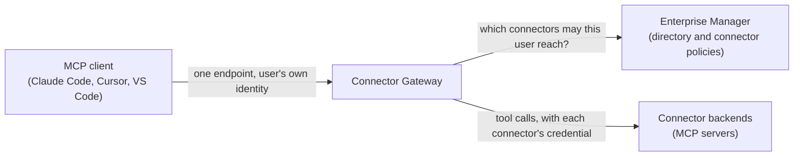

:::enterprise

The Connector Gateway is a component of Stacklok Enterprise.

[Learn more about Stacklok Enterprise](../platform/index.mdx).

:::

The Connector Gateway provides an identity-aware endpoint for MCP tool calls. It
evaluates each connector's policy to expose the connectors available to each
caller and brokers connector credentials on their behalf.

It is the counterpart to the [AI Gateway](../ai-gateway/index.mdx). The AI
Gateway governs the **models** your agents can call; the Connector Gateway
governs the **tools** they can use.

## Where to start

- **Try it end to end.** The [quickstart](./quickstart.mdx) registers a
  connector, grants it, and calls it from Claude Code.
- **Configure and secure connectors.** [Manage connectors](./connectors.mdx),
  set up their [authentication](./connector-authentication.mdx), and
  [grant access](./connector-policies.mdx).
- **Roll out and support users.**
  [Roll out gateway clients](../platform/enterprise-platform/roll-out-gateway-clients.mdx)
  and [support users' connector access](./support-connector-access.mdx).
- **Operate the gateway.** Review [tool usage](./tool-usage.mdx), and export
  [telemetry](./telemetry.mdx) and [audit logs](./forward-audit-logs.mdx).

For connection status, tools, and user authentication endpoints, see the
[Connector Gateway API reference](./api-reference.mdx). For connector
administration, see the
[Enterprise Manager API reference](../platform/enterprise-platform/enterprise-manager-api.mdx).

## How it works

A _connector_ is an MCP server registered with the gateway. Every user points
their MCP client at the same gateway endpoint and signs in with their corporate
identity. The gateway then serves that user only the connectors they're granted
and connected to.

On each request, the gateway asks the Enterprise Manager who the caller is and
which connectors their [connector policies](./connector-policies.mdx) allow. For
each tool call, it attaches the credential that the connector's
[authentication type](./connector-authentication.mdx) defines and forwards the
call to the connector's backend.

Two roles share the work:

- **Administrators** register connectors, configure how the gateway
  authenticates to each backend, and grant connectors to directory groups. See
  [Manage connectors](./connectors.mdx).
- **Users** connect their MCP client to the gateway endpoint, connect to the
  connectors they're granted, and choose which tools stay on. A connector that
  acts as the user asks them to sign in to its provider once, when they connect.
  The console guides users through these steps. See
  [Support users' connector access](./support-connector-access.mdx).

## What you administer

The console groups Connector Gateway administration under **Connectors**:

| Console area           | What you do there                                                                                                                                                            |
| ---------------------- | ---------------------------------------------------------------------------------------------------------------------------------------------------------------------------- |
| **Connectors**         | [Register connectors](./connectors.mdx), configure [connector authentication](./connector-authentication.mdx), and grant access through [policies](./connector-policies.mdx) |
| **Identity Providers** | Register the [connector identity providers](./identity-providers.mdx) that OAuth and token exchange connectors authenticate against                                          |
| **Managed Secrets**    | Store the [API keys, tokens, and client secrets](./managed-secrets.mdx) that connectors and identity providers reference                                                     |
| **Tool Usage**         | [Review tool calls](./tool-usage.mdx) by connector and tool                                                                                                                  |

Outside the console, you configure tool call recording,
[telemetry](./telemetry.mdx), and [audit logs](./forward-audit-logs.mdx) in the
platform's Helm values.

## Connector Gateway and vMCP

The Connector Gateway and a
[Virtual MCP Server (vMCP)](../toolhive/guides-vmcp/index.mdx) both aggregate
MCP servers behind one endpoint. They differ in who decides what each caller
sees.

|                         | Connector Gateway                                                                        | vMCP                                                                                                                                                                                                                  |
| ----------------------- | ---------------------------------------------------------------------------------------- | --------------------------------------------------------------------------------------------------------------------------------------------------------------------------------------------------------------------- |
| **Built for**           | People using their own MCP clients                                                       | Applications and agents with a predefined toolset                                                                                                                                                                     |
| **Who picks the tools** | Administrators grant connectors in the console; each user connects to the ones they want | A fixed set of backends in the `VirtualMCPServer` configuration                                                                                                                                                       |
| **Authorization**       | A per-connector [policy](./connector-policies.mdx) evaluated for each user               | [Cedar policies](../toolhive/guides-vmcp/authentication.mdx#authorize-requests) on the vMCP, plus [`ToolhiveAuthorizationPolicy`](../platform/reference/crds/toolhiveauthorizationpolicy.mdx) on `MCPServer` backends |
| **Tool filtering**      | Each user turns off the tools they don't want                                            | Administrators [filter and rename tools](../toolhive/guides-vmcp/tool-aggregation.mdx) for every caller                                                                                                               |

In structured mode, connector policies grant access to directory groups, which
are separate from the OpenID Connect (OIDC) claim groups that cluster
authorization policies match. A Cedar-mode connector policy can also match
claims in the caller's token. See
[Directory groups and OIDC claim groups](../platform/concepts/two-group-models.mdx).

You can run the Connector Gateway and multiple vMCP instances in the same
cluster.

## Prerequisites

- **A deployed Connector Gateway.** See
  [Configure the Connector Gateway](../platform/enterprise-platform/configure-connector-gateway.mdx).
- **At least one directory group** to grant connectors to. See
  [Users and groups](../platform/enterprise-directory/users-and-groups.mdx).
- **Managed secrets or identity providers** for connectors whose backends need
  credentials. See
  [Set up the prerequisites in order](./connector-authentication.mdx#set-up-the-prerequisites-in-order).

## Next steps

- [Try the Connector Gateway quickstart](./quickstart.mdx) to register a
  connector and call it from an MCP client.
- [Manage connectors](./connectors.mdx) to register the MCP servers your
  organization needs.
