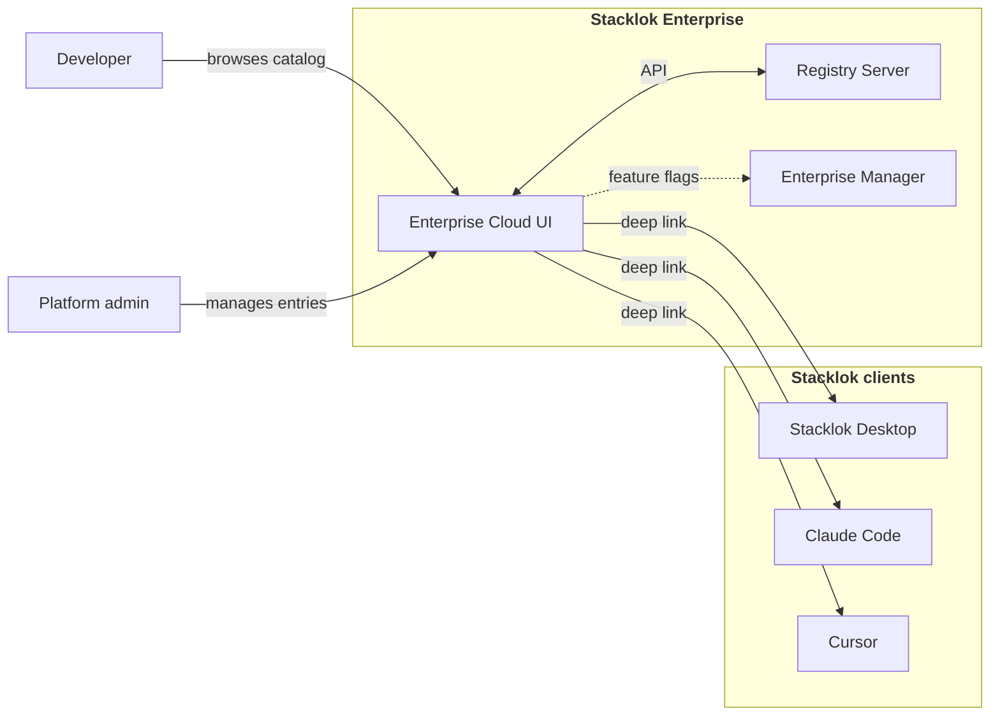

:::enterprise

The Enterprise Cloud UI is a component of Stacklok Enterprise. For a full
comparison of ToolHive Community and Stacklok Enterprise capabilities, see
[Stacklok Enterprise](../index.mdx).

:::

The Enterprise Cloud UI gives platform teams and developers a web-based
interface for the MCP server and skills catalog managed by the
[Registry Server](../../toolhive/guides-registry/index.mdx). It extends the
[open source ToolHive Cloud UI](../../toolhive/guides-cloud-ui/intro.mdx) with
skills discovery and installation, one-click Stacklok Desktop integration, an AI
assistant, and full catalog management for platform teams. Use it to:

- Browse and search the MCP server catalog
- Install servers into Stacklok Desktop with one click
- Add servers to AI clients (Claude Code, Cursor, Visual Studio Code)
- Chat with AI models that can call MCP tools directly
- Publish, update, and delete MCP server entries
- Manage registry sources and registries

## Where it fits

The Cloud UI is a Next.js application deployed in your Kubernetes cluster. It
reads from and writes to the Registry Server API and receives feature flags from
the [Enterprise Manager](../enterprise-manager/index.mdx).

## Roles

Access to Cloud UI features is controlled by roles in your identity provider.
The Registry Server maps JWT claims to roles that determine what each user can
do. At a high level, there are four levels of access:

- **Browse** - all authenticated users can search the catalog, view server
  details, and copy endpoints.
- **Publish** - users with entry management permissions can publish, update, and
  delete MCP server entries.
- **Administer sources** - users with source management permissions can create,
  update, and delete sources.
- **Administer registries** - users with registry management permissions can
  create, update, and delete registries.

The Cloud UI only shows features you have access to. For example, the
**Registries** navigation item only appears for users with source or registry
management permissions.

For details on how roles are configured, see the
[Registry Server authorization](../../toolhive/guides-registry/authorization.mdx)
guide.

## Claims-based visibility

The Registry Server filters API responses based on the claims in your JWT token.
Resources you are not authorized to see are never returned by the API, so they
never appear in the Cloud UI. This filtering happens server-side - the Cloud UI
does not perform client-side access control.

## Feature flags

The [Enterprise Manager](../enterprise-manager/index.mdx) can control Cloud UI
features through policy directives. Each directive carries an `enforcement`
level (`enforced` or `default`):

| Feature     | Controls                              |
| ----------- | ------------------------------------- |
| `assistant` | Show or hide the AI assistant sidebar |

When `assistant` is set to `false` with `enforcement: "enforced"`, the sidebar
is hidden for all users. Other feature flags such as `playground` and
`non_registry_servers` apply to the desktop app only - see
[Enterprise Manager policies](../enterprise-manager/policies/) for details.

## Next steps

- [Deploy the platform](../enterprise-platform/deployment.mdx) to install the
  Cloud UI in your Kubernetes cluster
- [Browse the catalog](./browse-catalog.mdx) to discover and install MCP servers
- [AI assistant](./ai-assistant.mdx) to chat with AI models that call MCP tools
- [Registry management](./administration/) to manage entries, sources, and
  registries
