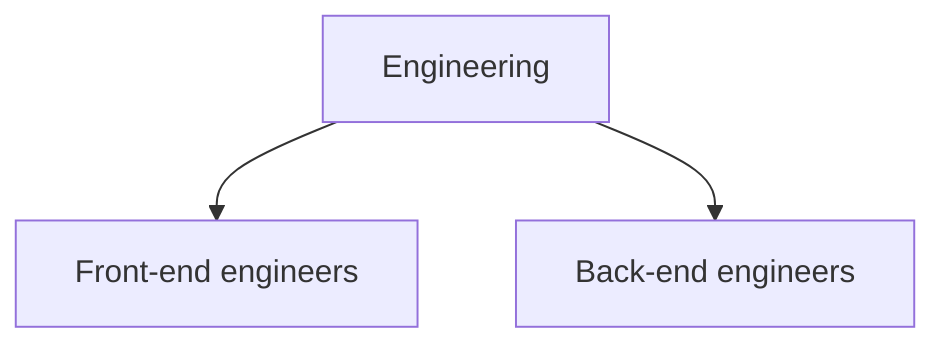

The directory resolves tokens to users. Directory groups organize those users
for connector grants and AI Gateway budgets.

## Where records come from

The source on each record identifies where to update it:

- **SCIM.** Update provisioned profile and membership data in the identity
  provider. See [SCIM provisioning](./scim-provisioning.mdx).
- **API.** Update records created in the console or REST API through either
  interface.

Both sources work identically in access decisions.

## Administer users

In the console, go to **User management**. The list shows each user's name,
email, and **Source**, and can be filtered by group or status. Opening a user
shows the budgets that apply to them.

Edit membership from a group's **Members** tab.

Deactivate a user to prevent the directory from resolving their identity. This
preserves their recorded usage and charges.

## Administer groups

On the **Groups** tab, select **New Group** and provide a name and optional
description. Add users from the group's **Members** tab. Use group names that
align with your identity provider when SCIM and OIDC policies refer to the same
organizational groups.

## Subgroups and inherited membership

A group can contain other groups, listed on its **Subgroups** tab. Membership is
transitive: a user in a subgroup is a member of every group above it, and access
granted to the parent reaches them.

Granting a connector to **Engineering** gives members of both subgroups access.
The directory returns direct and inherited membership to downstream components.

## What groups decide

| Grant a group         | And it affects                                                                    |
| --------------------- | --------------------------------------------------------------------------------- |
| Access to a connector | What that group's members can reach through the Connector Gateway                 |
| A budget              | What that group's members may spend, once their own budget is absent or exhausted |

Both follow inherited membership.

:::warning

Cluster authorization policy uses OIDC claim groups. See
[Directory groups and OIDC claim groups](../concepts/two-group-models.mdx).

:::

## Next steps

- [SCIM provisioning](./scim-provisioning.mdx) to have your identity provider
  maintain these records.
- [Connectors](../../connector-gateway/connectors.mdx) to grant a group access
  to a connector.
- [Budgets and pricing](../../ai-gateway/budgets-and-pricing.mdx) to cap what a
  group may spend.
