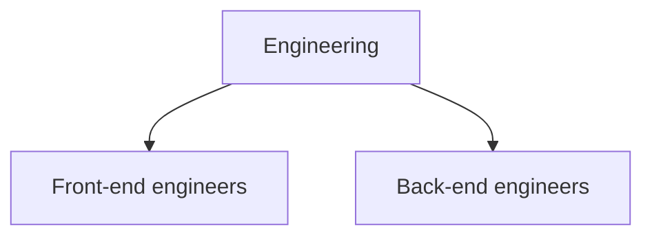

Users and groups are the directory's core records. A user is a person the
platform can resolve a token to. A group is a named set of users, optionally
containing other groups, that access and budgets are granted to.

## Where records come from

Each user and group carries a source, which tells you how it arrived and
therefore where to change it.

- **SCIM.** Provisioned from your identity provider. Membership and profile
  fields track the provider, so edit them there rather than here. See
  [SCIM provisioning](./scim-provisioning.mdx).
- **API.** Created directly through the platform, either in the console or over
  REST. These are yours to maintain.

Both kinds work identically for access decisions. The distinction matters only
for deciding where an edit belongs, which is why the console shows the source on
every row.

## Administer users

In the console, go to **User management**. The list shows each user's name,
email, and source, and can be filtered by group or status.

Over REST, the collection is `/v1/users`, with individual records under
`/v1/users/<ID>`. A user's own record is readable at `/v1/me` without an
administrative grant, which is what the console's user experience uses.

Deactivating a user is the operative control, not deleting them. An inactive user
resolves to nothing, so controls that key on platform identity stop firing for
them and controls that fail closed refuse them. Their recorded usage and charges
remain, because those are history rather than entitlement.

## Administer groups

Groups live under the **Groups** tab of the same area, and at `/v1/groups` over
REST. A group has a name, an optional description, and a membership list.

Group names are worth choosing deliberately, because they are what you will name
in budgets and connector grants, and they are what someone will compare against
your identity provider's group names when they try to reconcile the two systems.

## Subgroups and inherited membership

A group can contain other groups. Membership is transitive: a user in a subgroup
is a member of every group above it, and access granted to the parent reaches
them.

Grant a connector to **Engineering** and members of both subgroups can reach it.
That is the mechanism to prefer over granting each leaf group separately: it
keeps a single place to change access when the shape of a team changes.

Resolution walks the whole tree, so downstream components see a caller's full
inherited group set, not just their direct memberships.

## What groups decide

| Grant a group                | And it affects                                        |
| ---------------------------- | ----------------------------------------------------- |
| Access to a connector        | What that group's members can reach through the MCP gateway |
| A budget                     | What that group's members may spend, once their own budget is absent or exhausted |

Both follow inherited membership.

:::warning

These are directory groups. They are **not** the OIDC claim groups that
cluster-level authorization policy matches on, and changing one does not change
the other. See [The two group models](../concepts/two-group-models.mdx).

:::

## Next steps

- [SCIM provisioning](./scim-provisioning.mdx) to have your identity provider
  maintain these records.
- [Connectors](../enterprise-console/admin/connectors.mdx) to grant a group
  access to a connector.
- [Budgets and pricing](../enterprise-ai-gateway/budgets-and-pricing.mdx) to cap
  what a group may spend.
