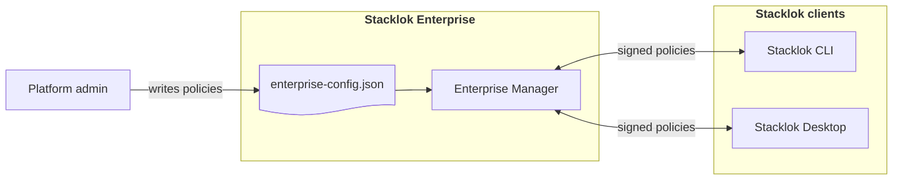

:::enterprise

The Enterprise Manager is a component of Stacklok Enterprise. For a full
comparison of ToolHive Community and Stacklok Enterprise capabilities, see
[Stacklok Enterprise](../index.mdx).

:::

The Enterprise Manager gives platform and security teams centralized control
over how the Stacklok CLI and Stacklok Desktop (the enterprise editions of the
ToolHive CLI and desktop app) behave across your organization. Use it to:

- Pin all clients to your internal MCP registry
- Block MCP servers that are not listed in that registry
- Standardize OpenTelemetry collector configuration
- Tailor the Stacklok Desktop experience (for example, hide the Playground tab)
- Define how clients behave when the Enterprise Manager is unreachable

## Where it fits

The Enterprise Manager runs as a service in your Kubernetes cluster. Clients
authenticate, fetch their configuration, and poll again on a refresh interval
you control, so policy updates propagate across your fleet without manual client
changes. The [Enterprise Cloud UI](../enterprise-cloud-ui/index.mdx) also
consumes feature flags from the Enterprise Manager to control UI features like
the AI assistant.



## Enforcement levels

Every policy directive carries an `enforcement` field — either `enforced`
(mandatory, cannot be overridden locally) or `default` (advisory, can be
overridden). See [Enforcement levels](./policies/#enforcement-levels) for
details.

## How clients connect

Clients bootstrap from a single well-known URL:

```text
GET /.well-known/toolhive-configuration
```

That document returns everything a client needs to authenticate and fetch
configuration: the config endpoint, the JWKS URI used to verify envelope
signatures, and the OIDC issuer, client ID, and scopes for the PKCE auth flow.
No out-of-band credential distribution is required. You share the bootstrap URL
and clients handle the rest.

Each configuration envelope is signed with an EC P-256 key, tagged with an ETag
for efficient caching, stamped with `issued_at` / `not_after` validity
timestamps, and includes the refresh interval that tells the client when to poll
next.

## Next steps

- [Deploy the platform](../enterprise-platform/deployment.mdx) to install the
  Enterprise Manager in your Kubernetes cluster
- [Configure policies](./policies/) to control client behavior across your
  organization
- [Configure degraded mode](./degraded-mode.mdx) to define client behavior when
  the Enterprise Manager is unreachable
