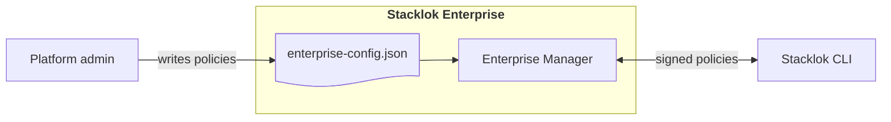

:::enterprise

The Enterprise Manager is a component of Stacklok Enterprise. For a full
comparison of ToolHive Community and Stacklok Enterprise capabilities, see
[Stacklok Enterprise](../index.mdx).

:::

The Enterprise Manager gives platform and security teams centralized control
over how the [Stacklok CLI](../enterprise-cli/index.mdx), the enterprise edition
of the ToolHive CLI, behaves across your organization. Use it to:

- Pin all clients to your internal MCP registry
- Block MCP servers that are not listed in that registry
- Standardize OpenTelemetry collector configuration
- Inject a custom CA certificate or environment variables into MCP containers
- Define how clients behave when the Enterprise Manager is unreachable

## Where it fits

The Enterprise Manager runs as a service in your Kubernetes cluster. Clients
authenticate, fetch their configuration, and poll again on a refresh interval
you control, so policy updates propagate across your fleet without manual client
changes.


```mermaid
flowchart LR
  Admin["Platform admin"]

  subgraph Enterprise["<strong>Stacklok Enterprise</strong>"]
    direction TB
    Config@{ shape: doc, label: "enterprise-config.json" }
    EM["Enterprise Manager"]
    Config --> EM
  end

  CLI["Stacklok CLI"]

  Admin -->|"writes policies"| Config
  EM <-->|"signed policies"| CLI
```

## Enforcement levels

Every policy directive carries an `enforcement` field. `enforced` values are
mandatory, while clients can override `default` values. See
[Enforcement levels](./policies/#enforcement-levels).

## How clients connect

Clients bootstrap from a single well-known URL:

```text
GET /.well-known/toolhive-configuration
```

That document returns the configuration endpoint, the JSON Web Key Set (JWKS)
URI used to verify envelope signatures, and the OIDC issuer, client ID, and
scopes for the Proof Key for Code Exchange (PKCE) flow. Distribute the bootstrap
URL with the Stacklok CLI.

Each configuration envelope is signed with an EC P-256 key, tagged with an ETag
for efficient caching, stamped with `issued_at` / `not_after` validity
timestamps, and includes the refresh interval that tells the client when to poll
next.

## Next steps

- [Deploy the platform](../enterprise-platform/deployment.mdx) to install the
  Enterprise Manager in your Kubernetes cluster
- [Configure policies](./policies/) to control client behavior across your
  organization
- [Configure degraded mode](./degraded-mode.mdx) to define client behavior when
  the Enterprise Manager is unreachable
