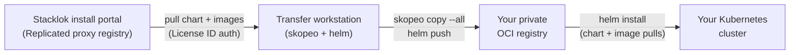

import Tabs from '@theme/Tabs';
import TabItem from '@theme/TabItem';

The [standard deployment](./deployment.mdx) pulls the umbrella Helm chart and
its images from Replicated at install time, using the license credentials you
receive during onboarding. That works when your cluster can reach Replicated
while it installs. When it can't, or your security posture requires every
artifact to come from an internal registry, use this air-gapped path instead. It
produces the same umbrella release, just sourced from your own registry.

## How it works

You move the platform artifacts across the air gap once, then install from your
side of it:

1. **Pull the bundle from Replicated.** Use the Stacklok install portal's Helm
   air-gap flow to download the umbrella chart and the container images it
   references.
1. **Mirror into your registry.** Push the chart and images into a private OCI
   registry you control. Amazon Elastic Container Registry (ECR) is the worked
   example below, but any OCI-compliant registry works the same way.
1. **Repoint the install.** Override the chart's image references and Helm
   source to your registry, and supply a pull secret.
1. **Install with Helm.** Run `helm install` against your registry and verify
   the platform comes up.



Upgrades follow the same path: when Stacklok publishes a new release, re-pull
the chart and images at the new version, mirror them into your registry again,
then re-run the install (or let your GitOps controller reconcile the bumped
version). See [Automate with GitOps](#automate-with-gitops).

## Prerequisites

Before you start, make sure you have:

- The platform prerequisites from the
  [standard deployment](./deployment.mdx#prerequisites): a Kubernetes cluster
  (1.28 or later), an ingress controller, an OIDC-compatible identity provider
  configured per [Configure platform identity](./configure-identity.mdx), and a
  PostgreSQL database for the Registry Server (the MCP and skills catalog
  component, distinct from the private OCI image registry this page mirrors
  into).
- A **StorageClass** for persistent volumes (only needed if you're enabling the
  AI Gateway). Valkey runs as a StatefulSet with a `ReadWriteOnce` persistent
  volume claim, so the cluster needs a StorageClass, ideally one marked
  **default**. If none is marked default, the claim stays `Pending` and Valkey
  never starts; set the class explicitly in your values (see
  [Step 4](#step-4-point-the-install-at-your-registry)).
- A private OCI registry you control (Amazon ECR, Google Artifact Registry,
  Azure Container Registry, Artifactory, Harbor, or any OCI-compliant registry)
  that your cluster can pull from.
- Your Stacklok Enterprise license, available from the Stacklok install portal
  at [install.stacklok.com](https://install.stacklok.com). Helm and your image
  tooling authenticate to the Replicated proxy registry using your **License
  ID** as the password. Stacklok sends portal access instructions during
  onboarding.
- A transfer workstation that can reach both the Replicated proxy registry and
  your own registry, with these tools installed:
  - A tool that can mirror multi-arch images between registries, such as
    [`skopeo`](https://github.com/containers/skopeo) or
    [`crane`](https://github.com/google/go-containerregistry). The examples
    below use `skopeo`.
  - [`helm`](https://helm.sh/) 3.8 or later (the version that supports OCI
    registries)
  - `kubectl` to install and verify
  - Your registry's CLI for authentication (for example, the AWS CLI v2 for ECR)

:::note[Egress for the transfer workstation]

The transfer workstation needs outbound HTTPS (port 443) to the Stacklok
distribution hosts and to your own registry. In a locked-down network, get these
allowlisted first; a blocked host surfaces as an opaque TLS or connection
timeout rather than a clear error:

- the install portal (`install.stacklok.com`)
- the OCI chart host and image-proxy host the portal prints for your release
  (typically an `oci.*` host and an `image-proxy.*` host)
- `proxy.replicated.com`, if the Replicated SDK is enabled
- your own registry host, so you can push

The cluster's own egress (identity provider issuer, telemetry, upstream MCP
endpoints) is separate and isn't covered here.

:::

:::note[Fully disconnected environments]

If the transfer workstation can't reach your registry and your cluster at the
same time, the install portal also produces a downloadable air-gap bundle (a
`.tgz` of the chart and images). Move the bundle across the gap on your own
media, then run the mirror steps below from a workstation on the internal
network. The commands are identical once the artifacts are local.

When you unpack the bundle, watch the OCI layout. A `tar --strip-components` can
drop the `index.json` at the layout root, and archives created on macOS carry
`__MACOSX/._*` junk that confuses tooling. Run `find . -name oci-layout` to
confirm the layout root after extraction, and test the exact unpack commands on
your target operating system.

:::

## Step 1: Get your license and image list

Stacklok distributes the platform through Replicated and gives you a
customer-facing install portal at
[install.stacklok.com](https://install.stacklok.com). Log in with the
credentials Stacklok provides during onboarding. The portal hosts your license,
the chart, and per-release install instructions.

In the portal, open the **Existing cluster with Helm** instructions and select
the air-gap flow. The portal generates the exact commands for your release,
authenticated with your license. The flow covers:

- Authenticating Helm and your image tooling to the Replicated proxy registry,
  using your **License ID** as the password
- Listing the container images the chart references for your release
- Pulling the umbrella chart and those images

Note your **License ID** and the image references the portal lists. You use the
License ID to authenticate in [Step 3](#step-3-mirror-the-chart-and-images), and
the image references tell you what to mirror.

:::warning[Mirror every image the portal lists]

Use the portal's image list for your release as the source of truth, and mirror
every image on it. Don't try to derive the list yourself by rendering the chart:
the platform subcharts are disabled by default, so a plain `helm template`
doesn't render most of them; some images are pinned inside subcharts or passed
through as operator settings as full `repo:tag` strings; and a few default to
other registries such as `docker.io` or `mcr.microsoft.com`. Grepping
`values.yaml` for `image.repository` fields under-reports for the same reasons.
If anything looks missing for your release, confirm the full set with Stacklok
before you install. An image you miss surfaces later as an `ImagePullBackOff`,
because the cluster pulls only from your registry and the missing image was
never mirrored into it.

:::

## Step 2: Create repositories in your registry

Create one repository per artifact you're mirroring: one for the umbrella chart
and one for each container image from Step 1. The repository layout under your
registry prefix should mirror the source paths so the image overrides in
[Step 4](#step-4-point-the-install-at-your-registry) stay simple.

<Tabs groupId='registry'>
<TabItem value='ecr' label='Amazon ECR' default>

ECR requires each repository to exist before you can push to it. Create them up
front. The example uses an `aws ecr create-repository` call per artifact:

```bash
export AWS_REGION=<YOUR_REGION>
export ECR_PREFIX=<YOUR_PREFIX> # for example: stacklok-enterprise

for repo in \
  stacklok-enterprise-platform \
  <IMAGE_1> <IMAGE_2> <IMAGE_3>; do
  aws ecr create-repository \
    --region "$AWS_REGION" \
    --repository-name "$ECR_PREFIX/$repo" \
    --image-tag-mutability IMMUTABLE >/dev/null \
    && echo "created $ECR_PREFIX/$repo"
done
```

Replace `<IMAGE_1>`, `<IMAGE_2>`, and so on with the image names from the
portal's image list. List your repositories with
`aws ecr describe-repositories --region "$AWS_REGION"` to confirm.

</TabItem>
<TabItem value='generic' label='Other OCI registries'>

Many registries (Harbor, Google Artifact Registry, Azure Container Registry)
create repositories automatically on first push, so you can skip ahead to
mirroring. If yours requires repositories to exist first, create one per
artifact from Step 1 (the umbrella chart plus each image) under a shared prefix,
using your registry's console or CLI.

Whichever registry you use, note its host (for example, `myorg.jfrog.io` or
`<REGION>-docker.pkg.dev/<PROJECT>`) and a prefix to group the Stacklok
artifacts. You reference both in the next steps.

</TabItem>
</Tabs>

## Step 3: Mirror the chart and images

Authenticate to both registries, then copy each artifact from Replicated into
your own.

### Authenticate to both registries

You authenticate to two registries: the Replicated proxy registry you pull
**from** (the source), and your own registry you push **to** (the target).

Log in to the source with your **License ID** from
[Step 1](#step-1-get-your-license-and-image-list). Replicated serves the chart
and the images from different hosts: the chart from an `oci.*` host (Helm) and
the images from an `image-proxy.*` host (skopeo). Use the exact hosts the
install portal printed for your release; the logins follow this shape:

```bash
# Use your License ID as the password for both.
# Images: skopeo pulls from the image-proxy host.
skopeo login <SOURCE_IMAGE_REGISTRY> \
  --username <YOUR_EMAIL> --password <LICENSE_ID>

# Chart: helm pulls from the OCI chart host.
helm registry login <SOURCE_CHART_REGISTRY> \
  --username <YOUR_EMAIL> --password <LICENSE_ID>
```

Then log in to your target registry:

<Tabs groupId='registry'>
<TabItem value='ecr' label='Amazon ECR' default>

Log `skopeo` and `helm` in to ECR with a short-lived token:

```bash
export ECR_HOST=<ACCOUNT_ID>.dkr.ecr.<YOUR_REGION>.amazonaws.com

aws ecr get-login-password --region "$AWS_REGION" \
  | skopeo login --username AWS --password-stdin "$ECR_HOST"

aws ecr get-login-password --region "$AWS_REGION" \
  | helm registry login --username AWS --password-stdin "$ECR_HOST"
```

ECR tokens from `get-login-password` expire after 12 hours, so run these again
if a long mirror session outlives the token.

</TabItem>
<TabItem value='generic' label='Other OCI registries'>

Log `skopeo` and `helm` in to your registry with the credentials it issues:

```bash
export TARGET_HOST=<YOUR_REGISTRY_HOST>

skopeo login "$TARGET_HOST"
helm registry login "$TARGET_HOST"
```

Use whatever credential your registry expects (a robot account, a personal
access token, or a service-account key). The rest of the flow is identical.

</TabItem>
</Tabs>

### Copy the images

Mirror each image with `skopeo copy --all`. The `--all` flag copies the full
multi-arch manifest list (for example, `amd64` and `arm64`) rather than a single
platform, so the image still resolves on every node type in your cluster:

```bash
skopeo copy --all \
  docker://<SOURCE_IMAGE_REGISTRY>/<IMAGE>:<TAG> \
  docker://$ECR_HOST/$ECR_PREFIX/<IMAGE>:<TAG>
```

Run one `skopeo copy` per image from the portal's image list. Take the
`<SOURCE_IMAGE_REGISTRY>` and `<IMAGE>:<TAG>` values directly from that list so
the tags match what the chart expects. The `docker://` prefix is skopeo's
registry transport, not a dependency on Docker; you don't need a container
engine for this step.

:::note[Preserve the multi-arch manifest]

[`crane copy`](https://github.com/google/go-containerregistry) preserves the
manifest list the same way and is a drop-in alternative (it takes bare image
references, with no `docker://` prefix). Avoid mirroring with a container
engine's single-image pull and push, such as `docker pull` and `docker push` (or
the `podman` and `nerdctl` equivalents), which flattens the image to one
architecture and breaks pulls on mixed `amd64` and `arm64` clusters.

:::

### Push the chart

Pull the umbrella chart from Replicated (the portal's generated command does
this), then push it to your registry as an OCI artifact:

```bash
helm push \
  stacklok-enterprise-platform-<VERSION>.tgz \
  oci://$ECR_HOST/$ECR_PREFIX
```

Verify the chart landed by pulling it back:

```bash
helm pull oci://$ECR_HOST/$ECR_PREFIX/stacklok-enterprise-platform \
  --version <VERSION>
```

Confirm the version that resolves is the one you pushed, not a stale cached
entry under a reused tag (a stale chart surfaces later as confusing CRD-schema
mismatches):

```bash
helm show chart oci://$ECR_HOST/$ECR_PREFIX/stacklok-enterprise-platform \
  --version <VERSION> | grep '^version:'
```

## Step 4: Point the install at your registry

The umbrella chart's image references default to the Replicated-hosted registry
it ships from. Override them so every pull comes from your registry, and give
the chart a pull secret for it.

### Create an image pull secret

Create a `docker-registry` secret in the install namespace so the cluster can
authenticate when it pulls images. Despite the name, this Kubernetes secret type
works for any OCI registry, not just Docker Hub; it's how the kubelet stores
registry pull credentials.

<Tabs groupId='registry'>
<TabItem value='ecr' label='Amazon ECR' default>

```bash
kubectl create namespace stacklok-system --dry-run=client -o yaml \
  | kubectl apply -f -

kubectl create secret docker-registry stacklok-enterprise-pull \
  --namespace stacklok-system \
  --docker-server="$ECR_HOST" \
  --docker-username=AWS \
  --docker-password="$(aws ecr get-login-password --region "$AWS_REGION")"
```

An ECR pull token expires after 12 hours, so don't pin it into a static secret.
Use a refreshing credential instead. See
[Keep registry credentials fresh](#keep-registry-credentials-fresh).

</TabItem>
<TabItem value='generic' label='Other OCI registries'>

```bash
kubectl create namespace stacklok-system --dry-run=client -o yaml \
  | kubectl apply -f -

kubectl create secret docker-registry stacklok-enterprise-pull \
  --namespace stacklok-system \
  --docker-server="$TARGET_HOST" \
  --docker-username=<USERNAME> \
  --docker-password=<TOKEN_OR_PASSWORD>
```

If your registry issues long-lived robot credentials, this secret is all the
cluster needs. If it issues short-lived tokens, see
[Keep registry credentials fresh](#keep-registry-credentials-fresh).

</TabItem>
</Tabs>

### Override the image source in values

Add your registry overrides and pull secret to the `values.yaml` from the
[standard deployment](./deployment.mdx#3-configure-values), so the chart pulls
every image from your registry instead of the default.

This chart has no global image-registry override (no `global.imageRegistry`),
and no single `global.imagePullSecrets` that reaches every component. Repoint
each component's image, and set its pull secret, in that component's own
subchart values. The example below uses verified key paths; confirm them against
the `values.yaml` in the chart you pulled in Step 1, since paths can change
between versions.

```yaml title="values.yaml (air-gap additions)"
# The air-gapped path uses your own pull secret, not the Replicated SDK. The
# standard values enable it; turn it off here, or it tries to pull from and
# phone home to Replicated.
replicated:
  enabled: false

# Cloud UI and Enterprise Manager: a structured image block plus their own
# imagePullSecrets list.
toolhive-cloud-ui:
  image:
    repository: <YOUR_REGISTRY_HOST>/<YOUR_PREFIX>/cloud-ui
    tag: '<VERSION>'
  imagePullSecrets:
    - name: stacklok-enterprise-pull
enterprise-manager:
  image:
    repository: <YOUR_REGISTRY_HOST>/<YOUR_PREFIX>/toolhive-enterprise
    tag: '<VERSION>'
  imagePullSecrets:
    - name: stacklok-enterprise-pull

# Registry Server: image referenced as a full repo:tag string (not a
# repository/tag pair).
toolhive-registry-server:
  upstream:
    image:
      registryServerUrl: <YOUR_REGISTRY_HOST>/<YOUR_PREFIX>/registry-api:<VERSION>
    imagePullSecrets:
      - name: stacklok-enterprise-pull

# ToolHive operator: four images set as full repo:tag strings. The operator
# stamps the runner, vMCP, and registry-api refs onto the workloads it spawns,
# so nothing global could rewrite them. defaultImagePullSecrets propagates the
# pull secret to those spawned pods.
toolhive-operator:
  upstream:
    operator:
      image: <YOUR_REGISTRY_HOST>/<YOUR_PREFIX>/operator:<VERSION>
      toolhiveRunnerImage: <YOUR_REGISTRY_HOST>/<YOUR_PREFIX>/proxyrunner:<VERSION>
      vmcpImage: <YOUR_REGISTRY_HOST>/<YOUR_PREFIX>/vmcp:<VERSION>
      imagePullSecrets:
        - name: stacklok-enterprise-pull
      defaultImagePullSecrets:
        - name: stacklok-enterprise-pull
    registryAPI:
      image: <YOUR_REGISTRY_HOST>/<YOUR_PREFIX>/registry-api:<VERSION>

# AI Gateway operator (aliased enterprise-ai-gateway-operator). Its subchart
# images live under upstream.*, and it honors a subchart-scoped
# global.imagePullSecrets. Repoint the operator, AI Gateway controller and
# ext-proc, Envoy Gateway, ratelimit, Valkey, and Presidio image references
# here, following the same paths in the chart's values.yaml.
enterprise-ai-gateway-operator:
  upstream:
    global:
      imagePullSecrets:
        - name: stacklok-enterprise-pull
```

:::warning[Presidio is pinned by digest]

Presidio is the only image the chart pins by `sha256` digest; the rest resolve
by tag. If you mirror with a tool that preserves the manifest digest (such as
`skopeo copy --all`), the pin still resolves from your registry. But if your
registry rewrites the manifest on push (some do), the digest no longer matches
and the pull fails even though the image is present. If you hit a Presidio
digest-mismatch error, clear the pin so it resolves by tag:

```yaml
enterprise-ai-gateway-operator:
  upstream:
    presidio:
      image:
        digest: ''
```

:::

If your cluster has no **default** StorageClass, pin one for Valkey. It's
deployed as a StatefulSet with a `ReadWriteOnce` claim, so without a class the
claim stays `Pending` and Valkey never starts:

```yaml
enterprise-ai-gateway-operator:
  upstream:
    valkey:
      persistence:
        storageClass: <YOUR_STORAGECLASS> # for example, an EBS gp3 class
```

Persistence is enabled by default with a 1Gi claim, so you only need to set the
class.

## Step 5: Install and verify

Install the chart from your registry with the merged values. Reference the chart
by its `oci://` URL rather than a Helm repo alias:

```bash
helm install stacklok-enterprise \
  oci://$ECR_HOST/$ECR_PREFIX/stacklok-enterprise-platform \
  --version <VERSION> \
  --namespace stacklok-system \
  --create-namespace \
  --values values.yaml
```

Verify the platform comes up the same way as in the
[standard deployment](./deployment.mdx#5-verify-the-install): confirm every pod
in `stacklok-system` reaches `Running` and the ToolHive CRDs registered.

In an air-gapped install, the failure mode to watch for is a pod stuck in
`ImagePullBackOff`. It almost always means an image the chart references wasn't
mirrored, or the pull secret can't authenticate. Recheck the pod's image against
the portal's image list to confirm you mirrored it, and confirm the
`stacklok-enterprise-pull` secret is valid.

## Step 6: Prepare workload namespaces

If you run MCP server and vMCP workloads in a namespace other than
`stacklok-system`, that namespace also needs pull access to your registry. The
operator stamps the `stacklok-enterprise-pull` secret onto every workload pod it
spawns (the `defaultImagePullSecrets` from
[Step 4](#step-4-point-the-install-at-your-registry)), and the kubelet resolves
it in the pod's own namespace. Provide that access the same way as
[Keep registry credentials fresh](#keep-registry-credentials-fresh):

- **Long-lived credentials** (Artifactory or Harbor robot accounts, a GAR or ACR
  service-account key): create `stacklok-enterprise-pull` in each workload
  namespace, as you did in `stacklok-system`. That's all the namespace needs:

  ```bash
  kubectl create namespace <WORKLOAD_NAMESPACE>

  kubectl create secret docker-registry stacklok-enterprise-pull \
    --namespace <WORKLOAD_NAMESPACE> \
    --docker-server=<YOUR_REGISTRY_HOST> \
    --docker-username=<USERNAME> \
    --docker-password=<TOKEN_OR_PASSWORD>
  ```

- **Short-lived tokens** (Amazon ECR's expire after 12 hours): grant registry
  read to the node identity instead. The kubelet then pulls in any namespace, so
  no static secret is needed and you can drop the `defaultImagePullSecrets`
  override.

## Automate with GitOps

The manual flow above is the clearest way to understand the air-gap path, but
most teams run it through their existing infrastructure-as-code and GitOps
tooling so it's repeatable and auditable.

- **Provision with infrastructure-as-code, in the right order.** Use Terraform,
  OpenTofu, or your preferred tool to create the registry repositories and the
  image pull secret. They must exist before the controller first reconciles, or
  the HelmRelease fails with `chart not found` or `secret not found` and you're
  debugging a race. Provision the registry side first, then point the controller
  at it.
- **Reconcile with GitOps, from a self-refreshing source.** Point Flux or Argo
  CD at your registry's `oci://` chart URL and let the controller install and
  upgrade the umbrella release. Rather than a static pull secret, let the
  controller pull the chart with a workload identity (for Flux, a
  `HelmRepository` with `provider: aws` and no `secretRef`); this is the
  chart-pull half of
  [Keep registry credentials fresh](#keep-registry-credentials-fresh). The
  values you assemble in [Step 4](#step-4-point-the-install-at-your-registry) go
  in your Git source of truth.
- **Mirror new releases, and keep Git in sync with what you mirrored.** Wrap the
  [Step 3](#step-3-mirror-the-chart-and-images) `skopeo` and `helm push`
  commands in a job that runs whenever Stacklok publishes a new release. In an
  air-gapped setup, Git can drift from reality: an out-of-band mirror leaves the
  cluster on a version Git never recorded. Pin the exact mirrored version and
  commit the bump when you mirror.

:::note[If you automate further]

Flux image-automation semver matchers ignore pre-release tags by default. And
infrastructure-as-code that creates registry repositories and IAM roles in a
single apply often needs retries: a freshly created IAM principal isn't
immediately usable, and the apply can fail with `Invalid principal in policy`.

:::

### Keep registry credentials fresh

Many registries issue short-lived pull tokens (ECR's expire after 12 hours). A
static pull secret built from one of those tokens stops working once the token
expires, and pulls start failing on chart upgrades and on any pod that schedules
onto a new node.

For a long-lived cluster, replace the static secret with a credential that
refreshes itself. Two separate pull paths need this, and they authenticate
differently.

**Image pulls happen at the node level.** The kubelet pulls container images
before a pod's identity exists, so it authenticates with the node's identity,
not a pod or service-account identity. Grant registry read to the node:

- **Amazon ECR:** Attach `AmazonEC2ContainerRegistryReadOnly` to the node group
  role, or use the ECR credential provider. Images then pull without a static
  secret.
- **Google Artifact Registry and Azure Container Registry:** Grant reader access
  (GAR) or the `AcrPull` role (ACR) to the node service account or kubelet
  identity.

Once the node identity has registry read, you can drop the static
`imagePullSecrets` override from your values.

**Chart pulls happen at the pod level.** A GitOps controller (for example,
Flux's source-controller) pulls the chart over the Helm OCI client from its own
pod, so pod-level workload identity fits here:

- **Amazon ECR:** Use
  [EKS Pod Identity](https://docs.aws.amazon.com/eks/latest/userguide/pod-identities.html)
  or IAM roles for service accounts. For Flux, set `provider: aws` on the
  `HelmRepository` and drop its `secretRef`.
- **Google Artifact Registry:** Use
  [Workload Identity Federation](https://cloud.google.com/iam/docs/workload-identity-federation)
  to bind the controller's service account to a Google service account with
  reader access.
- **Azure Container Registry:** Use
  [workload identity](https://learn.microsoft.com/en-us/azure/aks/workload-identity-overview)
  with an `AcrPull` role assignment.

## Next steps

- [Verify the distribution](./verify-artifacts.mdx) to confirm the signatures,
  provenance, and SBOMs of the images you mirrored
- [Configure platform identity](./configure-identity.mdx) to wire your identity
  provider to the platform components
- [Configure policies](../enterprise-manager/policies/) to control client
  behavior across your organization
- [Browse the catalog](../enterprise-cloud-ui/browse-catalog.mdx) once the Cloud
  UI is running

## Related information

- [Deploy the platform](./deployment.mdx) - the standard install, which pulls
  from Replicated at install time
- [Configure the Registry Server](./configure-registry-server.mdx) - the catalog
  the Cloud UI reads
