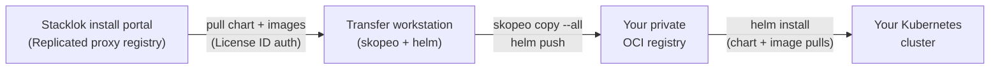

import Tabs from '@theme/Tabs';
import TabItem from '@theme/TabItem';

Use this workflow when your cluster cannot reach Replicated during installation
or must pull every artifact from an internal registry. You mirror the Stacklok
Enterprise chart and images into your registry, then install the same umbrella
release from there.

## How it works

Move the platform artifacts across the air gap, then install from your registry:

1. **Pull the bundle from Replicated.** Use the Stacklok install portal's Helm
   air-gap flow to download the umbrella chart and the container images it
   references.
1. **Mirror into your registry.** Push the chart and images into a private OCI
   registry you control. The examples use Amazon Elastic Container Registry
   (ECR) and include commands for other OCI-compliant registries.
1. **Repoint the install.** Override the chart's image references and Helm
   source to your registry, and supply a pull secret.
1. **Install with Helm.** Run `helm install` against your registry and verify
   the platform comes up.


```mermaid
flowchart LR
  Replicated["Stacklok install portal\n(Replicated proxy registry)"]
  Station["Transfer workstation\n(skopeo + helm)"]
  Registry["Your private\nOCI registry"]
  Cluster["Your Kubernetes\ncluster"]

  Replicated -->|"pull chart + images\n(License ID auth)"| Station
  Station -->|"skopeo copy --all\nhelm push"| Registry
  Registry -->|"helm install\n(chart + image pulls)"| Cluster
```

For upgrades, mirror the new chart and images, then update the Helm release or
the version in your GitOps configuration.

## Prerequisites

Before you start, make sure you have:

- The platform prerequisites from the
  [standard deployment](./deployment.mdx#prerequisites): a Kubernetes cluster
  (1.30 or later), an ingress controller, an OIDC-compatible identity provider
  configured per [Configure platform identity](./configure-identity.mdx), and a
  PostgreSQL database for the Registry Server (the MCP and skills catalog
  component, distinct from the private OCI image registry this page mirrors
  into).
- A **StorageClass** for the AI Gateway's Valkey persistent volume. Use the
  default StorageClass or set one explicitly in your values (see
  [Step 4](#step-4-point-the-install-at-your-registry)).
- A private OCI registry you control (Amazon ECR, Google Artifact Registry,
  Azure Container Registry, Artifactory, Harbor, or any OCI-compliant registry)
  that your cluster can pull from.
- Your Stacklok Enterprise license, available from the Stacklok install portal
  at [install.stacklok.com](https://install.stacklok.com). Helm and your image
  tooling authenticate to the Replicated proxy registry using your **License
  ID** as the password. Stacklok sends portal access instructions during
  onboarding.
- A transfer workstation that can reach both the Replicated proxy registry and
  your own registry, with these tools installed:
  - A tool that can mirror multi-arch images between registries, such as
    [`skopeo`](https://github.com/containers/skopeo) or
    [`crane`](https://github.com/google/go-containerregistry). The examples
    below use `skopeo`.
  - [`helm`](https://helm.sh/) 3.8 or later (the version that supports OCI
    registries)
  - `kubectl` to install and verify
  - Your registry's CLI for authentication (for example, the AWS CLI v2 for ECR)

:::note[Egress for the transfer workstation]

Allow outbound HTTPS from the transfer workstation to:

- the install portal (`install.stacklok.com`)
- the OCI chart host and image-proxy host the portal prints for your release
  (typically an `oci.*` host and an `image-proxy.*` host)
- `proxy.replicated.com`, if the Replicated SDK is enabled
- your own registry host, so you can push

Configure cluster egress separately for your identity provider, telemetry, and
upstream MCP endpoints.

:::

:::note[Fully disconnected environments]

For a fully disconnected environment, download the air-gap bundle from the
install portal and transfer it to a workstation on the internal network. Run the
mirror steps there after unpacking the bundle.

When you unpack the bundle, watch the OCI layout. A `tar --strip-components` can
drop the `index.json` at the layout root, and archives created on macOS carry
`__MACOSX/._*` junk that confuses tooling. Run `find . -name oci-layout` to
confirm the layout root after extraction, and test the exact unpack commands on
your target operating system.

:::

## Step 1: Get your license and image list

Log in to the [Stacklok install portal](https://install.stacklok.com) with the
credentials provided during onboarding.

In the portal, open the **Existing cluster with Helm** instructions and select
the air-gap flow. The portal generates the exact commands for your release,
authenticated with your license. The flow covers:

- Authenticating Helm and your image tooling to the Replicated proxy registry,
  using your **License ID** as the password
- Listing the container images the chart references for your release
- Pulling the umbrella chart and those images

Note your **License ID** and the image references the portal lists. You use the
License ID to authenticate in [Step 3](#step-3-mirror-the-chart-and-images), and
the image references tell you what to mirror.

:::warning[Mirror every image the portal lists]

Mirror every image in the portal's list for your release. Rendering the chart or
searching `values.yaml` produces an incomplete list because disabled subcharts
and operator settings contain additional image references. Confirm any apparent
omissions with Stacklok before installation.

:::

## Step 2: Create repositories in your registry

Create one repository per artifact you're mirroring: one for the umbrella chart
and one for each container image from Step 1. The repository layout under your
registry prefix should mirror the source paths so the image overrides in
[Step 4](#step-4-point-the-install-at-your-registry) stay simple.

<Tabs groupId='registry'>
<TabItem value='ecr' label='Amazon ECR' default>

ECR requires each repository to exist before you can push to it. Create them up
front. The example uses an `aws ecr create-repository` call per artifact:

```bash
export AWS_REGION=<YOUR_REGION>
export ECR_PREFIX=<YOUR_PREFIX> # for example: stacklok-enterprise

for repo in \
  stacklok-enterprise-platform \
  <IMAGE_1> <IMAGE_2> <IMAGE_3>; do
  aws ecr create-repository \
    --region "$AWS_REGION" \
    --repository-name "$ECR_PREFIX/$repo" \
    --image-tag-mutability IMMUTABLE >/dev/null \
    && echo "created $ECR_PREFIX/$repo"
done
```

Replace `<IMAGE_1>`, `<IMAGE_2>`, and so on with the image names from the
portal's image list. List your repositories with
`aws ecr describe-repositories --region "$AWS_REGION"` to confirm.

</TabItem>
<TabItem value='generic' label='Other OCI registries'>

Many registries (Harbor, Google Artifact Registry, Azure Container Registry)
create repositories automatically on first push, so you can skip ahead to
mirroring. If yours requires repositories to exist first, create one per
artifact from Step 1 (the umbrella chart plus each image) under a shared prefix,
using your registry's console or CLI.

Note the registry host, such as `<REGION>-docker.pkg.dev/<PROJECT>`, and a
prefix for the Stacklok artifacts. You reference both in the next steps.

</TabItem>
</Tabs>

## Step 3: Mirror the chart and images

Authenticate to both registries, then copy each artifact from Replicated into
your own.

### Authenticate to both registries

Log in to the source with your **License ID** from
[Step 1](#step-1-get-your-license-and-image-list). Replicated serves the chart
and the images from different hosts: the chart from an `oci.*` host (Helm) and
the images from an `image-proxy.*` host (skopeo). Use the exact hosts the
install portal printed for your release:

```bash
# Use your License ID as the password for both.
# Images: skopeo pulls from the image-proxy host.
skopeo login <SOURCE_IMAGE_REGISTRY> \
  --username <YOUR_EMAIL> --password <LICENSE_ID>

# Chart: helm pulls from the OCI chart host.
helm registry login <SOURCE_CHART_REGISTRY> \
  --username <YOUR_EMAIL> --password <LICENSE_ID>
```

Then log in to your target registry:

<Tabs groupId='registry'>
<TabItem value='ecr' label='Amazon ECR' default>

Log `skopeo` and `helm` in to ECR with a short-lived token:

```bash
export ECR_HOST=<ACCOUNT_ID>.dkr.ecr.<YOUR_REGION>.amazonaws.com

aws ecr get-login-password --region "$AWS_REGION" \
  | skopeo login --username AWS --password-stdin "$ECR_HOST"

aws ecr get-login-password --region "$AWS_REGION" \
  | helm registry login --username AWS --password-stdin "$ECR_HOST"
```

ECR tokens from `get-login-password` expire after 12 hours, so run these again
if a long mirror session outlives the token.

</TabItem>
<TabItem value='generic' label='Other OCI registries'>

Log `skopeo` and `helm` in to your registry with the credentials it issues:

```bash
export TARGET_HOST=<YOUR_REGISTRY_HOST>

skopeo login "$TARGET_HOST"
helm registry login "$TARGET_HOST"
```

Use whatever credential your registry expects (a robot account, a personal
access token, or a service-account key). The rest of the flow is identical.

</TabItem>
</Tabs>

### Copy the images

Mirror each image with `skopeo copy --all` to preserve its multi-architecture
manifest:

```bash
skopeo copy --all \
  docker://<SOURCE_IMAGE_REGISTRY>/<IMAGE>:<TAG> \
  docker://$ECR_HOST/$ECR_PREFIX/<IMAGE>:<TAG>
```

Run one `skopeo copy` per image from the portal's image list. Use the
`<SOURCE_IMAGE_REGISTRY>` and `<IMAGE>:<TAG>` values from that list. The
`docker://` prefix selects skopeo's registry transport.

:::note[Preserve the multi-arch manifest]

You can also use [`crane copy`](https://github.com/google/go-containerregistry)
with bare image references. Both commands preserve the manifest required for
clusters with mixed `amd64` and `arm64` nodes.

:::

### Push the chart

Pull the umbrella chart from Replicated (the portal's generated command does
this), then push it to your registry as an OCI artifact:

```bash
helm push \
  stacklok-enterprise-platform-<VERSION>.tgz \
  oci://$ECR_HOST/$ECR_PREFIX
```

Verify the chart landed by pulling it back:

```bash
helm pull oci://$ECR_HOST/$ECR_PREFIX/stacklok-enterprise-platform \
  --version <VERSION>
```

Confirm that the resolved version matches the chart you pushed. A cached chart
under a reused tag can cause CRD schema mismatches:

```bash
helm show chart oci://$ECR_HOST/$ECR_PREFIX/stacklok-enterprise-platform \
  --version <VERSION> | grep '^version:'
```

## Step 4: Point the install at your registry

The umbrella chart's image references default to the Replicated-hosted registry
it ships from. Override them so every pull comes from your registry, and give
the chart a pull secret for it.

### Create an image pull secret

Create a `docker-registry` secret in the install namespace. Kubernetes uses this
secret type for OCI registry credentials.

<Tabs groupId='registry'>
<TabItem value='ecr' label='Amazon ECR' default>

```bash
kubectl create namespace stacklok-system --dry-run=client -o yaml \
  | kubectl apply -f -

kubectl create secret docker-registry stacklok-enterprise-pull \
  --namespace stacklok-system \
  --docker-server="$ECR_HOST" \
  --docker-username=AWS \
  --docker-password="$(aws ecr get-login-password --region "$AWS_REGION")"
```

ECR pull tokens expire after 12 hours. Configure a refreshing credential as
described in
[Keep registry credentials fresh](#keep-registry-credentials-fresh).

</TabItem>
<TabItem value='generic' label='Other OCI registries'>

```bash
kubectl create namespace stacklok-system --dry-run=client -o yaml \
  | kubectl apply -f -

kubectl create secret docker-registry stacklok-enterprise-pull \
  --namespace stacklok-system \
  --docker-server="$TARGET_HOST" \
  --docker-username=<USERNAME> \
  --docker-password=<TOKEN_OR_PASSWORD>
```

If your registry issues long-lived robot credentials, this secret is all the
cluster needs. If it issues short-lived tokens, see
[Keep registry credentials fresh](#keep-registry-credentials-fresh).

</TabItem>
</Tabs>

### Override the image source in values

Add registry overrides and the pull secret to the `values.yaml` from the
[standard deployment](./deployment.mdx#3-configure-values). Set each component's
image and pull secret under its subchart because the umbrella chart has no
global image registry or pull-secret value. Confirm these paths against the
`values.yaml` in your chart version.

```yaml title="values.yaml (air-gap additions)"
# The air-gapped path uses your own pull secret, not the Replicated SDK. The
# standard values enable it; turn it off here, or it tries to pull from and
# phone home to Replicated.
replicated:
  enabled: false

# The console and Enterprise Manager: a structured image block plus their own
# imagePullSecrets list.
toolhive-cloud-ui:
  image:
    repository: <YOUR_REGISTRY_HOST>/<YOUR_PREFIX>/cloud-ui
    tag: '<VERSION>'
  imagePullSecrets:
    - name: stacklok-enterprise-pull
enterprise-manager:
  image:
    repository: <YOUR_REGISTRY_HOST>/<YOUR_PREFIX>/toolhive-enterprise
    tag: '<VERSION>'
  imagePullSecrets:
    - name: stacklok-enterprise-pull

# Registry Server: image referenced as a full repo:tag string (not a
# repository/tag pair).
toolhive-registry-server:
  upstream:
    image:
      registryServerUrl: <YOUR_REGISTRY_HOST>/<YOUR_PREFIX>/registry-api:<VERSION>
    imagePullSecrets:
      - name: stacklok-enterprise-pull

# ToolHive operator: four images set as full repo:tag strings. The operator
# stamps the runner, vMCP, and registry-api refs onto the workloads it spawns,
# so nothing global could rewrite them. defaultImagePullSecrets propagates the
# pull secret to those spawned pods.
toolhive-operator:
  upstream:
    operator:
      image: <YOUR_REGISTRY_HOST>/<YOUR_PREFIX>/operator:<VERSION>
      toolhiveRunnerImage: <YOUR_REGISTRY_HOST>/<YOUR_PREFIX>/proxyrunner:<VERSION>
      vmcpImage: <YOUR_REGISTRY_HOST>/<YOUR_PREFIX>/vmcp:<VERSION>
      imagePullSecrets:
        - name: stacklok-enterprise-pull
      defaultImagePullSecrets:
        - name: stacklok-enterprise-pull
    registryAPI:
      image: <YOUR_REGISTRY_HOST>/<YOUR_PREFIX>/registry-api:<VERSION>

# AI Gateway images live under upstream.*. Set each image path from the chart's
# values.yaml and apply the pull secret across its subcharts.
enterprise-ai-gateway-operator:
  upstream:
    global:
      imagePullSecrets:
        - name: stacklok-enterprise-pull
```

:::warning[Presidio is pinned by digest]

Presidio is the only image the chart pins by `sha256` digest; the rest resolve
by tag. If you mirror with a tool that preserves the manifest digest (such as
`skopeo copy --all`), the pin still resolves from your registry. But if your
registry rewrites the manifest on push (some do), the digest no longer matches
and the pull fails even though the image is present. If you hit a Presidio
digest-mismatch error, clear the pin so it resolves by tag:

```yaml
enterprise-ai-gateway-operator:
  upstream:
    presidio:
      image:
        digest: ''
```

:::

## Step 5: Preflight, install, and verify

### Run preflight checks against the mirrored chart

Run the platform's **preflight** spec against your target cluster. Template the
local `.tgz` from [Step 3](#step-3-mirror-the-chart-and-images) and pipe it to
the `kubectl-preflight` plugin:

```bash
helm template stacklok-enterprise \
  stacklok-enterprise-platform-<VERSION>.tgz \
  --values values.yaml \
  | kubectl preflight -
```

If the transfer workstation needs the CLI plugin itself, mirror the release
asset for your platform (`preflight_linux_<ARCH>.tar.gz`, or
`preflight_darwin_all.tar.gz` on macOS) from
[replicatedhq/troubleshoot releases](https://github.com/replicatedhq/troubleshoot/releases)
alongside the chart and image transfer in
[Step 1](#step-1-get-your-license-and-image-list). Install the
[pinned version](./deployment.mdx#install-the-cli-plugin) from the mirrored
release asset because krew requires index access.

### Enforce preflight checks in the cluster

The optional
[enforcement mode](./deployment.mdx#optional-enforce-preflight-checks-in-cluster)
runs the checks as a pre-install hook Job. For an air-gapped installation:

- Mirror the `preflight-runner` image from the portal's image list.
- Set `preflight.image.repository` to the image in your registry.
- Set `global.replicated.dockerconfigjson` to credentials for your registry. The
  Job renders its own hook-ordered pull secret from that value, and it can't use
  the `stacklok-enterprise-pull` secret you created above, because a pre-install
  hook runs before ordinary chart resources exist. This value is still required
  even though you set `replicated.enabled: false`.

The Job runs before the chart creates ordinary resources, so it requires its own
image credentials.

### Install and verify

Install the chart from its `oci://` URL with the merged values:

```bash
helm install stacklok-enterprise \
  oci://$ECR_HOST/$ECR_PREFIX/stacklok-enterprise-platform \
  --version <VERSION> \
  --namespace stacklok-system \
  --create-namespace \
  --values values.yaml
```

Verify the platform comes up the same way as in the
[standard deployment](./deployment.mdx#5-verify-the-install): confirm every pod
in `stacklok-system` reaches `Running` and the ToolHive CRDs registered.

## Step 6: Prepare workload namespaces

If you run MCP server and vMCP workloads in a namespace other than
`stacklok-system`, that namespace also needs pull access to your registry. The
operator stamps the `stacklok-enterprise-pull` secret onto every workload pod it
spawns (the `defaultImagePullSecrets` from
[Step 4](#step-4-point-the-install-at-your-registry)), and the kubelet resolves
it in the pod's own namespace. Provide that access the same way as
[Keep registry credentials fresh](#keep-registry-credentials-fresh):

- **Long-lived credentials** (Artifactory or Harbor robot accounts, a GAR or ACR
  service-account key): create `stacklok-enterprise-pull` in each workload
  namespace, as you did in `stacklok-system`:

  ```bash
  kubectl create namespace <WORKLOAD_NAMESPACE>

  kubectl create secret docker-registry stacklok-enterprise-pull \
    --namespace <WORKLOAD_NAMESPACE> \
    --docker-server=<YOUR_REGISTRY_HOST> \
    --docker-username=<USERNAME> \
    --docker-password=<TOKEN_OR_PASSWORD>
  ```

- **Short-lived tokens** (Amazon ECR's expire after 12 hours): grant registry
  read to the node identity instead. The kubelet then pulls in any namespace, so
  no static secret is needed and you can drop the `defaultImagePullSecrets`
  override.

## Automate with GitOps

Automate the mirror and deployment workflow with your infrastructure-as-code and
GitOps tools:

1. Provision the registry repositories and credentials before the GitOps
   controller reconciles the Helm release.
1. Configure Flux or Argo CD to install the chart from your registry's `oci://`
   URL with the values from
   [Step 4](#step-4-point-the-install-at-your-registry).
1. Mirror each new release and commit the mirrored version to your Git source of
   truth in the same change.

### Keep registry credentials fresh

Many registries issue short-lived pull tokens (ECR's expire after 12 hours). A
static pull secret built from one of those tokens stops working once the token
expires, and pulls start failing on chart upgrades and on any pod that schedules
onto a new node.

For a long-lived cluster, replace the static secret with a credential that
refreshes itself. Two separate pull paths need this, and they authenticate
differently.

**Image pulls happen at the node level.** The kubelet pulls container images
before a pod's identity exists, so it authenticates with the node's identity,
not a pod or service-account identity. Grant registry read to the node:

- **Amazon ECR:** Attach `AmazonEC2ContainerRegistryReadOnly` to the node group
  role, or use the ECR credential provider. Images then pull without a static
  secret.
- **Google Artifact Registry and Azure Container Registry:** Grant reader access
  (GAR) or the `AcrPull` role (ACR) to the node service account or kubelet
  identity.

Once the node identity has registry read, you can drop the static
`imagePullSecrets` override from your values.

**Chart pulls happen at the pod level.** A GitOps controller (for example,
Flux's source-controller) pulls the chart over the Helm OCI client from its own
pod, so pod-level workload identity fits here:

- **Amazon ECR:** Use
  [EKS Pod Identity](https://docs.aws.amazon.com/eks/latest/userguide/pod-identities.html)
  or IAM roles for service accounts. For Flux, set `provider: aws` on the
  `HelmRepository` and drop its `secretRef`.
- **Google Artifact Registry:** Use
  [Workload Identity Federation](https://cloud.google.com/iam/docs/workload-identity-federation)
  to bind the controller's service account to a Google service account with
  reader access.
- **Azure Container Registry:** Use
  [workload identity](https://learn.microsoft.com/en-us/azure/aks/workload-identity-overview)
  with an `AcrPull` role assignment.

## Next steps

- [Verify the distribution](./verify-artifacts.mdx) to confirm the signatures,
  provenance, and SBOMs of the images you mirrored
- [Configure platform identity](./configure-identity.mdx) to connect your
  identity provider to the platform components
- [Configure policies](../enterprise-manager/policies/) to control client
  behavior across your organization

## Related information

- [Deploy the platform](./deployment.mdx) - the standard install, which pulls
  from Replicated at install time
- [Configure the Registry Server](./configure-registry-server.mdx) - the catalog
  the console reads

## Troubleshooting

<details>
<summary>Pods remain in `ImagePullBackOff`</summary>

Compare the pod's image reference with the portal's image list and confirm that
you mirrored it. Then verify that the `stacklok-enterprise-pull` secret contains
valid credentials for your registry.

</details>
