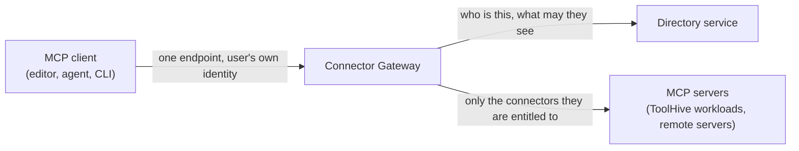

The Connector Gateway is the per-user entry point for tool calls. Developers
point a single MCP client at it, and it presents only the connectors that person
is entitled to use, brokering the upstream OAuth flows on their behalf. It is
part of the platform chart and **off by default**.

This page covers enabling it and how it fits into the distribution. It does not
reproduce the ToolHive operator or registry server guides; for those, see the
[ToolHive documentation](../../toolhive/index.mdx).

## Prerequisites

- **A corporate identity provider** at `global.stacklok.primaryIdp`. The gateway
  resolves every caller to a directory user before it decides what they can see.
  See [Configure identity](./configure-identity.mdx).
- **The directory service**, which the gateway reaches over gRPC for identity,
  connector configuration, and access policy. It is part of the platform chart.

## Enable it

Enabling the Connector Gateway is a three-value decision, not a single flag:

```yaml title="values.yaml"
global:
  stacklok:
    connectorGateway:
      enabled: true
    connectorGatewayId: <GATEWAY_ID>
    authServerIssuer: https://<GATEWAY_HOST>
```

`connectorGatewayId` has no default on purpose. A gateway announces this
identity to the directory when it registers, so if the value were defaulted,
every install would announce the same placeholder. Enabling the component
without choosing an id fails the render with a message naming the value, rather
than starting a gateway with a shared identity.

The same id scopes the console's admin **Connectors** view, so the console and
the gateway agree on which install they are talking about.

`authServerIssuer` has no default for the same reason: it is this deployment's
own public auth-server URL, and no placeholder is correct for it. The gateway
derives every identity provider's upstream OAuth callback from it, as
`{issuer}/oauth/callback`, so an install without one is refused at render rather
than starting a gateway that cannot complete a login.

Set it only here. The chart owns the value and projects it, so setting
`enterpriseConfig.authServer.issuer` or `appConfig.authServer.issuer` directly
is refused, naming this key instead.

The issuer is validated at render time, which saves an apply cycle. A trailing
slash and a tenant path prefix are both accepted. Userinfo, a query, a fragment,
percent-encoding, an uppercase scheme, and whitespace are all refused, as is
`http://` on anything but a loopback host unless you also set
`connector-gateway.enterpriseConfig.authServer.insecure_allow_http`.

:::note[Two different issuers]

This is not `global.stacklok.primaryIdp.issuer`. That one is your corporate
identity provider, the one your people sign in to the platform with. This one is
the gateway's own embedded auth server. A full install sets both, to different
values. See [Configure platform identity](./configure-identity.mdx).

:::

Any stable string works; it is not a UUID. Choose something that names the
deployment, such as `prod-eu` or `platform-staging`. Two rules are enforced on
every deployment: it cannot be empty, and it cannot contain a colon, which is
the reserved delimiter in the per-user token-storage key the gateway builds from
it. Treat it as fixed once set, since it is the identity the directory has
registered and part of the key that existing tokens are stored under.

## How it fits together



The gateway holds no access list of its own. It asks the directory who the
caller is and which connectors that caller may reach, then narrows the backends
it exposes accordingly. Access is granted to directory groups, so changing a
person's group membership changes what their MCP client can see.

:::note

Connector access is decided by directory groups, which are **not** the same as
the OIDC claim groups named in cluster-level authorization policy. See
[The two group models](../concepts/two-group-models.mdx).

:::

## After enabling

1. Confirm the gateway registered with the directory. Its pod becomes ready once
   it has, and the admin **Connectors** view in the console appears for the id
   you set.
2. Add connectors and grant them to groups, either in the console under
   [Connectors](../../connector-gateway/connectors.mdx) or through the directory
   API, which exposes the same operations under
   `/v1/gateways/{gateway_id}/connectors`.
3. Have a developer point a client at it, following
   [Connect a client](./connect-a-client.mdx). The console's setup page
   generates the client configuration with the real endpoint filled in. They
   then enable the connectors they want from their own view, and complete any
   OAuth consent those connectors need, either there or when their client first
   connects.

## Next steps

- [Connectors in the console](../../connector-gateway/connectors.mdx) to
  register connectors and grant access.
- [Identity and directory](../enterprise-directory/index.mdx) for the users and
  groups that access is granted to.
- [What you see depends on what is installed](../concepts/what-you-can-see.mdx)
  for which console areas enabling this reveals.
