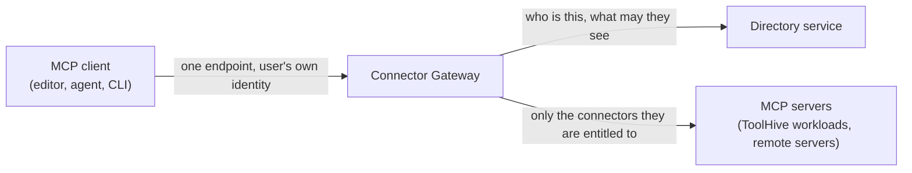

The Connector Gateway provides an identity-aware MCP endpoint and brokers
upstream OAuth for connectors. Enable it through the Stacklok Enterprise
platform chart.

## Prerequisites

- **A corporate identity provider** at `global.stacklok.primaryIdp`. The gateway
  resolves every caller to a directory user before it decides what they can see.
  See [Configure identity](./configure-identity.mdx).
- **The directory service**, which the gateway reaches over gRPC for identity,
  connector configuration, and access policy. It is part of the platform chart.

## Enable the Connector Gateway

Set the enable flag, gateway identifier, and public issuer URL:

```yaml title="values.yaml"
global:
  stacklok:
    connectorGateway:
      enabled: true
    connectorGatewayId: <GATEWAY_ID>
    authServerIssuer: https://<GATEWAY_HOST>
```

| Value                      | Purpose                                            |
| -------------------------- | -------------------------------------------------- |
| `connectorGateway.enabled` | Deploy the Connector Gateway                       |
| `connectorGatewayId`       | Identify this gateway to the directory and console |
| `authServerIssuer`         | Set the gateway's public authorization server URL  |

Choose a stable `connectorGatewayId` such as `prod-eu` or `platform-staging`.
The value cannot be empty or contain a colon. Changing it creates a new gateway
identity and changes the prefix used for stored per-user tokens.

Set `authServerIssuer` to the HTTPS URL that clients use to reach this
deployment. The gateway derives connector OAuth callbacks as
`{issuer}/oauth/callback`. Configure the value under `global.stacklok`; the
chart rejects equivalent settings under the component's internal configuration.

:::note[Two different issuers]

`global.stacklok.primaryIdp.issuer` identifies the corporate identity provider.
`authServerIssuer` identifies the Connector Gateway's authorization server.
Configure both values. See
[Configure platform identity](./configure-identity.mdx).

:::

## How connector access works



The gateway asks the directory to resolve each caller and return their connector
grants. Directory group membership determines the MCP servers exposed to the
client.

:::note

Cluster authorization policy uses OIDC claim groups. See
[Directory groups and OIDC claim groups](../concepts/two-group-models.mdx).

:::

## After enabling

1. Confirm the gateway registered with the directory. Its pod becomes ready once
   it has, and the admin **Connectors** view in the console appears for the id
   you set.
2. Add connectors and grant them to groups, either in the console under
   [Connectors](../../connector-gateway/connectors.mdx) or through the directory
   API, which exposes the same operations under
   `/v1/gateways/{gateway_id}/connectors`.
3. Direct users to the deployment-specific instructions in the console. See
   [Roll out gateway clients](./roll-out-gateway-clients.mdx).

## Next steps

- [Connectors in the console](../../connector-gateway/connectors.mdx) to
  register connectors and grant access.
- [Identity and directory](../enterprise-directory/index.mdx) for the users and
  groups that access is granted to.
