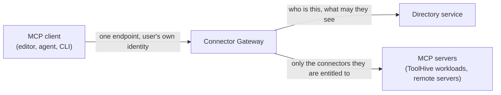

The Connector Gateway provides an identity-aware MCP endpoint and brokers
upstream OAuth for connectors. Enable it through the Stacklok Enterprise
platform chart. Every install runs the gateway's embedded authorization server,
so enabling it takes more than a single flag: you also supply Redis storage, key
material, and a connection to the directory.

This page uses the `stacklok-enterprise` release name and the `stacklok-system`
namespace from [Deploy the platform](./deployment.mdx). Several values below
embed those names, so adjust them if yours differ.

## Prerequisites

- **A corporate identity provider** at `global.stacklok.primaryIdp`. The gateway
  resolves every caller to a directory user before it decides what they can see.
  See [Configure identity](./configure-identity.mdx).
- **The Enterprise Manager with its directory service enabled**, which the
  gateway reaches over gRPC for identity, connector configuration, and access
  policy. The directory needs its PostgreSQL database, set up as described in
  [the Enterprise Manager database](./deployment.mdx#enterprise-manager-database).
  To administer connectors across users in the console, also create the
  `BYPASSRLS` admin database role described there.
- **The directory's key-encryption key, gRPC TLS, and NetworkPolicy**,
  configured as described in
  [Encrypting stored credentials](./deployment.mdx#encrypting-stored-credentials).
  The directory encrypts connector credentials and the identity provider's
  client secret with this key, and returns them to the gateway only over TLS.
  That section's NetworkPolicy example already admits pods labeled
  `app.kubernetes.io/name: connector-gateway`.
- **Redis or Valkey**, reachable from the cluster. The embedded authorization
  server stores its sessions only in Redis, at every replica count, and the
  chart doesn't deploy an instance. Configure it once under `global.redis`, as
  described in
  [Global Redis/Valkey defaults](./deployment.mdx#global-redisvalkey-defaults),
  and the gateway inherits the host, port, and password Secret.

## Prepare the gateway's secrets

The gateway needs three Secrets in the release namespace. Create them before you
install or upgrade.

**Key-encryption key (KEK).** The gateway seals the upstream OAuth tokens and
client registrations it stores with this key. It is separate from the
directory's KEK. The Secret holds 32 random bytes under the key `kek`:

```bash
openssl rand 32 > kek
kubectl create secret generic connector-gateway-kek \
  --namespace stacklok-system \
  --from-file=kek=./kek
```

Keep a backup of the key. Losing or replacing it makes every credential the
gateway has stored unreadable.

**Authorization server keys.** The signing key keeps issued tokens valid across
restarts and replicas, and the HMAC secret keeps authorization codes and refresh
tokens valid. The signing key must be a PEM-encoded ECDSA private key:

```bash
openssl ecparam -name prime256v1 -genkey -noout -out signing-key.pem
openssl rand 32 > hmac-secret
kubectl create secret generic connector-gateway-auth-server-keys \
  --namespace stacklok-system \
  --from-file=signing-key.pem=./signing-key.pem \
  --from-file=hmac-secret=./hmac-secret
```

:::warning[Use existing Secrets with GitOps]

`kek.generate: true` and `authServerKeys.generate: true` have the chart create
and preserve the key material itself, but only on a live `helm install` or
`helm upgrade`. `helm template`, Argo CD, and other render-and-apply workflows
can't look up the existing Secret, so they would mint new keys on every sync and
orphan everything sealed or signed with the old ones. Use `existingSecret` for
those workflows.

:::

**Directory CA bundle.** The gateway verifies the directory's gRPC serving
certificate against a CA bundle. Put only the CA certificate in this Secret. If
cert-manager issues the Enterprise Manager's certificate, copy `ca.crt` out of
its Secret rather than referencing that Secret, which also holds the private
key:

```bash
kubectl create secret generic enterprise-manager-grpc-ca \
  --namespace stacklok-system \
  --from-file=ca.crt=./ca.crt
```

## Enable the Connector Gateway

Add the following to the values file you use for the platform. Merge the
`global` keys into your existing `global` block rather than adding a second one.

```yaml title="values.yaml"
global:
  stacklok:
    # primaryIdp from "Configure identity" stays here unchanged.
    connectorGateway:
      enabled: true
    connectorGatewayId: '<GATEWAY_ID>'
    authServerIssuer: 'https://<GATEWAY_HOST>'
  # Redis or Valkey from "Global Redis/Valkey defaults"
  redis:
    host: 'redis.example.com'
    port: 6379
    existingSecret: 'redis-auth'

connector-gateway:
  vmcpConfig:
    incomingAuth:
      type: oidc
      oidc:
        issuer: 'https://<GATEWAY_HOST>'
        audience: 'https://<GATEWAY_HOST>/gw/mcp'
  enterpriseConfig:
    authServer:
      schema_version: 'v0.1.0'
      allowed_audiences:
        - 'https://<GATEWAY_HOST>/gw/mcp'
      storage:
        type: redis
    directory:
      addr: 'stacklok-enterprise-enterprise-manager.stacklok-system.svc.cluster.local:9443'
  directoryTLS:
    enabled: true
    caBundle:
      secretName: 'enterprise-manager-grpc-ca'
  kek:
    existingSecret: 'connector-gateway-kek'
  authServerKeys:
    existingSecret: 'connector-gateway-auth-server-keys'
```

| Value                                      | Purpose                                                                                   |
| ------------------------------------------ | ----------------------------------------------------------------------------------------- |
| `global.stacklok.connectorGateway.enabled` | Deploy the Connector Gateway                                                              |
| `global.stacklok.connectorGatewayId`       | Identify this gateway to the directory and console                                        |
| `global.stacklok.authServerIssuer`         | Set the gateway's public authorization server URL                                         |
| `vmcpConfig.incomingAuth`                  | Require tokens from the gateway's own authorization server on the MCP endpoint            |
| `enterpriseConfig.authServer`              | Configure the embedded authorization server and its Redis storage                         |
| `enterpriseConfig.directory.addr`          | Point the gateway at the directory's TLS gRPC port                                        |
| `directoryTLS`                             | Mount the directory CA bundle and a ServiceAccount token for the directory                |
| `kek`, `authServerKeys`                    | Reference the Secrets from [Prepare the gateway's secrets](#prepare-the-gateways-secrets) |

### Choose the gateway ID and issuer

Choose a stable `connectorGatewayId` such as `prod-eu` or `platform-staging`,
and give every install its own value. The gateway registers this ID with the
directory, so two installs sharing one ID act as a single gateway. The value
cannot be empty or contain a colon. Changing it creates a new gateway identity
and changes the prefix used for stored per-user tokens.

Set `authServerIssuer` to the HTTPS URL that clients use to reach this
deployment. The gateway derives connector OAuth callbacks as
`{issuer}/oauth/callback`. Configure the value under `global.stacklok`; the
chart rejects equivalent settings under the component's internal configuration.

The MCP endpoint is `{issuer}/gw/mcp`, and that URL is the token audience. Set
`vmcpConfig.incomingAuth.oidc.issuer` to the same value as `authServerIssuer`,
and list the audience in `allowed_audiences` exactly as it appears in
`incomingAuth.oidc.audience`. The gateway compares these strings exactly and
refuses to start when they disagree.

:::note[Two different issuers]

`global.stacklok.primaryIdp.issuer` identifies the corporate identity provider.
`authServerIssuer` identifies the Connector Gateway's authorization server.
Configure both values. See
[Configure platform identity](./configure-identity.mdx).

:::

Omit `upstreams` from `enterpriseConfig.authServer`. The authorization server
loads its identity providers from the Enterprise Manager: your corporate
identity provider from `global.stacklok.primaryIdp`, plus the connector identity
providers that admins register in the Enterprise Manager.

By default, the directory identifies users by the `sub` claim in your corporate
identity provider's tokens. If your provider identifies users with a different
claim, such as `uid` in Okta, add an `enterprise-manager.directory.issuers`
entry whose `issuer_url` matches `global.stacklok.primaryIdp.issuer` exactly,
and set `binding_claim`:

```yaml title="values.yaml"
enterprise-manager:
  directory:
    issuers:
      - id: 'corporate-idp'
        issuer_url: 'https://idp.example.com'
        audience: 'enterprise-manager'
        binding_claim: 'uid'
```

The same entry configures SCIM provisioning for that provider. See
[SCIM identity providers](./deployment.mdx#scim-identity-providers).

## Connect the gateway to the directory

`enterpriseConfig.directory.addr` requires exactly one transport. With
`directoryTLS.enabled: true`, the gateway dials the Enterprise Manager's TLS
gRPC port (`9443`) and authenticates with a projected ServiceAccount token. The
Enterprise Manager side of that connection needs a TLS listener, caller
authentication, and the gateway's ServiceAccount on three allowlists:

```yaml title="values.yaml"
enterprise-manager:
  grpc:
    tls:
      enabled: true
      existingSecret: 'enterprise-manager-grpc-tls'
    callerAuth:
      clusterOidcIssuer: '<CLUSTER_OIDC_ISSUER>'
      saSubjectAllowlist:
        - 'system:serviceaccount:stacklok-system:stacklok-enterprise-connector-gateway'
      gatewaySaSubjectAllowlist:
        - 'system:serviceaccount:stacklok-system:stacklok-enterprise-connector-gateway'
      credentialSaSubjectAllowlist:
        - 'system:serviceaccount:stacklok-system:stacklok-enterprise-connector-gateway'
```

`grpc.tls` is the same setting you configured in
[Encrypting stored credentials](./deployment.mdx#encrypting-stored-credentials).
The chart refuses to render a TLS gateway transport while
`enterprise-manager.grpc.tls.enabled` is `false`.

Set `clusterOidcIssuer` to your cluster's ServiceAccount token issuer, which
this command prints:

```bash
kubectl get --raw /.well-known/openid-configuration | jq -r .issuer
```

Each allowlist covers different directory calls. `saSubjectAllowlist` covers
identity resolution and per-user connector configuration.
`gatewaySaSubjectAllowlist` covers the gateway's startup registration and its
catalog reads. `credentialSaSubjectAllowlist` covers credential resolution,
which the gateway needs for the identity provider's client secret. The subject
is `system:serviceaccount:<NAMESPACE>:<RELEASE_NAME>-connector-gateway`. If the
AI Gateway also calls the directory, keep its entries on `saSubjectAllowlist`
alongside this one.

For a development cluster without TLS, set
`connector-gateway.enterpriseConfig.directory.insecure: true` in place of
`directoryTLS`, point `addr` at the cleartext port (`9091`), and set
`enterprise-manager.grpc.insecure: true`. The chart requires both settings
together. This transport carries credentials in cleartext with no caller
authentication, so reserve it for local testing.

## Corporate identity provider settings

The gateway reads these optional keys from `global.stacklok.primaryIdp`, in
addition to the issuer and client settings in
[Configure platform identity](./configure-identity.mdx):

| Key                      | Purpose                                                                                                                                                                                                        |
| ------------------------ | -------------------------------------------------------------------------------------------------------------------------------------------------------------------------------------------------------------- |
| `clientClaim`            | Access-token claim that names the OAuth client. Empty reads `cid` or `client_id`. Allowed values are `cid`, `client_id`, `azp`, and `appid`; set `azp` for Dex, or `azp` or `appid` for Microsoft Entra ID     |
| `clientClaimAllowUnsafe` | Boolean. Accepts a `clientClaim` outside the allowed values. A weaker claim can match tokens minted for a different client, and the gateway logs a warning at startup                                          |
| `allowPrivateIps`        | Boolean. Lets discovery and token exchange reach an identity provider on a private or link-local address. HTTPS is still required for non-localhost hosts                                                      |
| `caBundleRef`            | ConfigMap or Secret holding the PEM CA bundle for an identity provider served by a private CA. Set exactly one of `configMapRef` or `secretRef`, each with a `name`, plus an optional `key` (default `ca.crt`) |

Set the boolean keys as unquoted `true` or `false`. The chart refuses a quoted
string, and `--set-string` produces one.

:::warning[Include the full chain in `caBundleRef`]

For sign-in, the gateway trusts `caBundleRef` in addition to the system roots.
Its control-plane token validator, which checks the corporate tokens the console
sends, trusts only this bundle. Include every intermediate and root certificate
in the chain that serves your identity provider's JWKS endpoint. A bundle that
omits a public intermediate or root makes every control-plane request fail with
`401`, even though sign-in works.

:::

The gateway reads the bundle once at startup. After you replace the contents of
the same ConfigMap or Secret, restart the gateway with
`kubectl rollout restart deployment/stacklok-enterprise-connector-gateway -n stacklok-system`.

## How connector access works


```mermaid
flowchart LR
  Client["MCP client<br/>(editor, agent, CLI)"]
  MCPGW["Connector Gateway"]
  Dir["Directory service"]
  Backends["MCP servers<br/>(ToolHive workloads, remote servers)"]

  Client -->|"one endpoint, user's own identity"| MCPGW
  MCPGW -->|"who is this, what may they see"| Dir
  MCPGW -->|"only the connectors they are entitled to"| Backends
```

The gateway asks the directory to resolve each caller and return their connector
grants. Directory group membership determines the MCP servers exposed to the
client.

:::note

Cluster authorization policy uses OIDC claim groups. See
[Directory groups and OIDC claim groups](../concepts/two-group-models.mdx).

:::

## After enabling

1. Confirm the gateway pod is ready. It registers with the directory at startup
   and becomes ready once its first connector catalog read from the directory
   succeeds. The admin **Connectors** view in the console then appears for the
   ID you set.
2. Add connectors and grant them to groups, either in the console under
   [Connectors](../../connector-gateway/connectors.mdx) or through the
   [Enterprise Manager API](./api-reference.mdx#enterprise-manager), which
   exposes the same operations under `/v1/gateways/{gateway_id}/connectors`.
3. Direct users to the deployment-specific instructions in the console. See
   [Roll out gateway clients](./roll-out-gateway-clients.mdx).

## Next steps

- [Connectors in the console](../../connector-gateway/connectors.mdx) to
  register connectors and grant access.
- [Identity and directory](../enterprise-directory/index.mdx) for the users and
  groups that access is granted to.

## Troubleshooting

<details>
<summary>The gateway pod stays unready or restarts</summary>

The readiness probe fails until the gateway's first connector catalog read from
the directory succeeds, so an unready pod means the gateway can't complete its
directory calls. Check the pod's logs:

```bash
kubectl logs deployment/stacklok-enterprise-connector-gateway -n stacklok-system
```

- **`PermissionDenied` during registration, followed by a restart.** The
  gateway's ServiceAccount subject is missing from
  `enterprise-manager.grpc.callerAuth.gatewaySaSubjectAllowlist`. Add it as
  shown in
  [Connect the gateway to the directory](#connect-the-gateway-to-the-directory).
- **`Unauthenticated` on every directory call.** The directory rejected the
  gateway's ServiceAccount token. Check that `clusterOidcIssuer` matches the
  issuer your cluster reports.
- **TLS handshake errors.** Check that `enterprise-manager-grpc-ca` holds the CA
  that signed the Enterprise Manager's gRPC certificate, and that `addr` uses
  port `9443` and a hostname on that certificate. After you rotate the CA,
  restart the gateway; it reads the bundle only at startup.
- **Connection timeouts.** Check that the directory's NetworkPolicy admits the
  gateway pods, and that the gateway can reach the Redis or Valkey host.

</details>
