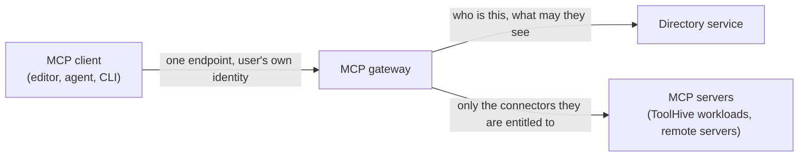

The MCP gateway is the per-user entry point for tool calls. Developers point a
single MCP client at it, and it presents only the connectors that person is
entitled to use, brokering the upstream OAuth flows on their behalf. It is part
of the platform chart and **off by default**.

This page covers enabling it and how it fits into the distribution. It does not
reproduce the ToolHive operator or registry server guides; for those, see the
[ToolHive documentation](../../toolhive/index.mdx).

## Prerequisites

- **A corporate identity provider** at `global.stacklok.primaryIdp`. The gateway
  resolves every caller to a directory user before it decides what they can see.
  See [Configure identity](./configure-identity.mdx).
- **The directory service**, which the gateway reaches over gRPC for identity,
  connector configuration, and access policy. It is part of the platform chart.

## Enable it

Enabling the MCP gateway is a two-value decision, not a single flag:

```yaml title="values.yaml"
global:
  stacklok:
    connectorGateway:
      enabled: true
    connectorGatewayId: <GATEWAY_ID>
```

`connectorGatewayId` has no default on purpose. A gateway announces this
identity to the directory when it registers, so if the value were defaulted,
every install would announce the same placeholder. Enabling the component
without choosing an id fails the render with a message naming the value, rather
than starting a gateway with a shared identity.

The same id scopes the console's admin **Connectors** view, so the console and
the gateway agree on which install they are talking about.

## How it fits together



The gateway holds no access list of its own. It asks the directory who the
caller is and which connectors that caller may reach, then narrows the backends
it exposes accordingly. Access is granted to directory groups, so changing a
person's group membership changes what their MCP client can see.

:::note

Connector access is decided by directory groups, which are **not** the same as
the OIDC claim groups named in cluster-level authorization policy. See
[The two group models](../concepts/two-group-models.mdx).

:::

## After enabling

1. Confirm the gateway registered with the directory and is ready.
2. Add connectors and grant them to groups, either in the console under
   [Connectors](../enterprise-console/admin/connectors.mdx) or through the
   directory API.
3. Have a developer point a client at it. The console's setup page generates the
   client configuration with the real endpoint filled in. See
   [Connect a client](../enterprise-console/workspace/connect-a-client.mdx).

## Next steps

- [Connectors in the console](../enterprise-console/admin/connectors.mdx) to
  register connectors and grant access.
- [Identity and directory](../enterprise-directory/index.mdx) for the users and
  groups that access is granted to.
