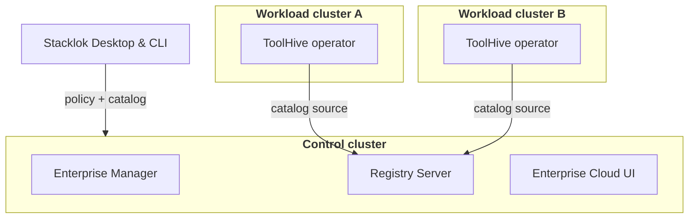
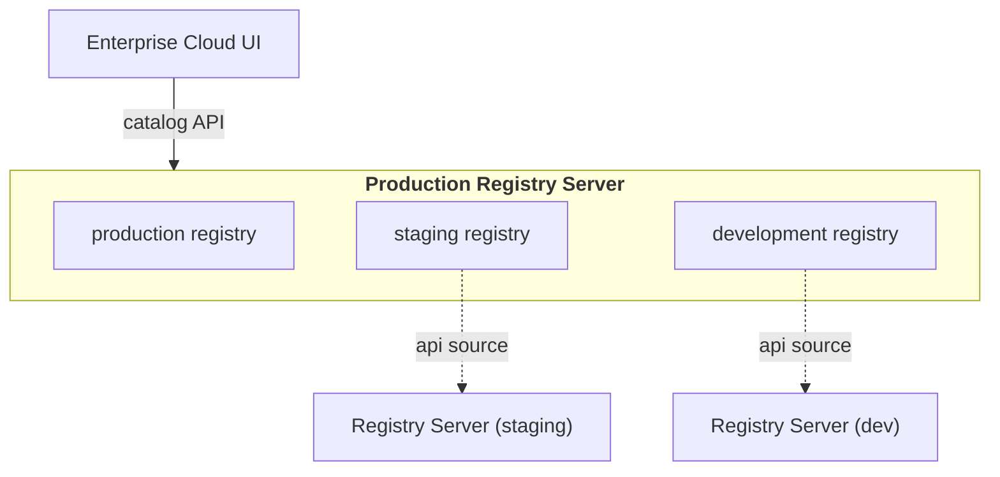

The [standard deployment](./deployment.mdx) installs every platform component in
a single Kubernetes cluster. That is the recommended setup, but the umbrella
chart doesn't require it. Each component can be turned on or off independently,
so you can install the same chart multiple times, each release enabling only the
components that belong in that cluster or environment.

This page covers two common distributed topologies. Both use the same umbrella
chart, the same onboarding artifacts, and the same configuration keys documented
on the per-component pages; only the set of enabled components changes between
releases.

## How it works

Every component has its own enable flag in the umbrella chart's values:

| Enable flag         | Component                                              |
| ------------------- | ------------------------------------------------------ |
| `toolhiveOperator`  | ToolHive operator (runs MCP workloads)                 |
| `enterpriseManager` | Enterprise Manager (serves policies and feature flags) |
| `cloudUi`           | Enterprise Cloud UI                                    |
| `registryServer`    | Registry Server (MCP server and skills catalog)        |
| `aiGateway`         | AI Gateway operator                                    |

To build a distributed topology, install the chart once per cluster or
environment, each time with a `values.yaml` that enables only the components
that release should run. Components in different clusters reach each other over
their external URLs, the same way the Stacklok clients do, so wire cross-cluster
references to ingress hostnames rather than in-cluster Service DNS.

:::note

Configure each enabled component exactly as the per-component pages describe.
See [Configure the Enterprise Manager](../enterprise-manager/configure.mdx),
[Configure the Enterprise Cloud UI](../enterprise-cloud-ui/configure.mdx), and
[Configure the Registry Server](./configure-registry-server.mdx).

:::

## Centralized control plane, operators in workload clusters

Run the shared services once in a control cluster and run the operator in each
workload cluster that hosts MCP server workloads. Developers and clients talk to
a single Enterprise Manager, Registry Server, and Cloud UI, while MCP servers
run close to the teams and data that need them.



In the control cluster, enable the shared services and leave the operator off if
no MCP workloads run there:

```yaml title="control-cluster-values.yaml"
toolhiveOperator:
  enabled: false
enterpriseManager:
  enabled: true
cloudUi:
  enabled: true
registryServer:
  enabled: true
aiGateway:
  enabled: false

# Configure each enabled component as its per-component page describes.
```

In each workload cluster, enable only the operator:

```yaml title="workload-cluster-values.yaml"
toolhiveOperator:
  enabled: true
enterpriseManager:
  enabled: false
cloudUi:
  enabled: false
registryServer:
  enabled: false
aiGateway:
  enabled: false
```

The operator in each workload cluster is the standard enterprise operator, so
manage its MCP server and Virtual MCP Server workloads with the
[Kubernetes operator guides](../../toolhive/guides-k8s/run-mcp-k8s.mdx). Point
those workloads at the control cluster's Registry Server through its external
URL, and roll out the clients against the control cluster's Enterprise Manager.

## Layered registries for promotion across environments

Promote MCP servers and skills through a sequence of environments, for example
development, staging, and production, as they pass each stage's review. This
topology leans on three concepts that the Registry Server keeps separate:

- A **Registry Server** is the instance you deploy. The Cloud UI connects to a
  single instance.
- A **registry** is a named, claim-scoped catalog that an instance serves. One
  instance can host several, and the Cloud UI shows each user the registries
  their claims allow as a dropdown.
- A **source** is where a registry's entries come from. The `api` source type
  pulls from another Registry Server, since every instance implements the
  standard registry API.

Run a Registry Server in each environment so servers can be reviewed and
promoted in place. The production instance does double duty: alongside its own
gated `production` registry, it defines `staging` and `development` registries
whose entries come from `api` sources pointing at those environments' instances.
Point the Cloud UI at the production instance, and scope each registry with
identity claims so reviewers see the staging and development catalogs while
everyone sees production.

:::note

The per-registry claims drive the Cloud UI dropdown: a user sees only the
registries whose claims match their identity. The common pattern surfaces
development and staging to developers and reviewers while production stays
broadly visible.

:::



Install a registry-only release in each upstream environment:

```yaml title="env-registry-values.yaml"
toolhiveOperator:
  enabled: false
enterpriseManager:
  enabled: false
cloudUi:
  enabled: false
registryServer:
  enabled: true
aiGateway:
  enabled: false

# Registry Server configuration. See "Configure the Registry Server".
toolhive-registry-server:
  upstream:
    config:
      # sources, registries, and database wiring for this environment
```

Install the production release with the Cloud UI, then point the Cloud UI at
this instance's own Registry Server:

```yaml title="prod-values.yaml"
toolhiveOperator:
  enabled: false
enterpriseManager:
  enabled: true
cloudUi:
  enabled: true
registryServer:
  enabled: true
aiGateway:
  enabled: false

toolhive-cloud-ui:
  # Point at this instance's own Registry Server.
  apiBaseUrl: 'http://registry-api.stacklok-system.svc.cluster.local:8080'

toolhive-registry-server:
  upstream:
    config:
      # Define a local, gated `production` registry, plus `staging` and
      # `development` registries backed by `api` sources that point at those
      # environments' Registry Servers. Scope each registry with identity
      # claims so the Cloud UI dropdown shows the right catalog to each user.
      # See "Configure the Registry Server".
```

Configure the sources, registries, and sync policies on each Registry Server
with the open source
[Registry Server configuration](../../toolhive/guides-registry/configuration.mdx)
reference. The enterprise build reads the same configuration schema.

If you'd rather not have the production instance carry the Cloud UI and the
cross-environment `api` sources, deploy a dedicated Registry Server instance for
aggregation and point the Cloud UI at it instead. The registry model is the
same; only the instance hosting the aggregating registries changes.

## Next steps

- [Deploy the platform](./deployment.mdx) for the single-cluster install the
  distributed topologies build on
- [Configure the Registry Server](./configure-registry-server.mdx) to wire
  sources, registries, and the database for each registry release
- [Configure platform identity](./configure-identity.mdx) so every cluster's
  components share one identity provider
