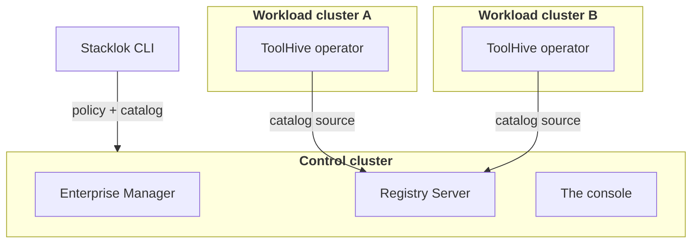
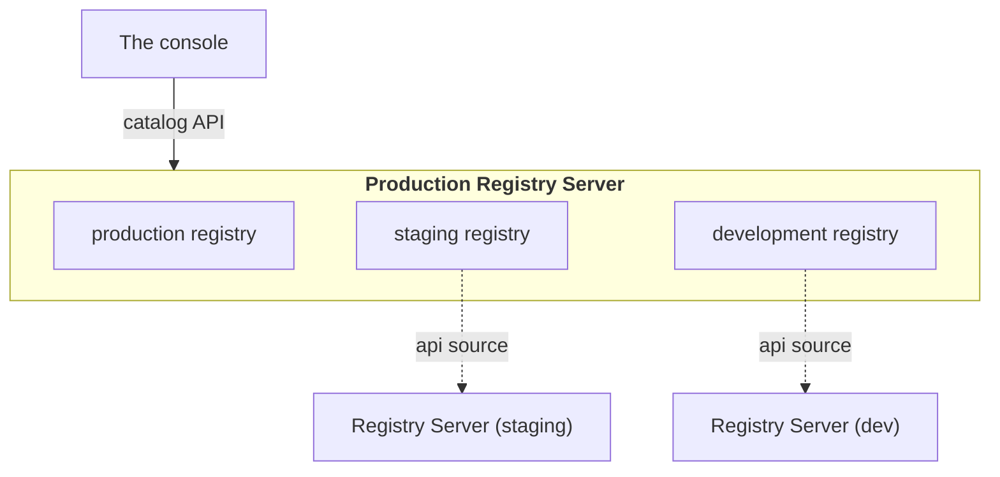

The [standard deployment](./deployment.mdx) installs platform components in one
Kubernetes cluster. For distributed deployments, install the umbrella chart in
multiple clusters and enable only the components assigned to each environment.
This page covers a centralized control plane and layered registries.

## How it works

Every component has its own enable flag in the umbrella chart's values:

| Enable flag                                | Component                                                                                                                                                                  |
| ------------------------------------------ | -------------------------------------------------------------------------------------------------------------------------------------------------------------------------- |
| `toolhiveOperator`                         | ToolHive operator (runs MCP workloads)                                                                                                                                     |
| `enterpriseManager`                        | Enterprise Manager (serves policies and feature flags)                                                                                                                     |
| `cloudUi`                                  | The console                                                                                                                                                                |
| `registryServer`                           | Registry Server (MCP server and skills catalog)                                                                                                                            |
| `global.stacklok.aiGateway.enabled`        | AI Gateway operator                                                                                                                                                        |
| `global.stacklok.connectorGateway.enabled` | Connector Gateway. Also requires `global.stacklok.connectorGatewayId`, which must differ per install, and `global.stacklok.authServerIssuer`, the gateway's own public URL |

Install the chart once per cluster or environment and enable the required
components in each `values.yaml`. Configure cross-cluster references with
external ingress hostnames.

## Centralized control plane, operators in workload clusters

Run the shared services once in a control cluster and run the operator in each
workload cluster that hosts MCP server workloads. Developers and clients talk to
a single Enterprise Manager, Registry Server, and console, while MCP servers run
close to the teams and data that need them.


```mermaid
flowchart TB
  subgraph Control["<strong>Control cluster</strong>"]
    EM["Enterprise Manager"]
    RS["Registry Server"]
    CloudUI["The console"]
  end

  subgraph WL1["<strong>Workload cluster A</strong>"]
    Op1["ToolHive operator"]
  end

  subgraph WL2["<strong>Workload cluster B</strong>"]
    Op2["ToolHive operator"]
  end

  Clients["Stacklok CLI"]

  Clients -->|"policy + catalog"| Control
  Op1 -->|"catalog source"| RS
  Op2 -->|"catalog source"| RS
```

In the control cluster, enable the shared services and leave the operator off if
no MCP workloads run there:

```yaml title="control-cluster-values.yaml"
toolhiveOperator:
  enabled: false
enterpriseManager:
  enabled: true
cloudUi:
  enabled: true
registryServer:
  enabled: true

# Configure each enabled component as its per-component page describes.
```

In each workload cluster, enable only the operator:

```yaml title="workload-cluster-values.yaml"
toolhiveOperator:
  enabled: true
enterpriseManager:
  enabled: false
cloudUi:
  enabled: false
registryServer:
  enabled: false
```

The operator in each workload cluster is the standard enterprise operator, so
manage its MCP server and Virtual MCP Server workloads with the
[Kubernetes operator guides](../../toolhive/guides-k8s/run-mcp-k8s.mdx). Point
those workloads at the control cluster's Registry Server through its external
URL, and roll out the clients against the control cluster's Enterprise Manager.

## Layered registries for promotion across environments

Promote MCP servers and skills through a sequence of environments, for example
development, staging, and production, as they pass each stage's review. This
topology leans on three concepts that the Registry Server keeps separate:

- A **Registry Server** is the instance you deploy. The console connects to a
  single instance.
- A **registry** is a named, claim-scoped catalog that an instance serves. One
  instance can host several, and the console shows each user the registries
  their claims allow as a dropdown.
- A **source** is where a registry's entries come from. The `api` source type
  pulls from another Registry Server, since every instance implements the
  standard registry API.

Run a Registry Server in each environment so servers can be reviewed and
promoted in place. The production instance does double duty: alongside its own
gated `production` registry, it defines `staging` and `development` registries
whose entries come from `api` sources pointing at those environments' instances.
Point the console at the production instance, and scope each registry with
identity claims so reviewers see the staging and development catalogs while
everyone sees production.


```mermaid
flowchart TB
  CloudUI["The console"]

  subgraph Prod["<strong>Production Registry Server</strong>"]
    RegProd["production registry"]
    RegStage["staging registry"]
    RegDev["development registry"]
  end

  Stage["Registry Server (staging)"]
  Dev["Registry Server (dev)"]

  CloudUI -->|"catalog API"| Prod
  RegStage -.->|"api source"| Stage
  RegDev -.->|"api source"| Dev
```

Install a registry-only release in each upstream environment:

```yaml title="env-registry-values.yaml"
toolhiveOperator:
  enabled: false
enterpriseManager:
  enabled: false
cloudUi:
  enabled: false
registryServer:
  enabled: true

# Registry Server configuration. See "Configure the Registry Server".
toolhive-registry-server:
  upstream:
    config:
      # sources, registries, and database wiring for this environment
```

Install the production release with the console, then point the console at this
instance's own Registry Server:

```yaml title="prod-values.yaml"
toolhiveOperator:
  enabled: false
enterpriseManager:
  enabled: true
cloudUi:
  enabled: true
registryServer:
  enabled: true

toolhive-cloud-ui:
  # Point at this instance's own Registry Server.
  apiBaseUrl: 'http://registry-api.stacklok-system.svc.cluster.local:8080'

toolhive-registry-server:
  upstream:
    config:
      # Define a local, gated `production` registry, plus `staging` and
      # `development` registries backed by `api` sources that point at those
      # environments' Registry Servers. Scope each registry with identity
      # claims so the console's dropdown shows the right catalog to each user.
      # See "Configure the Registry Server".
```

Configure the sources, registries, and sync policies on each Registry Server
with the open source
[Registry Server configuration](../../toolhive/guides-registry/configuration.mdx)
reference. The enterprise build reads the same configuration schema.

For a dedicated aggregation layer, deploy another Registry Server and point the
console to it.

## Next steps

- [Deploy the platform](./deployment.mdx) for the single-cluster install the
  distributed topologies build on
- [Configure the Registry Server](./configure-registry-server.mdx) to set
  sources, registries, and the database for each registry release
- [Configure platform identity](./configure-identity.mdx) so every cluster's
  components share one identity provider
