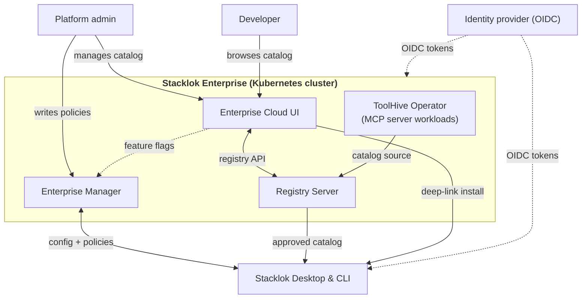

import DocCardList from '@theme/DocCardList';

:::enterprise

Stacklok Enterprise ships as one umbrella Helm chart that bundles every platform
component, so you install the whole platform in a single Helm release rather
than wiring up each chart yourself.

[Learn more about Stacklok Enterprise](../index.mdx).

:::

## How the platform fits together

The platform components run together in your Kubernetes cluster. The Enterprise
Manager serves policy to the Stacklok clients, the Registry Server holds the
approved MCP server and skills catalog, the Enterprise Cloud UI manages that
catalog, and the ToolHive Operator reconciles MCP server workloads. Your
identity provider authenticates every client and component.

## Deployment sequence

When you are ready to deploy, work through these steps in order. Each links to
its detailed guide.

1. **Configure identity.** Set up your identity provider (authorization server,
   audiences, scopes, claims, and OAuth clients) so the platform components and
   clients can authenticate. Do this first, because deployment wires in the
   client IDs and audiences you create here. See
   [Configure platform identity](./configure-identity.mdx).
1. **Deploy the platform.** Install the umbrella chart, wiring in the identity
   values from the previous step. The chart deploys the ToolHive operator, the
   Enterprise Manager, the Enterprise Cloud UI, and the Registry Server as
   subcharts. See [Deploy the platform](./deployment.mdx).
1. **Configure policies.** Use the Enterprise Manager to pin the registry,
   control non-registry servers, standardize telemetry, and shape the client
   experience. See [Configure policies](../enterprise-manager/policies/).
1. **Set up authorization.** Map identity-provider groups and roles to MCP
   access with the enterprise authorization custom resources. See
   [Enterprise authorization](../enterprise-authz/index.mdx).
1. **Roll out the clients.** Distribute
   [Stacklok Desktop](../enterprise-desktop/index.mdx) or the
   [Stacklok CLI](../enterprise-cli/index.mdx) to your users.
1. **Verify the catalog.** Browse the
   [Enterprise Cloud UI](../enterprise-cloud-ui/index.mdx) to confirm the
   end-to-end path, from catalog to client.

## Contents

<DocCardList />
