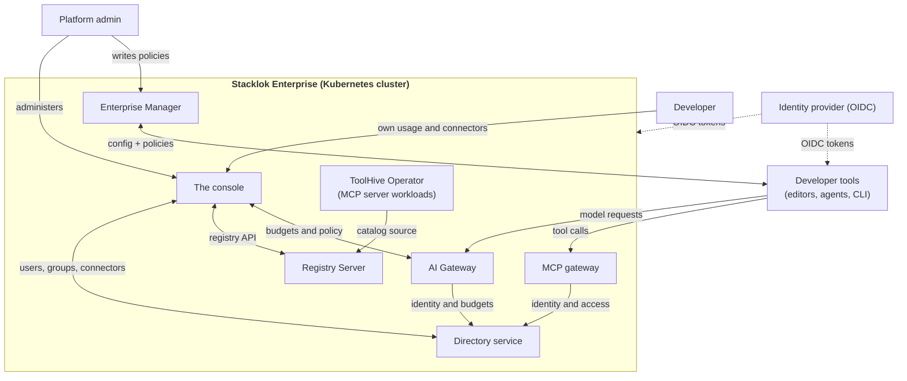

import DocCardList from '@theme/DocCardList';

:::enterprise

Stacklok Enterprise ships as one umbrella Helm chart that bundles every platform
component, so you install the whole platform in a single Helm release rather
than wiring up each chart yourself.

[Learn more about Stacklok Enterprise](../index.mdx).

:::

## How the platform fits together

The platform components run together in your Kubernetes cluster. The Enterprise
Manager serves policy to the Stacklok clients, the Registry Server holds the
approved MCP server and skills catalog, the Enterprise Cloud UI manages that
catalog, and the ToolHive Operator reconciles MCP server workloads. Your
identity provider authenticates every client and component.

```mermaid
flowchart TB
  Dev["Developer"]
  Admin["Platform admin"]
  IdP["Identity provider (OIDC)"]

  subgraph Enterprise["<strong>Stacklok Enterprise (Kubernetes cluster)</strong>"]
    direction TB
    Console["The console"]
    Dir["Directory service"]
    AIGW["AI Gateway"]
    MCPGW["MCP gateway"]
    RS["Registry Server"]
    EM["Enterprise Manager"]
    Operator["ToolHive Operator<br/>(MCP server workloads)"]
  end

  Tools["Developer tools<br/>(editors, agents, CLI)"]

  Admin -->|"administers"| Console
  Dev -->|"own usage and connectors"| Console
  Admin -->|"writes policies"| EM

  Console <-->|"users, groups, connectors"| Dir
  Console <-->|"registry API"| RS
  Console <-->|"budgets and policy"| AIGW
  MCPGW -->|"identity and access"| Dir
  AIGW -->|"identity and budgets"| Dir
  Operator -->|"catalog source"| RS

  Tools -->|"model requests"| AIGW
  Tools -->|"tool calls"| MCPGW
  EM <-->|"config + policies"| Tools

  IdP -.->|"OIDC tokens"| Enterprise
  IdP -.->|"OIDC tokens"| Tools
```

## Deployment sequence

When you are ready to deploy, work through these steps in order. Each links to
its detailed guide.

1. **Configure identity.** Set up your identity provider (authorization server,
   audiences, scopes, claims, and OAuth clients) so the platform components and
   clients can authenticate. Do this first, because deployment wires in the
   client IDs and audiences you create here. See
   [Configure platform identity](./configure-identity.mdx).
1. **Deploy the platform.** Install the umbrella chart, wiring in the identity
   values from the previous step. The chart deploys the ToolHive operator, the
   Enterprise Manager, the console, and the Registry Server as subcharts. See
   [Deploy the platform](./deployment.mdx). Before you install,
   [run preflight checks](./deployment.mdx#run-preflight-checks) to catch
   cluster problems that would otherwise surface partway through the release.
1. **Enable the gateways you need.** Both are off by default. See
   [Configure the AI Gateway](./configure-ai-gateway.mdx) and
   [Configure the MCP gateway](./configure-mcp-gateway.mdx).
1. **Populate the directory.** Provision users and groups from your identity
   provider, since access and budgets are granted to them. See
   [SCIM provisioning](../enterprise-directory/scim-provisioning.mdx).
1. **Configure policies.** Use the Enterprise Manager to pin the registry,
   control non-registry servers, and standardize telemetry. See
   [Configure policies](../enterprise-manager/policies/).
1. **Set up authorization.** Map identity-provider groups and roles to MCP
   access with the enterprise authorization custom resources. See
   [Enterprise authorization](../enterprise-authz/index.mdx).
1. **Roll out the clients.** Distribute the
   [Stacklok CLI](../enterprise-cli/index.mdx) to your users, and point them at
   [Connect a client](../enterprise-console/workspace/connect-a-client.mdx) for
   their editors and agents.
1. **Verify end to end.** Sign in to
   [the console](../enterprise-console/index.mdx) and confirm the path from
   catalog to client.

## Contents

<DocCardList />
