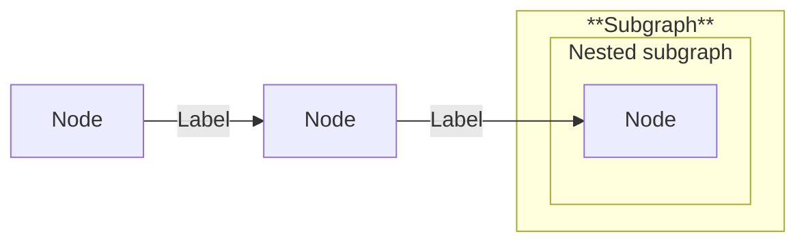
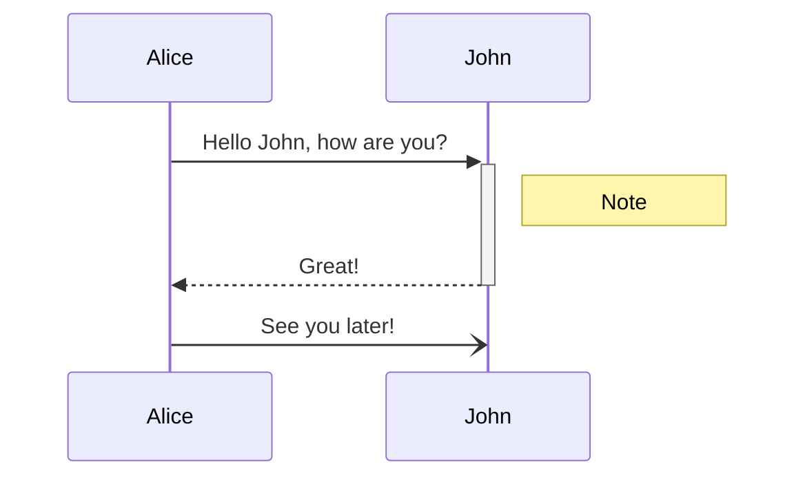

<head>
  <meta name='robots' content='noindex' />
</head>

This is a page used to preview a lot of theme elements in one place when working
on styles.

[Community knowledge base for Docusaurus design tips](https://docusaurus.community/knowledge/design/)

Breadcrumbs above aren't very interesting since this is a top-level page that
doesn't participate in a sidebar, navigate to a different page to see them.

Another element that can't be easily reproduced here is the DocCardList
component, but you can see it in action on the
[ToolHive CLI guides index page](./toolhive/guides-cli/index.mdx).

## Level 2 heading

By default level 2-3 headings generate the TOC on the top right
([reference](https://docusaurus.io/docs/markdown-features/toc#table-of-contents-heading-level)).

### Level 3 heading

Some text within a section. [Here is a link](/theme-preview.mdx).

And here is some `inline code` to show how it looks, even some
[`inline code with a link`](/theme-preview.mdx).

#### Level 4 heading

This level won't appear in the TOC by default.

## Code blocks

[Docusaurus reference docs](https://docusaurus.io/docs/markdown-features/code-blocks)

```js title="Some JavaScript with line numbers" showLineNumbers
console.log('We love marmots.');

function MarmotsAreGreat(agree) {
  if (agree) {
    // highlight-next-line
    return 'I agree, and this line is highlighted!';
  }

  return 'I am wrong.';
}
```

```yaml title="some-yaml.yaml"
---
# Sample profile for validating repositories
version: v1
type: profile
name: acme-github-profile
display_name: Sample Profile
alert: 'off'
remediate: 'off'
repository:
  - type: allowed_selected_actions
    def:
      github_owned_allowed: true
      verified_allowed: true
      patterns_allowed: []
```

```json title="Example JSON with highlighted lines" {2,5-7}
{
  "key": "String",
  "Number": 1,
  "array": [1, 2, 3],
  "nested": {
    "literals": true
  }
}
```

## Admonitions

These are MDX callouts
([reference](https://docusaurus.io/docs/markdown-features/admonitions)).

To customize the title, use square brackets after the type, e.g.
`:::tip[My title]`.

To keep Prettier from invalidating the admonition syntax, add empty lines around
the start and end of the admonition block (see
[here](https://docusaurus.io/docs/markdown-features/admonitions#usage-with-prettier)).

They can be customized in src/css/custom.css like so
([reference](https://docusaurus.community/knowledge/design/admonitions/#updating-the-css)):

```css
/* Customize the "Tip" admonition */
.alert--success {
  --ifm-alert-background-color: #59cfa8;
  --ifm-alert-background-color-highlight: #00bbbe26;
  --ifm-alert-foreground-color: #002a3e;
  --ifm-alert-border-color: #002a3e;
}

/* Use a different border color in dark mode */
[data-theme='dark'] .alert--success {
  --ifm-alert-border-color: #008385;
}
```

:::note

This is a `note` admonition. Its CSS class is `alert--secondary`.

[Here's a link inside the admonition](#tables).

:::

:::tip

This is a `tip` admonition. Its CSS class is `alert--success`.

[Here's a link inside the admonition](#tables).

:::

:::info[Hello]

This is an `info` admonition. Its CSS class is `alert--info` and it has a custom
title.

[Here's a link inside the admonition](#tables).

:::

:::warning

This is a `warning` admonition. Its CSS class is `alert--warning`.

[Here's a link inside the admonition](#tables).

:::

:::danger

This is a `danger` admonition. Its CSS class is `alert--danger`.

[Here's a link inside the admonition](#tables).

:::

:::::info[Parent]

Admonitions can be nested; example here so we can see how the colors look
together.

::::danger[Child]

Child content

:::tip[Inception]

This is getting silly

:::

::::

:::::

## Tables

A standard Markdown table:

| Column 1        |  Column 2   | Column 3                     |
| --------------- | :---------: | ---------------------------- |
| This            |    hello    | [A link in a table](#tables) |
| That            |     hi      | `value`                      |
| The other thing | how are you | 🙈                           |
| Another row     |   so you    | can see the zebra effect     |

(Docusaurus theme enables header row and zebra rows by default)

## Tabs

MDX Tabs component, default theme
([reference](https://docusaurus.io/docs/markdown-features/tabs))

<Tabs>
  <TabItem value='apple' label='Apple' default>
    This is an apple 🍎

    ```python title="Code block inside a tab"
    print('We love marmots.')

    def marmots_are_great(agree):
        if agree:
            # highlight-next-line
            return 'I agree, and this line is highlighted!'

        return 'I am wrong.'
        ```

  </TabItem>
  <TabItem value='orange' label='Orange'>
    This is an orange 🍊
  </TabItem>
  <TabItem value='banana' label='Banana'>
    This is a banana 🍌
  </TabItem>
</Tabs>

## Details panel

<details>
  <summary>Click to expand</summary>

This is a details panel, which can be used to show additional information
without cluttering the page.

It can contain any Markdown or MDX content, including `inline code`, code
blocks, images, even other details panels.
[Here's a link inside the details panel](#details-panel).

```js title="JavaScript code inside a details panel"
console.log('This is inside a details panel.');
```

</details>

## Images

An MDX ThemedImage, which switches based on light/dark theme
([reference](https://docusaurus.io/docs/markdown-features/assets#themed-images))

import useBaseUrl from '@docusaurus/useBaseUrl';
import ThemedImage from '@theme/ThemedImage';

<ThemedImage
  alt='Docusaurus themed image'
  width='300px'
  sources={{
    light: useBaseUrl('/img/logos/stacklok-default-black.svg'),
    dark: useBaseUrl('/img/logos/stacklok-default-white.svg'),
  }}
/>

An image using the "screenshot" CSS class to add a border and shadow/glow to
make them stand out from the background:

<ThemedImage
  alt='VS Code MCP settings'
  sources={{
    light: useBaseUrl('/img/toolhive/quickstart/vscode-mcp-start-light.webp'),
    dark: useBaseUrl('/img/toolhive/quickstart/vscode-mcp-start-dark.webp'),
  }}
  title='VS Code MCP settings'
  width='450'
  className='screenshot'
/>

## Diagrams

A mermaid flowchart
([reference](https://docusaurus.io/docs/markdown-features/diagrams))



A mermaid sequence diagram



## Other standard elements

Here's some **bold** and _italic_ text.

Unordered list:

- One
- Two
- Three

Ordered list:

1. One
1. Two
1. Three

Horizontal line:

---

## Pagination
