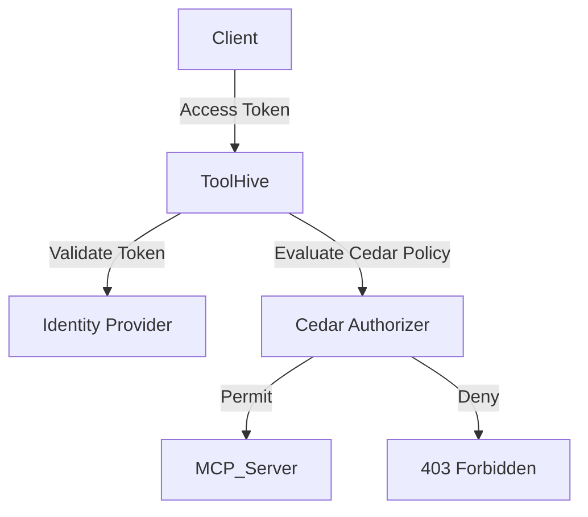
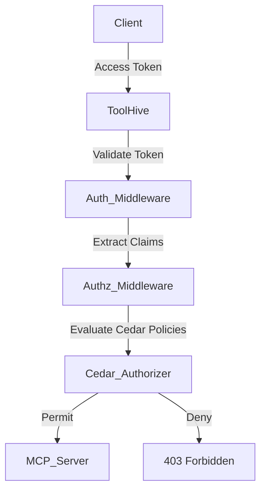

This document explains the concepts behind ToolHive's authentication and
authorization framework, which secures MCP servers by verifying client identity
and controlling access to resources. You'll learn how these systems work
together, why they're designed this way, and the benefits of this approach.

:::info[Scope of this documentation]

This documentation covers **client-to-MCP-server authentication**—how clients
authenticate to the MCP server itself. This is about securing access to the MCP
server's tools and resources.

This is different from **MCP-server-to-backend authentication**, which involves
how the MCP server authenticates to external services or APIs it calls (for
example, a GitHub MCP server authenticating to the GitHub API). That topic is
covered in [Backend authentication](./backend-auth.mdx).

:::

## Understanding authentication vs. authorization

When you secure MCP servers, you need to understand the strong separation
between two critical security concepts:

- **Authentication (authN):** Verifying the identity of clients connecting to
  your MCP server ("Who are you?")
- **Authorization (authZ):** Determining what actions authenticated clients are
  allowed to perform ("What can you do?")

You should always perform authentication first, using a trusted identity
provider, and then apply authorization rules to determine what the authenticated
identity can do. ToolHive helps you follow this best practice by acting as a
gateway in front of your MCP servers. This approach lets you use proven identity
systems for authentication, while keeping your authorization policies clear,
flexible, and auditable. You don't need to add custom authentication or
authorization logic to every server—ToolHive handles it for you, consistently
and securely.

## ToolHive vs. MCP specification

The
[official Model Context Protocol (MCP) specification](https://modelcontextprotocol.io/docs/tutorials/security/authorization)
recommends OAuth 2.1-based authorization for HTTP transports, which requires
each MCP server to act as an OAuth resource server that validates access tokens
and enforces scope-based access control. ToolHive takes a different approach: it
centralizes authentication and authorization in its proxy layer, using
OAuth/OIDC for authentication and Cedar for fine-grained authorization. This
means you don't need to implement token validation or scope management in every
server—just configure ToolHive with your IdP and write clear Cedar policies.
This approach is more flexible, secure, and easier to manage for you and your
team.

## Authentication framework

ToolHive uses OAuth-based authentication with support for both OAuth 2.1 and
OpenID Connect (OIDC), enabling both JWT tokens and opaque token validation.
This lets you connect ToolHive to any OAuth 2.1 or OIDC-compliant identity
provider (IdP), such as Google, GitHub, Microsoft Entra ID (Azure AD), Okta,
Auth0, or even Kubernetes service accounts. ToolHive never handles your raw
passwords or credentials; instead, it relies on access tokens issued by your
trusted provider—either self-contained JWT tokens or opaque tokens validated
through token introspection.

### Why use OAuth-based authentication?

OAuth-based authentication provides several key advantages for securing MCP
servers:

- **Standard and interoperable:** You can connect ToolHive to any OAuth 2.1 or
  OIDC-compliant IdP without custom code, supporting both human users and
  automated services.
- **Proven and secure:** Authentication is delegated to battle-tested identity
  systems, which handle login UI, multi-factor authentication, and password
  storage.
- **Decoupled identity management:** You can use your existing SSO/IdP
  infrastructure, making onboarding and management seamless.
- **Flexible for users and services:** This authentication framework supports
  both interactive user login (for example, Google sign-in) and
  service-to-service authentication (for example, Kubernetes service account
  tokens).

### Real-world authentication scenarios

Understanding how OAuth-based authentication works in practice helps you design
better security for your MCP servers:

**User login via Google:** For example, you can run an MCP server that requires
authentication using your Google credentials. ToolHive delegates login to
Google, receives an access token (either a JWT or an opaque token), and
validates it to authenticate you. This means users get a familiar login
experience while you benefit from Google's security infrastructure.

**Service-to-service auth with Kubernetes:** If you run a microservice in a
Kubernetes cluster, it can present its service account token (typically an OIDC
JWT) to ToolHive. ToolHive validates the token using the cluster's OIDC issuer
and JWKS endpoint, enabling secure, automated authentication for your internal
services.

### Token-based authentication

ToolHive supports two types of access tokens for authentication:

**JWT tokens (JSON Web Tokens):** Self-contained tokens that include identity
information within the token itself. JWTs are validated locally using
cryptographic signatures and consist of three parts:

1. **Header:** Metadata about the token
2. **Payload:** Claims about the entity (typically you or your service)
3. **Signature:** Ensures the token hasn't been altered

**Opaque tokens:** Reference tokens that don't contain identity information
directly. ToolHive validates these tokens by querying the identity provider's
token introspection endpoint to retrieve the associated claims.

ToolHive automatically detects the token type and uses the appropriate
validation method—attempting JWT validation first and falling back to token
introspection if needed.

### Authentication flow

The authentication process follows these steps:

1. **Token acquisition:** You obtain an access token from your identity
   provider.
2. **Token presentation:** You include the token in your requests to ToolHive
   (typically in the Authorization header).
3. **Token validation:** ToolHive validates the token using either:
   - **Local validation:** For JWT tokens, verifying the signature, expiration,
     and claims using the provider's public keys (JWKS)
   - **Remote validation:** For opaque tokens, querying the provider's token
     introspection endpoint to verify the token and retrieve claims
4. **Identity extraction:** ToolHive extracts your identity information from the
   validated token claims.

### Identity providers

ToolHive can integrate with any provider that supports OAuth 2.1 or OIDC,
including:

- Google
- GitHub
- Microsoft Entra ID (Azure AD)
- Okta
- Auth0
- Kubernetes (service account tokens)

This flexibility lets you use your existing identity infrastructure for both
users and services, reducing operational overhead and improving security.

### Token validation methods

ToolHive supports multiple token validation methods to work with different
identity providers:

- **JWT validation:** For providers that issue JWT tokens, ToolHive validates
  tokens locally using the provider's JWKS endpoint. This verifies the token's
  signature, expiration, and claims without calling the identity provider for
  each request.
- **Token introspection:** For providers that issue opaque tokens, ToolHive
  validates tokens by querying the provider's introspection endpoint. This
  supports RFC 7662 (OAuth 2.0 Token Introspection), Google's tokeninfo API, and
  GitHub's token validation API.

ToolHive automatically detects the token type—it first attempts JWT validation,
and if that fails, it falls back to token introspection. This means you don't
need to configure which validation method to use; ToolHive handles it
automatically based on the token format.

## Authorization framework

After authentication, ToolHive enforces authorization using Amazon's Cedar
policy language. ToolHive acts as a gateway in front of MCP servers, handling
all authorization checks before requests reach the server logic. This means MCP
servers do not need to implement their own OAuth or custom authorization
logic—ToolHive centralizes and standardizes access control.

### Why Cedar for authorization?

Cedar provides several advantages for MCP server authorization:

- **Expressive and flexible:** Cedar supports both role-based (RBAC) and
  attribute-based (ABAC) access control patterns, letting you create policies
  that match your security requirements.
- **Formally verified:** Cedar's design has been formally verified for safety
  and security properties, which reduces the risk of policy bugs.
- **Human-readable:** Cedar policies use clear, declarative syntax that's easy
  to read, write, and audit.
- **Policy enforcement point:** ToolHive blocks unauthorized requests before
  they reach the MCP server, which reduces risk and simplifies server code.
- **Secure by default:** Authorization is explicit—if a request is not
  explicitly permitted, it is denied. Deny rules take precedence over permit
  rules (deny overrides).

### Authorization components

ToolHive's authorization framework consists of:

1. **Cedar authorizer:** Evaluates Cedar policies to determine if a request is
   authorized
2. **Authorization middleware:** Extracts information from MCP requests and uses
   the Cedar Authorizer
3. **Configuration:** A JSON or YAML file that specifies the Cedar policies and
   entities

### Authorization flow

When a request arrives at an MCP server with authorization enabled:

1. The authentication middleware authenticates the client and adds token claims
   to the request context
2. The authorization middleware extracts information from the request
   (principal, action, resource, and any arguments)
3. The Cedar authorizer evaluates policies to determine if the request is
   authorized
4. If authorized, the request proceeds; otherwise, a 403 Forbidden response is
   returned

## Security and operational benefits

ToolHive's authentication and authorization approach provides several key
benefits:

- **Separation of concerns:** Authentication and authorization are handled
  independently, following security best practices.
- **Integration with existing systems:** Use your existing identity
  infrastructure (SSO, IdPs, Kubernetes, etc.).
- **Centralized, flexible policy model:** Define precise, auditable access rules
  in a single place—no need to modify MCP server code.
- **Secure by default:** Requests are denied unless explicitly permitted by
  policy, with deny precedence for maximum safety.
- **Auditable and versionable:** Policies are clear, declarative, and can be
  tracked in version control for compliance and review.
- **Developer and operator friendly:** ToolHive acts as a smart proxy, so you
  don't need to implement complex OAuth or custom auth logic in every server.

## Client authentication support

While ToolHive provides a robust authentication and authorization framework for
MCP servers, authentication support varies across the MCP client ecosystem.

### MCP client capabilities

The MCP ecosystem includes numerous clients with varying levels of
authentication support. Authentication support is not universal. Some clients
focus primarily on local, unauthenticated MCP servers for development workflows,
while others provide enterprise-grade authentication for production deployments.

When selecting an MCP client for authenticated workflows, look for clients that
support the MCP authentication standards, including OAuth 2.1 and
transport-level authentication mechanisms.

ToolHive's OIDC-based authentication approach aligns with industry standards and
works with clients that support modern authentication protocols. As the MCP
ecosystem continues to mature, we expect authentication support to become more
standardized across clients.

## Related information

- For backend authentication concepts, see
  [Backend authentication](./backend-auth.mdx)
- For detailed policy writing guidance, see
  [Cedar policies](./cedar-policies.mdx)
