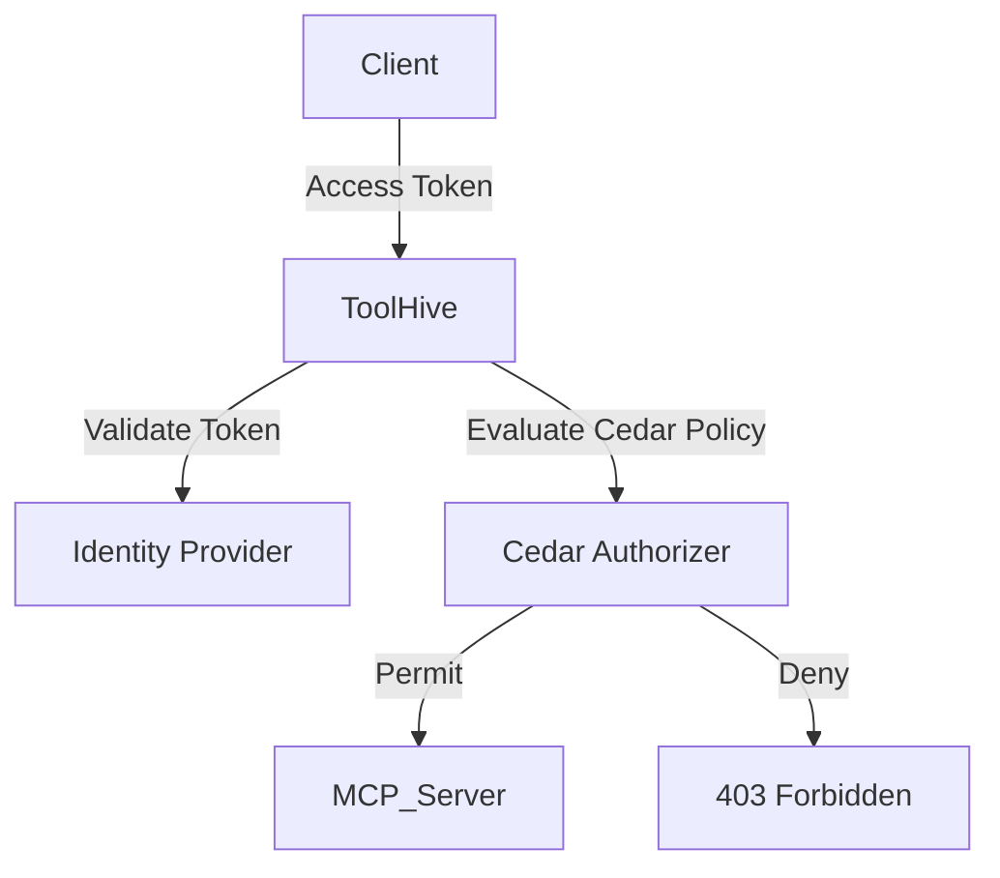
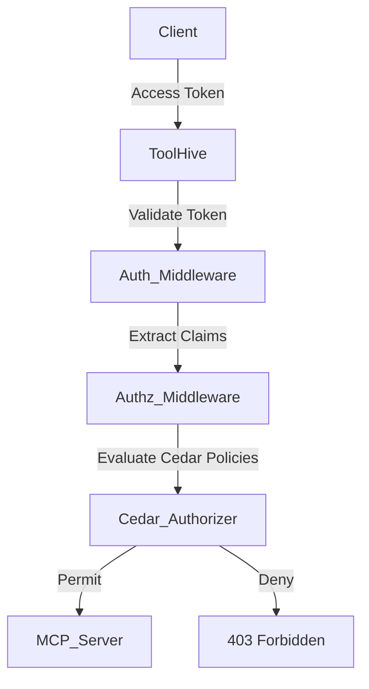

This document explains the concepts behind ToolHive's authentication and
authorization framework, which secures MCP servers by verifying client identity
and controlling access to resources. You'll learn how these systems work
together, the reasoning behind their design, and the benefits of this approach.

:::info[Scope of this documentation]

This documentation covers **client-to-MCP-server authentication**: how clients
authenticate to the MCP server itself. This is about securing access to the MCP
server's tools and resources.

This is different from **MCP-server-to-backend authentication**, which involves
how the MCP server authenticates to external services or APIs it calls (for
example, a GitHub MCP server authenticating to the GitHub API). That topic is
covered in [Backend authentication](./backend-auth.mdx).

:::

## Understanding authentication vs. authorization

When you secure MCP servers, you need to understand the strong separation
between two critical security concepts:

- **Authentication (authN):** Verifying the identity of clients connecting to
  your MCP server ("Who are you?")
- **Authorization (authZ):** Determining what actions authenticated clients are
  allowed to perform ("What can you do?")

You should always perform authentication first, using a trusted identity
provider, and then apply authorization rules to determine what the authenticated
identity can do. ToolHive helps you follow this best practice by acting as a
gateway in front of your MCP servers. This approach lets you use proven identity
systems for authentication, while keeping your authorization policies clear,
flexible, and auditable. You don't need to add custom authentication or
authorization logic to every server. ToolHive handles it for you, consistently
and securely.

## Why ToolHive centralizes authentication

The
[official MCP specification](https://modelcontextprotocol.io/specification/2025-11-25/basic/authorization)
defines an OAuth 2.1 authorization profile for HTTP transports, where each MCP
server acts as an OAuth resource server. While authorization is optional in MCP,
HTTP-transport implementations that adopt it must follow this profile. In
practice, this model creates significant operational challenges:

- **OAuth client registration burden:** Many identity providers (such as Google,
  GitHub, and Atlassian) require manual pre-registration of OAuth clients to
  obtain a client ID and client secret. The MCP specification addresses this gap
  with a priority order of registration mechanisms (pre-registered client info,
  Client ID Metadata Documents, and Dynamic Client Registration), but most
  existing identity providers don't yet implement the latter two. If each user
  client (for example, an IDE) had to pre-register at every provider, the burden
  would be impractical at scale.
- **No federation with external services:** While token exchange (RFC 8693) and
  federated identity providers work when the upstream service is in the same
  trust domain as the MCP server or has an established trust relationship with
  the identity provider, many MCP servers need to access external services like
  GitHub, Google, or Atlassian APIs where no federation relationship exists.
- **Per-server implementation cost:** Each MCP server would need to implement
  its own token validation and scope management, duplicating security-critical
  logic across servers.

ToolHive addresses the per-server implementation cost by centralizing
authentication and authorization in its proxy layer. You configure ToolHive with
your identity provider and write Cedar policies for fine-grained authorization.
Individual MCP servers don't need to implement token validation or scope
management.

The [embedded authorization server](#embedded-authorization-server) addresses
the remaining challenges. It exposes standard OAuth endpoints and handles the
full OAuth web flow, and solves the federation gap by obtaining tokens directly
from external providers like GitHub or Atlassian. ToolHive delegates
authentication to the upstream provider and issues its own tokens, giving MCP
clients a spec-compliant OAuth experience while centralizing the complexity of
token acquisition and management.

To eliminate the client registration burden, the embedded authorization server
currently implements Dynamic Client Registration (DCR), which the MCP
specification lists as the backwards-compatibility fallback. Support for Client
ID Metadata Documents, the spec's preferred mechanism for clients and servers
without an existing relationship, is planned.

## Authentication framework

ToolHive uses OAuth-based authentication and accepts access tokens issued by any
OAuth 2.0 or OIDC-compliant identity provider (IdP), such as Google, GitHub,
Microsoft Entra ID (Azure AD), Okta, Auth0, or Kubernetes service accounts.
ToolHive supports both self-contained JWT tokens and opaque tokens (validated
through introspection), and never handles your raw passwords or credentials.

### Why use OAuth-based authentication?

OAuth-based authentication provides several key advantages for securing MCP
servers:

- **Standard and interoperable:** You can connect ToolHive to any OAuth 2.0 or
  OIDC-compliant IdP without custom code, supporting both human users and
  automated services.
- **Proven and secure:** Authentication is delegated to battle-tested identity
  systems, which handle login UI, multi-factor authentication, and password
  storage.
- **Decoupled identity management:** You can use your existing SSO/IdP
  infrastructure, making onboarding and management seamless.
- **Flexible for users and services:** This authentication framework supports
  both interactive user login (for example, Google sign-in) and
  service-to-service authentication (for example, Kubernetes service account
  tokens).

### Real-world authentication scenarios

Understanding how OAuth-based authentication works in practice helps you design
better security for your MCP servers:

**User login via Google:** For example, you can run an MCP server that requires
authentication using your Google credentials. ToolHive delegates login to
Google, receives an access token (either a JWT or an opaque token), and
validates it to authenticate you. This means users get a familiar login
experience while you benefit from Google's security infrastructure.

**Service-to-service auth with Kubernetes:** If you run a microservice in a
Kubernetes cluster, it can present its service account token (typically an OIDC
JWT) to ToolHive. ToolHive validates the token using the cluster's OIDC issuer
and JWKS endpoint, enabling secure, automated authentication for your internal
services.

### Token-based authentication

ToolHive supports two types of access tokens for authentication:

**JWT tokens (JSON Web Tokens):** Self-contained tokens that include identity
information within the token itself. JWTs are validated locally using
cryptographic signatures and consist of three parts:

1. **Header:** Metadata about the token
2. **Payload:** Claims about the subject and the token, such as issuer,
   audience, and expiration
3. **Signature:** Ensures the token hasn't been altered

**Opaque tokens:** Reference tokens that don't contain identity information
directly. ToolHive validates these tokens by querying the identity provider's
token introspection endpoint to retrieve the associated claims.

ToolHive automatically detects the token type and uses the appropriate
validation method, attempting JWT validation first and falling back to token
introspection if needed.

### Authentication flow

The authentication process follows these steps:

1. **Token acquisition:** You obtain an access token from your identity
   provider.
2. **Token presentation:** You include the token in the `Authorization` header
   on every request to ToolHive. Per the MCP specification, access tokens must
   not appear in URI query strings.
3. **Token validation:** ToolHive validates the token using either:
   - **Local validation:** For JWT tokens, verifying the signature, expiration,
     and claims using the provider's public keys (JWKS)
   - **Remote validation:** For opaque tokens, querying the provider's token
     introspection endpoint to verify the token and retrieve claims
4. **Identity extraction:** ToolHive extracts your identity information from the
   validated token claims.

```mermaid
flowchart TD
    Client -->|Access Token| ToolHive
    ToolHive -->|Validate Token| Identity_Provider[Identity Provider]
    ToolHive -->|Evaluate Cedar Policy| Cedar_Authorizer[Cedar Authorizer]
    Cedar_Authorizer -->|Permit| MCP_Server
    Cedar_Authorizer -->|Deny| Denied[403 Forbidden]
```

### Embedded authorization server

In the standard authentication flow described above, clients obtain tokens
independently from an external identity provider and present them to ToolHive
for validation. The embedded authorization server provides an alternative model
where ToolHive itself acts as an OAuth authorization server, obtaining tokens
from an upstream provider on behalf of clients, storing those tokens, and
issuing its own JWTs for clients to use on subsequent requests.

This solves two problems at once: it eliminates the client registration burden
through Dynamic Client Registration (DCR), and it bridges the gap for external
APIs like GitHub or Atlassian where no federation relationship exists with your
identity provider.

For the complete conceptual description (including the OAuth flow, token storage
and forwarding, session storage options, and differences between MCPServer and
VirtualMCPServer), see
[Embedded authorization server](./embedded-auth-server.mdx).

For Kubernetes setup instructions, see
[Set up embedded authorization server authentication](../guides-k8s/auth-k8s.mdx#set-up-embedded-authorization-server-authentication).

### Identity providers

ToolHive can integrate with any provider that supports OAuth 2.0 or OIDC,
including:

- Google
- GitHub
- Microsoft Entra ID (Azure AD)
- Okta
- Auth0
- Kubernetes (service account tokens)

These same providers work with both external token validation and the embedded
authorization server. For the embedded authorization server, the upstream
provider must support the OAuth 2.0 authorization code flow.

### Token validation methods

ToolHive supports multiple token validation methods to work with different
identity providers:

- **JWT validation:** For providers that issue JWT tokens, ToolHive validates
  tokens locally using the provider's JWKS endpoint. This verifies the token's
  signature, expiration, and claims without calling the identity provider for
  each request.
- **Token introspection:** For providers that issue opaque tokens, ToolHive
  validates tokens by querying the provider's introspection endpoint. This
  supports RFC 7662 (OAuth 2.0 Token Introspection) for compliant providers,
  plus provider-specific token-validation endpoints such as Google's `tokeninfo`
  endpoint and GitHub's token-check REST API. The latter two are not OAuth
  introspection in the RFC 7662 sense; they're vendor APIs that return similar
  information.

ToolHive automatically detects the token type. It first attempts JWT validation,
and if that fails, it falls back to token introspection. This means you don't
need to configure which validation method to use; ToolHive handles it
automatically based on the token format.

## Authorization framework

After authentication, ToolHive enforces authorization using Amazon's Cedar
policy language. ToolHive acts as a gateway in front of MCP servers, handling
all authorization checks before requests reach the server logic. This means MCP
servers do not need to implement their own OAuth or custom authorization logic.
ToolHive centralizes and standardizes access control.

### Why Cedar for authorization?

Cedar provides several advantages for MCP server authorization:

- **Expressive and flexible:** Cedar supports both role-based (RBAC) and
  attribute-based (ABAC) access control patterns, letting you create policies
  that match your security requirements.
- **Formally verified:** Cedar's design has been formally verified for safety
  and security properties, which reduces the risk of policy bugs.
- **Human-readable:** Cedar policies use clear, declarative syntax that's easy
  to read, write, and audit.
- **Policy enforcement point:** ToolHive blocks unauthorized requests before
  they reach the MCP server, which reduces risk and simplifies server code.
- **Secure by default:** Authorization is explicit: if a request is not
  explicitly permitted, it is denied. Deny rules take precedence over permit
  rules (deny overrides).

### Authorization components

ToolHive's authorization framework consists of:

1. **Cedar authorizer:** Evaluates Cedar policies to determine if a request is
   authorized
2. **Authorization middleware:** Extracts information from MCP requests and uses
   the Cedar Authorizer
3. **Configuration:** A JSON or YAML file that specifies the Cedar policies and
   entities

### Authorization flow

When a request arrives at an MCP server with authorization enabled:

1. The authentication middleware authenticates the client and adds token claims
   to the request context
2. The authorization middleware extracts information from the request
   (principal, action, resource, and any arguments)
3. The Cedar authorizer evaluates policies to determine if the request is
   authorized
4. If authorized, the request proceeds; otherwise, a 403 Forbidden response is
   returned

```mermaid
flowchart TD
    Client -->|Access Token| ToolHive
    ToolHive -->|Validate Token| Auth_Middleware
    Auth_Middleware -->|Extract Claims| Authz_Middleware
    Authz_Middleware -->|Evaluate Cedar Policies| Cedar_Authorizer
    Cedar_Authorizer -->|Permit| MCP_Server
    Cedar_Authorizer -->|Deny| Denied[403 Forbidden]
```

## Security and operational benefits

ToolHive's authentication and authorization approach provides several key
benefits:

- **Separation of concerns:** Authentication and authorization are handled
  independently, following security best practices.
- **Integration with existing systems:** Use your existing identity
  infrastructure (SSO, IdPs, Kubernetes, etc.).
- **Centralized, flexible policy model:** Define precise, auditable access rules
  in a single place, with no need to modify MCP server code.
- **Secure by default:** Requests are denied unless explicitly permitted by
  policy, with deny precedence for maximum safety.
- **Auditable and versionable:** Policies are clear, declarative, and can be
  tracked in version control for compliance and review.
- **Developer and operator friendly:** ToolHive acts as a smart proxy, so you
  don't need to implement complex OAuth or custom auth logic in every server.

## Client authentication support

While ToolHive provides a robust authentication and authorization framework for
MCP servers, authentication support varies across the MCP client ecosystem.

### MCP client capabilities

The MCP ecosystem includes numerous clients with varying levels of
authentication support. Authentication support is not universal. Some clients
focus primarily on local, unauthenticated MCP servers for development workflows,
while others provide enterprise-grade authentication for production deployments.

When selecting an MCP client for authenticated workflows, look for clients that
implement the OAuth 2.1 authorization profile defined by the MCP specification.

ToolHive's OIDC-based authentication approach aligns with industry standards and
works with clients that support modern authentication protocols. As the MCP
ecosystem continues to mature, we expect authentication support to become more
standardized across clients.

## Related information

- For configuring the embedded authorization server in Kubernetes, see
  [Embedded authorization server authentication](../guides-k8s/auth-k8s.mdx#set-up-embedded-authorization-server-authentication)
- For backend authentication concepts, see
  [Backend authentication](./backend-auth.mdx)
- For detailed policy writing guidance, see
  [Cedar policies](./cedar-policies.mdx)
- For a complete end-to-end example with Okta OIDC and role-based access
  control, see [Role-based authorization with Okta](../integrations/okta.mdx)
