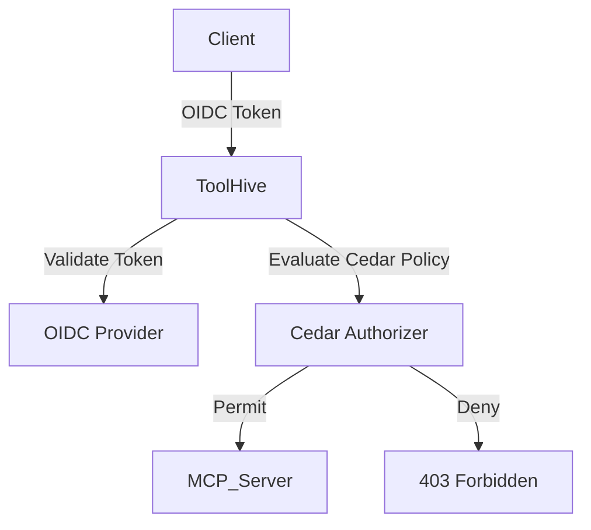
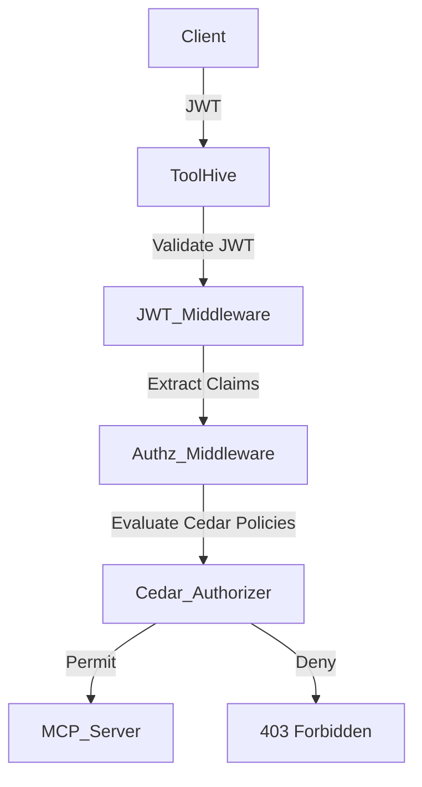

This document explains the concepts behind ToolHive's authentication and
authorization framework, which secures MCP servers by verifying client identity
and controlling access to resources.

> For step-by-step setup and troubleshooting, see
> [Securing MCP servers with authentication and authorization](../how-to/authentication-authorization.md).

## Understanding authentication vs. authorization

When you secure MCP servers, it's critical to understand the strong separation
between:

- **Authentication (authN):** Verifying the identity of clients connecting to
  your MCP server ("Who are you?")
- **Authorization (authZ):** Determining what actions authenticated clients are
  allowed to perform ("What can you do?")

You should always perform authentication first, using a trusted identity
provider, and then apply authorization rules to determine what the authenticated
identity can do. ToolHive helps you follow this best practice by acting as a
gateway in front of your MCP servers. This approach lets you use proven identity
systems for authentication, while keeping your authorization policies clear,
flexible, and auditable. You don't need to add custom authentication or
authorization logic to every server—ToolHive handles it for you, consistently
and securely.

## Authentication framework

You use OpenID Connect (OIDC)—an identity layer built on top of OAuth 2.0—for
authentication in ToolHive. OIDC is a widely adopted, interoperable protocol
that lets you connect ToolHive to any OIDC-compliant identity provider (IdP),
such as Google, GitHub, Microsoft Entra ID (Azure AD), Okta, Auth0, or even
Kubernetes service accounts. ToolHive never handles your raw passwords or
credentials; instead, it relies on signed identity tokens (usually JWTs) issued
by your trusted provider.

**Why use OIDC?**

- **Standard and interoperable:** You can connect ToolHive to any OIDC-compliant
  IdP without custom code, supporting both human users and automated services.
- **Proven and secure:** Authentication is delegated to battle-tested identity
  systems, which handle login UI, multi-factor authentication, and password
  storage.
- **Decoupled identity management:** You can use your existing SSO/IdP
  infrastructure, making onboarding and management seamless.
- **Flexible for users and services:** OIDC supports both interactive user login
  (for example, Google sign-in) and service-to-service authentication (for
  example, Kubernetes service account tokens).

### Real-world scenarios

- **User login via Google (OIDC):** You can run an MCP server that requires
  authentication using your Google credentials. ToolHive delegates login to
  Google, receives a signed ID token, and uses it to authenticate you.
- **Service-to-service auth with Kubernetes:** If you run a microservice in a
  Kubernetes cluster, it can present its service account token (an OIDC JWT) to
  ToolHive. ToolHive validates the token using the cluster's OIDC issuer and
  JWKS URL, enabling secure, automated authentication for your internal
  services.

### JWT-based authentication

ToolHive uses JSON Web Tokens (JWTs) for authentication. JWTs are compact,
self-contained tokens that securely transmit identity information. Each JWT has
three parts:

1. **Header:** Metadata about the token
2. **Payload:** Claims about the entity (typically you or your service)
3. **Signature:** Ensures the token hasn't been altered

### Authentication flow

The authentication process follows these steps:

1. **Token acquisition:** You obtain a JWT from your identity provider.
2. **Token presentation:** You include the JWT in your requests to ToolHive.
3. **Token validation:** ToolHive validates the JWT's signature, expiration, and
   claims.
4. **Identity extraction:** ToolHive extracts your identity information from the
   validated JWT.



### Identity providers

ToolHive can integrate with:

- Google
- GitHub
- Microsoft Entra ID (Azure AD)
- Okta
- Auth0
- Kubernetes (service account tokens)
- Any provider that supports OIDC

This flexibility lets you use your existing identity infrastructure for both
users and services, reducing operational overhead and improving security.

## Authorization framework

After authentication, ToolHive enforces authorization using Amazon's Cedar
policy language. ToolHive acts as a gateway in front of MCP servers, handling
all authorization checks before requests reach the server logic. This means MCP
servers do not need to implement their own OAuth or custom authorization
logic—ToolHive centralizes and standardizes access control.

**Key features of ToolHive's authorization:**

- **Cedar policy language:** Cedar is a flexible, expressive, and formally
  verified language for access control, supporting both role-based (RBAC) and
  attribute-based (ABAC) rules.
- **Policy enforcement point:** ToolHive blocks unauthorized requests before
  they reach the MCP server, reducing risk and simplifying server code.
- **Secure-by-default:** Authorization is explicit—if a request is not
  explicitly permitted, it is denied. Deny rules take precedence over permit
  rules (deny overrides).

### Cedar policy language

Cedar policies express authorization rules in a clear, declarative syntax:

```text
permit|forbid(principal, action, resource) when { conditions };
```

- `permit` or `forbid`: Whether to allow or deny the operation
- `principal`: The entity making the request (the client)
- `action`: The operation being performed
- `resource`: The object being accessed
- `conditions`: Optional conditions that must be satisfied

### Authorization components

ToolHive's authorization framework consists of:

1. **Cedar authorizer:** Evaluates Cedar policies to determine if a request is
   authorized
2. **Authorization middleware:** Extracts information from MCP requests and uses
   the Cedar Authorizer
3. **Configuration:** A JSON or YAML file that specifies the Cedar policies and
   entities

### Authorization flow

When a request arrives at an MCP server with authorization enabled:

1. The JWT middleware authenticates the client and adds JWT claims to the
   request context
2. The authorization middleware extracts information from the request
   (principal, action, resource, and any arguments)
3. The Cedar authorizer evaluates policies to determine if the request is
   authorized
4. If authorized, the request proceeds; otherwise, a 403 Forbidden response is
   returned



## MCP-specific entities

In the context of MCP servers, Cedar policies use the following entities:

### Principal

The client making the request, identified by the `sub` claim in the JWT token:

- Format: `Client::<client_id>`
- Example: `Client::user123`

### Action

The operation being performed on an MCP feature:

- Format: `Action::<operation>`
- Examples:
  - `Action::"call_tool"`: Call a tool
  - `Action::"get_prompt"`: Get a prompt
  - `Action::"read_resource"`: Read a resource
  - `Action::"list_tools"`: List available tools

### Resource

The object being accessed:

- Format: `<type>::<id>`
- Examples:
  - `Tool::"weather"`: The weather tool
  - `Prompt::"greeting"`: The greeting prompt
  - `Resource::"data"`: The data resource

## Policy examples

Cedar policies can express a wide range of authorization rules:

### Basic access control

```text
permit(principal, action == Action::"call_tool", resource == Tool::"weather");
```

This policy allows any authenticated client to call the weather tool.

### Role-based access control (RBAC)

```text
permit(principal, action == Action::"call_tool", resource) when {
  principal.claim_roles.contains("admin")
};
```

This policy allows clients with the "admin" role to call any tool.

### Attribute-based access control (ABAC)

```text
permit(principal, action == Action::"call_tool", resource == Tool::"sensitive_data") when {
  principal.claim_roles.contains("data_analyst") &&
  resource.arg_data_level <= principal.claim_clearance_level
};
```

This policy allows data analysts to access sensitive data, but only if their
clearance level is sufficient.

## JWT claims and tool arguments

ToolHive makes JWT claims and tool arguments available in Cedar policies:

### JWT claims

Claims from the JWT are added with a `claim_` prefix:

```text
permit(principal, action == Action::"call_tool", resource == Tool::"weather") when {
  principal.claim_name == "John Doe"
};
```

This policy allows only clients with the name "John Doe" to call the weather
tool.

### Tool arguments

Arguments from tool calls are added with an `arg_` prefix:

```text
permit(principal, action == Action::"call_tool", resource == Tool::"weather") when {
  resource.arg_location == "New York" || resource.arg_location == "London"
};
```

This policy allows any client to call the weather tool, but only for the
locations "New York" and "London".

## Policy evaluation and secure defaults

ToolHive's policy evaluation follows a secure-by-default, least-privilege model:

1. If any `forbid` policy matches, the request is denied (deny precedence)
2. If any `permit` policy matches, the request is authorized
3. If no policy matches, the request is denied (default deny)

This means that `forbid` policies always override `permit` policies, and any
request not explicitly permitted is denied. This approach minimizes risk and
ensures that only authorized actions are allowed.

## Security and operational benefits

ToolHive's authentication and authorization approach provides several key
benefits:

- **Separation of concerns:** Authentication and authorization are handled
  independently, following best practices.
- **Integration with existing systems:** Use your existing identity
  infrastructure (SSO, IdPs, Kubernetes, etc.).
- **Centralized, flexible policy model:** Define precise, auditable access rules
  in a single place—no need to modify MCP server code.
- **Secure by default:** Requests are denied unless explicitly permitted by
  policy, with deny precedence for maximum safety.
- **Auditable and versionable:** Policies are clear, declarative, and can be
  tracked in version control for compliance and review.
- **Developer and operator friendly:** ToolHive acts as a smart proxy, so you
  don't need to implement complex OAuth or custom auth logic in every server.

## Example scenarios

### Multi-tenant environments

In multi-tenant environments, you can use policies to isolate tenants:

```text
permit(principal, action, resource) when {
  principal.claim_tenant_id == resource.tenant_id
};
```

This ensures that clients can only access resources belonging to their tenant.

### Data sensitivity levels

For data with different sensitivity levels:

```text
permit(principal, action == Action::"call_tool", resource == Tool::"data_access") when {
  principal.claim_clearance_level >= resource.arg_data_sensitivity
};
```

This ensures that clients can only access data within their clearance level.

### Geographic restrictions

For geographically restricted resources:

```text
permit(principal, action == Action::"call_tool", resource == Tool::"geo_restricted") when {
  principal.claim_location in ["US", "Canada", "Mexico"]
};
```

This restricts access based on the client's location.

## Related information

- For practical steps to configure authentication and authorization, see
  [Authentication and authorization](../how-to/authentication-authorization.md)
- For security best practices, see
  [Security reference](../reference/security.md)
- For container security details, see
  [Container security model](container-security-model.md)
- For detailed Cedar policy syntax, see
  [Cedar documentation](https://docs.cedarpolicy.com/)

---

### ToolHive vs. MCP Specification

The official Model Context Protocol (MCP) specification recommends OAuth
2.1-based authorization for HTTP transports, which can require each MCP server
to implement OAuth endpoints and manage tokens. ToolHive takes a different
approach: it centralizes authentication and authorization in its proxy layer,
using OIDC for authentication and Cedar for fine-grained authorization. This
means you don't need to implement OAuth flows or scope management in every
server—just configure ToolHive with your IdP and write clear policies. This
approach is more flexible, secure, and easier to manage for you and your team.
