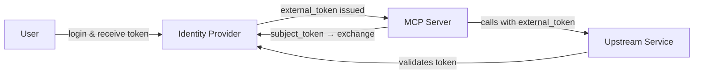
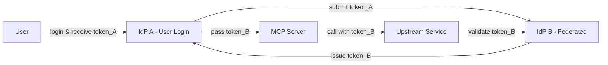
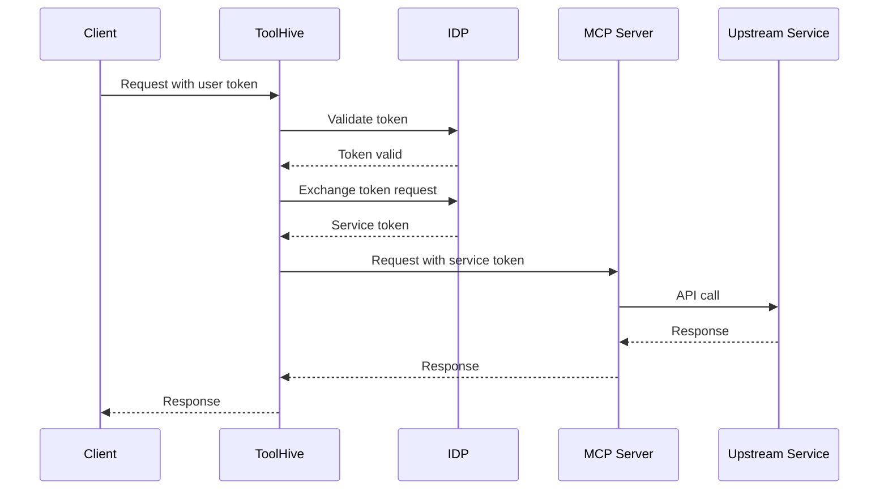

This document explains how ToolHive helps MCP servers authenticate to
third-party APIs and backend services exposed through the MCP servers. You'll
learn about the back end authentication patterns ToolHive supports, why its
approach improves security and multi-tenancy, and how it simplifies MCP server
development.

:::info[Scope of this documentation]

This documentation covers **MCP-server-to-backend authentication**—how MCP
servers authenticate to external services or APIs they call (for example, a
GitHub MCP server authenticating to the GitHub API).

This is different from **client-to-MCP-server authentication**, which involves
how clients authenticate to the MCP server itself. That topic is covered in
[Authentication and authorization](./auth-framework.mdx).

:::

## The challenge of backend authentication

The MCP specification focuses on authorization to the MCP server but doesn't
specify how an MCP server should authenticate to the services it exposes. This
is intentionally left to implementers, which makes sense from a specification
perspective but leaves MCP server creators without clear guidance.

Many MCP servers today either embed static API keys or require custom
authentication code. This creates several problems:

- **Security risks:** Long-lived credentials stored in configuration files or
  environment variables can be compromised
- **Audit challenges:** When multiple users share a service account, you can't
  trace individual actions
- **Multi-tenancy complexity:** Supporting multiple tenants with isolated
  credentials requires significant custom code

ToolHive addresses these challenges by implementing several authentication
patterns such as token exchange and federated identity that provide MCP servers
with properly scoped, short-lived access tokens instead of requiring embedded
secrets.

## Managing third-party service tokens

The key insight is that ToolHive already implements authentication and
authorization for the MCP server—it helps the client authenticate and obtain an
access token scoped for the MCP server. ToolHive can leverage this existing
token to obtain a token for the backend service and pass it to the MCP server.

This means the MCP server receives a properly scoped token for the external
service as part of the standard MCP protocol call, typically in the
`Authorization: Bearer` header. This simplifies MCP server implementation
because:

- No long-lived tokens need to be stored
- No custom authentication code is required
- The MCP server can focus on its business logic
- Each request is attributed to the individual user making it

## Methods for acquiring external access tokens

ToolHive supports multiple patterns for obtaining external access tokens,
depending on the relationship between your identity provider (IdP) and the
external service. All patterns assume OAuth-based authentication—for services
using other authentication methods (like database connections with static
credentials), consider integrations with secret management systems like
HashiCorp Vault.

ToolHive implements two main patterns:

### Same IdP with token exchange

When both the MCP server and the backend service trust the same IdP, and that
IdP supports [RFC 8693](https://datatracker.ietf.org/doc/html/rfc8693) token
exchange, ToolHive can exchange the internal token for an external one.



**How it works:**

1. The user authenticates to the MCP client and receives an access token from
   the IdP
2. ToolHive's token exchange middleware contacts the IdP, presenting the user's
   access token
3. The IdP issues a new access token with different audience and scopes
4. ToolHive passes this access token to the MCP server
5. The MCP server uses the access token to call the upstream service

### Federated IdPs with identity mapping

When the backend service trusts a different IdP, but federation is configured
between the two IdPs, ToolHive can use the federated identity service to issue
short-lived tokens. An example is Google's Security Token Service (STS), which
can issue tokens for Google Cloud services based on your corporate identity.



**How it works:**

1. The user authenticates to their MCP client with a corporate IdP and receives
   token_A
2. ToolHive submits token_A to the federated identity service
3. The federated service maps the identity and issues token_B
4. ToolHive passes token_B to the MCP server
5. The MCP server uses token_B to call the upstream service

## Token exchange implementation

The token exchange flow demonstrates how ToolHive transforms user identity
tokens into properly scoped service tokens.



### Token transformation

When a client authenticates to ToolHive, they receive a token scoped for the MCP
server:

```json
{
  "iss": "https://idp.example.com/oauth2/default",
  "aud": "mcp-server",
  "scp": ["backend-mcp:tools:call", "backend-mcp:tools:list"],
  "sub": "user@example.com"
}
```

ToolHive's token exchange middleware contacts the IdP and exchanges this token
for one scoped to the backend service:

```json
{
  "iss": "https://idp.example.com/oauth2/default",
  "aud": "backend-server",
  "scp": ["backend-api:read"],
  "sub": "user@example.com"
}
```

Notice how the audience (`aud`) and scopes (`scp`) change while preserving the
user's identity (`sub`). This exchanged token is then injected into the
`Authorization: Bearer` HTTP header and passed to the MCP server.

## Token exchange with federation

When using federated identity providers, ToolHive can map your corporate
identity to an external service identity. This is particularly useful for
accessing cloud services like Google Cloud Platform.

### Federation flow

The client authenticates with your corporate IdP and receives a token:

```json
{
  "iss": "https://idp.example.com/oauth2/default",
  "aud": "mcp-server",
  "sub": "user@example.com",
  "email": "user@example.com",
  "scp": ["mcp:tools:call", "mcp:tools:list"],
  "exp": 1729641600,
  "iat": 1729638000
}
```

ToolHive's token exchange middleware calls the external Security Token Service
(STS) endpoint. For Google Cloud, this looks like:

```http
POST https://sts.googleapis.com/v1/token
Content-Type: application/x-www-form-urlencoded

grant_type=urn:ietf:params:oauth:grant-type:token-exchange
&audience=//iam.googleapis.com/projects/PROJECT_NUMBER/locations/global/workloadIdentityPools/POOL_ID/providers/PROVIDER_ID
&scope=https://www.googleapis.com/auth/bigquery
&requested_token_type=urn:ietf:params:oauth:token-type:access_token
&subject_token=eyJhbGciOiJSUzI1NiIsInR5cCI6IkpXVCJ9...
&subject_token_type=urn:ietf:params:oauth:token-type:jwt
```

The federated service returns a token that maps your corporate identity to a
federated principal:

```json
{
  "iss": "https://sts.googleapis.com",
  "sub": "principal://iam.googleapis.com/projects/PROJECT_NUMBER/locations/global/workloadIdentityPools/POOL_ID/subject/user@example.com",
  "aud": "https://bigquery.googleapis.com/",
  "email": "user@example.com",
  "scope": "https://www.googleapis.com/auth/bigquery",
  "exp": 1729641600,
  "iat": 1729638000
}
```

This exchanged token is injected into the `Authorization: Bearer` HTTP header
and passed to the MCP server. The MCP server uses this token to make upstream
API calls, with each request attributed to the individual user's federated
identity rather than a shared service account.

### Key differences from standard token exchange

Federation-based token exchange has several important characteristics:

1. **No client authentication required:** The external STS endpoint doesn't
   require `client_id` or `client_secret`. The OAuth JWT itself serves as proof
   of identity.
2. **Identity federation pool as intermediary:** The `audience` parameter points
   to a federation pool configuration, not directly to the target service.
3. **Principal mapping:** User attributes (email, sub) from the OAuth token are
   mapped to federated principals for access control.
4. **Individual audit trail:** Upstream service audit logs show the individual
   user identity, not a service account.

## Security and operational benefits

ToolHive's token exchange approach provides several key advantages:

- **Secure:** MCP servers receive short-lived, properly scoped access tokens
  instead of embedding long-lived secrets
- **Auditable:** Each API call is attributed to the individual user identity,
  making audit trails clear and meaningful
- **Multi-tenant friendly:** Token scoping naturally supports tenant isolation
  and separation of duties
- **Developer friendly:** MCP servers don't need custom authentication
  logic—they just use the provided token
- **Least privilege:** Tokens are narrowly scoped to specific audiences and
  permissions, reducing the blast radius if compromised
- **Consistent:** The same pattern works across different backend services and
  identity providers

## Related information

- For client authentication concepts, see
  [Authentication and authorization](./auth-framework.mdx)
- For policy configuration, see [Cedar policies](./cedar-policies.mdx)
