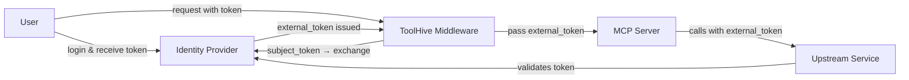
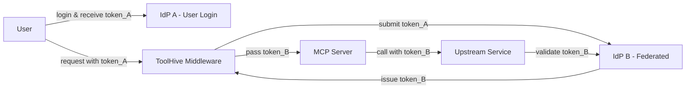
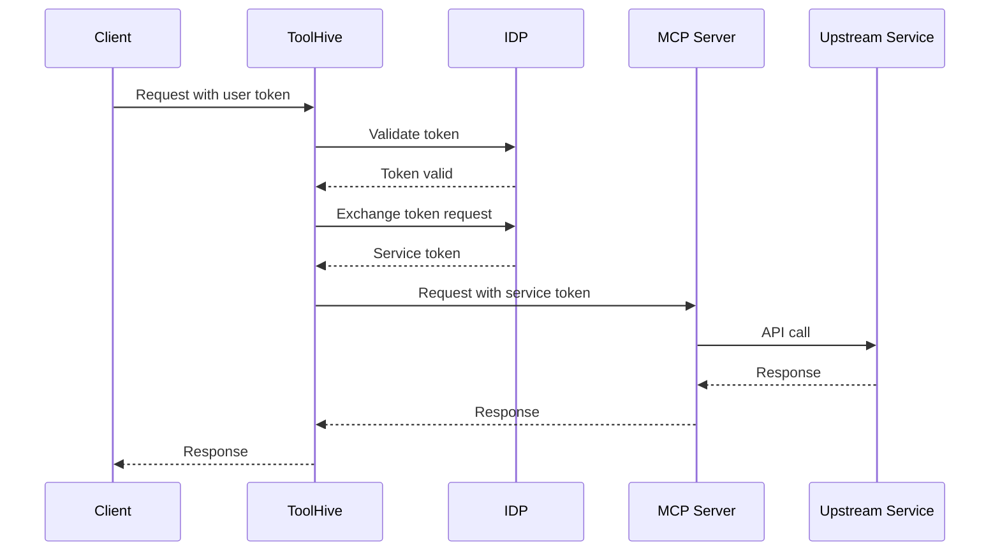

This document explains how ToolHive helps MCP servers authenticate to
third-party APIs and backend services exposed through the MCP servers. You'll
learn about the backend authentication patterns ToolHive supports, why they
improve security and multi-tenancy, and how they simplify MCP server
development.

:::info[Scope of this documentation]

This documentation covers **MCP-server-to-backend authentication**—how MCP
servers authenticate to external services or APIs they call (for example, a
GitHub MCP server authenticating to the GitHub API).

This is different from **client-to-MCP-server authentication**, which involves
how clients authenticate to the MCP server itself. That topic is covered in
[Authentication and authorization](./auth-framework.mdx).

:::

## The challenge of backend authentication

The MCP specification focuses on authorization to the MCP server but doesn't
specify how an MCP server should authenticate to the services it exposes. This
is intentionally left to implementers, which makes sense from a specification
perspective but leaves MCP server developers without clear guidance.

Many MCP servers today either embed static API keys or require custom
authentication code. This creates several problems:

- **Security risks:** Long-lived credentials stored in configuration files or
  environment variables can be compromised
- **Audit challenges:** When multiple users share a service account, you can't
  trace individual actions
- **Multi-tenancy complexity:** Supporting multiple tenants with isolated
  credentials requires significant custom code

ToolHive addresses these challenges with three backend authentication patterns:
static credentials for services that don't support OAuth, token exchange for
services in the same or federated trust domain, and the embedded authorization
server for OAuth-based external APIs where no federation exists.

## How ToolHive handles backend authentication

ToolHive sits between clients and MCP servers, and can acquire backend
credentials on behalf of the MCP server. Depending on the pattern, it might
exchange the client's token, run an OAuth flow against an external provider, or
inject static credentials. In each case, the MCP server receives ready-to-use
credentials—via an `Authorization: Bearer` header, another header, or
environment variables, depending on the pattern—without needing to implement
custom authentication logic or manage secrets directly.

## Backend authentication patterns

ToolHive supports three patterns for backend authentication. Which one you use
depends on the relationship between your identity provider (IdP) and the backend
service.

### Static credentials and API keys

When a backend service requires API keys, database passwords, or other static
credentials, you can configure them directly in ToolHive as environment
variables, secret files, or injected headers.

This is the simplest pattern, but it provides the least security and
auditability. Static credentials are long-lived and shared across all users, so
there is no per-user attribution in audit logs.

When using static credentials, consider integrating with a secret management
system like [HashiCorp Vault](../integrations/vault.mdx) for secure storage and
rotation.

### Token exchange

When the backend service trusts the same IdP as your MCP clients—or federation
is configured between the two IdPs—ToolHive can exchange the client's token for
one scoped to the backend service using RFC 8693 token exchange. This preserves
the user's identity across services and provides short-lived, narrowly scoped
tokens. Because the trust relationship is pre-configured at the IdP, the
exchange is transparent to the end user—no consent screen required.

#### Same IdP with token exchange

When both the MCP server and the backend service trust the same IdP, and that
IdP supports [RFC 8693](https://datatracker.ietf.org/doc/html/rfc8693) token
exchange, ToolHive can exchange the internal token for an external one.


```mermaid
flowchart LR
    User[User]
    IDP[Identity Provider]
    ToolHive[ToolHive Middleware]
    MCP[MCP Server]
    Upstream[Upstream Service]

    User -->|login & receive token| IDP
    User -->|request with token| ToolHive
    ToolHive -->|subject_token → exchange| IDP
    IDP -->|external_token issued| ToolHive
    ToolHive -->|pass external_token| MCP
    MCP -->|calls with external_token| Upstream
    Upstream -->|validates token| IDP
```

**How it works:**

1. The user authenticates to the MCP client and receives an access token from
   the IdP
2. ToolHive's token exchange middleware contacts the IdP, presenting the user's
   access token
3. The IdP issues a new access token with different audience and scopes
4. ToolHive passes this access token to the MCP server
5. The MCP server uses the access token to call the upstream service

#### Federated IdPs with identity mapping

When the backend service trusts a different IdP, but federation is configured
between the two IdPs, ToolHive can use the federated identity service to issue
short-lived tokens. Examples include Google's Security Token Service (STS) for
Google Cloud services and AWS STS for AWS services—both can issue tokens based
on your corporate identity.


```mermaid
flowchart LR
    User[User]
    IDP1[IdP A - User Login]
    ToolHive[ToolHive Middleware]
    IDP2[IdP B - Federated]
    MCP[MCP Server]
    Upstream[Upstream Service]

    User -->|login & receive token_A| IDP1
    User -->|request with token_A| ToolHive
    ToolHive -->|submit token_A| IDP2
    IDP2 -->|issue token_B| ToolHive
    ToolHive -->|pass token_B| MCP
    MCP -->|call with token_B| Upstream
    Upstream -->|validate token_B| IDP2
```

**How it works:**

1. The user authenticates to their MCP client with a corporate IdP and receives
   token_A
2. ToolHive submits token_A to the federated identity service
3. The federated service maps the identity and issues token_B
4. ToolHive passes token_B to the MCP server
5. The MCP server uses token_B to call the upstream service

### Embedded authorization server

When the MCP server needs to call an external API where no federation
relationship exists—such as GitHub, Google Workspace, or Atlassian APIs—the
embedded authorization server handles the full OAuth web flow against the
external provider. The proxy redirects the user to authenticate directly with
the external service, obtains tokens on behalf of the user, and automatically
forwards the upstream token to the MCP server on each subsequent request.

The embedded authorization server runs in-process within the ToolHive proxy—no
separate infrastructure is needed. It supports Dynamic Client Registration
(DCR), so MCP clients can register automatically with ToolHive—no manual client
configuration in ToolHive is required.

For a full explanation of how the OAuth flow works, token storage and
forwarding, automatic token refresh, session storage options, and differences
between MCPServer and VirtualMCPServer deployments, see
[Embedded authorization server](./embedded-auth-server.mdx).

:::note

The embedded authorization server is currently available only for Kubernetes
deployments using the ToolHive Operator.

:::

## Token exchange in depth

This section provides implementation details for the token exchange patterns
described above. For setup instructions, see
[Configure token exchange](../guides-cli/token-exchange.mdx) (CLI) or
[Configure token exchange in Kubernetes](../guides-k8s/token-exchange-k8s.mdx).

### Same IdP with token exchange

The token exchange flow demonstrates how ToolHive transforms user identity
tokens into properly scoped service tokens.


```mermaid
sequenceDiagram
    participant Client
    participant ToolHive
    participant IDP
    participant MCP Server
    participant Upstream Service

    Client->>ToolHive: Request with user token
    ToolHive->>IDP: Validate token
    IDP-->>ToolHive: Token valid
    ToolHive->>IDP: Exchange token request
    IDP-->>ToolHive: Service token
    ToolHive->>MCP Server: Request with service token
    MCP Server->>Upstream Service: API call
    Upstream Service-->>MCP Server: Response
    MCP Server-->>ToolHive: Response
    ToolHive-->>Client: Response
```

When a client authenticates to ToolHive, it receives a token scoped for the MCP
server:

```json
{
  "iss": "https://idp.example.com/oauth2/default",
  "aud": "mcp-server",
  "scp": ["backend-mcp:tools:call", "backend-mcp:tools:list"],
  "sub": "user@example.com"
}
```

ToolHive's token exchange middleware contacts the IdP and exchanges this token
for one scoped to the backend service:

```json
{
  "iss": "https://idp.example.com/oauth2/default",
  "aud": "backend-server",
  "scp": ["backend-api:read"],
  "sub": "user@example.com"
}
```

Notice how the audience (`aud`) and scopes (`scp`) change while preserving the
user's identity (`sub`). This exchanged token is then injected into the
`Authorization: Bearer` HTTP header and passed to the MCP server.

### Federated IdPs with identity mapping

When using federated identity providers, ToolHive can map your corporate
identity to an external service identity. This is particularly useful for
accessing cloud services like Google Cloud Platform.

The client authenticates with your corporate IdP and receives a token:

```json
{
  "iss": "https://idp.example.com/oauth2/default",
  "aud": "mcp-server",
  "sub": "user@example.com",
  "email": "user@example.com",
  "scp": ["mcp:tools:call", "mcp:tools:list"],
  "exp": 1729641600,
  "iat": 1729638000
}
```

ToolHive's token exchange middleware calls the external Security Token Service
(STS) endpoint. For Google Cloud, this looks like:

```http
POST https://sts.googleapis.com/v1/token
Content-Type: application/x-www-form-urlencoded

grant_type=urn:ietf:params:oauth:grant-type:token-exchange
&audience=//iam.googleapis.com/projects/PROJECT_NUMBER/locations/global/workloadIdentityPools/POOL_ID/providers/PROVIDER_ID
&scope=https://www.googleapis.com/auth/bigquery
&requested_token_type=urn:ietf:params:oauth:token-type:access_token
&subject_token=eyJhbGciOiJSUzI1NiIsInR5cCI6IkpXVCJ9...
&subject_token_type=urn:ietf:params:oauth:token-type:jwt
```

The federated service returns a token that maps your corporate identity to a
federated principal:

```json
{
  "iss": "https://sts.googleapis.com",
  "sub": "principal://iam.googleapis.com/projects/PROJECT_NUMBER/locations/global/workloadIdentityPools/POOL_ID/subject/user@example.com",
  "aud": "https://bigquery.googleapis.com/",
  "email": "user@example.com",
  "scope": "https://www.googleapis.com/auth/bigquery",
  "exp": 1729641600,
  "iat": 1729638000
}
```

This exchanged token is injected into the `Authorization: Bearer` HTTP header
and passed to the MCP server. The MCP server uses this token to make upstream
API calls, with each request attributed to the individual user's federated
identity rather than a shared service account.

Federation-based token exchange has several important characteristics that
distinguish it from standard token exchange:

1. **No client authentication required:** The external STS endpoint doesn't
   require `client_id` or `client_secret`. The OAuth JWT itself serves as proof
   of identity.
2. **Identity federation pool as intermediary:** The `audience` parameter points
   to a federation pool configuration, not directly to the target service.
3. **Principal mapping:** User attributes (email, sub) from the OAuth token are
   mapped to federated principals for access control.
4. **Individual audit trail:** Upstream service audit logs show the individual
   user identity, not a service account.

## Security and operational benefits

ToolHive's token-based authentication patterns (token exchange and the embedded
authorization server) provide several key advantages over static credentials:

- **Secure:** MCP servers receive short-lived, properly scoped access tokens
  instead of embedding long-lived secrets
- **Auditable:** Each API call is attributed to the individual user identity,
  making audit trails clear and meaningful
- **Multi-tenant friendly:** Token scoping naturally supports tenant isolation
  and separation of duties
- **Developer friendly:** MCP servers don't need custom authentication
  logic—they just use the provided token
- **Least privilege:** Tokens are narrowly scoped to specific audiences and
  permissions, reducing the blast radius if compromised
- **Consistent:** The same pattern works across different backend services and
  identity providers

## Choosing the right backend authentication pattern

| Scenario                                                            | Pattern                                                              | Why                                                               |
| ------------------------------------------------------------------- | -------------------------------------------------------------------- | ----------------------------------------------------------------- |
| Backend only accepts API keys or static credentials                 | [Static credentials](#static-credentials-and-api-keys)               | No OAuth support; configure credentials directly in ToolHive      |
| Backend trusts the same IdP as your clients                         | [Token exchange (same IdP)](#same-idp-with-token-exchange)           | Exchange the client token for a backend-scoped token via RFC 8693 |
| Backend trusts a federated IdP (for example, Google Cloud)          | [Token exchange (federation)](#federated-idps-with-identity-mapping) | Map your corporate identity to the federated service              |
| Backend is an external API with no federation (for example, GitHub) | [Embedded authorization server](#embedded-authorization-server)      | Run the full OAuth flow against the external provider             |

### Built-in AWS STS support

For AWS services like the
[AWS MCP Server](https://docs.aws.amazon.com/aws-mcp/), ToolHive has built-in
support for exchanging OIDC tokens for temporary AWS credentials using
`AssumeRoleWithWebIdentity`. This handles the STS exchange and SigV4 request
signing automatically, with claim-based IAM role selection. See the
[AWS STS integration tutorial](../integrations/aws-sts.mdx) for a step-by-step
setup guide.

You can also combine the embedded authorization server with AWS STS on the same
`MCPServer` or `MCPRemoteProxy` resource. In this pattern, the embedded auth
server handles incoming client authentication (using `authServerRef`), while AWS
STS handles outgoing backend credentials (using `externalAuthConfigRef`). This
is useful when your MCP clients don't have their own OIDC tokens and need
ToolHive to manage the full OAuth flow. See
[Combine embedded auth with AWS STS](../integrations/aws-sts.mdx#combine-embedded-auth-with-aws-sts)
for a complete example.

## Related information

- For client authentication concepts, see
  [Authentication and authorization](./auth-framework.mdx)
- For a deep dive into the embedded authorization server, see
  [Embedded authorization server](./embedded-auth-server.mdx)
- For configuring the embedded authorization server in Kubernetes, see
  [Set up embedded authorization server authentication](../guides-k8s/auth-k8s.mdx#set-up-embedded-authorization-server-authentication)
- For configuring token exchange, see
  [Configure token exchange](../guides-cli/token-exchange.mdx) (CLI) or
  [Configure token exchange in Kubernetes](../guides-k8s/token-exchange-k8s.mdx)
- For policy configuration, see [Cedar policies](./cedar-policies.mdx)
