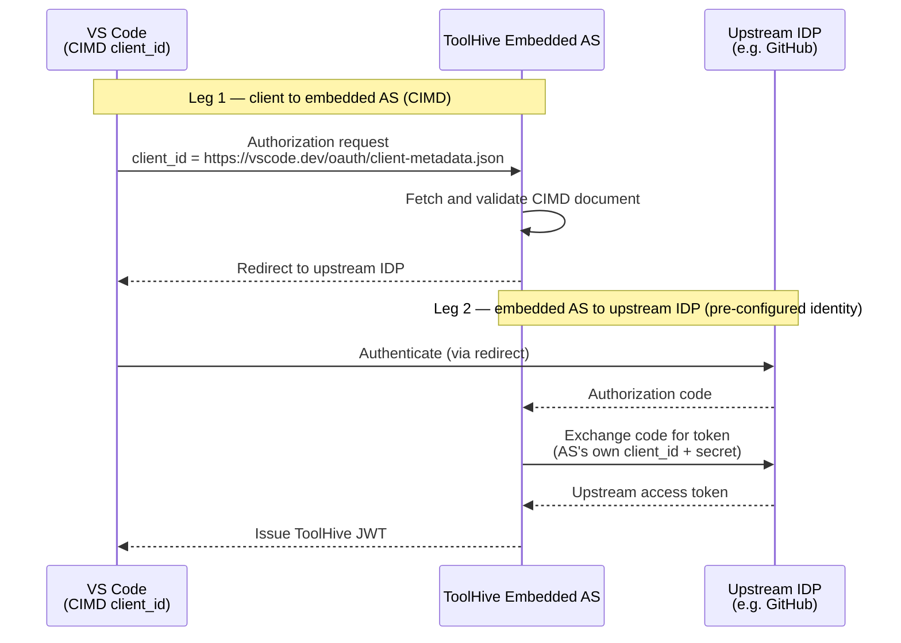

Client ID Metadata Documents (CIMD) are defined in
[draft-ietf-oauth-client-id-metadata-document](https://www.ietf.org/archive/id/draft-ietf-oauth-client-id-metadata-document-06.txt).
Instead of registering an OAuth application in advance to obtain an opaque
`client_id` string, a client presents an HTTPS URL as its `client_id`. The
authorization server fetches the document at that URL and uses it to resolve the
client's metadata on the fly. The
[MCP authorization specification (2025-11-25)](https://modelcontextprotocol.io/specification/2025-11-25/basic/authorization)
designates CIMD as the preferred client registration mechanism for clients and
servers that do not have a prior relationship.

CIMD eliminates the manual app-registration step on both sides of an OAuth
interaction. A client that hosts a stable metadata document at a public HTTPS
URL can interact with any authorization server that supports CIMD without
pre-registration, and an authorization server that supports CIMD can accept new
clients without requiring them to call a registration endpoint first.

## How ToolHive uses CIMD

ToolHive supports CIMD in two independent directions: as a client connecting to
remote MCP servers, and as a server accepting connections from MCP clients such
as VS Code or Claude Code.

### ToolHive as a CIMD client

When you run `thv run` against a remote MCP server that requires OAuth
authentication, ToolHive discovers the server's authorization server and checks
whether it advertises CIMD support via the
`client_id_metadata_document_supported` field in its OAuth discovery metadata
(RFC 8414). If it does, ToolHive presents
`https://toolhive.dev/oauth/client-metadata.json` as its `client_id` instead of
calling the Dynamic Client Registration (DCR) endpoint.

ToolHive follows this priority order when authenticating to a remote server:

1. **Stored credentials** — if a previous session left a cached refresh token or
   DCR `client_id`, those are used directly.
2. **CIMD** — if the remote authorization server advertises
   `client_id_metadata_document_supported: true` and no credentials are stored,
   ToolHive presents its CIMD URL.
3. **DCR** — if the remote authorization server does not support CIMD, ToolHive
   falls back to RFC 7591 Dynamic Client Registration.

If the remote authorization server advertises CIMD support but rejects the CIMD
`client_id` (for example, because the server is still rolling out support),
ToolHive automatically retries using DCR.

:::tip

Linear's MCP server (`https://mcp.linear.app/mcp`) advertises
`client_id_metadata_document_supported: true`. When you connect to it with
`thv run`, ToolHive uses its CIMD URL automatically and no OAuth app
pre-registration on the Linear side is required.

:::

### ToolHive as a CIMD server (embedded AS)

The ToolHive embedded authorization server can accept HTTPS URLs as `client_id`
values from MCP clients. When CIMD is enabled on the embedded AS, a client such
as VS Code presents `https://vscode.dev/oauth/client-metadata.json` as its
`client_id`. The embedded AS fetches that document, validates it, and uses the
declared metadata (redirect URIs, grant types, scopes) to authorize the client
without any prior DCR call.

When CIMD is disabled (the default), the embedded AS only accepts `client_id`
values that were issued through DCR. Enabling CIMD adds a second lookup path
alongside DCR; existing DCR-registered clients continue to work.

:::note

The embedded authorization server is available only for Kubernetes deployments
using the ToolHive Operator. See
[Enable CIMD on the embedded authorization server](../guides-k8s/cimd-embedded-as.mdx)
for setup instructions.

:::

## Two-layer architecture

When the embedded AS is deployed and CIMD is enabled, the OAuth flow involves
two independent legs. The client's CIMD identity is used only within the
embedded AS. The embedded AS uses its own pre-configured identity when talking
to the upstream identity provider.

The upstream IDP never sees the client's CIMD URL. The embedded AS uses its own
pre-configured `client_id` and `client_secret` (or DCR-obtained credentials)
when talking to the upstream IDP. The two OAuth legs are completely independent.

## Security model

### Document validation

When the embedded AS receives a CIMD `client_id`, it fetches the document and
enforces the following rules:

- The URL must use `https`. Loopback `http://localhost` is accepted only in
  development and test environments.
- The `client_id` field inside the fetched document must exactly match the URL
  used to fetch it. No normalization is applied — allowing normalization would
  permit subtle spoofing attacks where a document at URL A claims the identity
  of URL B.
- The document must declare at least one `redirect_uri`, and all redirect URIs
  must pass strict validation (RFC 8252).
- Symmetric shared-secret `token_endpoint_auth_method` values
  (`client_secret_post`, `client_secret_basic`, `client_secret_jwt`) are
  forbidden. CIMD clients have no pre-shared secret by definition.
- `grant_types` must be a subset of `[authorization_code, refresh_token]` and
  must include `authorization_code`.
- `response_types` must be a subset of `[code]`.
- If the embedded AS has a restricted `scopes_supported` list, the document's
  declared scopes must be a subset of it.

### SSRF protection

The HTTP client used to fetch CIMD documents includes SSRF protection:

- Keep-alive connections are disabled so the IP check runs on every request.
- DNS resolution is performed first and the resulting IP is checked against
  private and special-use ranges (RFC 1918). Loopback addresses are allowed for
  development use only.
- Redirects are not followed. Per the CIMD specification, the authorization
  server must not automatically follow redirects when retrieving a client
  metadata document.
- The fetch timeout is five seconds and the response body is capped at 10 KB.

### Caching

To avoid fetching the CIMD document on every request, the embedded AS caches
documents in an LRU cache. Two parameters control the cache:

| Parameter          | Default | Description                                                                                                                          |
| ------------------ | ------- | ------------------------------------------------------------------------------------------------------------------------------------ |
| `cacheMaxSize`     | `256`   | Maximum number of documents held in the cache. When full, the least-recently-used entry is evicted.                                  |
| `cacheFallbackTtl` | `5m`    | Fixed TTL applied to every cached entry. Cache-Control header parsing is not yet implemented; all entries use this value regardless. |

If a fetch fails (network error, invalid document, policy violation), the
request is rejected and the failure is not cached.

## Limitations

- **Cache-Control header parsing is not yet implemented.** All cached CIMD
  documents use the `cacheFallbackTtl` value regardless of the `Cache-Control`
  header in the response. This means a document that declares a short max-age is
  still cached for `cacheFallbackTtl`.
- **Kubernetes only for the embedded AS.** CIMD support on the embedded AS is
  configured via the `MCPExternalAuthConfig` CRD and is not available for
  standalone `thv run` deployments.

## Related information

- [Enable CIMD on the embedded authorization server](../guides-k8s/cimd-embedded-as.mdx)
  — step-by-step Kubernetes setup
- [Embedded authorization server](./embedded-auth-server.mdx) — conceptual
  overview of the embedded AS, including DCR and token forwarding
- [Authentication and authorization](./auth-framework.mdx) — the overall
  authentication framework
