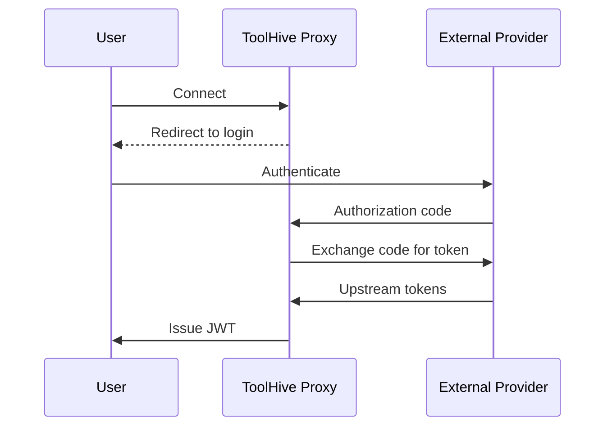
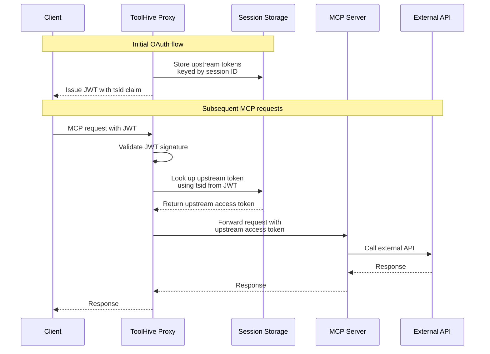
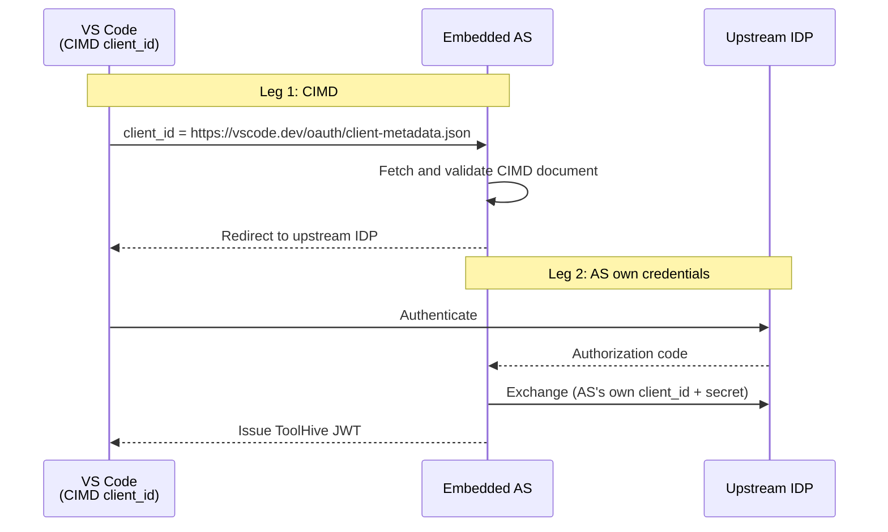

The embedded authorization server is an OAuth 2.0 authorization server that runs
in-process within the ToolHive proxy. It solves a specific problem: how to
authenticate MCP server requests to external APIs (like GitHub, Google
Workspace, or Atlassian) where no federation relationship exists between your
identity provider and that external service.

Without the embedded auth server, every MCP client would need to register its
own OAuth application with each external provider, manage redirect URIs, and
handle token acquisition separately. The embedded auth server centralizes this:
it handles the full OAuth web flow against the external provider on behalf of
clients, stores the resulting tokens, and issues its own JWTs that clients use
for subsequent requests.

:::note

The embedded authorization server is currently available only for Kubernetes
deployments using the ToolHive Operator.

:::

## When to use the embedded authorization server

Use the embedded authorization server when your MCP servers call external APIs
on behalf of individual users and no federation relationship exists between your
identity provider and those services - for example, GitHub, Google Workspace, or
Atlassian. If your backend accepts static credentials, or trusts the same (or a
federated) IdP as your clients, a different backend pattern is a better fit. See
[Choosing the right backend authentication pattern](./backend-auth.mdx#choosing-the-right-backend-authentication-pattern)
for the full comparison across all four patterns.

## How the OAuth flow works

From the client's perspective, the embedded authorization server provides a
standard OAuth 2.0 experience:

1. The client identifies itself using one of two mechanisms, with no manual
   registration in ToolHive required:
   - **Client ID Metadata Document (CIMD):** If CIMD is enabled on the embedded
     AS and the client supports it (for example, VS Code), the client presents
     its public HTTPS metadata URL as its `client_id`. The embedded AS fetches
     and validates the document.
   - **Dynamic Client Registration (DCR, RFC 7591):** The client calls
     `/oauth/register` to receive a `client_id` dynamically.
2. The client is directed to the ToolHive authorization endpoint.
3. ToolHive redirects the client to the upstream identity provider for
   authentication (for example, signing in with GitHub or Atlassian).
4. ToolHive exchanges the authorization code for upstream tokens and issues its
   own JWT to the client, signed with keys you configure.
5. The client includes this JWT as a `Bearer` token in the `Authorization`
   header on subsequent requests.



Behind the scenes, ToolHive stores the upstream tokens in session storage and
uses them to authenticate MCP server requests to external APIs. The client only
manages a single ToolHive-issued JWT.

## Token storage and forwarding

When the OAuth flow completes, the embedded auth server generates a unique
session ID and stores the upstream tokens (access token, refresh token, and ID
token from the external provider) keyed by this ID in session storage. The JWT
issued to the client contains a `tsid` (Token Session ID) claim that references
this session.

When a client makes an MCP request with this JWT:

1. The ToolHive proxy validates the JWT signature and extracts the `tsid` claim.
2. It retrieves the upstream tokens from session storage using the `tsid`.
3. The proxy replaces the `Authorization` header with the upstream access token.
4. The request is forwarded to the MCP server with the external provider's
   token.



MCP servers receive the upstream access token in the `Authorization: Bearer`
header. They don't need to implement custom authentication logic or manage
secrets.

If the backend MCP server is public and you only want client-side
authentication, set `disableUpstreamTokenInjection: true` on the embedded auth
server config. In that mode the JWT is still validated, but the proxy strips the
client's credential headers (`Authorization`, `Cookie`, and
`Proxy-Authorization`) instead of swapping them for an upstream token, so the
backend receives an unauthenticated request.

## Automatic token refresh

Upstream access tokens expire independently of the ToolHive JWT lifespan. When
the stored upstream access token has expired, ToolHive automatically refreshes
it using the stored refresh token before forwarding the request. Your MCP
session continues without re-authentication.

If the refresh token is also expired or has been revoked by the upstream
provider, ToolHive returns a `401` response, prompting re-authentication through
the OAuth flow.

## Key characteristics

- **In-process execution:** The authorization server runs within the ToolHive
  proxy with no separate infrastructure or sidecar containers.
- **Client ID Metadata Document (CIMD):** When enabled, accepts HTTPS URLs as
  `client_id` values and resolves client metadata on demand. Clients that
  support CIMD (such as VS Code) use it automatically.
- **Dynamic Client Registration (DCR):** Supports OAuth 2.0 DCR (RFC 7591) as a
  fallback for clients that do not support CIMD. MCP clients register
  automatically with no manual configuration in ToolHive.
- **Direct upstream redirect:** Redirects clients directly to the upstream
  provider for authentication (for example, GitHub or Atlassian).
- **Configurable signing keys:** JWTs are signed with keys you provide,
  supporting key rotation for zero-downtime updates.
- **Flexible upstream providers:** Supports OIDC providers (with automatic
  endpoint discovery) and plain OAuth 2.0 providers (with explicit endpoint
  configuration).
- **Configurable token lifespans:** Access tokens, refresh tokens, and
  authorization codes have configurable durations with sensible defaults.

## Client ID Metadata Document (CIMD)

DCR requires every client to register before its first authorization request.
Some MCP clients, including recent VS Code builds, can instead present an HTTPS
URL that hosts a Client ID Metadata Document (CIMD), letting the authorization
server resolve client metadata on demand without a prior registration step. CIMD
is the MCP specification's preferred client registration mechanism; DCR is the
backward-compatibility fallback for clients that don't support it.

For the configuration steps, cache settings, and the document validation rules
the embedded AS enforces, see
[Enable CIMD for zero-registration clients](../guides-k8s/embedded-auth-server-k8s.mdx#enable-cimd-for-zero-registration-clients).

### Two-layer architecture

The client's CIMD identity is used only within the embedded AS. The embedded AS
uses its own pre-configured upstream credentials when redirecting to the
upstream identity provider.



The upstream IDP never sees the client's CIMD URL. This means you must still
configure an upstream client ID and secret for the embedded AS regardless of
whether clients use CIMD or DCR.

## Baseline scopes for DCR clients

Some MCP clients (for example, Claude Code) register via DCR with a narrowed
`scope` value, then request a wider set of scopes at `/oauth/authorize`. By
default, the embedded authorization server rejects those requests with
`invalid_scope` because the registered client's scope set does not include the
scopes being requested. `baselineClientScopes` solves this by merging a fixed
set of scopes into every DCR-registered client's scope set, regardless of what
it originally registered with.

For the exact defaults, the `scopesSupported` interaction, and guidance on
keeping the baseline narrow, see
[Enable baseline scopes for DCR clients](../guides-k8s/embedded-auth-server-k8s.mdx#enable-baseline-scopes-for-dcr-clients).

## Session storage

By default, session storage is in-memory. Upstream tokens are lost when pods
restart, requiring users to re-authenticate.

For production deployments, configure Redis Sentinel as the storage backend for
persistent, highly available session storage. See
[Configure session storage](../guides-k8s/embedded-auth-server-k8s.mdx#configure-session-storage)
for a quick setup, or the full
[Redis Sentinel session storage](../guides-k8s/redis-session-storage.mdx) guide
for an end-to-end walkthrough.

## Configuring the embedded auth server with `authServerRef`

On `MCPServer` and `MCPRemoteProxy` resources, use the `authServerRef` field to
reference an `MCPExternalAuthConfig` resource that defines the embedded auth
server. `VirtualMCPServer` resources use an inline `authServerConfig` block
instead.

```yaml
spec:
  authServerRef:
    kind: MCPExternalAuthConfig
    name: my-embedded-auth-server
```

The `authServerRef` field uses a `TypedLocalObjectReference`, so you must
specify both `kind: MCPExternalAuthConfig` and the `name` of the resource.

For setup instructions, see
[Set up the embedded authorization server in Kubernetes](../guides-k8s/embedded-auth-server-k8s.mdx).
For the combined auth pattern with AWS STS, see
[Combine embedded auth with AWS STS](../integrations/aws-sts.mdx#combine-embedded-auth-with-aws-sts).

## The issuer must be a bare host

The embedded auth server's OAuth endpoints are always served at the host root,
regardless of any path in `issuer`. This also affects the default callback URL
for upstream providers. For the exact endpoints, the failure mode when this is
misconfigured, and how to set `redirectUri` correctly, see
[Keep issuer path-free](../guides-k8s/embedded-auth-server-k8s.mdx#step-4-create-the-mcpexternalauthconfig-resource).

## MCPServer vs. VirtualMCPServer

The embedded auth server is available on both `MCPServer` and `VirtualMCPServer`
resources, with some differences:

|                        | MCPServer                                                                  | VirtualMCPServer                                                               |
| ---------------------- | -------------------------------------------------------------------------- | ------------------------------------------------------------------------------ |
| Configuration location | `authServerRef` referencing a separate `MCPExternalAuthConfig` resource    | Inline `authServerConfig` block on the resource                                |
| Upstream providers     | Single upstream provider                                                   | Multiple upstream providers with sequential authorization chaining             |
| Token forwarding       | Automatic (single provider, single backend)                                | Explicit `upstreamInject` or `tokenExchange` config maps providers to backends |
| Combined auth          | `authServerRef` for incoming and `externalAuthConfigRef` for outgoing auth | Separate incoming and outgoing auth configuration                              |

For single-backend deployments on MCPServer, the embedded auth server
automatically swaps the token for each request. For vMCP with multiple backends,
you configure which upstream provider's token goes to which backend using
[upstream token injection](../guides-vmcp/embedded-auth-server-vmcp.mdx#forward-a-stored-upstream-token-upstream-injection)
or
[token exchange with upstream tokens](../guides-vmcp/embedded-auth-server-vmcp.mdx#exchange-a-stored-upstream-token-token-exchange).

## Next steps

- [Set up the embedded authorization server in Kubernetes](../guides-k8s/embedded-auth-server-k8s.mdx)
  for step-by-step setup of MCPServer resources in Kubernetes
- [Configure the vMCP embedded authorization server](../guides-vmcp/embedded-auth-server-vmcp.mdx)
  for multiple upstream providers on a VirtualMCPServer
- [Deploy Redis Sentinel](../guides-k8s/redis-session-storage.mdx) for
  production session storage

## Related information

- [Authentication and authorization](./auth-framework.mdx) covers client-to-MCP
  authentication concepts and the overall framework
- [Backend authentication](./backend-auth.mdx) covers all backend authentication
  patterns, including when to choose the embedded auth server
- [Cedar policies](./cedar-policies.mdx) for authorization policy configuration
