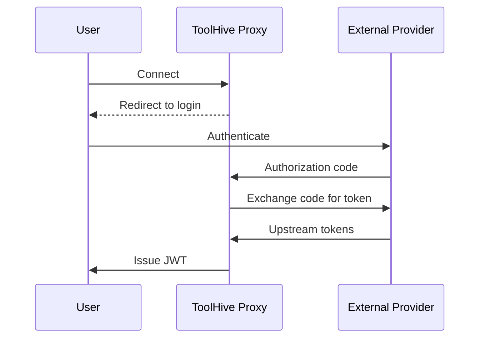
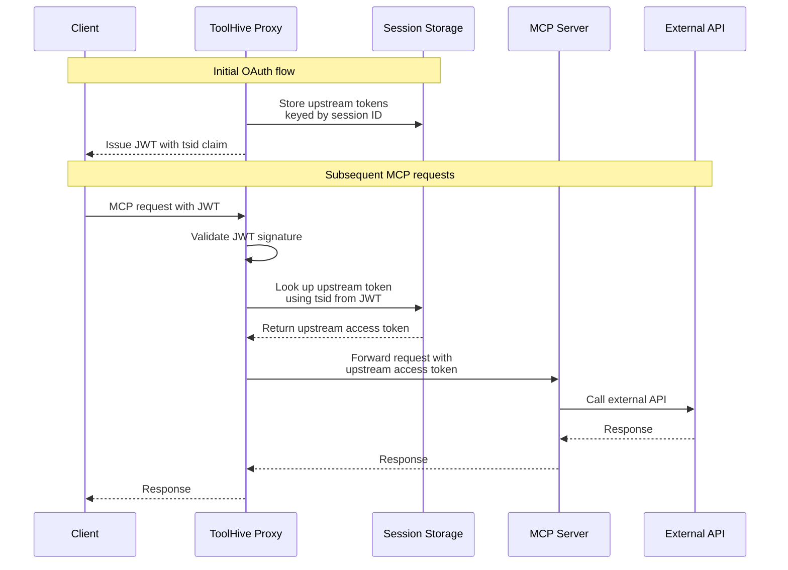

The embedded authorization server is an OAuth 2.0 authorization server that runs
in-process within the ToolHive proxy. It solves a specific problem: how to
authenticate MCP server requests to external APIs—like GitHub, Google Workspace,
or Atlassian—where no federation relationship exists between your identity
provider and that external service.

Without the embedded auth server, every MCP client would need to register its
own OAuth application with each external provider, manage redirect URIs, and
handle token acquisition separately. The embedded auth server centralizes this:
it handles the full OAuth web flow against the external provider on behalf of
clients, stores the resulting tokens, and issues its own JWTs that clients use
for subsequent requests.

:::note

The embedded authorization server is currently available only for Kubernetes
deployments using the ToolHive Operator.

:::

## When to use the embedded authorization server

Use the embedded authorization server when your MCP servers call external APIs
on behalf of individual users and no federation relationship exists between your
identity provider and those services.

| Scenario                                                            | Pattern to use                                                                         |
| ------------------------------------------------------------------- | -------------------------------------------------------------------------------------- |
| Backend only accepts API keys or static credentials                 | [Static credentials](./backend-auth.mdx#static-credentials-and-api-keys)               |
| Backend trusts the same IdP as your clients                         | [Token exchange (same IdP)](./backend-auth.mdx#same-idp-with-token-exchange)           |
| Backend trusts a federated IdP (for example, Google Cloud, AWS)     | [Token exchange (federation)](./backend-auth.mdx#federated-idps-with-identity-mapping) |
| Backend is an external API with no federation (for example, GitHub) | **Embedded authorization server** (this page)                                          |

## How the OAuth flow works

From the client's perspective, the embedded authorization server provides a
standard OAuth 2.0 experience:

1. If the client is not yet registered, it registers via Dynamic Client
   Registration (DCR, RFC 7591), receiving a `client_id` and `client_secret`. No
   manual client registration in ToolHive is required.
2. The client is directed to the ToolHive authorization endpoint.
3. ToolHive redirects the client to the upstream identity provider for
   authentication (for example, signing in with GitHub or Atlassian).
4. ToolHive exchanges the authorization code for upstream tokens and issues its
   own JWT to the client, signed with keys you configure.
5. The client includes this JWT as a `Bearer` token in the `Authorization`
   header on subsequent requests.



Behind the scenes, ToolHive stores the upstream tokens in session storage and
uses them to authenticate MCP server requests to external APIs. The client only
manages a single ToolHive-issued JWT.

## Token storage and forwarding

When the OAuth flow completes, the embedded auth server generates a unique
session ID and stores the upstream tokens (access token, refresh token, and ID
token from the external provider) keyed by this ID in session storage. The JWT
issued to the client contains a `tsid` (Token Session ID) claim that references
this session.

When a client makes an MCP request with this JWT:

1. The ToolHive proxy validates the JWT signature and extracts the `tsid` claim.
2. It retrieves the upstream tokens from session storage using the `tsid`.
3. The proxy replaces the `Authorization` header with the upstream access token.
4. The request is forwarded to the MCP server with the external provider's
   token.



MCP servers receive the upstream access token in the `Authorization: Bearer`
header—they don't need to implement custom authentication logic or manage
secrets.

## Automatic token refresh

Upstream access tokens expire independently of the ToolHive JWT lifespan. When
the stored upstream access token has expired, ToolHive automatically refreshes
it using the stored refresh token before forwarding the request. Your MCP
session continues without re-authentication.

If the refresh token is also expired or has been revoked by the upstream
provider, ToolHive returns a `401` response, prompting re-authentication through
the OAuth flow.

## Key characteristics

- **In-process execution:** The authorization server runs within the ToolHive
  proxy—no separate infrastructure or sidecar containers needed.
- **Dynamic Client Registration (DCR):** Supports OAuth 2.0 DCR (RFC 7591),
  allowing MCP clients to register automatically. No manual client registration
  in ToolHive is required.
- **Direct upstream redirect:** Redirects clients directly to the upstream
  provider for authentication (for example, GitHub or Atlassian).
- **Configurable signing keys:** JWTs are signed with keys you provide,
  supporting key rotation for zero-downtime updates.
- **Flexible upstream providers:** Supports OIDC providers (with automatic
  endpoint discovery) and plain OAuth 2.0 providers (with explicit endpoint
  configuration).
- **Configurable token lifespans:** Access tokens, refresh tokens, and
  authorization codes have configurable durations with sensible defaults.

## Session storage

By default, session storage is in-memory. Upstream tokens are lost when pods
restart, requiring users to re-authenticate.

For production deployments, configure Redis Sentinel as the storage backend for
persistent, highly available session storage. See
[Configure session storage](../guides-k8s/auth-k8s.mdx#configure-session-storage)
for a quick setup, or the full
[Redis Sentinel session storage](../guides-k8s/redis-session-storage.mdx) guide
for an end-to-end walkthrough.

## Configuring the embedded auth server with `authServerRef`

On `MCPServer` and `MCPRemoteProxy` resources, use the `authServerRef` field to
reference an `MCPExternalAuthConfig` resource that defines the embedded auth
server. This is the preferred configuration method because it keeps the embedded
auth server (incoming client authentication) separate from
`externalAuthConfigRef` (outgoing backend authentication such as AWS STS or
token exchange).

```yaml
spec:
  authServerRef:
    kind: MCPExternalAuthConfig
    name: my-embedded-auth-server
```

The `authServerRef` field uses a `TypedLocalObjectReference`, so you must
specify both `kind: MCPExternalAuthConfig` and the `name` of the resource.

When you only need the embedded auth server without an outgoing auth type, you
can use either `authServerRef` or `externalAuthConfigRef`. Both approaches work,
but `authServerRef` is preferred for consistency. When you need both incoming
and outgoing auth on the same resource, you must use `authServerRef` for the
embedded auth server so that `externalAuthConfigRef` remains available for the
outgoing auth configuration.

For setup instructions, see
[Set up embedded authorization server authentication](../guides-k8s/auth-k8s.mdx#set-up-embedded-authorization-server-authentication).
For the combined auth pattern with AWS STS, see
[Combine embedded auth with AWS STS](../integrations/aws-sts.mdx#combine-embedded-auth-with-aws-sts).

## MCPServer vs. VirtualMCPServer

The embedded auth server is available on both `MCPServer` and `VirtualMCPServer`
resources, with some differences:

|                        | MCPServer                                                                                                           | VirtualMCPServer                                                               |
| ---------------------- | ------------------------------------------------------------------------------------------------------------------- | ------------------------------------------------------------------------------ |
| Configuration location | `authServerRef` (preferred) or `externalAuthConfigRef` — both reference a separate `MCPExternalAuthConfig` resource | Inline `authServerConfig` block on the resource                                |
| Upstream providers     | Single upstream provider                                                                                            | Multiple upstream providers with sequential authorization chaining             |
| Token forwarding       | Automatic (single provider, single backend)                                                                         | Explicit `upstreamInject` or `tokenExchange` config maps providers to backends |
| Combined auth          | Supports `authServerRef` + `externalAuthConfigRef` on same resource                                                 | Not applicable (uses inline config)                                            |

For single-backend deployments on MCPServer, the embedded auth server
automatically swaps the token for each request. For vMCP with multiple backends,
you configure which upstream provider's token goes to which backend using
[upstream token injection](../guides-vmcp/authentication.mdx#upstream-token-injection)
or
[token exchange with upstream tokens](../guides-vmcp/authentication.mdx#token-exchange-with-upstream-tokens).

:::note

`VirtualMCPServer` uses an inline `authServerConfig` block, not `authServerRef`.
The `authServerRef` field is available only on `MCPServer` and `MCPRemoteProxy`
resources.

:::

## Next steps

- [Set up embedded authorization server authentication](../guides-k8s/auth-k8s.mdx#set-up-embedded-authorization-server-authentication)
  — step-by-step setup for MCPServer resources in Kubernetes
- [vMCP embedded authorization server](../guides-vmcp/authentication.mdx#embedded-authorization-server)
  — configuring multiple upstream providers on a VirtualMCPServer
- [Redis Sentinel session storage](../guides-k8s/redis-session-storage.mdx) —
  production session storage configuration

## Related information

- [Authentication and authorization](./auth-framework.mdx) — client-to-MCP
  authentication concepts and the overall framework
- [Backend authentication](./backend-auth.mdx) — all backend authentication
  patterns, including when to choose the embedded auth server
- [Cedar policies](./cedar-policies.mdx) — authorization policy configuration
