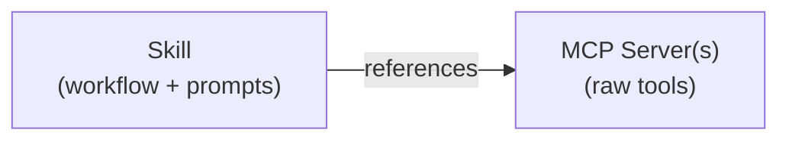

A **skill** is a reusable, versioned bundle of instructions, prompts, and
configuration that teaches an AI agent how to perform a specific task. If MCP
servers provide **tools** (the raw capabilities an agent can call), skills
provide the **knowledge** of when, why, and how to use those tools effectively.

Skills follow the [Agent Skills](https://agentskills.io/) specification, an open
standard supported by a growing number of AI coding agents including Claude
Code, GitHub Copilot, Cursor, OpenCode, and many others.

## When you would use skills

Consider these scenarios:

- **You maintain a shared MCP registry** and want teams to publish reusable
  prompt bundles alongside the MCP servers they connect to, so that other
  engineers can discover both the tooling and the expertise in one place.
- **You build internal developer tools** and want to package a "code review"
  workflow that combines multiple MCP server calls with domain-specific
  instructions, then distribute it through a central catalog.
- **You run a platform team** and want to curate a set of approved skills that
  your organization's AI agents can use, with clear versioning and status
  tracking.

## How skills relate to MCP servers

MCP servers expose tools; skills consume them. A skill might reference one or
more tools from one or more MCP servers, wrapping them in a higher-level
workflow with context-specific instructions.



When you publish skills to the ToolHive Registry for team-wide discovery, they
are stored under a separate extensions API path
(`/{registryName}/v0.1/x/dev.toolhive/skills`, where `{registryName}` is the
name of your registry). They are not intermixed with MCP server entries.

## Skill structure

A skill is a directory containing a `SKILL.md` file (required) plus optional
supporting files:

```text
my-skill/
├── SKILL.md          # Required: metadata + instructions
├── scripts/          # Optional: executable code
├── references/       # Optional: documentation
└── assets/           # Optional: templates, resources
```

The `SKILL.md` file contains YAML frontmatter with metadata followed by Markdown
instructions that the AI agent reads when the skill is activated.

### SKILL.md frontmatter

| Field           | Required | Description                                           |
| --------------- | -------- | ----------------------------------------------------- |
| `name`          | Yes      | Lowercase letters, numbers, and hyphens (2-64 chars). |
|                 |          | Must match the directory name.                        |
| `description`   | Yes      | What the skill does and when to use it (max 1024      |
|                 |          | chars)                                                |
| `version`       | No       | Semantic version (e.g., `1.0.0`)                      |
| `license`       | No       | SPDX license identifier (e.g., `Apache-2.0`)          |
| `allowed-tools` | No       | Space-delimited list of pre-approved tools            |
| `compatibility` | No       | Environment requirements (max 500 chars)              |
| `metadata`      | No       | Arbitrary key-value pairs                             |

Example:

```yaml title="SKILL.md"
---
name: code-review
description: >-
  Performs structured code reviews using best practices. Use when reviewing pull
  requests or code changes.
version: 1.0.0
license: Apache-2.0
---
```

For the complete format specification, see
[agentskills.io/specification](https://agentskills.io/specification).

### Naming conventions

- **Name**: Use kebab-case identifiers. For example, `code-review`,
  `deploy-checker`, `security-scan`. The name must match the parent directory
  name.
- **Version**: Use semantic versioning (e.g., `1.0.0`, `2.1.3`).

When publishing skills to the ToolHive Registry, additional fields apply:

- **Namespace**: Use reverse-DNS notation (e.g., `io.github.your-org`). This
  prevents naming collisions across organizations.
- **Status**: One of `ACTIVE`, `DEPRECATED`, or `ARCHIVED`.

### Package types

Skills can reference distribution packages in two formats:

- **OCI**: Container registry references with an identifier, digest, and media
  type
- **Git**: Repository references with a URL, ref, commit, and optional subfolder

## Versioning

The registry stores multiple versions of each skill and maintains a "latest"
pointer. When you publish a new version, the registry automatically updates the
latest pointer if the new version is newer than the current latest. Publishing
an older version does not change the latest pointer.

You can retrieve a specific version or request `latest` to get the most recent
one.

## How skills are discovered

AI agents discover skills by reading from their skills directories. When you
install a skill with the ToolHive CLI, the `SKILL.md` file is written to the
appropriate directory for your AI client. The agent loads the skill's `name` and
`description` at startup, and activates the full instructions when a task
matches.

Skills support two installation scopes:

- **User scope**: Available across all your projects (installed to your home
  directory)
- **Project scope**: Available only in a specific project (installed to the
  project directory)

## Distribution

Skills can be distributed as:

- **OCI artifacts**: Packaged as container registry artifacts for versioned
  distribution through registries like GitHub Container Registry
- **Git repositories**: Referenced by URL with optional branch/tag and subfolder
- **Registry entries**: Published to a ToolHive Registry server for centralized
  discovery and installation by name

## Next steps

- [Manage agent skills](../guides-cli/skills-management.mdx) with the ToolHive
  CLI
- [Manage skills in the registry](../guides-registry/skills.mdx) through the
  Registry server API
- [Agent Skills specification](https://agentskills.io/specification) for the
  complete format reference
