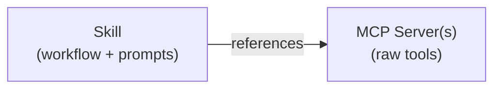

A **skill** is a reusable, versioned bundle of instructions, prompts, and
configuration that teaches an AI agent how to perform a specific task. If MCP
servers provide **tools** (the raw capabilities an agent can call), skills
provide the **knowledge** of when, why, and how to use those tools effectively.

## When you would use skills

Consider these scenarios:

- **You maintain a shared MCP registry** and want teams to publish reusable
  prompt bundles alongside the MCP servers they connect to, so that other
  engineers can discover both the tooling and the expertise in one place.
- **You build internal developer tools** and want to package a "code review"
  workflow that combines multiple MCP server calls with domain-specific
  instructions, then distribute it through a central catalog.
- **You run a platform team** and want to curate a set of approved skills that
  your organization's AI agents can use, with clear versioning and status
  tracking.

## How skills relate to MCP servers

MCP servers expose tools; skills consume them. A skill might reference one or
more tools from one or more MCP servers, wrapping them in a higher-level
workflow with context-specific instructions.

Skills are stored in the same Registry server instance as MCP servers, but under
a separate extensions API path (`/{registryName}/v0.1/x/dev.toolhive/skills`,
where `{registryName}` is the name of your registry). They are not intermixed
with MCP server entries.

## Skill structure

Each skill has the following core fields:

| Field         | Required | Description                                                         |
| ------------- | -------- | ------------------------------------------------------------------- |
| `namespace`   | Yes      | Reverse-DNS identifier (e.g., `io.github.acme`)                     |
| `name`        | Yes      | Skill identifier in kebab-case (e.g., `code-review`)                |
| `description` | Yes      | Human-readable summary of what the skill does                       |
| `version`     | Yes      | Semantic version or commit hash (e.g., `1.0.0`)                     |
| `status`      | No       | One of `ACTIVE`, `DEPRECATED`, or `ARCHIVED` (defaults to `ACTIVE`) |
| `title`       | No       | Human-friendly display name                                         |
| `license`     | No       | SPDX license identifier (e.g., `Apache-2.0`)                        |

Skills also support optional fields for packages (OCI or Git references), icons,
repository metadata, allowed tools, compatibility requirements, and arbitrary
metadata.

### Naming conventions

- **Namespace**: Use reverse-DNS notation. For example, `io.github.your-org` or
  `com.example.team`. This prevents naming collisions across organizations.
- **Name**: Use kebab-case identifiers. For example, `code-review`,
  `deploy-checker`, `security-scan`.
- **Version**: Use semantic versioning (e.g., `1.0.0`, `2.1.3`) or a commit
  hash. The registry tracks a "latest" pointer per namespace/name pair.

**Valid examples:**

- `io.github.acme/code-review` version `1.0.0`
- `com.example.platform/deploy-checker` version `0.3.1`

**Invalid examples:**

- `acme/Code Review` (namespace must be reverse-DNS, name must be kebab-case)
- Empty namespace or name (both are required)

### Package types

Skills can reference distribution packages in two formats:

- **OCI**: Container registry references with an identifier, digest, and media
  type
- **Git**: Repository references with a URL, ref, commit, and optional subfolder

## Versioning

The registry stores multiple versions of each skill and maintains a "latest"
pointer. When you publish a new version, the registry automatically updates the
latest pointer if the new version is newer than the current latest. Publishing
an older version does not change the latest pointer.

You can retrieve a specific version or request `latest` to get the most recent
one.

## Current status and what's next

The skills API is available as an extension endpoint on the Registry server
(`/v0.1/x/dev.toolhive/skills`). You can publish, list, search, retrieve, and
delete skills through this API.

Skill installation via agent clients (such as the ToolHive CLI or IDE
extensions) is planned for a future release. For now, the registry serves as a
discovery and distribution layer where you can browse available skills and
retrieve their package references.

## Next steps

- [Manage skills](../guides-registry/skills.mdx) through the Registry server API
- [Registry server introduction](../guides-registry/intro.mdx) for an overview
  of the Registry server
