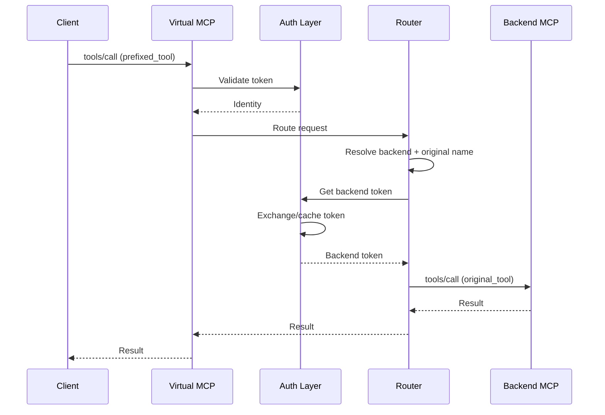
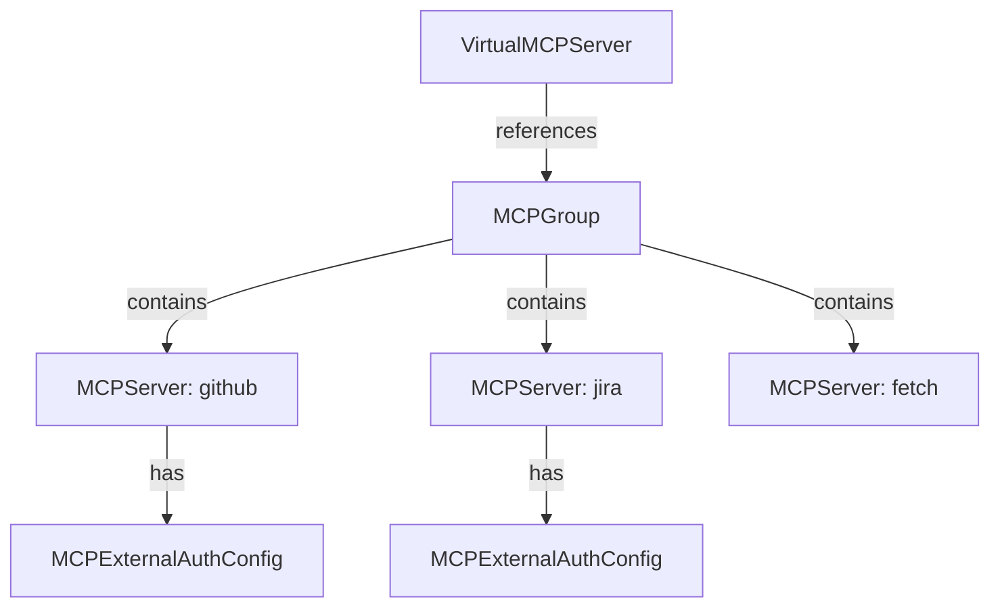

This document explains the architecture behind Virtual MCP Server, helping you
understand how it aggregates multiple MCP servers and routes requests.

## Overview

Virtual MCP Server acts as an aggregation proxy between MCP clients and multiple
backend MCP servers. Instead of clients connecting directly to each backend,
they connect to a single Virtual MCP endpoint that presents a unified view of
all available tools.

## Core components

### Aggregator

The aggregator discovers backend MCP servers from the referenced MCPGroup and
merges their capabilities:

- Queries each backend for available tools, resources, and prompts
- Applies conflict resolution strategies for naming collisions
- Applies tool filtering and overrides
- Builds a unified capability list for clients

### Router

The router directs incoming requests to the appropriate backend:

- Maintains a routing table mapping tool names to backends
- Handles capability name translation (resolved name to original name)
- Supports session affinity for stateful backends

### Authentication layer

Implements the two-boundary authentication model:

- **Incoming auth**: Validates client tokens using OIDC or Kubernetes tokens
- **Outgoing auth**: Exchanges tokens or injects credentials for backend APIs
- **Token cache**: Reduces latency by caching exchanged tokens

### Composer

Executes composite tool workflows:

- DAG-based step execution with parallel processing
- Template expansion for dynamic arguments
- Elicitation handling for user interaction
- Error handling and retry logic

## Request flow

## Backend discovery

Virtual MCP discovers backends through the Kubernetes operator:

1. VirtualMCPServer references an MCPGroup
2. Operator queries MCPServers with matching `groupRef`
3. Backend URLs and auth configs are extracted
4. Capabilities are queried from each healthy backend

## Capability merging

When aggregating capabilities, Virtual MCP:

1. Queries all healthy backends in parallel
2. Collects tools, resources, and prompts from each
3. Applies per-workload filters (include lists)
4. Applies per-workload overrides (renames, descriptions)
5. Applies conflict resolution strategy
6. Builds final routing table

The routing table maps each resolved capability name to:

- Backend target (URL, transport type)
- Original capability name (for forwarding)
- Authentication strategy and metadata

## Session management

Virtual MCP maintains per-user sessions with:

- Lazy capability discovery (capabilities queried on first request)
- Session-scoped routing tables
- Configurable session TTL (default: 30 minutes)
- Automatic cleanup of expired sessions

## Health monitoring

Virtual MCP monitors backend health:

- Periodic health checks (configurable interval)
- Unhealthy threshold before marking backend unavailable
- Circuit breaker to prevent cascading failures
- Automatic recovery when backends return to healthy state

## Related information

- [Introduction to Virtual MCP](../guides-vmcp/intro.mdx)
- [Deploy Virtual MCP Server](../guides-vmcp/quickstart.mdx)
- [Authentication](../guides-vmcp/authentication.mdx)
