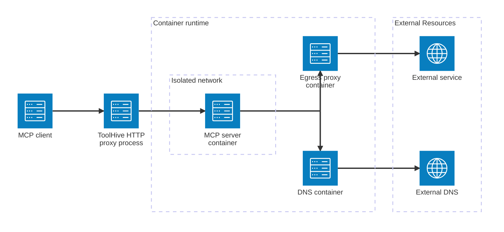
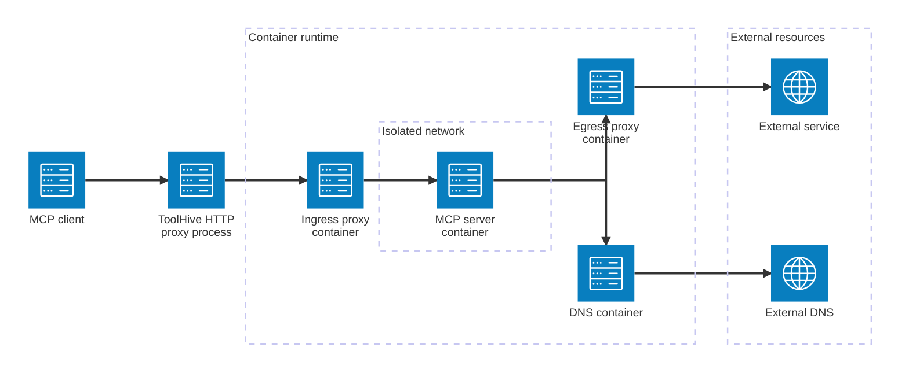

import Tabs from '@theme/Tabs';
import TabItem from '@theme/TabItem';

ToolHive includes a permission system that lets you control an MCP server's
access to your host's file system and to network resources. This is crucial for
maintaining security and ensuring that MCP servers operate within defined
boundaries.

This guide shows you how to create and apply custom permission profiles for MCP
servers, including built-in profiles and examples of common use cases.

## Understanding permission profiles

Permissions are defined using permission profiles. These profiles specify:

- Host file system access (read and/or write access to specific paths)
- Network access rules (outbound connections from the MCP server)

:::note

Since the MCP server runs in a container, it can't access the host file system
by default. File system access is relative to the container's file system.

When you run a server with the `--volume` flag to mount a local path, ToolHive
adds the path to the MCP server's permission profile automatically.

:::

Profiles include the following sections:

- `read`: List of file system paths that the MCP server can read, relative to
  the container's file system.
- `write`: List of file system paths that the MCP server can write to (this also
  implies read access).
- `network`: Network access rules for outbound connections (see
  [Network isolation](#network-isolation) for details):
  - `outbound`: Outbound network access rules, which include:
    - `insecure_allow_all`: If set to `true`, allows unrestricted outbound
      network access. This isn't recommended for production use.
    - `allow_host`: List of allowed hostnames or IP addresses for outbound
      connections. To allow all subdomains of a domain, prefix the domain with a
      period (e.g., `.github.com` allows any subdomain of `github.com`).
      Wildcards are not supported.
    - `allow_port`: List of allowed ports for outbound connections.
    - `allow_transport`: List of allowed transport protocols (e.g., `tcp`,
      `udp`).

## Default permissions in the ToolHive registry

ToolHive includes default least-privilege permissions for MCP servers in the
built-in registry. These defaults are designed to balance functionality and
security, but you should review them to make sure they meet your specific
requirements.

View these permissions using the following command:

```bash
thv registry info <server-name>
```

In the output, look for the "Permissions" section:

```test
Permissions:
  Read:
    - /data
  Write:
    - /tmp
  Network:
    Allow Transport: tcp
    Allow Host: .google.com
    Allow Port: 443
```

This example shows that the MCP server has read access to `/data`, read/write
access to `/tmp`, and can make outbound TCP connections to `*.google.com` (note
the leading `.` which enables subdomain matching) on port 443.

Always verify the default permissions and override them with a custom profile if
needed to meet your security policies.

:::tip

Add `--format json` to the
[`thv registry info`](../reference/cli/thv_registry_info.md) command to get the
output in JSON format for easier customization. Use the contents of the
`permissions` section as a starting point for creating a custom profile.

:::

## Built-in profiles

ToolHive includes two built-in profiles that you can use without creating a
custom file:

- The `network` profile permits all outbound network access. It's the default
  profile applied to MCP servers when you run a custom server without the
  `--permission-profile` flag.

  :::important

  This profile is useful for development and testing but isn't recommended for
  production use since it doesn't restrict network destinations. If possible,
  create a custom profile that specifies the allowed hosts and ports.

  :::

- The `none` profile provides no network access. It's useful for MCP servers
  that don't require any external connectivity. File system access is limited to
  paths you explicitly mount using the `--volume` flag.

## Create a custom permission profile

Create a JSON file with your desired permissions, like `~/custom-profile.json`.
For example:

```json
{
  "read": ["/example/path1", "/example/path2"],
  "write": ["/example/path3"],
  "network": {
    "outbound": {
      "insecure_allow_all": false,
      "allow_transport": ["tcp", "udp"],
      "allow_host": ["localhost", ".google.com"],
      "allow_port": [80, 443]
    }
  }
}
```

This profile:

- Allows read-only access to `/example/path1` and `/example/path2`
- Allows read and write access to `/example/path3` (note that the `write`
  setting also implies read access)
- Allows outbound TCP or UDP connections to `localhost` and `google.com`
  (including subdomains) on ports 80 and 443

## Apply a permission profile

### Using a built-in profile

To run an MCP server with a built-in profile:

```bash
# This is equivalent to running a server without the --permission-profile flag
thv run --permission-profile network <server-name>
```

or

```bash
thv run --permission-profile none <server-name>
```

Add the `--isolate-network` flag to enforce network restrictions:

```bash
thv run --isolate-network --permission-profile none <server-name>
```

### Using a custom profile file

To run an MCP server with your custom profile:

```bash
thv run --isolate-network --permission-profile </path/to/custom-profile.json> <server-name>
```

## Network isolation

To enforce the network access rules defined in the registry or your custom
permission profile, use the `--isolate-network` flag when running the MCP
server:

```bash
thv run --isolate-network [--permission-profile </path/to/custom-profile.json>] <server-name>
```

When you enable network isolation, ToolHive creates a secure network
architecture around your MCP server. This architecture includes several
components that work together to control network access.

### Network architecture components

Along with the main MCP server container, ToolHive launches additional
containers to manage network traffic:

- An egress proxy container that filters outgoing network traffic
- A DNS container that provides controlled domain name resolution
- An ingress proxy container that handles incoming requests (only for MCP
  servers using SSE or Streamable HTTP transport; stdio MCP servers don't need
  this since they don't expose ports)

### Network topology

ToolHive creates two separate networks in the container runtime:

- A shared external network (`toolhive-external`) that connects to your host's
  network
- An internal network (`toolhive-<server-name>-internal`) for each MCP server
  that isolates it from external access

The MCP server container only connects to the internal network, while the proxy
and DNS containers connect to both networks. This design ensures that all
network traffic flows through controlled points, allowing ToolHive to enforce
the access rules you specify in your permission profile.

The following diagrams show how network traffic flows through the isolation
architecture for different transport types:

<Tabs groupId='transport'>
<TabItem value='stdio' label='Transport: Standard Input/Output (stdio)' default>

For MCP servers using stdio transport, the ToolHive proxy process communicates
directly with the MCP server container through standard input and output. All
outbound network requests from the MCP server flow through the egress proxy and
DNS containers:



</TabItem>
<TabItem value='sse' label='Transport: SSE or Streamable HTTP'>

For MCP servers using SSE or Streamable HTTP transport, ToolHive includes an
additional ingress proxy container. This proxy handles incoming HTTP requests
and ensures the MCP server remains isolated from direct external access:



</TabItem>
</Tabs>

:::important

Network isolation supports HTTP and HTTPS protocols. If your MCP server needs to
use other protocols (like direct TCP connections for database access), you'll
need to run it without the `--isolate-network` flag and rely on the container's
built-in isolation instead.

:::

## Example: Restrict network access

The GitHub MCP server in the registry has a default profile that allows access
to `github.com`, but you might need to customize it for a self-hosted GitHub
Enterprise instance:

1. Create a file named `github-profile.json`:

   ```json
   {
     "network": {
       "outbound": {
         "insecure_allow_all": false,
         "allow_transport": ["tcp"],
         "allow_host": ["github.example.com"],
         "allow_port": [443]
       }
     }
   }
   ```

2. Run the GitHub MCP server with this profile:

   ```bash
   thv run --isolate-network --permission-profile ./github-profile.json --secret github,target=GITHUB_PERSONAL_ACCESS_TOKEN github
   ```

This restricts the GitHub MCP server to make HTTPS connections only to
`github.example.com`.

## Security best practices

When creating and using permission profiles:

- Use the `none` profile when possible (for MCP servers that don't require
  network or file access)
- Only grant necessary permissions
- Avoid enabling `network.outbound.insecure_allow_all`, as this allows
  unrestricted outbound network access
- Review and test custom profiles thoroughly
- Keep permission profiles in version control to track changes and share them
  with your team

## Related information

- [`thv run` command reference](../reference/cli/thv_run.md)
- [Run MCP servers](run-mcp-servers.mdx)

## Troubleshooting

<details>
<summary>File system access issues</summary>

If your MCP server can't access the file system as expected:

1. Verify that the path(s) in your profile are correct
2. Check that the permissions are set correctly (read/write)
3. Make sure the paths are accessible from within the container. You can execute
   a shell in the container to check (this assumes the container includes an
   interactive shell):

   ```bash
   docker exec -it <server-name> /bin/sh
   ```

4. Restart the server with the updated profile or a corrected volume mount

</details>

<details>
<summary>Network connectivity issues</summary>

If your MCP server can't connect to external services:

1. Verify that your profile allows the necessary hosts and ports
2. Check that the transport protocol (TCP/UDP) is allowed
3. Check the logs of the egress proxy container for any blocked requests:

   ```bash
   docker logs <mcp-server-name>-egress
   ```

   Look for messages indicating denied connections.

4. Try temporarily using the default `network` profile to confirm it's a
   permissions issue

</details>
