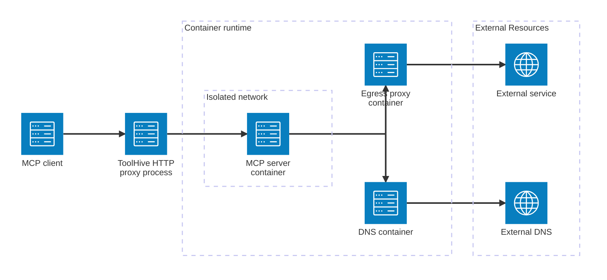
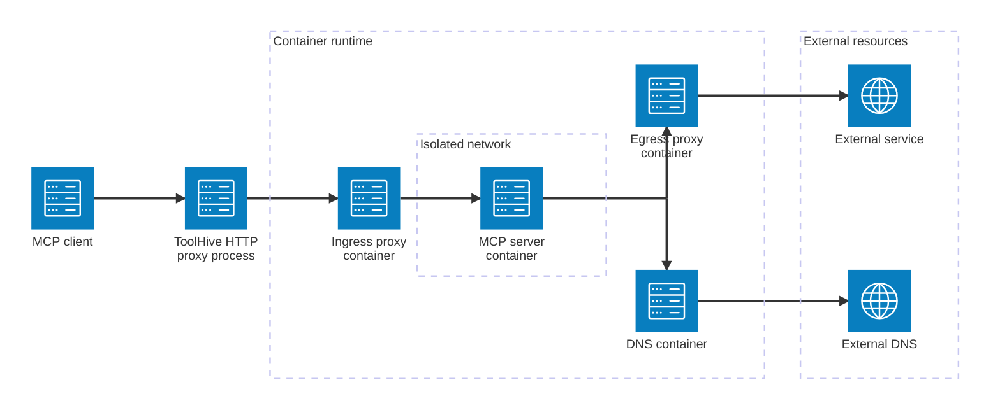

Most MCP servers require network access to function properly—for example, to
access APIs, download data, or communicate with other services. However,
malicious or misconfigured servers can also exfiltrate sensitive data or
download unwanted content.

When you run an MCP server in ToolHive, you can optionally enable _network
isolation_. This feature restricts the MCP server's network access to only the
resources you specify.

## Enable network isolation

To enforce network access rules, use the `--isolate-network` flag when running
the MCP server. Network rules can come from:

- The MCP server's default registry permissions
- A custom permission profile you create

```bash
thv run --isolate-network [--permission-profile </path/to/custom-profile.json>] <SERVER>
```

:::tip

You can combine file system and network permissions in the same permission
profile. For details on creating profiles that include both types of
permissions, see [custom permissions](./custom-permissions.mdx).

:::

When you enable network isolation, ToolHive creates a secure network
architecture around your MCP server that includes several components working
together to control network access.

### Network architecture components

Along with the main MCP server container, ToolHive launches additional
containers to manage network traffic:

- An egress proxy container that filters outgoing network traffic
- A DNS container that provides controlled domain name resolution
- An ingress proxy container that handles incoming requests (only for MCP
  servers using SSE or Streamable HTTP transport; stdio MCP servers don't need
  this since they don't expose ports)

### Network topology

ToolHive creates two separate networks in the container runtime:

- A shared external network (`toolhive-external`) that connects to your host's
  network
- An internal network (`toolhive-<SERVER_NAME>-internal`) for each MCP server
  that isolates it from external access

The MCP server container connects only to the internal network, while the proxy
and DNS containers connect to both networks. This design ensures that all
network traffic flows through controlled points, allowing ToolHive to enforce
the access rules you specify in your permission profile.

The following diagrams show how network traffic flows through the isolation
architecture for different transport types:

<Tabs groupId='transport'>
<TabItem value='stdio' label='Transport: Standard Input/Output (stdio)' default>

For MCP servers using stdio transport, the ToolHive proxy process communicates
directly with the MCP server container through standard input and output. All
outbound network requests from the MCP server flow through the egress proxy and
DNS containers:



</TabItem>
<TabItem value='sse' label='Transport: SSE or Streamable HTTP'>

For MCP servers using SSE or Streamable HTTP transport, ToolHive includes an
additional ingress proxy container. This proxy handles incoming HTTP requests
and ensures the MCP server remains isolated from direct external access:



</TabItem>
</Tabs>

:::info[Important]

Network isolation supports HTTP and HTTPS protocols. If your MCP server needs to
use other protocols (like direct TCP connections for database access), run it
without the `--isolate-network` flag and rely on the container's built-in
isolation instead.

:::

## Example: Enable network isolation using registry defaults

Many MCP servers in the ToolHive registry have default permission profiles that
allow access to the specific resources they need. For example, the `atlassian`
MCP server has a default profile that allows access to Atlassian services.

First, check the registry to see the default permissions for the `atlassian` MCP
server:

```bash
thv registry info atlassian
```

Look for the `Permissions` section in the output:

```text
Permissions:
  Network:
    Allow Host: .atlassian.net, .atlassian.com
    Allow Port: 443
```

To run the `atlassian` MCP server with these default permissions and enable
network isolation, use the following command:

```bash
thv run --isolate-network atlassian
```

## Example: Customize network access

The GitHub MCP server in the registry has a default profile that allows access
to `github.com`, but you might need to customize it for a self-hosted GitHub
Enterprise instance:

```json title="github-enterprise-profile.json"
{
  "network": {
    "outbound": {
      "insecure_allow_all": false,
      "allow_host": ["github.example.com"],
      "allow_port": [443]
    }
  }
}
```

Run the GitHub MCP server with this profile:

```bash
thv run --isolate-network --permission-profile ./github-enterprise-profile.json --secret github,target=GITHUB_PERSONAL_ACCESS_TOKEN github
```

## Example: Combined network and file system permissions

Some MCP servers need both network restrictions and file system access. For
example, the `aws-diagram` MCP server generates diagrams locally but doesn't
need network access:

```json title="aws-diagram-profile.json"
{
  "write": ["/tmp/generated-diagrams"],
  "network": {
    "outbound": {
      "insecure_allow_all": false,
      "allow_host": [],
      "allow_port": []
    }
  }
}
```

This profile:

- Blocks all network access (equivalent to the `none` built-in profile)
- Allows the server to write generated diagrams to `/tmp/generated-diagrams`

Run the server with this combined profile:

```bash
thv run --isolate-network --permission-profile ./aws-diagram-profile.json aws-diagram
```

### Alternative: Using built-in profiles with volume mounts

You can achieve the same result without creating a custom profile file by using
the built-in `none` profile and the `--volume` flag:

```bash
thv run --isolate-network --permission-profile none --volume /home/user/aws-diagrams:/tmp/generated-diagrams aws-diagram
```

This approach is more flexible since you can easily change the host directory
without editing a profile file.

## Accessing other workloads on the same container network

ToolHive allows you to configure both outbound and inbound network access for
MCP servers. This is commonly needed when your MCP server needs to communicate
with databases, APIs, or other services that are running on your local host
during development, or when other containers need to communicate with your MCP
server.

### Outbound access: MCP server to other workloads

To allow an MCP server to access other workloads on the same network, you need
to configure outbound network isolation to include the appropriate hostnames and
ports.

For example, in Docker environments, you can add `host.docker.internal` to
access services on the host. `host.docker.internal` is a special hostname
provided by Docker that resolves to the host machine's IP address from within
containers.

Create a permission profile that allows this hostname and the required port:

```json title="internal-access-profile.json"
{
  "network": {
    "outbound": {
      "insecure_allow_all": false,
      "allow_host": ["host.docker.internal"],
      "allow_port": [3000]
    }
  }
}
```

Run the MCP server with this profile:

```bash
thv run --isolate-network --permission-profile ./internal-access-profile.json <SERVER>
```

### Inbound access: Other containers to MCP server

By default, the ingress proxy only allows traffic from the container's own
hostname, `localhost`, and `127.0.0.1`. If you need to allow other containers or
workloads to communicate with your MCP server, configure the
`network.inbound.allow_host` setting in your permission profile.

This is useful when:

- Other containers need to call your MCP server's API
- You're running multiple services that need to communicate with each other
- You need to allow traffic from specific internal hostnames or domains

Create a permission profile that allows specific inbound hostnames:

```json title="inbound-access-profile.json"
{
  "network": {
    "inbound": {
      "allow_host": ["host.docker.internal", "localhost"]
    }
  }
}
```

Run the MCP server with this profile:

```bash
thv run --isolate-network --permission-profile ./inbound-access-profile.json <SERVER>
```

:::info

If no `network.inbound` configuration is specified, the ingress proxy uses the
default behavior of allowing traffic only from the container's own hostname,
`localhost`, and `127.0.0.1`.

:::

## Related information

- [`thv run` command reference](../reference/cli/thv_run.md)
- [Run MCP servers](./run-mcp-servers.mdx)
- [Custom permissions](./custom-permissions.mdx)
- [File system access](./filesystem-access.mdx)

## Troubleshooting

<details>
<summary>Network connectivity issues</summary>

If your MCP server can't connect to external services:

1. Verify that your profile allows the necessary hosts and ports
2. Check that the transport protocol (TCP/UDP) is allowed
3. Check the logs of the egress proxy container for blocked requests:

   ```bash
   docker logs <SERVER_NAME>-egress
   ```

   Look for messages indicating denied connections.

4. Try temporarily using the default `network` profile to confirm it's a
   permissions issue:

   ```bash
   thv run --isolate-network --permission-profile network <SERVER>
   ```

5. If the default profile works, review the egress proxy logs to identify which
   specific permissions are missing in your custom profile.

</details>
