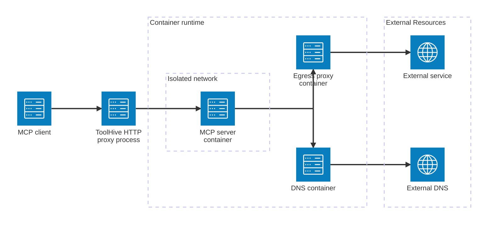
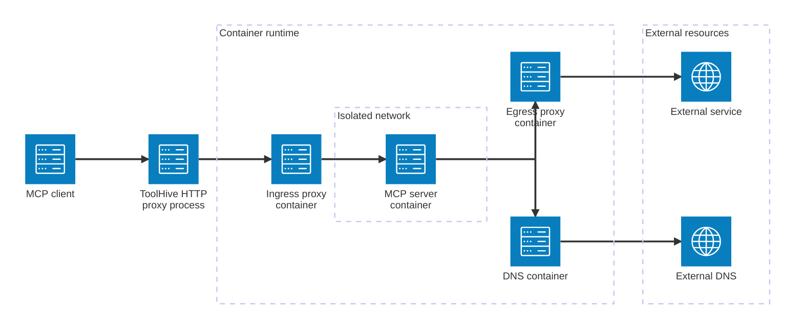

Most MCP servers require network access to function properly, for example, to
access APIs, download data, or communicate with other services. However,
malicious or misconfigured servers can also exfiltrate sensitive data or
download unwanted content.

ToolHive runs every MCP server with _network isolation_ by default. This
restricts the server's network access to the hosts and ports declared in its
permission profile so it can reach the services it needs and nothing else.

## How the default works

`thv run` enables network isolation automatically. The allowed hosts and ports
come from the first match in this order:

- A permission profile you pass with `--permission-profile`
- The MCP server's default profile from the ToolHive registry (when running a
  registry server by name)
- The built-in `network` profile (when neither of the above applies), which
  permits all outbound HTTP/HTTPS but still blocks host-directed access through
  the container's isolated network

Passing `--isolate-network` explicitly is equivalent to the default and is still
accepted:

```bash
thv run [--permission-profile </path/to/custom-profile.json>] <SERVER>
```

:::info[Changed in v0.30.1]

Earlier versions of ToolHive required `--isolate-network` to turn on network
isolation. From v0.30.1 onward, isolation is the default for `thv run` and for
workloads created through the REST API. See
[Opt out of network isolation](#opt-out-of-network-isolation) if you need the
previous behavior for a specific server.

:::

:::tip

You can combine file system and network permissions in the same permission
profile. For details on creating profiles that include both types of
permissions, see [custom permissions](./custom-permissions.mdx).

:::

When you enable network isolation, ToolHive creates a secure network
architecture around your MCP server that includes several components working
together to control network access.

### Network architecture components

Along with the main MCP server container, ToolHive launches additional
containers to manage network traffic:

- An egress proxy container that filters outgoing network traffic
- A DNS container that provides controlled domain name resolution
- An ingress proxy container that handles incoming requests (only for MCP
  servers using SSE or Streamable HTTP transport; stdio MCP servers don't need
  this since they don't expose ports)

### Network topology

ToolHive creates two separate networks in the container runtime:

- A shared external network (`toolhive-external`) that connects to your host's
  network
- An internal network (`toolhive-<SERVER_NAME>-internal`) for each MCP server
  that isolates it from external access

The MCP server container connects only to the internal network, while the proxy
and DNS containers connect to both networks. This design ensures that all
network traffic flows through controlled points, allowing ToolHive to enforce
the access rules you specify in your permission profile.

The following diagrams show how network traffic flows through the isolation
architecture for different transport types:

<Tabs groupId='transport'>
<TabItem value='stdio' label='Transport: Standard Input/Output (stdio)' default>

For MCP servers using stdio transport, the ToolHive proxy process communicates
directly with the MCP server container through standard input and output. All
outbound network requests from the MCP server flow through the egress proxy and
DNS containers:


```mermaid
architecture-beta
    service mcp_client(server)[MCP client]
    service toolhive_proxy(server)[ToolHive HTTP proxy process]

    group container_runtime[Container runtime]
    group thv_internal[Isolated network] in container_runtime
    service egress(server)[Egress proxy container] in container_runtime
    service mcp_server(server)[MCP server container] in thv_internal
    service dns_container(server)[DNS container] in container_runtime

    group external[External Resources]
    service external_service(internet)[External service] in external
    service external_dns(internet)[External DNS] in external

    junction outbound in container_runtime

    mcp_client:R --> L:toolhive_proxy
    toolhive_proxy:R --> L:mcp_server
    mcp_server:R -- L:outbound
    egress:B <-- T:outbound
    dns_container:T <-- B:outbound
    egress:R --> L:external_service
    dns_container:R --> L:external_dns
```

</TabItem>
<TabItem value='sse' label='Transport: SSE or Streamable HTTP'>

For MCP servers using SSE or Streamable HTTP transport, ToolHive includes an
additional ingress proxy container. This proxy handles incoming HTTP requests
and ensures the MCP server remains isolated from direct external access:


```mermaid
architecture-beta
    service mcp_client(server)[MCP client]
    service toolhive_proxy(server)[ToolHive HTTP proxy process]

    group container_runtime[Container runtime]
    group thv_internal[Isolated network] in container_runtime
    service ingress(server)[Ingress proxy container] in container_runtime
    service egress(server)[Egress proxy container] in container_runtime
    service mcp_server(server)[MCP server container] in thv_internal
    service dns_container(server)[DNS container] in container_runtime

    group external[External resources]
    service external_service(internet)[External service] in external
    service external_dns(internet)[External DNS] in external

    junction outbound in container_runtime

    mcp_client:R --> L:toolhive_proxy
    toolhive_proxy:R --> L:ingress
    ingress:R --> L:mcp_server
    mcp_server:R -- L:outbound
    egress:B <-- T:outbound
    dns_container:T <-- B:outbound
    egress:R --> L:external_service
    dns_container:R --> L:external_dns
```

</TabItem>
</Tabs>

### Outbound traffic routing

ToolHive routes outbound traffic from MCP servers through an explicit HTTP proxy
using standard environment variables. When network isolation is active, ToolHive
automatically injects the following into the MCP server container:

```text
HTTP_PROXY=http://<SERVER_NAME>-egress:3128
HTTPS_PROXY=http://<SERVER_NAME>-egress:3128
http_proxy=http://<SERVER_NAME>-egress:3128
https_proxy=http://<SERVER_NAME>-egress:3128
NO_PROXY=localhost,127.0.0.1,::1
```

Both uppercase and lowercase variants are injected to cover applications that
use either convention.

For this to work, the MCP server must honor these proxy environment variables.
If a server bypasses them (for example, by using raw TCP sockets, a custom HTTP
client that ignores environment variables, or hardcoded connections), its
outbound traffic fails. ToolHive does not transparently redirect all traffic
with iptables or nftables rules. The Docker network provides no direct path to
external networks, so non-compliant outbound connections fail.

:::info[Important]

Network isolation supports HTTP and HTTPS protocols. If your MCP server needs to
use other protocols (like direct TCP connections for database access), opt out
of isolation with `--isolate-network=false` and rely on the container's built-in
isolation instead.

:::

## Opt out of network isolation

To run a server without ToolHive's egress proxy and DNS containers, pass
`--isolate-network=false`. This is useful for servers that need direct TCP/UDP
connections, custom protocols, or unrestricted outbound network access:

```bash
thv run --isolate-network=false <SERVER>
```

The container's own network namespace still isolates it from the host; only
ToolHive's allowlist enforcement is disabled.

## Example: Enable network isolation using registry defaults

Many MCP servers in the ToolHive registry have default permission profiles that
allow access to the specific resources they need. For example, the `atlassian`
MCP server has a default profile that allows access to Atlassian services.

First, check the registry to see the default permissions for the `atlassian` MCP
server:

```bash
thv registry info atlassian
```

Look for the `Permissions` section in the output:

```text
Permissions:
  Network:
    Allow Host: .atlassian.net, .atlassian.com
    Allow Port: 443
```

To run the `atlassian` MCP server with these default permissions, use the
following command:

```bash
thv run atlassian
```

## Example: Customize network access

The GitHub MCP server in the registry has a default profile that allows access
to `github.com`, but you might need to customize it for a self-hosted GitHub
Enterprise instance:

```json title="github-enterprise-profile.json"
{
  "network": {
    "outbound": {
      "insecure_allow_all": false,
      "allow_host": ["github.example.com"],
      "allow_port": [443]
    }
  }
}
```

Run the GitHub MCP server with this profile:

```bash
thv run --permission-profile ./github-enterprise-profile.json --secret github,target=GITHUB_PERSONAL_ACCESS_TOKEN github
```

## Example: Combined network and file system permissions

Some MCP servers need both network restrictions and file system access. For
example, the `aws-diagram` MCP server generates diagrams locally but doesn't
need network access:

```json title="aws-diagram-profile.json"
{
  "write": ["/tmp/generated-diagrams"],
  "network": {
    "outbound": {
      "insecure_allow_all": false,
      "allow_host": [],
      "allow_port": []
    }
  }
}
```

This profile:

- Blocks all network access (equivalent to the `none` built-in profile)
- Allows the server to write generated diagrams to `/tmp/generated-diagrams`

Run the server with this combined profile:

```bash
thv run --permission-profile ./aws-diagram-profile.json aws-diagram
```

### Alternative: Using built-in profiles with volume mounts

You can achieve the same result without creating a custom profile file by using
the built-in `none` profile and the `--volume` flag:

```bash
thv run --permission-profile none --volume /home/user/aws-diagrams:/tmp/generated-diagrams aws-diagram
```

This approach is more flexible since you can easily change the host directory
without editing a profile file.

## Accessing other workloads on the same container network

ToolHive allows you to configure both outbound and inbound network access for
MCP servers. This is commonly needed when your MCP server needs to communicate
with databases, APIs, or other services that are running on your local host
during development, or when other containers need to communicate with your MCP
server.

### Outbound access: MCP server to other workloads

To allow an MCP server to access other workloads on the same network, configure
outbound network isolation to include the appropriate hostnames and ports.

**Reaching the host with `host.docker.internal`**

`host.docker.internal` is a Docker Desktop hostname that resolves to the host
machine's IP address. Docker gateway addresses are blocked by an explicit deny
in the egress proxy by default, even when `insecure_allow_all` is set. The
`--allow-docker-gateway` flag removes that deny for `host.docker.internal`,
`gateway.docker.internal`, and `172.17.0.1`.

If you are using the default `network` profile (which allows all outbound
HTTP/HTTPS), `--allow-docker-gateway` alone is enough:

```bash
thv run --allow-docker-gateway <SERVER>
```

If you are using a restrictive permission profile, you need both the flag and
`host.docker.internal` in your `allow_host` list:

```json title="host-access-profile.json"
{
  "network": {
    "outbound": {
      "insecure_allow_all": false,
      "allow_host": ["host.docker.internal"],
      "allow_port": [3000]
    }
  }
}
```

```bash
thv run --allow-docker-gateway --permission-profile ./host-access-profile.json \
  <SERVER>
```

:::note

`host.docker.internal` is a Docker Desktop feature available on macOS and
Windows. On Linux hosts running Docker Engine without Docker Desktop, use the
Docker bridge gateway IP directly (typically `172.17.0.1`) instead.

:::

**Reaching other local services**

For other local services, create a permission profile with the required hostname
and port:

```json title="internal-access-profile.json"
{
  "network": {
    "outbound": {
      "insecure_allow_all": false,
      "allow_host": ["my-local-service.example.com"],
      "allow_port": [3000]
    }
  }
}
```

```bash
thv run --permission-profile ./internal-access-profile.json <SERVER>
```

### Inbound access: Other containers to MCP server

By default, the ingress proxy only allows traffic from the container's own
hostname, `localhost`, and `127.0.0.1`. If you need to allow other containers or
workloads to communicate with your MCP server, configure the
`network.inbound.allow_host` setting in your permission profile.

This is useful when:

- Other containers need to call your MCP server's API
- You're running multiple services that need to communicate with each other
- You need to allow traffic from specific internal hostnames or domains

Create a permission profile that allows specific inbound hostnames:

```json title="inbound-access-profile.json"
{
  "network": {
    "inbound": {
      "allow_host": ["host.docker.internal", "localhost"]
    }
  }
}
```

Run the MCP server with this profile:

```bash
thv run --permission-profile ./inbound-access-profile.json <SERVER>
```

:::info

If no `network.inbound` configuration is specified, the ingress proxy uses the
default behavior of allowing traffic only from the container's own hostname,
`localhost`, and `127.0.0.1`.

:::

## Next steps

- [Set up authentication](./auth.mdx) for user-level access control with OIDC
  and Cedar policies

## Related information

- [`thv run` command reference](../reference/cli/thv_run.md)
- [Run MCP servers](./run-mcp-servers.mdx)
- [Custom permissions](./custom-permissions.mdx)
- [File system access](./filesystem-access.mdx)

## Troubleshooting

<details>
<summary>MCP server can't reach allowed hosts</summary>

If an MCP server fails to connect to a host that is listed in its permission
profile, the server may not be respecting the `HTTP_PROXY` and `HTTPS_PROXY`
environment variables that ToolHive injects.

ToolHive uses an explicit proxy model: outbound traffic must flow through the
egress proxy container. There are no transparent redirect rules, so an HTTP
client that ignores proxy environment variables has no route to the internet.
Common causes include:

- The server uses a custom HTTP client that does not read proxy environment
  variables
- The server opens raw TCP or UDP sockets directly instead of using standard
  HTTP libraries
- The server hardcodes connection targets and bypasses the system proxy
  configuration

To confirm this is the problem, check the egress proxy logs:

```bash
docker logs <SERVER_NAME>-egress
```

If the host you expect is absent from the logs entirely (no denied entry, no
access entry), the server does not route its traffic through the proxy at all.
In this case, you need either a different MCP server implementation that
respects standard proxy environment variables, or opt out of network isolation
with `--isolate-network=false`.

</details>

<details>
<summary>Network connectivity issues</summary>

If your MCP server can't reach an external service when network isolation is
enabled, the egress proxy is the source of truth for what's allowed and what
gets denied.

1. Confirm your profile lists the host and port the server is trying to reach.
   Network isolation only supports HTTP and HTTPS, so direct TCP/UDP connections
   (databases, custom protocols) won't work behind the egress proxy.

2. Check the egress proxy logs for the blocked request. ToolHive launches the
   egress container as `<SERVER_NAME>-egress`:

   ```bash
   docker logs <SERVER_NAME>-egress
   ```

   Look for denied or `403`-style entries that name the host and port the server
   attempted to reach.

3. To prove it's a permissions issue and not a different failure, run the server
   temporarily with the built-in `network` profile, which allows all outbound
   HTTP/HTTPS:

   ```bash
   thv run --permission-profile network <SERVER>
   ```

   If the server works with this profile, copy the host and port from the denied
   entries in step 2 into your custom profile's `network.outbound.allow_host`
   and `allow_port` lists.

</details>
