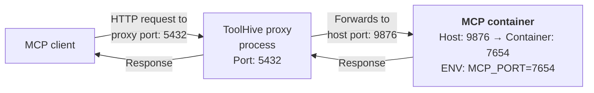
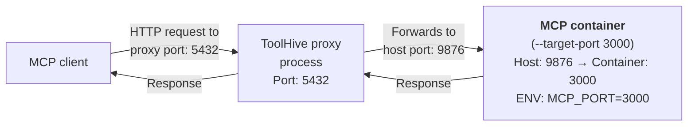

This guide explains how to run Model Context Protocol (MCP) servers using
ToolHive. It covers how to run servers from the ToolHive registry, customize
server settings, and run custom servers using Docker images or protocol schemes.

## Run a server from the registry

To run an MCP server from the [ToolHive registry](./registry.md), use the
[`thv run`](../reference/cli/thv_run.md) command with the name of the server you
want to run. The server name is the same as its name in the registry.

```bash
thv run <SERVER_NAME>
```

The ToolHive registry contains both local containerized MCP servers and remote
MCP servers. ToolHive automatically handles the appropriate setup based on the
server type.

### Local containerized servers

For example, to run the `fetch` server, which is a local containerized MCP
server that fetches website contents:

```bash
thv run fetch
```

### Remote MCP servers

Remote MCP servers in the registry don't run as local containers but instead use
ToolHive's transparent http proxy to forward requests to remote servers. For
example:

```bash
thv run neon
thv run stripe
```

When you run a remote server from the registry, ToolHive uses the pre-configured
remote URL and authentication settings.

:::note[Naming convention]

Remote MCP servers use the `-remote` suffix **when they have a local
containerized counterpart** to distinguish between the two versions. For
example:

- `notion-remote` indicates this is the remote version of a server that also has
  a local `notion` version
- `neon` and `stripe` don't have local counterparts, so they don't use the
  `-remote` suffix

To run a remote notion mcp server, you should use the `notion-remote` name.

```bash
thv run notion-remote
```

:::

:::info[What's happening?]

When you run an MCP server from the registry, ToolHive handles different server
types automatically:

**For local containerized servers:**

1. Pulls the image and launches a container using the configuration from the
   registry.
2. Starts an HTTP proxy process on a random port to forward client requests to
   the container.
3. Labels the container so it can be tracked by ToolHive:
   ```yaml
   toolhive: true
   toolhive-name: <SERVER_NAME>
   ```

**For remote MCP servers:**

1. Uses the pre-configured remote URL from the registry.
2. Automatically detects if the remote server requires authentication.
3. Handles OAuth/OIDC authentication flows if needed.
4. Starts an HTTP proxy process on a random port to forward client requests to
   the remote server.
5. Manages the server like any other ToolHive workload. No container is created
   for remote MCP servers.

:::

See [Run a custom MCP server](#run-a-custom-mcp-server) to run a server that is
not in the registry, or [Run a remote MCP server](#run-a-remote-mcp-server) for
more details about remote server configuration.

## Customize server settings

You might need to customize the behavior of an MCP server, such as changing the
port, mounting a local directory, or passing secrets. ToolHive provides several
options to customize the server's configuration when you run it.

For a complete list of options, run
[`thv run --help`](../reference/cli/thv_run.md) or see the
[`thv run` command reference](../reference/cli/thv_run.md).

### Run a server with a custom name

By default, the container name matches the MCP server's name in the registry or
is automatically generated from the image name when you run a custom server. To
give your server instance a custom name, use the `--name` option:

```bash
thv run --name <FRIENDLY_NAME> <SERVER>
```

For example:

```bash
thv run --name my-fetch fetch
```

### Run a server with secrets

Many MCP servers require secrets or other configuration variables to function
correctly. ToolHive lets you pass these secrets as environment variables when
starting the server.

To pass a secret to an MCP server, use the `--secret` option:

```bash
thv run --secret <SECRET_NAME>,target=<ENV_VAR_NAME> <SERVER>
```

The `target` parameter specifies the name of the environment variable in the MCP
server's container. This is useful for passing secrets like API tokens or other
sensitive information.

For example:

```bash
thv run --secret github,target=GITHUB_PERSONAL_ACCESS_TOKEN github
```

See [Secrets management](./secrets-management.mdx) to learn how to manage
secrets in ToolHive.

### Run a server within a group

To run an MCP server within a specific group, use the `--group` option. This
allows you to organize your servers and manage them collectively.

```bash
thv run --group <GROUP_NAME> <SERVER>
```

:::note

The group must exist before you can run a server in it.

:::

See [Group management](./group-management.md) for more details on organizing
servers into groups and configuring client access.

### Mount a local file or directory

To enable file system access for an MCP server, you can either use the
`--volume` flag to mount specific paths or create a custom permission profile
that defines read and write permissions.

See [File system access](./filesystem-access.md) for detailed examples. To
prevent sensitive files from being exposed when mounting a project, use
[.thvignore](./thvignore.md).

### Restrict network access

To restrict an MCP server's network access, use the `--isolate-network` flag.
This enforces network access rules from either the server's default registry
permissions or a custom permission profile you create.

See [Network isolation](./network-isolation.mdx) for network architecture
details and examples.

### Add command-line arguments

Some MCP servers require additional arguments to run correctly. You can pass
these arguments after the server name in the
[`thv run`](../reference/cli/thv_run.md) command:

```bash
thv run <SERVER> -- <ARGS>
```

For example:

```bash
thv run my-mcp-server:latest -- --arg1 value1 --arg2 value2
```

Check the MCP server's documentation for the required arguments.

:::warning

Some MCP servers in the ToolHive registry include default arguments that are
essential for proper operation. When you provide custom arguments using
`-- <ARGS>`, these replace the registry defaults entirely rather than adding to
them.

Before adding custom arguments, check the server's registry entry:

```bash
thv registry info <SERVER> --format json | jq '.args'
```

If default arguments are listed, include them along with your custom arguments
to ensure the server functions correctly.

:::

### Run a server on a specific port

ToolHive creates a reverse proxy on a random port that forwards requests to the
container. This is the port that client applications connect to. To set a
specific proxy port instead, use the `--proxy-port` flag:

```bash
thv run --proxy-port <PORT_NUMBER> <SERVER>
```

### Run a server exposing only selected tools

ToolHive can filter the tools returned to the client as result of a `tools/list`
command as well as block calls to tools that you don't want to expose.

This can help reduce the amount of tools sent to the LLM while still using the
same MCP server, but it is not meant as a security feature.

To filter the list of tools, use the `--tools` flag either once

```bash
thv run --tools <TOOL_1> <SERVER>
```

Or multiple times

```bash
thv run --tools <TOOL_1> --tools <TOOL_2> <SERVER>
```

For example:

```bash
thv run --tools list_issues --tools get_issue github
```

If the server comes from the registry, ToolHive can validate the tool names
against the list advertised in the image reference. An error is returned in case
ToolHive cannot find one of the specified tools.

### Override tool names and descriptions

With ToolHive you can modify how tools exposed by an MCP server are exposed to
clients. In particular, tool names and descriptions can be changed.

This is useful when you want to guide an agent toward calling a specific tool
for particular questions.

One common use case is running multiple copies of the same MCP server with
different [network access levels](./network-isolation.mdx)—one for internal
resources and another for public internet access. By overriding the tool names
and descriptions, you can help your agent choose the right server for each task.

For example, the `fetch` MCP server exposes a single `fetch` tool with a
description like:

```
"Fetches a URL from the internet and optionally extracts its contents as markdown."
```

To override this, create a configuration file with one entry under
`toolsOverride` for each tool you want to modify:

```json
{
  "toolsOverride": {
    "fetch": {
      "name": "toolhive-docs-fetch",
      "description": "Fetches a URL from https://docs.stacklok.com/toolhive website."
    }
  }
}
```

Then pass this file to [`thv run`](../reference/cli/thv_run.md):

```sh
thv run --tools-override override.json fetch
```

The key in the override object is the _original tool name_, while the `name`
field contains the _new name_ that clients will see.

:::info

Take care when using `--tools` and `--tools-override` together in the same
command.

Tool filtering and tool overrides work independently: filtering limits access to
a subset of tools, while overrides change how those tools appear to clients.

When using both options, `--tools` must reference the _overridden names_ (the
new names you define) since those are what clients will see.

:::

## Run a custom MCP server

To run an MCP server that isn't in the registry, you can use a
[Docker image](#run-a-server-from-a-docker-image) or a
[protocol scheme](#run-a-server-using-protocol-schemes) to dynamically build the
server.

ToolHive supports the following transport methods:

- **Standard I/O** (`stdio`), default:\
  ToolHive redirects SSE or Streamable HTTP traffic from the client to the
  container's standard input and output. This acts as a secure proxy, ensuring
  that the container doesn't have direct access to the network or the host
  machine.

- **HTTP with SSE (server-sent events)** (`sse`):\
  ToolHive creates a reverse proxy that forwards requests to the container using
  the HTTP/SSE protocol.

- **Streamable HTTP** (`streamable-http`):\
  ToolHive creates a reverse proxy that forwards requests to the container using
  the Streamable HTTP protocol, which replaced SSE in the MCP specification as
  of the `2025-03-26` revision.

:::info

We are actively monitoring the adoption of the Streamable HTTP protocol across
the client ecosystem. Once we confirm that ToolHive's supported clients support
Streamable HTTP, we will make it the default proxy transport method for stdio
servers.

Currently, you can add the `--proxy-mode streamable-http` flag to the
[`thv run`](../reference/cli/thv_run.md) command to use Streamable HTTP for
stdio servers. This will ensure that the server is compatible with the latest
MCP specification and can be used with clients that support Streamable HTTP.

:::

### Run a server from a Docker image

To run an MCP server from a Docker image, specify the image name and tag in the
[`thv run`](../reference/cli/thv_run.md) command. You can also specify a custom
name for the server instance, the transport method, and any additional arguments
required by the MCP server.

```bash
thv run [--name <FRIENDLY_NAME>] [--transport <stdio/sse/streamable-http>] <IMAGE_REFERENCE> -- <ARGS>
```

For example, to run an MCP server from a Docker image named
`my-mcp-server-image` that uses the Streamable HTTP transport method and takes
additional arguments:

```bash
thv run --name my-mcp-server --transport streamable-http my-mcp-server-image:latest -- --arg1 value1 --arg2 value2
```

Check your MCP server's documentation for the required arguments.

:::info[What's happening?]

When you run an MCP server from a Docker image, ToolHive:

1. Pulls the image (`my-mcp-server-image:latest`) and launches a container with
   the options and arguments you specified.
2. Launches an HTTP proxy on a random port (optionally, add
   `--proxy-port <PORT_NUMBER>` to specify the port).
3. Labels the container so it can be tracked by ToolHive:
   ```yaml
   toolhive: true
   toolhive-name: my-mcp-server
   ```
4. Sets up the specified `--transport` method (`stdio`, `sse`, or
   `streamable-http`).

:::

See [`thv run --help`](../reference/cli/thv_run.md) for more options.

### Run a server using protocol schemes

ToolHive also supports running MCP servers directly from package managers. This
means you can launch MCP servers without building or publishing a Docker image,
and without installing language-specific build tools on your machine.

Currently, three protocol schemes are supported:

- `uvx://`: For Python-based MCP servers using the uv package manager
- `npx://`: For Node.js-based MCP servers using npm
- `go://`: For Go-based MCP servers

```bash
thv run <uvx|npx|go>://<PACKAGE_NAME>@<VERSION|latest>
```

You'll likely need to specify additional arguments like the transport method,
volumes, and environment variables. Check your MCP server's documentation and
see [`thv run --help`](../reference/cli/thv_run.md) for more options.

:::info[What's happening?]

When you use a protocol scheme, ToolHive:

1. Detects the protocol scheme and extracts the package reference
2. Generates a Dockerfile based on the appropriate template
3. Builds a Docker image with the package installed
4. Runs the MCP server using the new image (see
   [Run a server from a Docker image](#run-a-server-from-a-docker-image) for
   details)

:::

#### Examples

<Tabs groupId='protocol' queryString='protocol'>
<TabItem value='uvx' label='Python (uvx)' default>

The `uvx://` protocol is used for Python-based MCP servers. The package name
must be a valid package in the [PyPI registry](https://pypi.org/). The
`@<version>` suffix is _optional_ and defaults to the latest version if omitted.

```bash
thv run --name aws-docs uvx://awslabs.aws-documentation-mcp-server@latest
```

</TabItem>
<TabItem value='npx' label='Node.js (npx)'>

The `npx://` protocol is used for Node.js-based MCP servers. The package name
must be a valid package in the [npm registry](https://www.npmjs.com/). The
`@<version>` suffix is _optional_ and defaults to the latest version if omitted.

```bash
thv run --name pulumi npx://@pulumi/mcp-server@latest
```

</TabItem>
<TabItem value='go' label='Go'>

The `go://` protocol is used for Go-based MCP servers. The package name must be
a valid Go module repo URI referencing the `main` package. The `@<version>`
suffix is **required**.

```bash
thv run --name grafana go://github.com/grafana/mcp-grafana/cmd/mcp-grafana@latest
```

You can also run a local Go module by specifying the path to the module:

```bash
# Run from a relative path
thv run go://./cmd/my-mcp-server

# Run from the current directory
cd my-go-mcp-project
thv run go://.

# Run from an absolute path
thv run go:///path/to/my-go-project
```

</TabItem>
</Tabs>

### Configure network transport

When you run custom MCP servers using the SSE (`--transport sse`) or Streamable
HTTP (`--transport streamable-http`) transport method, ToolHive automatically
selects a random port to expose from the container to the host and sets the
`MCP_PORT` and `FASTMCP_PORT` environment variables in the container.



This is equivalent to running a Docker container with
`docker run -p <random_host_port>:<random_container_port> ...`

For MCP servers that use a specific port or don't recognize those environment
variables, specify the container port for ToolHive to expose using the
`--target-port` flag:

```bash
thv run --transport streamable-http --target-port <PORT_NUMBER> <SERVER>
```

ToolHive still maps the container port to a random port on the host to avoid
conflicts with commonly used ports. This is equivalent to running a Docker
container with `docker run -p <random_port>:<PORT_NUMBER> ...`



Some MCP servers use command-line arguments to specify their transport and port.
For example, if your server expects the transport type as a positional argument
and requires the `--port` flag, you can pass it like this:

```bash
thv run --transport streamable-http --target-port <PORT_NUMBER> <SERVER> -- http --port <PORT_NUMBER>
```

Check your MCP server's documentation for the required transport and port
configuration.

### Add a custom CA certificate

In corporate environments with TLS inspection or custom certificate authorities,
you may need to configure a CA certificate for ToolHive to use when building
containers from protocol schemes like `uvx://`, `npx://`, and `go://`.

ToolHive provides both global configuration and per-command options for CA
certificates.

#### Configure a global CA certificate

To set a CA certificate that ToolHive will use for all container builds:

```bash
thv config set-ca-cert /path/to/corporate-ca.crt
```

To view the currently configured CA certificate:

```bash
thv config get-ca-cert
```

To remove the CA certificate configuration:

```bash
thv config unset-ca-cert
```

#### Override CA certificate per command

You can override the global CA certificate configuration for a specific run
using the `--ca-cert` flag:

```bash
thv run --ca-cert /path/to/other-ca.crt uvx://some-package
```

This is useful when you need to use different CA certificates for different
servers or when testing with a specific certificate.

#### Priority order

ToolHive uses the following priority order for CA certificates:

1. Command-line flag (`--ca-cert`)
2. Global configuration (`thv config set-ca-cert`)
3. No custom CA certificate (default behavior)

For example:

```bash
# Set a global CA certificate
thv config set-ca-cert /path/to/corporate-ca.crt

# This uses the configured CA certificate
thv run uvx://some-package

# This overrides the configured CA certificate
thv run --ca-cert /path/to/special-ca.crt uvx://other-package
```

## Run a remote MCP server

You can run remote MCP servers directly by providing their URL. This allows you
to connect to MCP servers hosted elsewhere without needing to manage containers
locally. ToolHive creates a transparent proxy that handles authentication and
forwards requests to the remote server.

### Basic remote server setup

To run a remote MCP server, simply provide its URL:

```bash
thv run <URL> [--name <SERVER_NAME>]
```

For example:

```bash
thv run https://api.example.com/mcp
```

If you don't specify a name with `--name`, ToolHive will automatically derive a
name from the URL by extracting the main domain name (e.g., `notion` from
`https://api.notion.com/mcp`).

By default, remote servers use the `streamable-http` transport. If the server
uses Server-Sent Events (SSE), specify the transport flag:

```bash
thv run https://api.example.com/sse --transport sse
```

:::info[What's happening?]

When you run a remote MCP server, ToolHive:

1. Automatically detects if the remote server requires authentication.
2. Handles OAuth/OIDC authentication flows if needed.
3. Starts an HTTP proxy process on a random port to forward client requests to
   the remote server.
4. Manages the server like any other ToolHive workload. No container is created
   for remote MCP servers.

:::

### Authentication setup

Many remote MCP servers require authentication. ToolHive supports automatic
authentication detection and OAuth/OIDC flows.

#### Auto-detect authentication

ToolHive can automatically detect if a remote server requires authentication by
examining the server's response headers and status codes:

```bash
thv run https://protected-api.com/mcp --name my-server
```

If authentication is required, ToolHive will prompt you to complete the OAuth
flow. When no client credentials are provided, ToolHive automatically registers
an OAuth client with the authorization server using RFC 7591 dynamic client
registration, eliminating the need to pre-configure client ID and secret.

#### OIDC authentication

For servers using OpenID Connect (OIDC), you can provide the issuer URL:

```bash
thv run https://api.example.com/mcp \
  --name my-server \
  --remote-auth-issuer https://auth.example.com \
  --remote-auth-client-id my-client-id
  --remote-auth-client-secret my-client-secret
```

#### OAuth2 authentication

For servers using OAuth2, you can specify the authorization and token URLs
manually:

```bash
thv run https://api.example.com/mcp \
  --name my-server \
  --remote-auth-authorize-url https://auth.example.com/oauth/authorize \
  --remote-auth-token-url https://auth.example.com/oauth/token \
  --remote-auth-client-id my-client-id \
  --remote-auth-client-secret my-client-secret
```

#### Automatic token refresh

ToolHive automatically handles OAuth token refresh for remote MCP servers. When
you authenticate with a remote server, ToolHive stores both the access token and
refresh token securely. The refresh token is used to automatically obtain new
access tokens when they expire, ensuring uninterrupted service without requiring
manual re-authentication.

### Advanced remote server configuration

#### OAuth scopes and parameters

Specify custom OAuth scopes for the authentication flow:

```bash
thv run https://api.example.com/mcp \
  ... \
  --remote-auth-scopes read,write,admin
```

#### Custom authentication timeout

Adjust the authentication timeout for slow networks:

```bash
thv run https://api.example.com/mcp \
  ... \
  --remote-auth-timeout 2m
```

#### Skip browser authentication

For headless environments, skip the browser-based OAuth flow:

```bash
thv run https://api.example.com/mcp \
  ... \
  --remote-auth-skip-browser
```

### Remote server management

Remote MCP servers are managed like any other ToolHive workload:

- **List servers**: `thv list` shows remote servers with their target URLs
- **View logs**: `thv logs <SERVER_NAME>` shows proxy and authentication logs
- **Stop/restart**: `thv stop <SERVER_NAME>` and `thv restart <SERVER_NAME>`
- **Remove**: `thv rm <SERVER_NAME>` removes the proxy and configuration

## Share and reuse server configurations

ToolHive allows you to export a server's configuration and run servers using
previously exported configurations. This is useful for:

- Sharing server setups with team members
- Creating backups of complex configurations
- Running identical server instances across different environments

### Export a server configuration

To export a running server's configuration to a file, use the
[`thv export`](../reference/cli/thv_export.md) command:

```bash
thv export <server-name> <output-file>
```

For example, to export the configuration of a running server named "fetch":

```bash
thv export fetch ./fetch-config.json
```

This creates a JSON file containing all the server's configuration, including:

- Container image and version
- Environment variables and secrets references
- Volume mounts and permissions
- Network settings
- Transport configuration

### Run a server from an exported configuration

To run a server using a previously exported configuration, use the
[`thv run`](../reference/cli/thv_run.md) command with the `--from-config` flag:

```bash
thv run --from-config <config-file>
```

For example, to run a server using the exported configuration:

```bash
thv run --from-config ./fetch-config.json
```

This creates a new server instance with identical settings to the original. If
the original server used secrets, you must have the same secrets available in
your ToolHive secrets store.

## Next steps

See [Monitor and manage MCP servers](./manage-mcp-servers.md) to monitor and
control your servers.

## Related information

- [`thv run` command reference](../reference/cli/thv_run.md)
- [Client configuration](./client-configuration.mdx)
- [Secrets management](./secrets-management.mdx)
- [Custom permissions](./custom-permissions.mdx)
- [File system access](./filesystem-access.md)
- [Network isolation](./network-isolation.mdx)

## Troubleshooting

<details>
<summary>Server fails to start</summary>

If a server fails to start:

1. Check if Docker, Podman, or Colima is running
2. Verify you have internet access to pull images
3. Check if the port is already in use
4. Look at the error message for specific issues

</details>

<details>
<summary>Server starts but isn't accessible</summary>

If a server starts but isn't accessible:

1. Check the server logs:

   ```bash
   thv logs <SERVER_NAME>
   ```

2. Verify the port isn't blocked by a firewall

3. Make sure clients are properly configured (see
   [Client configuration](./client-configuration.mdx))

</details>

<details>
<summary>Server crashes or exits unexpectedly</summary>

If a server crashes or exits unexpectedly:

1. List all MCP servers including stopped ones:

   ```bash
   thv list --all
   ```

2. Check the logs for error messages:

   ```bash
   thv logs <SERVER_NAME>
   ```

3. Check if the server requires any secrets or environment variables

4. Verify the server's configuration and arguments

</details>

<details>
<summary>Remote server authentication fails</summary>

If a remote MCP server authentication fails:

1. Check the server logs for authentication errors:

   ```bash
   thv logs <SERVER_NAME>
   ```

2. Verify the issuer URL is correct and accessible

3. Check if the OAuth client ID and secret are valid

4. Ensure the remote server supports the OAuth flow you're using

5. Try re-authenticating by restarting the server:

   ```bash
   thv restart <SERVER_NAME>
   ```

</details>

<details>
<summary>Remote server connection issues</summary>

If you can't connect to a remote MCP server:

1. Verify the remote server URL is correct and accessible

2. Check your network connectivity:

   ```bash
   curl -I https://api.example.com/mcp
   ```

3. Check if the remote server requires specific headers or authentication

4. Review the server logs for connection errors:

   ```bash
   thv logs <SERVER_NAME>
   ```

5. Try running with debug mode for more detailed logs:

   ```bash
   thv run --debug https://api.example.com/mcp --name my-server
   ```

</details>
