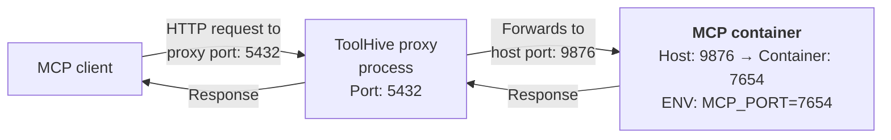
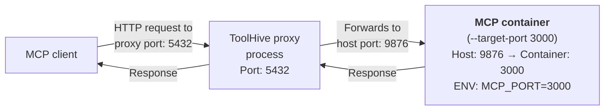

This guide explains how to run Model Context Protocol (MCP) servers using
ToolHive. It covers how to run servers from the ToolHive registry and how to run
custom servers using Docker images or protocol schemes.

Related guides cover the rest of the workflow:

- [Run remote MCP servers](./run-remote-mcp-servers.mdx) to connect to servers
  hosted elsewhere by URL, including OAuth and bearer token authentication.
- [Configure MCP servers](./configure-mcp-servers.mdx) to customize any server
  with options like custom names, secrets, tool filtering, ports, and volume
  mounts.

## Run a server from the registry

To run an MCP server from the [ToolHive registry](./registry.mdx), use the
[`thv run`](../reference/cli/thv_run.md) command with the name of the server you
want to run. The server name is the same as its name in the registry.

```bash
thv run <SERVER_NAME>
```

The ToolHive registry contains both local containerized MCP servers and remote
MCP servers. ToolHive automatically handles the appropriate setup based on the
server type.

### Local containerized servers

For example, to run the `fetch` server, which is a local containerized MCP
server that fetches website contents:

```bash
thv run fetch
```

### Remote MCP servers

Remote MCP servers in the registry don't run as local containers but instead use
ToolHive's transparent HTTP proxy to forward requests to remote servers. For
example:

```bash
thv run neon
thv run stripe
```

When you run a remote server from the registry, ToolHive uses the pre-configured
remote URL and authentication settings.

:::note[Naming convention]

Remote MCP servers use the `-remote` suffix **when they have a local
containerized counterpart** to distinguish between the two versions. For
example:

- `notion-remote` indicates this is the remote version of a server that also has
  a local `notion` version
- `neon` and `stripe` don't have local counterparts, so they don't use the
  `-remote` suffix

To run a remote notion mcp server, you should use the `notion-remote` name.

```bash
thv run notion-remote
```

Use `thv search <NAME>` or `thv registry list` to discover available servers.

:::

To connect to a remote server that isn't in the registry, see
[Run remote MCP servers](./run-remote-mcp-servers.mdx).

:::info[What's happening?]

When you run an MCP server from the registry, ToolHive handles different server
types automatically:

**For local containerized servers:**

1. Pulls the image and launches a container using the configuration from the
   registry.
2. Starts an HTTP proxy process on a random port to forward client requests to
   the container.
3. Labels the container so it can be tracked by ToolHive:
   ```yaml
   toolhive: true
   toolhive-name: <SERVER_NAME>
   ```

**For remote MCP servers:**

1. Uses the pre-configured remote URL from the registry.
2. Automatically detects if the remote server requires authentication.
3. Handles OAuth/OIDC authentication flows if needed.
4. Starts an HTTP proxy process on a random port to forward client requests to
   the remote server.
5. Manages the server like any other ToolHive workload. No container is created
   for remote MCP servers.

:::

### Run servers in a group

You can organize MCP servers into groups using `thv group create` and then run
servers within a group:

```bash
thv group create my-group
thv run --group my-group fetch
thv run --group my-group github
```

See [Group management](./group-management.mdx) for more details on creating and
managing groups.

See [Run a custom MCP server](#run-a-custom-mcp-server) to run a server that is
not in the registry, or [Run remote MCP servers](./run-remote-mcp-servers.mdx)
for more details about remote server configuration.

To customize a server's behavior, such as setting a custom name, passing
secrets, or filtering tools, see
[Configure MCP servers](./configure-mcp-servers.mdx).

## Run a custom MCP server

To run an MCP server that isn't in the registry, you can use a
[Docker image](#run-a-server-from-a-docker-image) or a
[protocol scheme](#run-a-server-using-protocol-schemes) to dynamically build the
server.

ToolHive supports the following transport methods:

- **Standard I/O** (`stdio`), default:\
  ToolHive redirects SSE or Streamable HTTP traffic from the client to the
  container's standard input and output. This acts as a secure proxy, ensuring
  that the container doesn't have direct access to the network or the host
  machine.

- **HTTP with SSE (server-sent events)** (`sse`):\
  ToolHive creates a reverse proxy that forwards requests to the container using
  the HTTP/SSE protocol.

- **Streamable HTTP** (`streamable-http`):\
  ToolHive creates a reverse proxy that forwards requests to the container using
  the Streamable HTTP protocol, which replaced SSE in the MCP specification as
  of the `2025-03-26` revision.

:::info

As of ToolHive CLI version 0.6.0, the default proxy mode for `stdio` MCP servers
is `streamable-http`.

For backward compatibility with the deprecated SSE transport, you can explicitly
set the transport to `sse` using the `--proxy-mode sse` flag when running the
server.

:::

### Run a server from a Docker image

To run an MCP server from a Docker image, specify the image name and tag in the
[`thv run`](../reference/cli/thv_run.md) command. You can also specify a custom
name for the server instance, the transport method, and any additional arguments
required by the MCP server.

```bash
thv run [--name <FRIENDLY_NAME>] [--transport <stdio/sse/streamable-http>] <IMAGE_REFERENCE> -- <ARGS>
```

For example, to run an MCP server from a Docker image named
`my-mcp-server-image` that uses the Streamable HTTP transport method and takes
additional arguments:

```bash
thv run --name my-mcp-server --transport streamable-http my-mcp-server-image:latest -- --arg1 value1 --arg2 value2
```

Check your MCP server's documentation for the required arguments.

:::info[What's happening?]

When you run an MCP server from a Docker image, ToolHive:

1. Pulls the image (`my-mcp-server-image:latest`) and launches a container with
   the options and arguments you specified.
2. Launches an HTTP proxy on a random port (optionally, add
   `--proxy-port <PORT_NUMBER>` to specify the port).
3. Labels the container so it can be tracked by ToolHive:
   ```yaml
   toolhive: true
   toolhive-name: my-mcp-server
   ```
4. Sets up the specified `--transport` method (`stdio`, `sse`, or
   `streamable-http`).

:::

See [`thv run --help`](../reference/cli/thv_run.md) for more options.

### Run a server using protocol schemes

ToolHive also supports running MCP servers directly from package managers. This
means you can launch MCP servers without building or publishing a Docker image,
and without installing language-specific build tools on your machine.

Currently, three protocol schemes are supported:

- `uvx://`: For Python-based MCP servers using the uv package manager
- `npx://`: For Node.js-based MCP servers using npm
- `go://`: For Go-based MCP servers

```bash
thv run <uvx|npx|go>://<PACKAGE_NAME>@<VERSION|latest>
```

You'll likely need to specify additional arguments like the transport method,
volumes, and environment variables. Check your MCP server's documentation and
see [`thv run --help`](../reference/cli/thv_run.md) for more options.

:::info[What's happening?]

When you use a protocol scheme, ToolHive:

1. Detects the protocol scheme and extracts the package reference
2. Generates a Dockerfile based on the appropriate template
3. Builds a Docker image with the package installed
4. Runs the MCP server using the new image (see
   [Run a server from a Docker image](#run-a-server-from-a-docker-image) for
   details)

:::

To build the image without running it, see
[Build MCP containers](./build-containers.mdx).

#### Examples

<Tabs groupId='protocol' queryString='protocol'>
<TabItem value='uvx' label='Python (uvx)' default>

The `uvx://` protocol is used for Python-based MCP servers. The package name
must be a valid package in the [PyPI registry](https://pypi.org/). The
`@<version>` suffix is _optional_ and defaults to the latest version if omitted.

```bash
thv run --name aws-docs uvx://awslabs.aws-documentation-mcp-server@latest
```

</TabItem>
<TabItem value='npx' label='Node.js (npx)'>

The `npx://` protocol is used for Node.js-based MCP servers. The package name
must be a valid package in the [npm registry](https://www.npmjs.com/). The
`@<version>` suffix is _optional_ and defaults to the latest version if omitted.

```bash
thv run --name pulumi npx://@pulumi/mcp-server@latest
```

</TabItem>
<TabItem value='go' label='Go'>

The `go://` protocol is used for Go-based MCP servers. The package name must be
a valid Go module repo URI referencing the `main` package. The `@<version>`
suffix is **required**.

```bash
thv run --name grafana go://github.com/grafana/mcp-grafana/cmd/mcp-grafana@latest
```

You can also run a local Go module by specifying the path to the module:

```bash
# Run from a relative path
thv run go://./cmd/my-mcp-server

# Run from the current directory
cd my-go-mcp-project
thv run go://.

# Run from an absolute path
thv run go:///path/to/my-go-project
```

</TabItem>
</Tabs>

#### Customize the build image

Because ToolHive builds the image on demand for protocol schemes, you can
customize that build at run time. To override the default base image, use
`--runtime-image`:

```bash
thv run --runtime-image node:20-alpine npx://@modelcontextprotocol/server-filesystem
```

To install additional OS packages into the builder and runtime stages, use
`--runtime-add-package`. Repeat the flag for multiple packages:

```bash
thv run --runtime-add-package git --runtime-add-package ca-certificates \
  uvx://mcp-server-git
```

These flags apply only to protocol-scheme runs, since that's when ToolHive
builds the image.

### Configure network transport

When you run custom MCP servers using the SSE (`--transport sse`) or Streamable
HTTP (`--transport streamable-http`) transport method, ToolHive automatically
selects a random port to expose from the container to the host and sets the
`MCP_PORT` and `FASTMCP_PORT` environment variables in the container.


```mermaid
graph LR
    A[MCP client] -->|HTTP request to<br/>proxy port: 5432| B[ToolHive proxy<br/>process<br/>Port: 5432]
    B -->|Forwards to<br/>host port: 9876| C[<strong>MCP container</strong><br/>Host: 9876 → Container: 7654<br/>ENV: MCP_PORT=7654]
    C -->|Response| B
    B -->|Response| A
```

This is equivalent to running a Docker container with
`docker run -p <random_host_port>:<random_container_port> ...`

For MCP servers that use a specific port or don't recognize those environment
variables, specify the container port for ToolHive to expose using the
`--target-port` flag:

```bash
thv run --transport streamable-http --target-port <PORT_NUMBER> <SERVER>
```

ToolHive still maps the container port to a random port on the host to avoid
conflicts with commonly used ports. This is equivalent to running a Docker
container with `docker run -p <random_port>:<PORT_NUMBER> ...`


```mermaid
graph LR
    A[MCP client] -->|HTTP request to<br/>proxy port: 5432| B[ToolHive proxy<br/>process<br/>Port: 5432]
    B -->|Forwards to<br/>host port: 9876| C["<strong>MCP container</strong><br/>(--target-port 3000)<br/>Host: 9876 → Container: 3000<br/>ENV: MCP_PORT=3000"]
    C -->|Response| B
    B -->|Response| A
```

Some MCP servers use command-line arguments to specify their transport and port.
For example, if your server expects the transport type as a positional argument
and requires the `--port` flag, you can pass it like this:

```bash
thv run --transport streamable-http --target-port <PORT_NUMBER> <SERVER> -- http --port <PORT_NUMBER>
```

Check your MCP server's documentation for the required transport and port
configuration.

### Add a custom CA certificate

In corporate environments with TLS inspection or custom certificate authorities,
you may need to configure a CA certificate for ToolHive to use when building
containers from protocol schemes like `uvx://`, `npx://`, and `go://`.

ToolHive provides both global configuration and per-command options for CA
certificates.

#### Configure a global CA certificate

To set a CA certificate that ToolHive will use for all container builds:

```bash
thv config set-ca-cert /path/to/corporate-ca.crt
```

To view the currently configured CA certificate:

```bash
thv config get-ca-cert
```

To remove the CA certificate configuration:

```bash
thv config unset-ca-cert
```

#### Override CA certificate per command

You can override the global CA certificate configuration for a specific run
using the `--ca-cert` flag:

```bash
thv run --ca-cert /path/to/other-ca.crt uvx://some-package
```

This is useful when you need to use different CA certificates for different
servers or when testing with a specific certificate.

#### Priority order

ToolHive uses the following priority order for CA certificates:

1. Command-line flag (`--ca-cert`)
2. Global configuration (`thv config set-ca-cert`)
3. No custom CA certificate (default behavior)

For example:

```bash
# Set a global CA certificate
thv config set-ca-cert /path/to/corporate-ca.crt

# This uses the configured CA certificate
thv run uvx://some-package

# This overrides the configured CA certificate
thv run --ca-cert /path/to/special-ca.crt uvx://other-package
```

## Share and reuse server configurations

ToolHive allows you to export a server's configuration and run servers using
previously exported configurations. This is useful for:

- Sharing server setups with team members
- Creating backups of complex configurations
- Running identical server instances across different environments

### Export a server configuration

To export the saved run configuration of a server you've already created, use
the [`thv export`](../reference/cli/thv_export.md) command. ToolHive exports the
stored configuration of an existing workload, so the server must have been run
or created first. The `--format` flag controls the output format and accepts two
values: `json` (the default) and `k8s`.

```bash
thv export <server-name> <output-file> [--format json|k8s]
```

#### Export as ToolHive configuration (JSON)

By default, `thv export` writes a ToolHive run configuration as JSON. This is
the format you use with `thv run --from-config` to recreate the same server.

For example, to export the configuration of a server named "fetch":

```bash
thv export fetch ./fetch-config.json
```

This creates a JSON file containing all the server's configuration, including:

- Container image and version
- Environment variables and secrets references
- Volume mounts and permissions
- Network settings
- Transport configuration

#### Export as a Kubernetes resource

To deploy the same server with the ToolHive Kubernetes operator, export it as an
`MCPServer` custom resource by setting `--format k8s`:

```bash
thv export fetch ./fetch.yaml --format k8s
```

This generates a YAML manifest that you can apply to a cluster running the
operator:

```yaml title="fetch.yaml"
apiVersion: toolhive.stacklok.dev/v1beta1
kind: MCPServer
metadata:
  name: fetch
spec:
  image: ghcr.io/stackloklabs/gofetch/server:latest
  transport: stdio
  proxyMode: streamable-http
```

Some settings aren't included in the exported manifest, because their values
live outside the run configuration or require a separate resource. If the server
uses any of the following, `thv export` prints a warning and you must configure
these separately before applying the manifest:

- **Secrets**: create the corresponding Kubernetes Secret objects in your
  cluster, then reference them from the `MCPServer` under `spec.secrets` (each
  entry takes a secret `name`, a `key`, and an optional `targetEnvName`).
- **OIDC authentication**: create an `MCPOIDCConfig` resource and add an
  `oidcConfigRef` to the `MCPServer`.
- **Telemetry**: create an `MCPTelemetryConfig` resource and add a
  `telemetryConfigRef` to the `MCPServer`.

`thv export` doesn't support exporting remote MCP servers to Kubernetes. To run
a remote server with the operator, configure an
[`MCPRemoteProxy`](../guides-k8s/remote-mcp-proxy.mdx) resource directly.

See [Run MCP servers in Kubernetes](../guides-k8s/run-mcp-k8s.mdx) and the
[`MCPServer` CRD reference](../reference/crds/mcpserver.mdx) for details on
deploying and configuring servers with the operator.

### Run a server from an exported configuration

To run a server using a previously exported configuration, use the
[`thv run`](../reference/cli/thv_run.md) command with the `--from-config` flag:

```bash
thv run --from-config <config-file>
```

For example, to run a server using the exported configuration:

```bash
thv run --from-config ./fetch-config.json
```

This creates a new server instance with identical settings to the original. If
the original server used secrets, you must have the same secrets available in
your ToolHive secrets store.

:::note

When you use `--from-config`, you cannot specify any other command-line flags.
The configuration file must contain all server settings.

:::

## Next steps

- [Configure MCP servers](./configure-mcp-servers.mdx) to customize names,
  secrets, ports, tool filtering, and other options
- [Run remote MCP servers](./run-remote-mcp-servers.mdx) to connect to servers
  hosted elsewhere by URL
- [Monitor and manage MCP servers](./manage-mcp-servers.mdx) to control your
  running servers
- [Test your MCP servers](./test-mcp-servers.mdx) using the MCP Inspector or
  `thv mcp` commands
- [Secure your servers](./auth.mdx) with OIDC authentication and Cedar policies

## Related information

- [`thv run` command reference](../reference/cli/thv_run.md)
- [Configure MCP servers](./configure-mcp-servers.mdx)
- [Run remote MCP servers](./run-remote-mcp-servers.mdx)
- [Client configuration](./client-configuration.mdx)
- [Secrets management](./secrets-management.mdx)
- [Custom permissions](./custom-permissions.mdx)
  - [File system access](./filesystem-access.mdx)
  - [Network isolation](./network-isolation.mdx)

## Troubleshooting

<details>
<summary>Server fails to start</summary>

If a server fails to start:

1. Check that Docker, Podman, or Colima is running.
2. Verify you have internet access to pull the image.
3. Check whether the proxy port is already in use. To pick a specific port, use
   `--proxy-port`.
4. Inspect the server logs for the specific error:

   ```bash
   thv logs <SERVER_NAME>
   ```

</details>

<details>
<summary>Server runs but no tools appear in the client</summary>

If `thv list` shows the server as running but your AI client sees no tools, ask
the server directly what it advertises:

```bash
thv mcp list tools --server <SERVER_NAME>
```

You can also list the prompts and resources the server exposes:

```bash
thv mcp list prompts --server <SERVER_NAME>
thv mcp list resources --server <SERVER_NAME>
```

If the server returns the tools you expect, the issue is on the client side:
remove the client by running
[`thv client remove <CLIENT_IDENTIFIER>`](../reference/cli/thv_client_remove.md),
re-register the client by running
[`thv client register <CLIENT_IDENTIFIER>`](../reference/cli/thv_client_register.md),
and restart it. If the server returns nothing or errors, check
`thv logs <SERVER_NAME>` for missing environment variables, failed
authentication, or other startup problems.

If you're using `--tools` to filter the tool list, make sure the names you
passed match the tools the server actually advertises.

</details>

<details>
<summary>Server starts but isn't accessible from the client</summary>

If the server is running but a client can't reach it:

1. Confirm the server is healthy and check what it exposes:

   ```bash
   thv list
   thv mcp list tools --server <SERVER_NAME>
   ```

2. Check the proxy URL and port shown by `thv list` and try reaching it
   directly. For Streamable HTTP servers, a quick `curl -I` against the URL
   confirms the proxy is reachable.

3. Make sure the client is registered for this server. See
   [Client configuration](./client-configuration.mdx).

</details>

<details>
<summary>Server crashes or exits unexpectedly</summary>

If a server crashes or exits unexpectedly:

1. List all MCP servers including stopped ones:

   ```bash
   thv list --all
   ```

2. Check the logs for error messages:

   ```bash
   thv logs <SERVER_NAME>
   ```

   Look for missing environment variable, secret, or argument errors. Many MCP
   servers exit immediately if a required token isn't set.

3. Confirm the server's required secrets and arguments against its registry
   entry:

   ```bash
   thv registry info <SERVER_NAME>
   ```

</details>

<details>
<summary>MCP server can't connect to services on the same host</summary>

When ToolHive runs MCP servers in containers, they can't reach services on your
host machine using `localhost` due to container network isolation.

Replace `localhost` in your MCP server configuration with the appropriate host
address for your platform:

- **Docker Desktop (macOS/Windows)**: `host.docker.internal`
- **Podman Desktop**: `host.containers.internal`
- **Docker Engine (Linux)**: `172.17.0.1` (or your custom bridge gateway IP)

For example, change `http://localhost:3000` to
`http://host.docker.internal:3000`.

</details>
