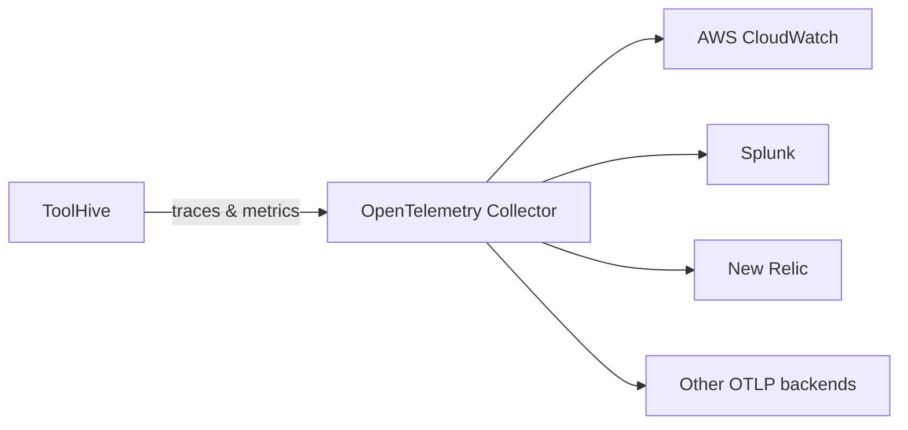

ToolHive includes built-in instrumentation using OpenTelemetry, which gives you
comprehensive observability for your MCP server interactions. You can export
traces and metrics to popular observability backends like Jaeger, Honeycomb,
Datadog, and Grafana Cloud, or expose Prometheus metrics locally.

## What you can monitor

ToolHive's telemetry captures detailed information about MCP interactions
including traces, metrics, and performance data. For a comprehensive overview of
the telemetry architecture, metrics collection, and monitoring capabilities, see
the [observability overview](../concepts/observability.md).

## Enable telemetry

You can enable telemetry when running an MCP server by using the OpenTelemetry
flags with the [`thv run`](../reference/cli/thv_run.md) command or configure
defaults for all MCP servers using the
[`thv config otel`](../reference/cli/thv_config_otel.md) commands.

### Export to an OTLP endpoint

You can export traces and metrics to an OpenTelemetry Protocol (OTLP) compatible
backend using the `--otel-endpoint` flag. You can also specify headers for
authentication and configure sampling rates.

This example runs the Fetch MCP server and exports traces to a local instance of
the [OpenTelemetry Collector](https://opentelemetry.io/docs/collector/):

```bash
thv run \
  --otel-endpoint localhost:4318 \
  --otel-service-name fetch-mcp \
  --otel-insecure \
  fetch
```

:::note

The `--otel-endpoint` is provided as a hostname and optional port, without a
scheme or path (e.g., use `api.honeycomb.io` or `api.honeycomb.io:443`, not
`https://api.honeycomb.io`). ToolHive automatically uses HTTPS unless
`--otel-insecure` is specified.

:::

By default, the service name is set to `toolhive-mcp-proxy`, and the sampling
rate is `0.1` (10%). You can customize these settings with additional
[configuration options](#configuration-options).

:::tip[Recommendation]

Set the `--otel-service-name` flag to a meaningful name for each MCP server.
This helps you identify the server in your observability backend.

:::

### Include environment variables

You can include specific environment variables from your host system in
telemetry spans using the `--otel-env-vars` flag. This is useful for adding
context like deployment environment or service version to your traces.

```bash
thv run \
  --otel-endpoint api.honeycomb.io \
  --otel-headers "x-honeycomb-team=<YOUR_API_KEY>" \
  --otel-env-vars "NODE_ENV,DEPLOYMENT_ENV,SERVICE_VERSION" \
  fetch
```

Only the environment variables you specify will be included in spans, and
they'll appear as attributes with the `environment.` prefix (e.g.,
`environment.NODE_ENV`).

### Enable Prometheus metrics

You can expose Prometheus-style metrics at `/metrics` on the main transport port
for local scraping using the `--otel-enable-prometheus-metrics-path` flag.

This example runs the Fetch MCP server and enables the Prometheus metrics
endpoint:

```bash
thv run --otel-enable-prometheus-metrics-path fetch
```

To access the metrics, you can use `curl` or any Prometheus-compatible scraper.
The metrics are available at `http://127.0.0.1:<PORT>/metrics`, where `<PORT>`
is the port assigned to the MCP server.

```bash
# Get the port number assigned to the MCP server
thv list

# Replace <PORT> with the actual port number from the output of `thv list`
curl http://127.0.0.1:<PORT>/metrics
```

### Dual export

You can export to both an OTLP endpoint and expose Prometheus metrics
simultaneously.

This example exports to Honeycomb and enables the Prometheus metrics endpoint:

```bash
thv run \
  --otel-endpoint api.honeycomb.io \
  --otel-headers "x-honeycomb-team=<YOUR_API_KEY>" \
  --otel-enable-prometheus-metrics-path \
  fetch
```

## Configuration options

You can configure telemetry settings globally or per MCP server. The global
configuration is stored in the ToolHive configuration file, while per-server
configuration can be specified using command-line flags when running an MCP
server.

### Per-server configuration

The table below lists the available configuration options for enabling telemetry
when running an MCP server with the `thv run` command:

```bash
thv run [--otel-endpoint <URL>] [--otel-service-name <NAME>] \
  [--otel-metrics-enabled]  [--otel-tracing-enabled] \
  [--otel-sampling-rate <RATE>] [--otel-headers <KEY=VALUE>] \
  [--otel-insecure] [--otel-enable-prometheus-metrics-path] \
  <SERVER>
```

| Flag                                    | Description                                                   | Default              |
| --------------------------------------- | ------------------------------------------------------------- | -------------------- |
| `--otel-endpoint`                       | OTLP endpoint (e.g., `api.honeycomb.io`)                      | None                 |
| `--otel-metrics-enabled`                | Enable OTLP metrics export (when OTLP endpoint is configured) | `true`               |
| `--otel-tracing-enabled`                | Enable distributed tracing (when OTLP endpoint is configured) | `true`               |
| `--otel-service-name`                   | Service name for telemetry                                    | `toolhive-mcp-proxy` |
| `--otel-sampling-rate`                  | Trace sampling rate (0.0-1.0)                                 | `0.1` (10%)          |
| `--otel-headers`                        | Authentication headers in `key=value` format                  | None                 |
| `--otel-env-vars`                       | List of environment variables to include in telemetry spans   | None                 |
| `--otel-insecure`                       | Connect using HTTP instead of HTTPS                           | `false`              |
| `--otel-enable-prometheus-metrics-path` | Enable `/metrics` endpoint                                    | `false`              |

### Global configuration

You can set default telemetry options for all MCP servers using the
[`thv config otel`](../reference/cli/thv_config_otel.md) command. This way you
don't have to set the same flags every time you run an MCP server.

These defaults are applied to all MCP servers unless overridden by command-line
flags when you run a specific server.

Currently the OpenTelemetry endpoint, sampling rate, and environment variables
can be set globally. For example, to set the default OTLP endpoint and sampling
rate:

```bash
thv config otel set-endpoint api.honeycomb.io
thv config otel set-metrics-enabled true
thv config otel set-tracing-enabled true
thv config otel set-sampling-rate 0.25
thv config otel set-enable-prometheus-metrics-path true
thv config otel set-insecure true
```

Each command has a corresponding `get` and `unset` command to retrieve or remove
the configuration. For example, to check the current OTLP endpoint:

```bash
thv config otel get-endpoint
```

## Observability backends

ToolHive can export telemetry data to many different observability backends. It
supports exporting traces and metrics to any backend that implements the OTLP
protocol. Some common examples are listed below, but specific configurations
will vary based on your environment and requirements.

### OpenTelemetry Collector (recommended)

The OpenTelemetry Collector is a vendor-agnostic way to receive, process and
export telemetry data. It supports many backend services, scalable deployment
options, and advanced processing capabilities.



You can run the OpenTelemetry Collector locally or use a managed service. For
local deployment, follow the
[OpenTelemetry Collector documentation](https://opentelemetry.io/docs/collector/).

To export data to a local OpenTelemetry Collector, set your OTLP endpoint to the
OTLP http receiver port (default is `4318`):

```bash
thv run \
  --otel-endpoint localhost:4318 \
  --otel-insecure \
  fetch
```

### Prometheus

To collect metrics using Prometheus, run your MCP server with the
`--otel-enable-prometheus-metrics-path` flag and add the following to your
Prometheus configuration:

```yaml title="prometheus.yml"
scrape_configs:
  - job_name: 'toolhive-mcp-proxy'
    static_configs:
      - targets: ['localhost:<MCP_SERVER_PORT>']
    scrape_interval: 15s
    metrics_path: /metrics
```

You can add multiple MCP servers to the `targets` list. Replace
`<MCP_SERVER_PORT>` with the port number assigned to each MCP server.

### Jaeger

Jaeger is a popular open-source distributed tracing system. You can run it
locally or use a managed service within your enterprise or from a third-party
provider.

Follow the
[Jaeger getting started guide](https://www.jaegertracing.io/docs/latest/getting-started/#all-in-one)
to set up a local Jaeger instance. Once running, you can export traces to Jaeger
by setting the OTLP endpoint to Jaeger's collector:

```bash
thv run \
  --otel-endpoint localhost:4318 \
  --otel-metrics-enabled=false \
  --otel-insecure \
  <SERVER>
```

Access the Jaeger UI at `http://localhost:16686` to view traces.

### Honeycomb

You can send OpenTelemetry data directly to
[Honeycomb's OTLP endpoint](https://docs.honeycomb.io/send-data/opentelemetry/#using-the-honeycomb-opentelemetry-endpoint),
or use the [OpenTelemetry Collector](#opentelemetry-collector-recommended) to
forward data to Honeycomb. This example sends data directly to Honeycomb:

```bash
thv run \
  --otel-endpoint api.honeycomb.io \
  --otel-headers "x-honeycomb-team=<YOUR_API_KEY>" \
  --otel-service-name production-mcp-proxy \
  <SERVER>
```

You'll need your Honeycomb API key, which you can find in your
[Honeycomb account settings](https://ui.honeycomb.io/account).

### Datadog

Datadog has [multiple options](https://docs.datadoghq.com/opentelemetry/) for
collecting OpenTelemetry data:

- The
  [**OpenTelemetry Collector**](https://docs.datadoghq.com/opentelemetry/setup/collector_exporter/)
  is recommended for existing OpenTelemetry users or users wanting a
  vendor-neutral solution.

- The [**Datadog Agent**](https://docs.datadoghq.com/opentelemetry/setup/agent)
  is recommended for existing Datadog users.

### Grafana Cloud

You can send OpenTelemetry data to Grafana Cloud using
[Grafana Alloy](https://grafana.com/docs/opentelemetry/collector/grafana-alloy/),
Grafana Labs' supported distribution of the OpenTelemetry Collector. This is the
recommended method for production deployments.

You can also send data directly to
[Grafana Cloud's OTLP endpoint](https://grafana.com/docs/grafana-cloud/send-data/otlp/send-data-otlp/#manual-opentelemetry-setup-for-advanced-users):

```bash
thv run \
  --otel-endpoint otlp-gateway-prod-us-central-0.grafana.net \
  --otel-headers "Authorization=Basic $(echo -n 'user:password' | base64)" \
  <SERVER>
```

## Performance considerations

### Sampling rates

Adjust sampling rates based on your environment:

- **Development**: `--otel-sampling-rate 1.0` (100% sampling)
- **Production**: `--otel-sampling-rate 0.01` (1% sampling for high-traffic
  systems)
- **Default**: `--otel-sampling-rate 0.1` (10% sampling)

### Network overhead

Telemetry adds minimal overhead when properly configured:

- Use appropriate sampling rates for your traffic volume
- Monitor your observability backend costs and adjust sampling accordingly

## Related information

- [Telemetry and monitoring concepts](../concepts/observability.md)
- [`thv run` command reference](../reference/cli/thv_run.md)
- [Run MCP servers](run-mcp-servers.mdx)

## Troubleshooting

<details>
<summary>Traces not received by collector</summary>

If traces aren't showing up in your backend:

1. Verify the endpoint URL and authentication headers
2. Check network connectivity to the OTLP endpoint
3. Ensure sampling rate isn't too low (set to `1.0` temporarily for testing)
4. Check the ToolHive log file for errors related to telemetry (the log file
   path is displayed when you start a server with `thv run`)
5. If your endpoint uses a self-signed certificate or a certificate from a
   custom CA, use the `--thv-ca-bundle` flag to add your CA or self-signed
   certificate.

</details>

<details>
<summary>Prometheus metrics not available</summary>

If the `/metrics` endpoint isn't accessible:

1. Confirm `--otel-enable-prometheus-metrics-path` is set
2. Check that you're accessing the correct port
3. Verify no firewall is blocking the port

</details>

<details>
<summary>High CPU or memory usage</summary>

If telemetry is consuming too many resources on your system:

1. Reduce the sampling rate with `--otel-sampling-rate` for specific servers or
   globally with `thv config otel set-sampling-rate`
2. Only enable telemetry for servers you need to monitor
3. Monitor the resource usage of the OpenTelemetry Collector or other backend
   services

</details>
