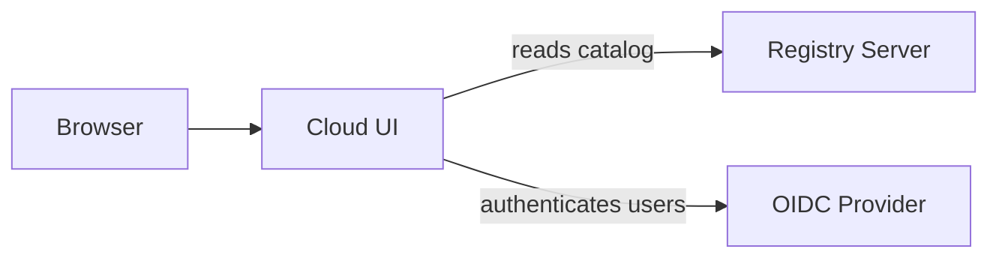

The ToolHive Cloud UI is a web application that gives your team a shared catalog
of MCP servers. It connects to a [Registry Server](../guides-registry/index.mdx)
and displays every registered server in a browsable interface, so team members
can discover available servers and copy connection URLs into their AI agents or
clients.

Use the Cloud UI when you want to:

- Give your team a single place to discover MCP servers without using the CLI or
  desktop app.
- Provide a self-service catalog where users copy server URLs directly into
  their AI workflows.
- Layer authentication on top of the catalog with your existing identity
  provider (IdP).

:::note

The Cloud UI is a **read-oriented catalog** that works alongside the Registry
Server. It does not start or stop MCP servers. To manage server lifecycles, use
the [ToolHive CLI](../guides-cli/index.mdx),
[ToolHive UI](../guides-ui/index.mdx), or
[Kubernetes Operator](../guides-k8s/index.mdx).

:::

## Architecture overview

The Cloud UI is a Next.js application with two main dependencies:

- **Registry Server** - provides the MCP server catalog through the
  [MCP Registry API](../reference/registry-api.mdx). The Cloud UI reads server
  entries from this API.
- **OIDC provider** - handles user authentication. The Cloud UI uses
  [Better Auth](https://www.better-auth.com/) with any standards-compliant OIDC
  provider (Okta, Microsoft Entra ID, Auth0, and others).

## Next steps

- [Deploy the Cloud UI](./deployment.mdx) on Kubernetes with the Helm chart, a
  Registry Server, and your OIDC provider.
- [Configure the Cloud UI](./configuration.mdx) with environment variables and
  OIDC settings.
