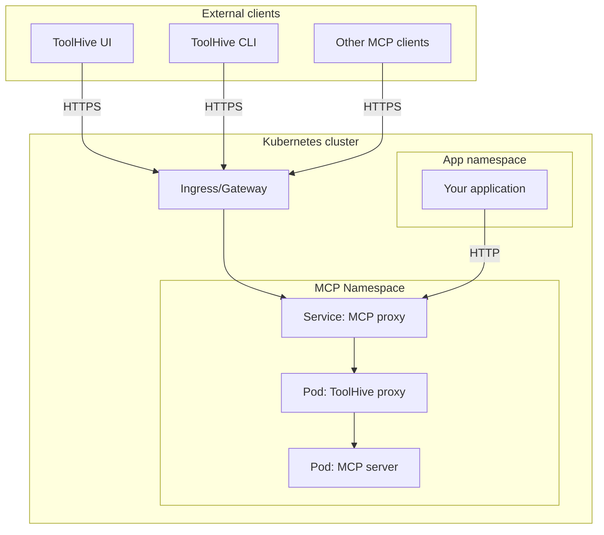

import Tabs from '@theme/Tabs';
import TabItem from '@theme/TabItem';

## Overview

After deploying MCP servers in your Kubernetes cluster, you need to connect
clients to use them. This guide covers two main connection scenarios:

1. **External clients** - Connecting from outside the cluster using Ingress or
   Gateway API to expose MCP servers
2. **Internal clients** - Connecting from applications running within the same
   Kubernetes cluster



## Prerequisites

- A Kubernetes cluster with MCP servers deployed (see
  [Run MCP servers in Kubernetes](./run-mcp-k8s.mdx))
- An Ingress controller or Gateway API implementation installed in your cluster
  (for external access)
- [`kubectl`](https://kubernetes.io/docs/tasks/tools/) configured to communicate
  with your cluster

## Connect from outside the cluster

To make your MCP servers accessible to external clients like the ToolHive UI,
ToolHive CLI, or other MCP clients, you need to expose the proxy service using
an Ingress resource or Gateway API.

:::info[Service naming convention]

The ToolHive operator automatically creates a Kubernetes Service for each
MCPServer, MCPRemoteProxy, and VirtualMCPServer resource using the following
naming patterns using the resource name:

- MCPServer: `mcp-<SERVER_NAME>-proxy`
- MCPRemoteProxy: `mcp-<SERVER_NAME>-remote-proxy`
- VirtualMCPServer: `vmcp-<SERVER_NAME>`

For example, an MCPServer named `fetch` gets a Service named `mcp-fetch-proxy`.

:::

:::warning[Security requirements]

When exposing MCP servers externally, you should:

- Always use HTTPS with valid TLS certificates
- Configure authentication to control access (see
  [Authentication and authorization](./auth-k8s.mdx))
- Consider network policies to restrict traffic

Running MCP servers without authentication on public networks is a security
risk.

:::

### Option 1: Using Ingress

Ingress provides a stable API for exposing HTTP/HTTPS services. This example
shows a generic Ingress configuration that works with popular Ingress
controllers like Traefik, Contour, and HAProxy, as well as cloud provider
implementations like AWS Load Balancer Controller, Google Cloud Load Balancer,
and Azure Application Gateway.

First, ensure you have an MCP server deployed. This example uses the `fetch`
server:

```yaml title="fetch-server.yaml"
apiVersion: toolhive.stacklok.dev/v1alpha1
kind: MCPServer
metadata:
  name: fetch
  namespace: toolhive-system
spec:
  image: ghcr.io/stackloklabs/gofetch/server:latest
  transport: streamable-http
  mcpPort: 8080
  proxyPort: 8080
```

Create an Ingress resource to expose the MCP server proxy. You can use either
host-based routing (separate subdomain per server) or path-based routing (single
domain with paths):

<Tabs groupId='routing-method' queryString='routing-method'>
<TabItem value='host-based' label='Host-based routing' default>

Each MCP server gets its own subdomain:

```yaml title="fetch-ingress.yaml"
apiVersion: networking.k8s.io/v1
kind: Ingress
metadata:
  name: fetch-mcp-ingress
  namespace: toolhive-system
  annotations:
    cert-manager.io/cluster-issuer: 'letsencrypt-prod'
spec:
  ingressClassName: traefik
  tls:
    - hosts:
        - fetch-mcp.example.com
      secretName: fetch-mcp-tls
  rules:
    - host: fetch-mcp.example.com
      http:
        paths:
          - path: /
            pathType: Prefix
            backend:
              service:
                name: mcp-fetch-proxy
                port:
                  number: 8080
```

The MCP server is accessible at `https://fetch-mcp.example.com/mcp`.

</TabItem>
<TabItem value='path-based' label='Path-based routing'>

Multiple MCP servers share a single domain using path prefixes. This approach
requires URL rewriting to strip the path prefix before forwarding to the backend
service.

:::note

Path rewriting support and syntax varies by Ingress controller. Check your
controller's documentation for the correct annotations or resources.

:::

```yaml title="mcp-ingress.yaml"
apiVersion: networking.k8s.io/v1
kind: Ingress
metadata:
  name: mcp-servers-ingress
  namespace: toolhive-system
  annotations:
    cert-manager.io/cluster-issuer: 'letsencrypt-prod'
    # Traefik example: strip path prefix
    traefik.ingress.kubernetes.io/router.middlewares: toolhive-system-strip-mcp-prefix@kubernetescrd
spec:
  ingressClassName: traefik
  tls:
    - hosts:
        - mcp.example.com
      secretName: mcp-tls
  rules:
    - host: mcp.example.com
      http:
        paths:
          # Fetch MCP server
          - path: /fetch
            pathType: Prefix
            backend:
              service:
                name: mcp-fetch-proxy
                port:
                  number: 8080
          # Another MCP server
          - path: /<SERVER_NAME>
            pathType: Prefix
            backend:
              service:
                name: mcp-<SERVER_NAME>-proxy
                port:
                  number: 8080
---
# Traefik Middleware to strip path prefixes
apiVersion: traefik.io/v1alpha1
kind: Middleware
metadata:
  name: strip-mcp-prefix
  namespace: toolhive-system
spec:
  stripPrefix:
    prefixes:
      - /fetch
      - /<SERVER_NAME>
```

The MCP servers are accessible at `https://mcp.example.com/fetch/mcp` and
`https://mcp.example.com/<SERVER_NAME>/mcp`.

</TabItem>
<TabItem value='path-based-auth' label='Path-based routing with OAuth'>

This example is the same as the previous path-based routing example but includes
additional rules in the Ingress to direct the `.well-known` path for each MCP
server to the corresponding backend. This is necessary when using OAuth
authentication since the OAuth flow requires access to the `.well-known`
endpoint for discovery.

First, in the MCPServer spec for each server, ensure the `resourceUrl` property
is set to the full client-facing URL:

```yaml title="fetch-server-oauth.yaml"
apiVersion: toolhive.stacklok.dev/v1alpha1
kind: MCPServer
# ...
spec:
  oidcConfig:
    type: inline
    resourceUrl: https://mcp.example.com/<SERVER_NAME>/mcp
    inline:
      # ... other OIDC config ...
```

The `inline.audience` value should match the audience expected by your identity
provider, and is likely the same for all servers using the same authorization
server. See [Authentication and authorization](./auth-k8s.mdx) for full OIDC
setup instructions.

Configure the Ingress with additional rules for the `.well-known` paths of each
MCP server that has OAuth enabled:

:::note

Path rewriting support and syntax varies by Ingress controller. Check your
controller's documentation for the correct annotations or resources.

:::

```yaml {28-34,43-49} title="mcp-ingress.yaml"
apiVersion: networking.k8s.io/v1
kind: Ingress
metadata:
  name: mcp-servers-ingress
  namespace: toolhive-system
  annotations:
    cert-manager.io/cluster-issuer: 'letsencrypt-prod'
    # Traefik example: strip path prefix
    traefik.ingress.kubernetes.io/router.middlewares: toolhive-system-strip-mcp-prefix@kubernetescrd
spec:
  ingressClassName: traefik
  tls:
    - hosts:
        - mcp.example.com
      secretName: mcp-tls
  rules:
    - host: mcp.example.com
      http:
        paths:
          # Fetch MCP server
          - path: /fetch
            pathType: Prefix
            backend:
              service:
                name: mcp-fetch-proxy
                port:
                  number: 8080
          - path: /.well-known/oauth-protected-resource/fetch/mcp
            pathType: Exact
            backend:
              service:
                name: mcp-fetch-proxy
                port:
                  number: 8080
          # Another MCP server
          - path: /<SERVER_NAME>
            pathType: Prefix
            backend:
              service:
                name: mcp-<SERVER_NAME>-proxy
                port:
                  number: 8080
          - path: /.well-known/oauth-protected-resource/<SERVER_NAME>/mcp
            pathType: Exact
            backend:
              service:
                name: mcp-<SERVER_NAME>-proxy
                port:
                  number: 8080
---
# Traefik Middleware to strip path prefixes
apiVersion: traefik.io/v1alpha1
kind: Middleware
metadata:
  name: strip-mcp-prefix
  namespace: toolhive-system
spec:
  stripPrefix:
    prefixes:
      - /fetch
      - /<SERVER_NAME>
```

The MCP servers are accessible at `https://mcp.example.com/fetch/mcp` and
`https://mcp.example.com/<SERVER_NAME>/mcp`.

</TabItem>
</Tabs>

Apply the resources:

```bash
kubectl apply -f fetch-server.yaml
kubectl apply -f fetch-ingress.yaml  # or mcp-ingress.yaml for path-based
```

Verify the Ingress is configured:

```bash
kubectl get ingress -n toolhive-system
```

### Option 2: Using Gateway API

The [Gateway API](https://gateway-api.sigs.k8s.io/) is a more expressive way to
expose services and is the successor to Ingress. This example works with Gateway
API implementations like Cilium, Istio, Envoy Gateway, and Traefik, as well as
cloud provider implementations like AWS Gateway API Controller, Google
Kubernetes Engine (GKE) Gateway controller, and Azure Application Gateway for
Containers. See the
[full list of implementations](https://gateway-api.sigs.k8s.io/implementations/).

:::tip

For a complete working example using the ngrok Gateway API implementation, see
the
[Configure secure ingress for MCP servers on Kubernetes](../tutorials/k8s-ingress-ngrok.mdx)
tutorial.

:::

Many Gateway API implementations create a Gateway resource automatically during
installation. For example, Traefik's Helm chart creates a `traefik-gateway` in
the default namespace when enabled. Check if a Gateway already exists:

```bash
kubectl get gateway --all-namespaces
```

If a Gateway exists, note its name and namespace to use in your HTTPRoute. If
you need to create a new Gateway, use this example:

```yaml title="mcp-gateway.yaml"
apiVersion: gateway.networking.k8s.io/v1
kind: Gateway
metadata:
  name: mcp-gateway
  namespace: toolhive-system
spec:
  gatewayClassName: traefik # Change to match your Gateway implementation
  listeners:
    - name: https
      protocol: HTTPS
      port: 443
      tls:
        mode: Terminate
        certificateRefs:
          - name: mcp-gateway-cert
      allowedRoutes:
        namespaces:
          from: Same
```

Create an HTTPRoute to expose your MCP server. You can use either host-based
routing (separate subdomain per server) or path-based routing (single domain
with paths):

<Tabs groupId='routing-method' queryString='routing-method'>
<TabItem value='host-based' label='Host-based routing' default>

Each MCP server gets its own subdomain:

```yaml title="fetch-route.yaml"
apiVersion: gateway.networking.k8s.io/v1
kind: HTTPRoute
metadata:
  name: fetch-mcp-route
  namespace: toolhive-system
spec:
  parentRefs:
    - name: mcp-gateway # Reference your Gateway name (e.g., traefik-gateway)
      # namespace: default # Uncomment if Gateway is in a different namespace
  hostnames:
    - fetch-mcp.example.com # Change to your domain
  rules:
    - backendRefs:
        - name: mcp-fetch-proxy # Format: mcp-<SERVER_NAME>-proxy
          port: 8080 # This matches the proxyPort
```

The MCP server is accessible at `https://fetch-mcp.example.com/mcp`.

</TabItem>
<TabItem value='path-based' label='Path-based routing'>

Multiple MCP servers share a single domain using path prefixes. This approach
uses URL rewriting to strip the path prefix before forwarding to the backend
service.

```yaml title="mcp-routes.yaml"
apiVersion: gateway.networking.k8s.io/v1
kind: HTTPRoute
metadata:
  name: mcp-servers-route
  namespace: toolhive-system
spec:
  parentRefs:
    - name: mcp-gateway # Reference your Gateway name (e.g., traefik-gateway)
      # namespace: default # Uncomment if Gateway is in a different namespace
  hostnames:
    - mcp.example.com # Change to your domain
  rules:
    # Fetch MCP server
    - matches:
        - path:
            type: PathPrefix
            value: /fetch
      filters:
        - type: URLRewrite
          urlRewrite:
            path:
              type: ReplacePrefixMatch
              replacePrefixMatch: /
      backendRefs:
        - name: mcp-fetch-proxy # Format: mcp-<SERVER_NAME>-proxy
          port: 8080 # This matches the proxyPort
    # Another MCP server
    - matches:
        - path:
            type: PathPrefix
            value: /<SERVER_NAME>
      filters:
        - type: URLRewrite
          urlRewrite:
            path:
              type: ReplacePrefixMatch
              replacePrefixMatch: /
      backendRefs:
        - name: mcp-<SERVER_NAME>-proxy
          port: 8080
```

The MCP servers are accessible at `https://mcp.example.com/fetch/mcp` and
`https://mcp.example.com/<SERVER_NAME>/mcp`.

The `URLRewrite` filter removes the path prefix (e.g., `/fetch`) before
forwarding requests to the backend service, so the MCP server receives requests
at `/mcp` as expected.

</TabItem>
<TabItem value='path-based-auth' label='Path-based routing with OAuth'>

This example is the same as the previous path-based routing example but includes
additional rules in the HTTPRoute to direct the `.well-known` path for each MCP
server to the corresponding backend. This is necessary when using OAuth
authentication since the OAuth flow requires access to the `.well-known`
endpoint for discovery.

First, in the MCPServer spec for each server, ensure the `resourceUrl` property
is set to the full client-facing URL:

```yaml title="fetch-server-oauth.yaml"
apiVersion: toolhive.stacklok.dev/v1alpha1
kind: MCPServer
# ...
spec:
  oidcConfig:
    type: inline
    resourceUrl: https://mcp.example.com/<SERVER_NAME>/mcp
    inline:
      # ... other OIDC config ...
```

The `inline.audience` value should match the audience expected by your identity
provider, and is likely the same for all servers using the same authorization
server. See [Authentication and authorization](./auth-k8s.mdx) for full OIDC
setup instructions.

Configure the HTTPRoute with additional rules for the `.well-known` paths of
each MCP server that has OAuth enabled:

```yaml {27-33,48-54} title="mcp-routes.yaml"
apiVersion: gateway.networking.k8s.io/v1
kind: HTTPRoute
metadata:
  name: mcp-servers-route
  namespace: toolhive-system
spec:
  parentRefs:
    - name: mcp-gateway # Reference your Gateway name (e.g., traefik-gateway)
      # namespace: default # Uncomment if Gateway is in a different namespace
  hostnames:
    - mcp.example.com # Change to your domain
  rules:
    # Fetch MCP server
    - matches:
        - path:
            type: PathPrefix
            value: /fetch
      filters:
        - type: URLRewrite
          urlRewrite:
            path:
              type: ReplacePrefixMatch
              replacePrefixMatch: /
      backendRefs:
        - name: mcp-fetch-proxy # Format: mcp-<SERVER_NAME>-proxy
          port: 8080 # This matches the proxyPort
    - matches:
        - path:
            type: Exact
            value: /.well-known/oauth-protected-resource/fetch/mcp
      backendRefs:
        - name: mcp-fetch-proxy
          port: 8080
    # Another MCP server
    - matches:
        - path:
            type: PathPrefix
            value: /<SERVER_NAME>
      filters:
        - type: URLRewrite
          urlRewrite:
            path:
              type: ReplacePrefixMatch
              replacePrefixMatch: /
      backendRefs:
        - name: mcp-<SERVER_NAME>-proxy
          port: 8080
    - matches:
        - path:
            type: Exact
            value: /.well-known/oauth-protected-resource/<SERVER_NAME>/mcp
      backendRefs:
        - name: mcp-<SERVER_NAME>-proxy
          port: 8080
```

The MCP servers are accessible at `https://mcp.example.com/fetch/mcp` and
`https://mcp.example.com/<SERVER_NAME>/mcp`.

The `URLRewrite` filter removes the path prefix (e.g., `/fetch`) before
forwarding requests to the backend service, so the MCP server receives requests
at `/mcp` as expected.

</TabItem>
</Tabs>

Apply the resources:

```bash
kubectl apply -f mcp-gateway.yaml  # If creating a new Gateway
kubectl apply -f fetch-route.yaml  # or mcp-routes.yaml for path-based
```

Verify the route is configured:

```bash
kubectl get httproute -n toolhive-system
```

### TLS certificates

For production deployments, use valid TLS certificates from a trusted
certificate authority. The most common approaches are:

<Tabs groupId='cert-method'>
<TabItem value='cert-manager' label='cert-manager' default>

[cert-manager](https://cert-manager.io/) automates certificate management in
Kubernetes. Install cert-manager and create a ClusterIssuer:

```yaml title="letsencrypt-issuer.yaml"
apiVersion: cert-manager.io/v1
kind: ClusterIssuer
metadata:
  name: letsencrypt-prod
spec:
  acme:
    server: https://acme-v02.api.letsencrypt.org/directory
    email: your-email@example.com # Change to your email
    privateKeySecretRef:
      name: letsencrypt-prod
    solvers:
      - http01:
          ingress:
            class: traefik # Change to match your Ingress controller
```

Apply it:

```bash
kubectl apply -f letsencrypt-issuer.yaml
```

The Ingress example above already includes the cert-manager annotation. Once
cert-manager is installed, it will automatically provision and renew
certificates.

</TabItem>
<TabItem value='manual' label='Manual certificates'>

If you have existing certificates, create a Kubernetes Secret:

```bash
kubectl create secret tls fetch-mcp-tls \
  --cert=path/to/tls.crt \
  --key=path/to/tls.key \
  -n toolhive-system
```

Reference this secret in your Ingress or Gateway configuration as shown in the
examples above.

</TabItem>
</Tabs>

### Connect with ToolHive UI or CLI

Once your MCP server is exposed with HTTPS, you can connect to it as a remote
MCP server from the ToolHive UI or CLI.

<Tabs groupId='mode' queryString='mode'>
<TabItem value='ui' label='ToolHive UI' default>

In the ToolHive UI:

1. Click **Add an MCP server** on the **MCP Servers** page
2. Select **Add a remote MCP server**
3. Enter the connection details:
   - **Name**: A friendly name for the server
   - **Server URL**: Use the appropriate URL based on your routing approach:
     - Host-based: `https://fetch-mcp.example.com/mcp`
     - Path-based: `https://mcp.example.com/fetch/mcp`
   - **Transport**: Streamable HTTP (or SSE if your server uses SSE)
4. If authentication is configured, select the method and enter the required
   OAuth or OIDC details
5. Click **Install server**

The MCP server appears in your server list and you can use it with any connected
MCP client.

</TabItem>
<TabItem value='cli' label='ToolHive CLI'>

Use the `thv run` command to connect:

```bash
# Host-based routing: separate subdomain per server
thv run --name fetch-k8s https://fetch-mcp.example.com/mcp

# Path-based routing: single domain with paths
thv run --name fetch-k8s https://mcp.example.com/fetch/mcp
```

If authentication is configured, add the appropriate flags. See the
[ToolHive CLI guide](../guides-cli/run-mcp-servers.mdx#authentication-setup) for
details.

The MCP server is now available to your configured MCP clients.

</TabItem>
</Tabs>

For more details on using remote MCP servers, see:

- [Run remote MCP servers (UI)](../guides-ui/run-mcp-servers.mdx?custom-type=custom_remote#install-a-custom-mcp-server)
- [Run remote MCP servers (CLI)](../guides-cli/run-mcp-servers.mdx#run-a-remote-mcp-server)

## Connect from within the cluster

Applications running inside your Kubernetes cluster can connect directly to MCP
server proxy services using Kubernetes service discovery. This is more efficient
and secure than routing through an external Ingress.

### Service DNS names

Each MCPServer, MCPRemoteProxy, or VirtualMCPServer automatically gets a
Kubernetes Service that other pods can use to connect using the following naming
patterns:

- MCPServer: `mcp-<SERVER_NAME>-proxy`
- MCPRemoteProxy: `mcp-<SERVER_NAME>-remote-proxy`
- VirtualMCPServer: `vmcp-<SERVER_NAME>`

The full DNS name follows the standard Kubernetes pattern:

```text
<SERVICE_NAME>.<NAMESPACE>.svc.cluster.local:<proxyPort>
```

For example, if you have an MCPServer named `fetch` in the `toolhive-system`
namespace with `proxyPort: 8080`, the full URL is:

```text
http://mcp-fetch-proxy.toolhive-system.svc.cluster.local:8080
```

Within the same namespace, you can use the short form:

```text
http://mcp-fetch-proxy:8080
```

### Example: Configuring applications

When deploying applications like AI agents in the same cluster, configure them
to use the service DNS name. This example shows how to pass the connection URL
as an environment variable:

```yaml title="agent-app.yaml"
apiVersion: apps/v1
kind: Deployment
metadata:
  name: my-agent-app
  namespace: my-app
spec:
  # ... other deployment configuration ...
  template:
    spec:
      containers:
        - name: app
          image: my-agent-app:latest
          env:
            - name: MCP_SERVER_URL
              # Different namespace: use full DNS name
              value: 'http://mcp-fetch-proxy.toolhive-system.svc.cluster.local:8080/mcp'
              # Same namespace: use short name
              # value: 'http://mcp-fetch-proxy:8080/mcp'
```

### Network policies for cross-namespace access

If your cluster uses network policies, you may need to create a policy to allow
traffic between namespaces:

```yaml title="allow-cross-namespace.yaml"
apiVersion: networking.k8s.io/v1
kind: NetworkPolicy
metadata:
  name: allow-app-to-mcp
  namespace: toolhive-system
spec:
  podSelector:
    matchLabels:
      app.kubernetes.io/name: toolhive-proxy
  policyTypes:
    - Ingress
  ingress:
    - from:
        - namespaceSelector:
            matchLabels:
              name: my-app # Your app's namespace must have this label
```

## Authentication for external clients

When exposing MCP servers externally, configure authentication to control
access. ToolHive supports multiple authentication methods:

- **OIDC authentication** - Use external identity providers like Google, GitHub,
  Okta, or Microsoft Entra ID
- **Kubernetes service accounts** - For service-to-service authentication within
  the cluster

See the [Authentication and authorization](./auth-k8s.mdx) guide for detailed
setup instructions.

## Check connection status

### Test external connectivity

If you have the ToolHive CLI installed, you can test connectivity to your MCP
server:

```bash
thv mcp list tools --server https://fetch-mcp.example.com/mcp
```

Or use `curl` to send a JSON-RPC request:

```bash
# Host-based routing
curl -X POST https://fetch-mcp.example.com/mcp \
  -H "Content-Type: application/json" \
  -d '{"jsonrpc":"2.0","method":"tools/list","id":1}'

# Path-based routing
curl -X POST https://mcp.example.com/fetch/mcp \
  -H "Content-Type: application/json" \
  -d '{"jsonrpc":"2.0","method":"tools/list","id":1}'
```

You should receive a JSON response with a list of available tools.

:::tip

If you've configured authentication on your MCP server, see the
[Authentication and authorization](./auth-k8s.mdx) guide for how to test
authenticated connections.

:::

### Test internal connectivity

Test connectivity from within the cluster:

```bash
# Port-forward to test locally
kubectl port-forward -n toolhive-system service/mcp-fetch-proxy 8080:8080

# In another terminal, test the connection
curl -X POST http://localhost:8080/mcp \
  -H "Content-Type: application/json" \
  -d '{"jsonrpc":"2.0","method":"tools/list","id":1}'
```

### Verify the connection path

Check that the Ingress or Gateway is properly configured and the Service has
running pods:

```bash
# For Ingress: verify it exists and has an address
kubectl get ingress -n toolhive-system fetch-mcp-ingress

# For Gateway API: check HTTPRoute status (look for "Accepted: True" in conditions)
kubectl describe httproute -n toolhive-system fetch-mcp-route

# Verify the Service exists
kubectl get service -n toolhive-system mcp-fetch-proxy

# Check that the proxy pod is running
kubectl get pods -n toolhive-system -l app.kubernetes.io/instance=fetch
```

If the Ingress shows an address or the HTTPRoute status shows "Accepted: True",
and the pod is running, the connection path is properly configured.

## Next steps

Learn how to secure your MCP servers with
[Authentication and authorization](./auth-k8s.mdx).

Configure [Telemetry and metrics](./telemetry-and-metrics.mdx) to monitor your
MCP server usage and performance.

[Set up logging](./logging.mdx) to track requests and audit MCP server activity.

## Related information

- [Run MCP servers in Kubernetes](./run-mcp-k8s.mdx) - Deploy MCP servers in
  your cluster
- [Proxy remote MCP servers](./remote-mcp-proxy.mdx) - Create proxies for
  external MCP servers
- [Client compatibility](../reference/client-compatibility.mdx) - Supported MCP
  clients and configuration
- [Kubernetes CRD reference](../reference/crd-spec.md#apiv1alpha1mcpserver) -
  Full MCPServer specification
- [Configure secure ingress tutorial](../tutorials/k8s-ingress-ngrok.mdx) -
  Complete tutorial using ngrok and Gateway API

## Troubleshooting

<details>
<summary>Ingress returns 503 Service Unavailable</summary>

If your Ingress returns a 503 error:

```bash
# Check if the service exists
kubectl get service -n toolhive-system mcp-fetch-proxy

# Check the proxy pod is running
kubectl get pods -n toolhive-system -l app.kubernetes.io/instance=fetch

# Check pod logs for errors
kubectl logs -n toolhive-system -l app.kubernetes.io/instance=fetch
```

Common causes:

- **Proxy pod not running**: Ensure the MCPServer resource was created
  successfully
- **Wrong service name**: The Ingress backend service name must follow the
  naming conventions defined above
- **Wrong port**: The Ingress backend port must match the `proxyPort` in the
  MCPServer spec
- **Pod health check failing**: Check the proxy pod logs for errors

</details>

<details>
<summary>TLS certificate issues</summary>

If you see certificate errors when connecting:

```bash
# Check the certificate secret exists
kubectl get secret -n toolhive-system fetch-mcp-tls

# Describe the secret to verify it contains tls.crt and tls.key
kubectl describe secret -n toolhive-system fetch-mcp-tls

# If using cert-manager, check certificate status
kubectl get certificate -n toolhive-system

# Check cert-manager logs
kubectl logs -n cert-manager -l app=cert-manager
```

Common causes:

- **Certificate not ready**: Wait for cert-manager to provision the certificate
  (can take a few minutes)
- **DNS not configured**: Ensure your domain points to the Ingress load balancer
- **Challenge validation failing**: Check cert-manager logs for ACME challenge
  errors
- **Wrong ClusterIssuer**: Verify the cert-manager annotation references an
  existing ClusterIssuer

</details>

<details>
<summary>Authentication failures</summary>

If OAuth authentication is failing when connecting to your MCP server:

```bash
# Test if the OAuth metadata endpoint is accessible
# For host-based routing
curl https://fetch-mcp.example.com/.well-known/oauth-protected-resource

# For path-based routing
curl https://mcp.example.com/.well-known/oauth-protected-resource/fetch/mcp

# Check proxy logs for authentication errors
kubectl logs -n toolhive-system -l app.kubernetes.io/instance=fetch

# Verify the MCPServer OIDC configuration
kubectl get mcpserver -n toolhive-system fetch -o yaml | grep -A15 oidcConfig
```

Common causes:

- **`.well-known` endpoint not accessible**: When using path-based routing with
  OAuth, you must configure your Ingress or HTTPRoute to forward the
  `.well-known` path to the backend. See the "Path-based routing with OAuth" tab
  in the Ingress or Gateway API sections above for configuration examples.
- **Missing or incorrect `resourceUrl`**: Ensure the `resourceUrl` in your
  MCPServer's `oidcConfig` matches the client-facing URL (e.g.,
  `https://mcp.example.com/fetch/mcp` for path-based routing).
- **Token validation failure**: The token's `aud` claim must match the
  configured audience in your MCPServer's OIDC configuration.
- **Issuer mismatch**: The token's `iss` claim must match the configured issuer.
- **JWKS endpoint unreachable**: Check that the proxy can reach your identity
  provider's JWKS endpoint to validate tokens.

For detailed OAuth setup and troubleshooting, see the
[Authentication and authorization](./auth-k8s.mdx) guide.

</details>

<details>
<summary>Cannot connect from within cluster</summary>

If pods cannot connect to the MCP server service:

```bash
# Verify service exists
kubectl get service -n toolhive-system mcp-fetch-proxy

# Check that pods are running
kubectl get pods -n toolhive-system -l app.kubernetes.io/instance=fetch

# Test DNS resolution from a pod
kubectl run test-dns -n toolhive-system --image=busybox --restart=Never -- \
  nslookup mcp-fetch-proxy.toolhive-system.svc.cluster.local

# Check the DNS test results
kubectl logs -n toolhive-system test-dns

# Clean up the test pod
kubectl delete pod -n toolhive-system test-dns

# Test connectivity from a pod
kubectl run test-curl -n toolhive-system --image=curlimages/curl --restart=Never -- \
  curl -X POST http://mcp-fetch-proxy:8080/mcp \
  -H "Content-Type: application/json" \
  -d '{"jsonrpc":"2.0","method":"tools/list","id":1}'

# Check the connectivity test results
kubectl logs -n toolhive-system test-curl

# Clean up the test pod
kubectl delete pod -n toolhive-system test-curl
```

Common causes:

- **Network policies blocking traffic**: Check for network policies that might
  prevent pod-to-pod communication
- **Wrong namespace**: Ensure you're using the correct service DNS name for
  cross-namespace access
- **Service not created**: The operator automatically creates services, but
  verify it exists
- **Wrong port**: Ensure you're using the `proxyPort` value from the MCPServer
  spec
- **Wrong service name**: Remember the service name follows the naming
  conventions defined above

</details>

<details>
<summary>Gateway API not working</summary>

If using Gateway API and connections fail:

```bash
# Check Gateway status
kubectl get gateway -n toolhive-system mcp-gateway

# Check HTTPRoute status
kubectl get httproute -n toolhive-system fetch-mcp-route

# Describe the HTTPRoute for detailed status
kubectl describe httproute -n toolhive-system fetch-mcp-route

# Check Gateway implementation logs (example for Istio)
kubectl logs -n istio-system -l app=istio-ingressgateway
```

Common causes:

- **Gateway not ready**: Wait for the Gateway to be accepted and programmed by
  the controller
- **Wrong gateway class**: Ensure `gatewayClassName` matches your installed
  Gateway API implementation
- **Listener configuration issues**: Verify the Gateway listener configuration
  matches the HTTPRoute requirements
- **Certificate issues**: For HTTPS, ensure the certificate reference exists and
  is valid

</details>

<details>
<summary>Cross-namespace access denied</summary>

If cross-namespace connections fail:

```bash
# Check network policies in the MCP server namespace
kubectl get networkpolicy -n toolhive-system

# Describe network policies to see rules
kubectl describe networkpolicy -n toolhive-system

# Check if the app namespace has the required labels
kubectl get namespace my-app --show-labels
```

Solutions:

- Create or update network policies to allow traffic from your app namespace
- Add required labels to your application namespace
- Test connectivity using a debug pod in the app namespace

</details>
