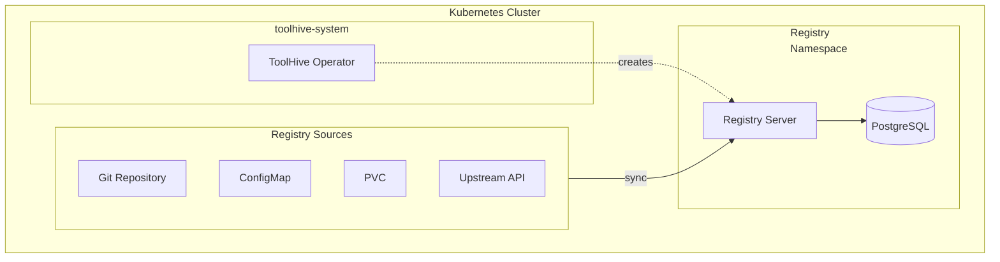

## Prerequisites

- A Kubernetes cluster (current and two previous minor versions are supported)
- Permissions to create resources in the cluster
- [`kubectl`](https://kubernetes.io/docs/tasks/tools/) configured to communicate
  with your cluster
- The ToolHive operator installed in your cluster (see
  [Deploy the operator using Helm](./deploy-operator-helm.mdx))
- A PostgreSQL database (recommended for production deployments)

## Overview

The ToolHive operator deploys the Registry server in Kubernetes by creating
`MCPRegistry` resources. This is the recommended method for deploying the
ToolHive Registry Server in Kubernetes environments.

### High-level architecture

This diagram shows the basic relationship between components. The ToolHive
operator watches for `MCPRegistry` resources and automatically creates the
necessary infrastructure to run the Registry server.



## Create a registry

You can create `MCPRegistry` resources in namespaces based on how the operator
was deployed.

- **Cluster mode (default)**: Create MCPRegistry resources in any namespace
- **Namespace mode**: Create MCPRegistry resources only in allowed namespaces

See [Deploy the operator](./deploy-operator-helm.mdx#operator-deployment-modes)
to learn about the different deployment modes.

To create a registry, define an `MCPRegistry` resource and apply it to your
cluster. This minimal example creates a registry that syncs from the ToolHive
Git repository.

```yaml title="my-registry.yaml"
apiVersion: toolhive.stacklok.dev/v1alpha1
kind: MCPRegistry
metadata:
  name: my-registry
  namespace: my-namespace # Update with your namespace
spec:
  displayName: My MCP Registry
  registries:
    - name: toolhive
      format: toolhive
      git:
        repository: https://github.com/stacklok/toolhive.git
        branch: main
        path: pkg/registry/data/registry.json
      syncPolicy:
        interval: '30m'
```

Apply the resource:

```bash
kubectl apply -f my-registry.yaml
```

:::info[What's happening?]

When you apply an `MCPRegistry` resource, here's what happens:

1. The ToolHive operator detects the new resource (if it's in an allowed
   namespace)
2. The operator creates the necessary RBAC resources in the target namespace
3. The operator creates a Deployment containing the Registry server pod and
   service
4. The Registry server syncs data from the configured sources
5. The Registry API becomes available at the service endpoint

:::

## Configuring source Registries

The `MCPRegistry` resource supports multiple registry source types. You can
configure one or more of them. Each type is mutually exclusive within a single
registry configuration.

### Git repository source

Clone and sync from Git repositories. Ideal for version-controlled registries.

```yaml {7-12} title="registry-git.yaml"
apiVersion: toolhive.stacklok.dev/v1alpha1
kind: MCPRegistry
metadata:
  name: git-registry
spec:
  registries:
    - name: toolhive
      format: toolhive
      git:
        repository: https://github.com/stacklok/toolhive.git
        branch: main
        path: pkg/registry/data/registry.json
      syncPolicy:
        interval: '30m'
```

**Git source fields:**

| Field        | Required | Description                                           |
| ------------ | -------- | ----------------------------------------------------- |
| `repository` | Yes      | Git repository URL (HTTP/HTTPS/SSH)                   |
| `branch`     | No       | Branch name (mutually exclusive with `tag`, `commit`) |
| `tag`        | No       | Tag name (mutually exclusive with `branch`, `commit`) |
| `commit`     | No       | Commit SHA (mutually exclusive with `branch`, `tag`)  |
| `path`       | No       | Path to registry file (default: `registry.json`)      |

:::tip

You can use `branch`, `tag`, or `commit` to pin to a specific version. If
multiple are specified, `commit` takes precedence over `tag`, which takes
precedence over `branch`.

:::

### ConfigMap source

Read from a Kubernetes ConfigMap. Ideal for registry data managed within the
cluster.

```yaml {7-11} title="registry-configmap.yaml"
apiVersion: toolhive.stacklok.dev/v1alpha1
kind: MCPRegistry
metadata:
  name: configmap-registry
spec:
  registries:
    - name: local
      format: upstream
      configMapRef:
        name: registry-data
        key: registry.json
      syncPolicy:
        interval: '15m'
```

The ConfigMap must exist in the same namespace as the `MCPRegistry` resource.

### PersistentVolumeClaim source

Read from a PersistentVolumeClaim. Useful for large registry files or shared
storage scenarios.

```yaml {7-10} title="registry-pvc.yaml"
apiVersion: toolhive.stacklok.dev/v1alpha1
kind: MCPRegistry
metadata:
  name: pvc-registry
spec:
  registries:
    - name: shared
      format: upstream
      pvcRef:
        claimName: registry-data-pvc
        path: registries/production.json
      syncPolicy:
        interval: '1h'
```

**PVC source fields:**

| Field       | Required | Description                                                 |
| ----------- | -------- | ----------------------------------------------------------- |
| `claimName` | Yes      | Name of the PersistentVolumeClaim                           |
| `path`      | No       | Path to registry file within PVC (default: `registry.json`) |

The PVC must exist in the same namespace as the `MCPRegistry` resource.

### API source

Sync from an upstream MCP Registry API. Supports federation and aggregation
scenarios.

```yaml {7-10} title="registry-api.yaml"
apiVersion: toolhive.stacklok.dev/v1alpha1
kind: MCPRegistry
metadata:
  name: api-registry
spec:
  registries:
    - name: upstream
      format: upstream
      api:
        endpoint: https://registry.example.com
      syncPolicy:
        interval: '1h'
```

The controller automatically appends the appropriate API paths to the endpoint
URL.

### Configure synchronization

Each registry source can have its own sync policy that controls automatic
synchronization.

```yaml
syncPolicy:
  interval: '30m' # Go duration format: "1h", "30m", "24h"
```

### Filter registry content

You can filter which servers are exposed through the API using name and tag
patterns.

```yaml {13-20} title="registry-filtered.yaml"
apiVersion: toolhive.stacklok.dev/v1alpha1
kind: MCPRegistry
metadata:
  name: filtered-registry
spec:
  registries:
    - name: toolhive
      format: toolhive
      git:
        repository: https://github.com/stacklok/toolhive.git
        branch: main
        path: pkg/registry/data/registry.json
      filter:
        names:
          include:
            - 'official/*'
          exclude:
            - '*/deprecated'
        tags:
          include:
            - production
          exclude:
            - experimental
      syncPolicy:
        interval: '30m'
```

## Configure database storage

For production deployments, configure PostgreSQL database storage for
persistence across restarts.

```yaml {6-15} title="registry-with-database.yaml"
apiVersion: toolhive.stacklok.dev/v1alpha1
kind: MCPRegistry
metadata:
  name: production-registry
spec:
  databaseConfig:
    host: postgres.database.svc.cluster.local
    port: 5432
    user: db_app
    migrationUser: db_migrator
    database: registry
    sslMode: verify-full
    maxOpenConns: 25
    maxIdleConns: 5
    connMaxLifetime: '30m'
  registries:
    - name: toolhive
      format: toolhive
      git:
        repository: https://github.com/stacklok/toolhive.git
        branch: main
        path: pkg/registry/data/registry.json
      syncPolicy:
        interval: '30m'
```

**Database configuration fields:**

| Field             | Default       | Description                                       |
| ----------------- | ------------- | ------------------------------------------------- |
| `host`            | `postgres`    | Database server hostname                          |
| `port`            | `5432`        | Database server port                              |
| `user`            | `db_app`      | Application user (SELECT, INSERT, UPDATE, DELETE) |
| `migrationUser`   | `db_migrator` | Migration user (CREATE, ALTER, DROP)              |
| `database`        | `registry`    | Database name                                     |
| `sslMode`         | `prefer`      | SSL mode (disable, prefer, require, verify-full)  |
| `maxOpenConns`    | `10`          | Maximum open connections                          |
| `maxIdleConns`    | `2`           | Maximum idle connections                          |
| `connMaxLifetime` | `30m`         | Maximum connection lifetime                       |

:::tip

Provide database passwords using a pgpass file mounted as a secret. See the
[Database configuration](../guides-registry/database.mdx) guide for details on
setting up password security.

:::

## Customize the Registry server pod

You can customize the Registry server pod using the `podTemplateSpec` field.
This gives you full control over the pod specification.

```yaml {6-15} title="registry-custom-pod.yaml"
apiVersion: toolhive.stacklok.dev/v1alpha1
kind: MCPRegistry
metadata:
  name: custom-registry
spec:
  podTemplateSpec:
    spec:
      containers:
        - name: registry-api # This name must be "registry-api"
          resources:
            limits:
              cpu: '500m'
              memory: '512Mi'
            requests:
              cpu: '100m'
              memory: '128Mi'
  registries:
    - name: toolhive
      format: toolhive
      git:
        repository: https://github.com/stacklok/toolhive.git
        branch: main
        path: pkg/registry/data/registry.json
      syncPolicy:
        interval: '30m'
```

:::info[Container name requirement]

When customizing containers in `podTemplateSpec`, you must use
`name: registry-api` for the main container to ensure the operator can properly
manage the Registry server.

:::

## Check registry status

To check the status of your registries in a specific namespace:

```bash
kubectl -n <NAMESPACE> get mcpregistries
```

To check registries across all namespaces:

```bash
kubectl get mcpregistries --all-namespaces
```

The status displays the phase, message, and age of each registry.

For more details about a specific registry:

```bash
kubectl -n <NAMESPACE> describe mcpregistry <NAME>
```

### Registry phases

| Phase         | Description                            |
| ------------- | -------------------------------------- |
| `Pending`     | The registry is being initialized      |
| `Ready`       | The registry is ready and operational  |
| `Syncing`     | The registry is currently syncing data |
| `Failed`      | The registry has encountered an error  |
| `Terminating` | The registry is being deleted          |

## Next steps

Learn how to configure authentication for the Registry server in the
[Authentication configuration](../guides-registry/authentication.mdx) guide.

Configure additional registry sources and filtering options in the
[Configuration](../guides-registry/configuration.mdx) guide.

Discover your deployed MCP servers automatically using the
[Kubernetes registry](../guides-registry/configuration.mdx#kubernetes-registry)
feature.

## Related information

- [Kubernetes CRD reference](../reference/crd-spec.mdx) - Reference for the
  `MCPRegistry` Custom Resource Definition (CRD)
- [Deploy the operator using Helm](./deploy-operator-helm.mdx) - Install the
  ToolHive operator
- [Database configuration](../guides-registry/database.mdx) - Configure
  PostgreSQL storage

## Troubleshooting

<details>
<summary>MCPRegistry resource not creating pods</summary>

If your `MCPRegistry` resource is created but no pods appear:

1. Ensure you created the `MCPRegistry` resource in an allowed namespace
1. Check the operator's configuration:

```bash
helm get values toolhive-operator -n toolhive-system
```

1. Check the MCPRegistry status and operator logs:

```bash
# Check MCPRegistry status
kubectl -n <NAMESPACE> describe mcpregistry <NAME>

# Check operator logs
kubectl -n toolhive-system logs -l app.kubernetes.io/name=toolhive-operator

# Verify the operator is running
kubectl -n toolhive-system get pods -l app.kubernetes.io/name=toolhive-operator
```

Common causes include:

- **Operator not running**: Ensure the ToolHive operator is deployed and running
- **RBAC issues**: Check for cluster-level permission issues
- **Resource quotas**: Check if namespace resource quotas prevent pod creation

</details>

<details>
<summary>Registry stuck in Pending or Syncing phase</summary>

If the registry is stuck in `Pending` or `Syncing` phase:

```bash
# Check registry status
kubectl -n <NAMESPACE> describe mcpregistry <NAME>

# Check registry pod logs
kubectl -n <NAMESPACE> logs -l app.kubernetes.io/instance=<NAME>
```

Common causes include:

- **Git repository inaccessible**: Verify the repository URL is correct and
  accessible
- **ConfigMap/PVC doesn't exist**: Ensure referenced resources exist in the same
  namespace
- **Network policies**: Check if network policies are blocking external access
- **Invalid registry file format**: Verify the registry JSON file is valid

</details>

<details>
<summary>Database connection errors</summary>

If you see database connection errors:

```bash
# Check registry pod logs
kubectl -n <NAMESPACE> logs -l app.kubernetes.io/instance=<NAME>
```

Common causes include:

- **Database not reachable**: Verify database host and port are correct
- **Invalid credentials**: Check that pgpass file is properly mounted
- **SSL configuration mismatch**: Verify `sslMode` matches your database
  configuration
- **Permission issues**: Ensure database users have required privileges

</details>

<details>
<summary>Sync failures</summary>

If synchronization is failing:

```bash
# Check sync status
kubectl -n <NAMESPACE> get mcpregistry <NAME> -o jsonpath='{.status.syncStatus}'

# Trigger manual sync to see immediate errors
kubectl annotate mcpregistry <NAME> \
  toolhive.stacklok.dev/sync-trigger="$(date +%s)" \
  --overwrite

# Check logs
kubectl -n <NAMESPACE> logs -l app.kubernetes.io/instance=<NAME>
```

Common causes include:

- **Source unavailable**: Git repository, API endpoint, or file is inaccessible
- **Invalid JSON format**: Registry file contains invalid JSON
- **Format mismatch**: The `format` field doesn't match the actual data format
- **Filter too restrictive**: Filters may be excluding all servers

</details>
