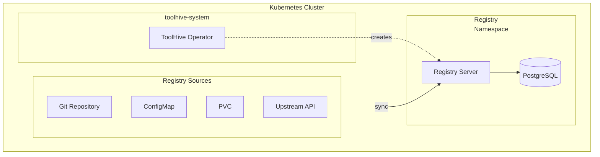

## Prerequisites

- A Kubernetes cluster (current and two previous minor versions are supported)
- Permissions to create resources in the cluster
- [`kubectl`](https://kubernetes.io/docs/tasks/tools/) configured to communicate
  with your cluster
- The ToolHive operator installed in your cluster (see
  [Deploy the operator](./deploy-operator.mdx))
- A PostgreSQL database (recommended for production deployments)

## Overview

The ToolHive operator deploys the Registry server in Kubernetes by creating
`MCPRegistry` resources. Alternatively, you can deploy the Registry Server
manually by following the
[manual deployment instructions](../guides-registry/deployment.mdx#manual-deployment).

### High-level architecture

This diagram shows the basic relationship between components. The ToolHive
operator watches for `MCPRegistry` resources and automatically creates the
necessary infrastructure to run the Registry server.



## Create a registry

You can create `MCPRegistry` resources in the namespaces where the ToolHive
Operator is deployed.

See [Deploy the operator](./deploy-operator.mdx#operator-deployment-modes) to
learn about the different deployment modes.

To create a registry, define an `MCPRegistry` resource and apply it to your
cluster. This minimal example creates a registry that syncs from the ToolHive
Git repository.

```yaml title="my-registry.yaml"
apiVersion: toolhive.stacklok.dev/v1alpha1
kind: MCPRegistry
metadata:
  name: my-registry
  namespace: my-namespace # Update with your namespace
spec:
  displayName: My MCP Registry
  auth:
    mode: anonymous
  registries:
    - name: toolhive
      format: toolhive
      git:
        repository: https://github.com/stacklok/toolhive.git
        branch: main
        path: pkg/registry/data/registry.json
      syncPolicy:
        interval: '30m'
```

Apply the resource:

```bash
kubectl apply -f my-registry.yaml
```

:::info[What's happening?]

When you apply an `MCPRegistry` resource, here's what happens:

1. The ToolHive operator detects the new resource (if it's in an allowed
   namespace)
2. The operator creates the necessary RBAC resources in the target namespace
3. The operator creates a Deployment containing the Registry server pod and
   service
4. The Registry server syncs data from the configured sources
5. The Registry API becomes available at the service endpoint

:::

## Configuring source Registries

The `MCPRegistry` resource supports multiple registry source types. You can
configure one or more of them. Each type is mutually exclusive within a single
registry configuration.

### Git repository source

Clone and sync from Git repositories. Ideal for version-controlled registries.

```yaml {9-14} title="registry-git.yaml"
apiVersion: toolhive.stacklok.dev/v1alpha1
kind: MCPRegistry
metadata:
  name: git-registry
spec:
  auth:
    mode: anonymous
  registries:
    - name: toolhive
      format: toolhive
      git:
        repository: https://github.com/stacklok/toolhive.git
        branch: main
        path: pkg/registry/data/registry.json
      syncPolicy:
        interval: '30m'
```

**Git source fields:**

| Field        | Required | Description                                           |
| ------------ | -------- | ----------------------------------------------------- |
| `repository` | Yes      | Git repository URL (HTTP/HTTPS/SSH)                   |
| `branch`     | No       | Branch name (mutually exclusive with `tag`, `commit`) |
| `tag`        | No       | Tag name (mutually exclusive with `branch`, `commit`) |
| `commit`     | No       | Commit SHA (mutually exclusive with `branch`, `tag`)  |
| `path`       | No       | Path to registry file (default: `registry.json`)      |

:::tip

You can use `branch`, `tag`, or `commit` to pin to a specific version. If
multiple are specified, `commit` takes precedence over `tag`, which takes
precedence over `branch`.

:::

### ConfigMap source

Read from a Kubernetes ConfigMap. Ideal for registry data managed within the
cluster.

```yaml {7-11} title="registry-configmap.yaml"
apiVersion: toolhive.stacklok.dev/v1alpha1
kind: MCPRegistry
metadata:
  name: configmap-registry
spec:
  auth:
    mode: anonymous
  registries:
    - name: local
      format: upstream
      configMapRef:
        name: registry-data
        key: registry.json
      syncPolicy:
        interval: '15m'
```

The ConfigMap must exist in the same namespace as the `MCPRegistry` resource.

### PersistentVolumeClaim source

Read from a PersistentVolumeClaim. Useful for large registry files or shared
storage scenarios.

```yaml {7-10} title="registry-pvc.yaml"
apiVersion: toolhive.stacklok.dev/v1alpha1
kind: MCPRegistry
metadata:
  name: pvc-registry
spec:
  auth:
    mode: anonymous
  registries:
    - name: shared
      format: upstream
      pvcRef:
        claimName: registry-data-pvc
        path: registries/production.json
      syncPolicy:
        interval: '1h'
```

**PVC source fields:**

| Field       | Required | Description                                                 |
| ----------- | -------- | ----------------------------------------------------------- |
| `claimName` | Yes      | Name of the PersistentVolumeClaim                           |
| `path`      | No       | Path to registry file within PVC (default: `registry.json`) |

The PVC must exist in the same namespace as the `MCPRegistry` resource.

### API source

Sync from an upstream MCP Registry API. Supports federation and aggregation
scenarios.

```yaml {7-10} title="registry-api.yaml"
apiVersion: toolhive.stacklok.dev/v1alpha1
kind: MCPRegistry
metadata:
  name: api-registry
spec:
  auth:
    mode: anonymous
  registries:
    - name: upstream
      format: upstream
      api:
        endpoint: https://registry.example.com
      syncPolicy:
        interval: '1h'
```

The controller automatically appends the appropriate API paths to the endpoint
URL.

### Configure synchronization

Each registry source can have its own sync policy that controls automatic
synchronization.

```yaml
syncPolicy:
  interval: '30m' # Go duration format: "1h", "30m", "24h"
```

### Filter registry content

You can filter which servers are exposed through the API using name and tag
patterns.

```yaml {13-20} title="registry-filtered.yaml"
apiVersion: toolhive.stacklok.dev/v1alpha1
kind: MCPRegistry
metadata:
  name: filtered-registry
spec:
  auth:
    mode: anonymous
  registries:
    - name: toolhive
      format: toolhive
      git:
        repository: https://github.com/stacklok/toolhive.git
        branch: main
        path: pkg/registry/data/registry.json
      filter:
        names:
          include:
            - 'official/*'
          exclude:
            - '*/deprecated'
        tags:
          include:
            - production
          exclude:
            - experimental
      syncPolicy:
        interval: '30m'
```

## Configure database storage

For production deployments, configure PostgreSQL database storage for
persistence across restarts.

```yaml {17-32} title="registry-with-database.yaml"
apiVersion: v1
kind: Secret
metadata:
  name: registry-api-db-passwords
type: Opaque
stringData:
  db-password: app_password
  migration-password: migrator_password
---
apiVersion: toolhive.stacklok.dev/v1alpha1
kind: MCPRegistry
metadata:
  name: production-registry
spec:
  auth:
    mode: anonymous
  databaseConfig:
    host: postgres.database.svc.cluster.local
    port: 5432
    user: db_app
    migrationUser: db_migrator
    dbAppUserPasswordSecretRef:
      name: registry-api-db-passwords
      key: db-password
    dbMigrationUserPasswordSecretRef:
      name: registry-api-db-passwords
      key: migration-password
    database: registry
    sslMode: verify-full
    maxOpenConns: 25
    maxIdleConns: 5
    connMaxLifetime: '30m'
  registries:
    - name: toolhive
      format: toolhive
      git:
        repository: https://github.com/stacklok/toolhive.git
        branch: main
        path: pkg/registry/data/registry.json
      syncPolicy:
        interval: '30m'
```

**Database configuration fields:**

| Field                              | Default       | Description                                       |
| ---------------------------------- | ------------- | ------------------------------------------------- |
| `host`                             | `postgres`    | Database server hostname                          |
| `port`                             | `5432`        | Database server port                              |
| `user`                             | `db_app`      | Application user (SELECT, INSERT, UPDATE, DELETE) |
| `migrationUser`                    | `db_migrator` | Migration user (CREATE, ALTER, DROP)              |
| `dbAppUserPasswordSecretRef`       | ``            | Password of application user                      |
| `dbMigrationUserPasswordSecretRef` | ``            | Password of migration user                        |
| `database`                         | `registry`    | Database name                                     |
| `sslMode`                          | `prefer`      | SSL mode (disable, prefer, require, verify-full)  |
| `maxOpenConns`                     | `10`          | Maximum open connections                          |
| `maxIdleConns`                     | `2`           | Maximum idle connections                          |
| `connMaxLifetime`                  | `30m`         | Maximum connection lifetime                       |

:::tip

Credentials are internally configured using a pgpass file mounted as a secret.

:::

## Configure authentication

You can configure authentication using the `authConfig` field in your
`MCPRegistry` resource.

### Authentication modes

| Mode        | Description                                     | Use case                     |
| ----------- | ----------------------------------------------- | ---------------------------- |
| `oauth`     | Validates access tokens from identity providers | Production deployments       |
| `anonymous` | No authentication required                      | Development and testing only |

:::info[Secure by default]

Configuring an authentication mode is mandatory, if you're not interested you
can set it to `anonymous`.

:::

### OAuth authentication

OAuth mode validates JWT tokens from one or more identity providers. Configure
providers in the `authConfig.oauth.providers` array.

```yaml title="registry-oauth.yaml"
apiVersion: toolhive.stacklok.dev/v1alpha1
kind: MCPRegistry
metadata:
  name: registry
  namespace: toolhive-system
spec:
  displayName: 'Authenticated MCP Server Registry'
  authConfig:
    mode: oauth
    oauth:
      providers:
        - name: kubernetes
          issuerUrl: https://kubernetes.default.svc.cluster.local
          jwksUrl: https://kubernetes.default.svc/openid/v1/jwks
          audience: registry-server
          caCertPath: /var/run/secrets/kubernetes.io/serviceaccount/ca.crt
          authTokenFile: /var/run/secrets/kubernetes.io/serviceaccount/token
          allowPrivateIP: true
  registries:
    - name: toolhive
      format: toolhive
      git:
        repository: https://github.com/stacklok/toolhive.git
        branch: main
        path: pkg/registry/data/registry.json
```

### OAuth configuration fields

| Field             | Required | Default                                   | Description                                        |
| ----------------- | -------- | ----------------------------------------- | -------------------------------------------------- |
| `mode`            | No       | `oauth`                                   | Authentication mode (`oauth` or `anonymous`)       |
| `resourceUrl`     | No       | -                                         | URL identifying this protected resource (RFC 9728) |
| `realm`           | No       | `mcp-registry`                            | Protection space identifier for WWW-Authenticate   |
| `scopesSupported` | No       | `[mcp-registry:read, mcp-registry:write]` | OAuth scopes supported by this resource            |

### Provider configuration fields

| Field              | Required | Description                                                             |
| ------------------ | -------- | ----------------------------------------------------------------------- |
| `name`             | Yes      | Unique identifier for this provider (for logging and monitoring)        |
| `issuerUrl`        | Yes      | OIDC issuer URL (e.g., `https://accounts.google.com`)                   |
| `audience`         | Yes      | Expected audience claim in the access token                             |
| `jwksUrl`          | No       | JWKS endpoint URL (skips OIDC discovery if specified)                   |
| `clientId`         | No       | OAuth client ID for token introspection                                 |
| `clientSecretFile` | No       | Path to file containing the client secret                               |
| `caCertPath`       | No       | Path to CA certificate for TLS verification                             |
| `authTokenFile`    | No       | Path to token file for authenticating to OIDC/JWKS endpoints            |
| `introspectionUrl` | No       | Token introspection endpoint URL for opaque token validation (RFC 7662) |
| `allowPrivateIP`   | No       | Allow connections to private IP addresses (required for in-cluster)     |

### Kubernetes service account authentication

For in-cluster deployments, you can configure OAuth to validate Kubernetes
service account tokens:

```yaml title="registry-k8s-auth.yaml"
apiVersion: toolhive.stacklok.dev/v1alpha1
kind: MCPRegistry
metadata:
  name: registry
spec:
  authConfig:
    mode: oauth
    oauth:
      providers:
        - name: kubernetes
          issuerUrl: https://kubernetes.default.svc.cluster.local
          jwksUrl: https://kubernetes.default.svc/openid/v1/jwks
          audience: registry-server
          caCertPath: /var/run/secrets/kubernetes.io/serviceaccount/ca.crt
          authTokenFile: /var/run/secrets/kubernetes.io/serviceaccount/token
          allowPrivateIP: true
```

:::tip[Kubernetes provider settings]

- **issuerUrl**: for most Kubernetes distributions,
  `https://kubernetes.default.svc.cluster.local` is the correct value to match
  the `iss` claim in Kubernetes service account tokens.
- **jwksUrl**: Specify directly to skip OIDC discovery (the Kubernetes API
  server doesn't support standard discovery).
- **allowPrivateIP**: Required for in-cluster communication with the API server.

:::

### Multiple providers

You can configure multiple OAuth providers to accept tokens from different
identity sources:

```yaml title="registry-multi-provider.yaml"
apiVersion: toolhive.stacklok.dev/v1alpha1
kind: MCPRegistry
metadata:
  name: registry
spec:
  authConfig:
    mode: oauth
    oauth:
      providers:
        # Kubernetes service accounts (in-cluster workloads)
        - name: kubernetes
          issuerUrl: https://kubernetes.default.svc.cluster.local
          jwksUrl: https://kubernetes.default.svc/openid/v1/jwks
          audience: registry-server
          caCertPath: /var/run/secrets/kubernetes.io/serviceaccount/ca.crt
          authTokenFile: /var/run/secrets/kubernetes.io/serviceaccount/token
          allowPrivateIP: true
        # External identity provider
        - name: okta
          issuerUrl: https://YOUR_DOMAIN.okta.com/oauth2/default
          audience: registry
```

The server validates tokens against each provider in order until one succeeds.

### Anonymous authentication

For development and testing, you can disable authentication entirely:

```yaml title="registry-anonymous.yaml"
apiVersion: toolhive.stacklok.dev/v1alpha1
kind: MCPRegistry
metadata:
  name: registry
spec:
  authConfig:
    mode: anonymous
  registries:
    - name: toolhive
      format: toolhive
      git:
        repository: https://github.com/stacklok/toolhive.git
        branch: main
        path: pkg/registry/data/registry.json
```

:::danger[No access control]

Anonymous mode provides **no access control**. Only use it in trusted
environments or when other security measures are in place. **Do not use
anonymous mode in production.**

:::

For detailed information about authentication configuration, including
provider-specific examples for Keycloak, Auth0, Azure AD, and Okta, see the
[Authentication configuration](../guides-registry/authentication.mdx) guide.

## Customize the Registry server pod

You can customize the Registry server pod using the `podTemplateSpec` field.
This gives you full control over the pod specification.

```yaml {6-15} title="registry-custom-pod.yaml"
apiVersion: toolhive.stacklok.dev/v1alpha1
kind: MCPRegistry
metadata:
  name: custom-registry
spec:
  podTemplateSpec:
    spec:
      containers:
        - name: registry-api # This name must be "registry-api"
          resources:
            limits:
              cpu: '500m'
              memory: '512Mi'
            requests:
              cpu: '100m'
              memory: '128Mi'
  auth:
    mode: anonymous
  registries:
    - name: toolhive
      format: toolhive
      git:
        repository: https://github.com/stacklok/toolhive.git
        branch: main
        path: pkg/registry/data/registry.json
      syncPolicy:
        interval: '30m'
```

:::info[Container name requirement]

When customizing containers in `podTemplateSpec`, you must use
`name: registry-api` for the main container to ensure the operator can properly
manage the Registry server. The container name is hardcoded to avoid conflict
issues with user provided containers. Mandating a container name on the Operator
side explicitly tells the Operator it is the main registry server container and
any other containers provided by the use are sidecars/init containers.

:::

## Check registry status

To check the status of your registries in a specific namespace:

```bash
kubectl -n <NAMESPACE> get mcpregistries
```

To check registries across all namespaces:

```bash
kubectl get mcpregistries --all-namespaces
```

The status displays the phase, message, and age of each registry.

For more details about a specific registry:

```bash
kubectl -n <NAMESPACE> describe mcpregistry <NAME>
```

### Registry phases

| Phase         | Description                            |
| ------------- | -------------------------------------- |
| `Pending`     | The registry is being initialized      |
| `Ready`       | The registry is ready and operational  |
| `Syncing`     | The registry is currently syncing data |
| `Failed`      | The registry has encountered an error  |
| `Terminating` | The registry is being deleted          |

## Next steps

Learn how to configure authentication for the Registry server in the
[Authentication configuration](../guides-registry/authentication.mdx) guide.

Configure additional registry sources and filtering options in the
[Configuration](../guides-registry/configuration.mdx) guide.

Discover your deployed MCP servers automatically using the
[Kubernetes registry](../guides-registry/configuration.mdx#kubernetes-registry)
feature. Note that the operator automatically creates a single kubernetes
registry named `default` - you cannot configure additional kubernetes
registries.

## Related information

- [Kubernetes CRD reference](../reference/crd-spec.md#apiv1alpha1mcpregistry) -
  Reference for the `MCPRegistry` Custom Resource Definition (CRD)
- [Deploy the operator](./deploy-operator.mdx) - Install the ToolHive operator
- [Database configuration](../guides-registry/database.mdx) - Configure
  PostgreSQL storage

## Troubleshooting

<details>
<summary>MCPRegistry resource not creating pods</summary>

If your `MCPRegistry` resource is created but no pods appear:

1. Ensure you created the `MCPRegistry` resource in an allowed namespace
1. Check the operator's configuration:

```bash
helm get values toolhive-operator -n toolhive-system
```

1. Check the MCPRegistry status and operator logs:

```bash
# Check MCPRegistry status
kubectl -n <NAMESPACE> describe mcpregistry <NAME>

# Check operator logs
kubectl -n toolhive-system logs -l app.kubernetes.io/name=toolhive-operator

# Verify the operator is running
kubectl -n toolhive-system get pods -l app.kubernetes.io/name=toolhive-operator
```

Common causes include:

- **Operator not running**: Ensure the ToolHive operator is deployed and running
- **RBAC issues**: Check for cluster-level permission issues
- **Resource quotas**: Check if namespace resource quotas prevent pod creation

</details>

<details>
<summary>Registry stuck in Pending or Syncing phase</summary>

If the registry is stuck in `Pending` or `Syncing` phase:

```bash
# Check registry status
kubectl -n <NAMESPACE> describe mcpregistry <NAME>

# Check registry pod logs
kubectl -n <NAMESPACE> logs -l app.kubernetes.io/instance=<NAME>
```

Common causes include:

- **Git repository inaccessible**: Verify the repository URL is correct and
  accessible
- **ConfigMap/PVC doesn't exist**: Ensure referenced resources exist in the same
  namespace
- **Network policies**: Check if network policies are blocking external access
- **Invalid registry file format**: Verify the registry JSON file is valid

</details>

<details>
<summary>Database connection errors</summary>

If you see database connection errors:

```bash
# Check registry pod logs
kubectl -n <NAMESPACE> logs -l app.kubernetes.io/instance=<NAME>
```

Common causes include:

- **Database not reachable**: Verify database host and port are correct
- **Invalid credentials**: Check that pgpass file is properly mounted
- **SSL configuration mismatch**: Verify `sslMode` matches your database
  configuration
- **Permission issues**: Ensure database users have required privileges

</details>

<details>
<summary>Sync failures</summary>

If synchronization is failing:

```bash
# Check sync status
kubectl -n <NAMESPACE> get mcpregistry <NAME> -o jsonpath='{.status.syncStatus}'

# Trigger manual sync to see immediate errors
kubectl annotate mcpregistry <NAME> \
  toolhive.stacklok.dev/sync-trigger="$(date +%s)" \
  --overwrite

# Check logs
kubectl -n <NAMESPACE> logs -l app.kubernetes.io/instance=<NAME>
```

Common causes include:

- **Source unavailable**: Git repository, API endpoint, or file is inaccessible
- **Invalid JSON format**: Registry file contains invalid JSON
- **Format mismatch**: The `format` field doesn't match the actual data format
- **Filter too restrictive**: Filters may be excluding all servers

</details>
