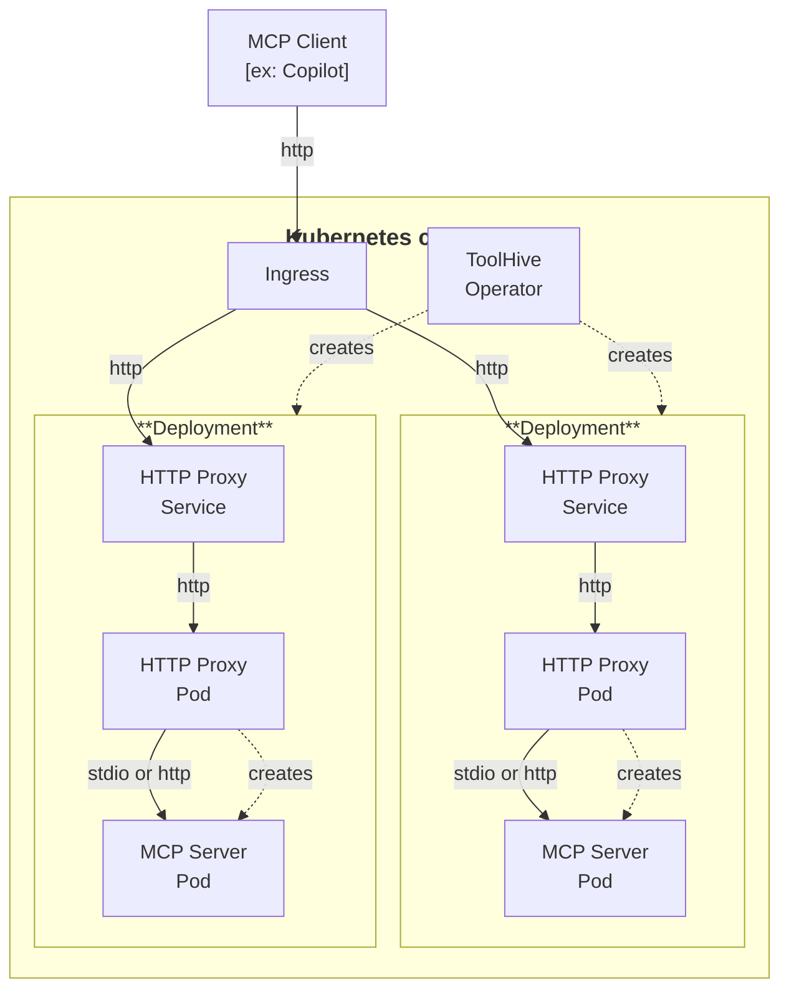

The ToolHive Kubernetes operator manages MCP servers in Kubernetes clusters. It
lets you define MCP servers as Kubernetes resources and automates their
deployment and management.

:::info[Experimental]

The Kubernetes operator is still under active development and isn't recommended
for production use cases yet. Specifically, the Custom Resource Definitions
(CRDs) are still in an alpha state so breaking changes to the spec and
capabilities are possible.

See the [ToolHive Operator quickstart tutorial](../tutorials/quickstart-k8s.mdx)
to get started quickly using a local kind cluster. We'd love for you to try it
out and send feedback!

:::

## Overview

The operator introduces new Custom Resource Definitions (CRDs) into your
Kubernetes cluster. The primary CRDs for MCP server workloads are `MCPServer`,
which represents a single MCP server running in Kubernetes, `MCPRemoteProxy`,
which represents an MCP server running outside the cluster that is proxied by
ToolHive, and `VirtualMCPServer`, which represents a virtual MCP server gateway
that aggregates multiple backend MCP servers.

When you create an `MCPServer` resource, the operator automatically:

1. Creates a Deployment to run the MCP server
2. Sets up a Service to expose the MCP server
3. Configures the appropriate permissions and settings
4. Manages the lifecycle of the MCP server

`MCPRemoteProxy` and `VirtualMCPServer` resources work similarly, with the
operator managing a proxy pod that connects to remote MCP servers or aggregates
multiple backends, respectively.

The diagram shows how clients connect to MCP servers through a standard Ingress
or Gateway. To learn how to expose your MCP servers and connect clients, see
[Connect clients to MCP servers](./connect-clients.mdx).

## Installation

[Use Helm to install the ToolHive operator](./deploy-operator.mdx) in your
Kubernetes cluster. Helm simplifies the installation process and lets you manage
the operator using Helm charts.

Once the operator is installed, you can create and manage MCP servers:

- [Run MCP servers in Kubernetes](./run-mcp-k8s.mdx)
- [Proxy remote MCP servers](./remote-mcp-proxy.mdx)
- [Virtual MCP Server (vMCP)](../guides-vmcp/index.mdx)
