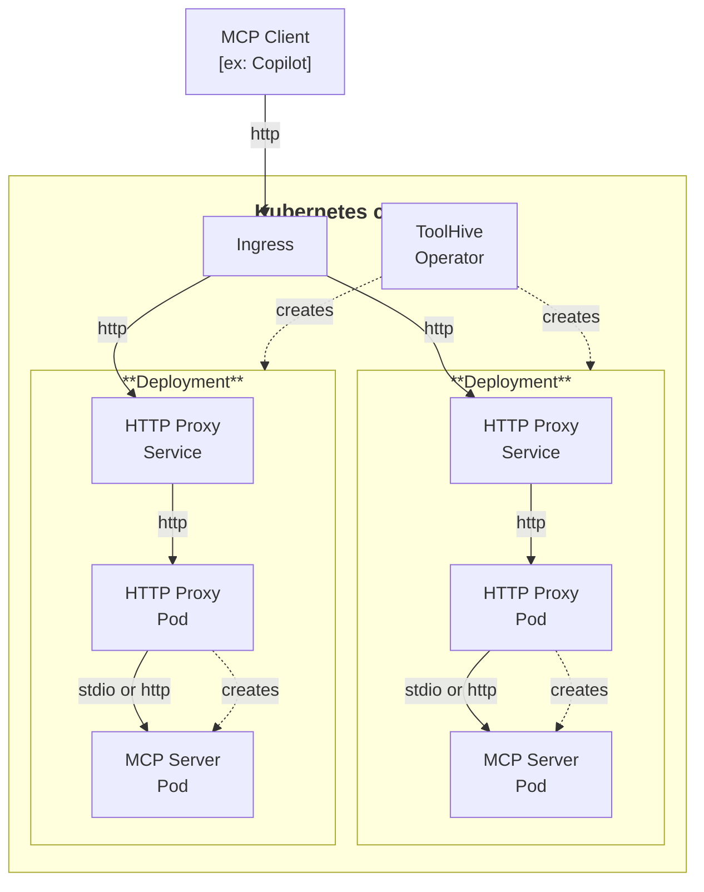

The ToolHive Kubernetes Operator manages MCP servers in Kubernetes clusters. It
lets you define MCP servers as Kubernetes resources and automates their
deployment and management.

:::info

See the [ToolHive Operator quickstart tutorial](./quickstart.mdx) to get started
quickly using a local kind cluster. Try it out and
[share your feedback](https://discord.gg/stacklok)!

:::

## How the operator works

The operator introduces new Custom Resource Definitions (CRDs) into your
Kubernetes cluster. The primary CRDs for MCP server workloads are `MCPServer`,
which represents a single MCP server running in Kubernetes, `MCPRemoteProxy`,
which represents an MCP server hosted outside the cluster that ToolHive proxies,
`VirtualMCPServer`, which aggregates multiple backend MCP servers behind a
single endpoint.

All ToolHive CRDs are registered under the `toolhive` category, so you can list
every ToolHive resource in your cluster with a single command:

```bash
kubectl get toolhive -n toolhive-system
```

When you create an `MCPServer` resource, the operator automatically:

1. Creates a Deployment to run the MCP server
2. Sets up a Service to expose the MCP server
3. Configures the appropriate permissions and settings
4. Manages the lifecycle of the MCP server


```mermaid
flowchart TB
  subgraph K8s["<h3>Kubernetes cluster</h3>"]
    subgraph K8s1["**Deployment**"]
      Svc1["HTTP Proxy<br>Service"] -- http --> Proxy1["HTTP Proxy<br>Pod"] -- stdio or http --> MCP1["MCP Server<br>Pod"]
      Proxy1 -.->|creates| MCP1
    end
    subgraph K8s2["**Deployment**"]
      Svc2["HTTP Proxy<br>Service"] -- http --> Proxy2["HTTP Proxy<br>Pod"] -- stdio or http --> MCP2["MCP Server<br>Pod"]
      Proxy2 -.->|creates| MCP2
    end
    Ingress["Ingress"] -- http --> Svc1 & Svc2
    Operator["ToolHive<br>Operator"] -.->|creates| K8s1 & K8s2
  end

  Client["MCP Client<br>[ex: Copilot]"] -- http --> Ingress
```

`MCPRemoteProxy` and `VirtualMCPServer` resources work similarly, with the
operator managing a proxy pod that connects to remote MCP servers or aggregates
multiple backends, respectively.

The diagram shows how clients connect to MCP servers through a standard Ingress
or Gateway. To learn how to expose your MCP servers and connect clients, see
[Connect clients to MCP servers](./connect-clients.mdx).

## Which resource type should I use?

The operator introduces resource types for MCP workloads. Choose based on
where your MCP server runs and how many servers you need to manage:

| Resource                | Use when                                                                                                          |
| ----------------------- | ----------------------------------------------------------------------------------------------------------------- |
| **MCPServer**           | Running an MCP server as a container inside your cluster                                                          |
| **MCPRemoteProxy**      | Connecting to an MCP server hosted outside your cluster (SaaS tools, external APIs, remote endpoints)             |
| **VirtualMCPServer**    | Aggregating multiple MCPServer and/or MCPRemoteProxy resources behind a single endpoint for a team or application |

Most teams start with `MCPServer` for container-based servers, add
`MCPRemoteProxy` for external SaaS tools, and graduate to `VirtualMCPServer`
when managing five or more servers or needing centralized authentication.

The operator also provides shared configuration CRDs that you reference from
workload resources:

| Resource                                                                                         | Purpose                                                                                      |
| ------------------------------------------------------------------------------------------------ | -------------------------------------------------------------------------------------------- |
| [**MCPOIDCConfig**](./auth-k8s.mdx#set-up-shared-oidc-configuration-with-mcpoidcconfig)          | Shared OIDC authentication settings, referenced via `oidcConfigRef`                          |
| [**MCPTelemetryConfig**](./telemetry-and-metrics.mdx#shared-telemetry-configuration-recommended) | Shared telemetry/observability settings, referenced via `telemetryConfigRef`                 |
| [**MCPToolConfig**](./customize-tools.mdx)                                                       | Tool filtering and renaming, referenced via `toolConfigRef`                                  |
| [**MCPExternalAuthConfig**](./auth-k8s.mdx#set-up-embedded-authorization-server-authentication)  | Token exchange or embedded auth server configuration, referenced via `externalAuthConfigRef` |

## Installation

[Deploy the ToolHive operator](./deploy-operator.mdx) in your Kubernetes
cluster.

Once the operator is installed, you can create and manage MCP servers:

- [Run MCP servers in Kubernetes](./run-mcp-k8s.mdx)
- [Proxy remote MCP servers](./remote-mcp-proxy.mdx)
- [Virtual MCP Server (vMCP)](../guides-vmcp/index.mdx)
