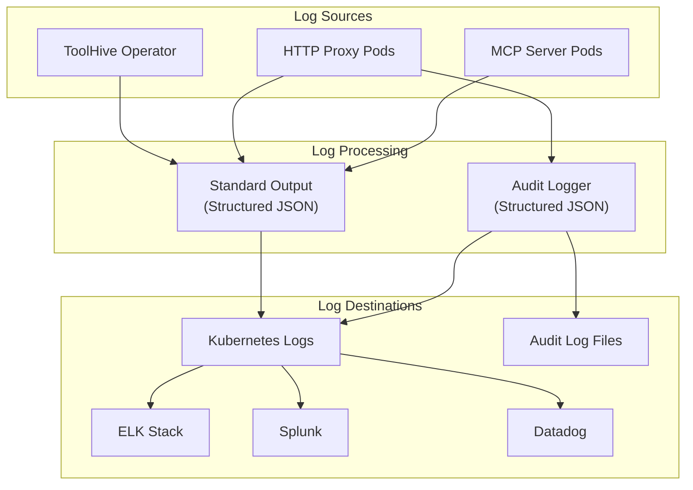

The ToolHive Kubernetes operator provides comprehensive logging capabilities for
monitoring, auditing, and troubleshooting MCP servers in production
environments. This guide focuses on the essential pieces: log formats, minimal
configuration, and simple integrations.

## Overview

ToolHive Operator provides two types of logs:

1. **Standard application logs** - Structured operational logs from the ToolHive
   operator and proxy components
2. **Audit logs** - Security and compliance logs tracking all MCP operations



## Log formats and content specifications

### Standard application logs

ToolHive uses structured JSON logging. All logs are output in a consistent JSON
format for easy parsing and analysis.

#### Log format specification

```json
{
  "level": "info",
  "ts": 1704067200.123456,
  "caller": "controllers/mcpserver_controller.go:123",
  "msg": "Starting MCP server",
  "server": "github",
  "transport": "sse",
  "container": "thv-github-abc123",
  "namespace": "default",
  "version": "0.1.0"
}
```

#### Field definitions

| Field       | Type   | Description                                       |
| ----------- | ------ | ------------------------------------------------- |
| `level`     | string | Log level: `debug`, `info`, `warn`, `error`       |
| `ts`        | float  | Unix timestamp with microseconds                  |
| `caller`    | string | Source code location                              |
| `msg`       | string | Log message                                       |
| `server`    | string | MCP server name                                   |
| `transport` | string | Transport type: `stdio`, `sse`, `streamable-http` |
| `container` | string | Container name                                    |
| `namespace` | string | Kubernetes namespace                              |
| `version`   | string | Component version                                 |

### Audit logs

Audit logs provide detailed, structured records of all MCP operations for
security and compliance purposes. When audit is enabled, the ToolHive proxy
generates structured audit events for every MCP operation.

#### Audit log format specification

```json
{
  "time": "2024-01-01T12:00:00.123456789Z",
  "level": "INFO+2",
  "msg": "audit_event",
  "audit_id": "550e8400-e29b-41d4-a716-446655440000",
  "type": "mcp_tool_call",
  "logged_at": "2024-01-01T12:00:00.123456Z",
  "outcome": "success",
  "component": "github-server",
  "source": {
    "type": "network",
    "value": "10.0.1.5",
    "extra": {
      "user_agent": "node"
    }
  },
  "subjects": {
    "user": "john.doe@example.com",
    "user_id": "user-123"
  },
  "target": {
    "endpoint": "/messages",
    "method": "tools/call",
    "name": "search_issues",
    "type": "tool"
  },
  "metadata": {
    "extra": {
      "duration_ms": 245,
      "transport": "http"
    }
  }
}
```

#### Audit field definitions

| Field                        | Type   | Description                                                             |
| ---------------------------- | ------ | ----------------------------------------------------------------------- |
| `time`                       | string | Timestamp when the log was generated                                    |
| `level`                      | string | Log level (INFO+2 for audit events)                                     |
| `msg`                        | string | Always "audit_event" for audit logs                                     |
| `audit_id`                   | string | Unique identifier for the audit event                                   |
| `type`                       | string | Type of MCP operation (see event types below)                           |
| `logged_at`                  | string | UTC timestamp of the event                                              |
| `outcome`                    | string | Result of the operation: `success` or `failure`                         |
| `component`                  | string | Name of the MCP server                                                  |
| `source`                     | object | Request source information                                              |
| `source.type`                | string | Source type (e.g., "network")                                           |
| `source.value`               | string | Source identifier (e.g., IP address)                                    |
| `source.extra`               | object | Additional source metadata                                              |
| `subjects`                   | object | User/identity information                                               |
| `subjects.user`              | string | User display name (from JWT claims: name, preferred_username, or email) |
| `subjects.user_id`           | string | User identifier (from JWT sub claim)                                    |
| `subjects.client_name`       | string | Optional: Client application name (if present in JWT claims)            |
| `subjects.client_version`    | string | Optional: Client version (if present in JWT claims)                     |
| `target`                     | object | Target resource information                                             |
| `target.endpoint`            | string | API endpoint path                                                       |
| `target.method`              | string | MCP method called                                                       |
| `target.name`                | string | Tool/resource name                                                      |
| `target.type`                | string | Target type (e.g., "tool")                                              |
| `metadata`                   | object | Additional metadata                                                     |
| `metadata.extra.duration_ms` | number | Operation duration in milliseconds                                      |
| `metadata.extra.transport`   | string | Transport protocol used                                                 |

#### Audit event types

| Event Type           | Description               |
| -------------------- | ------------------------- |
| `mcp_initialize`     | MCP server initialization |
| `mcp_tool_call`      | Tool execution request    |
| `mcp_tools_list`     | List available tools      |
| `mcp_resource_read`  | Resource access           |
| `mcp_resources_list` | List available resources  |
| `mcp_prompt_get`     | Prompt retrieval          |
| `mcp_prompts_list`   | List available prompts    |
| `mcp_notification`   | MCP notifications         |
| `mcp_ping`           | Health check pings        |
| `mcp_completion`     | Request completion        |

## Configuration

### Operator-level logging

Configure logging for the ToolHive operator in the Helm values:

```yaml
# values.yaml
operator:
  # Log level is controlled by the debug flag
  debug: false # Production: use info level (set to true for debug level)
```

### MCPServer logging configuration

Configure audit logging for individual MCP servers in the MCPServer resource:

```yaml
apiVersion: mcp.toolhive.io/v1alpha1
kind: MCPServer
metadata:
  name: github-server
spec:
  image: ghcr.io/stacklok/toolhive/servers/github:latest

  # Audit logging configuration
  audit:
    enabled: true # Audit logs are output to stdout alongside standard logs
```

:::info Audit logs are output to stdout alongside standard application logs. Log
collectors can differentiate between standard and audit logs by checking for the
presence of the `audit_id` field.

Note: User information in the `subjects` field is populated from JWT claims when
OIDC authentication is configured. The system uses the `name`,
`preferred_username`, or `email` claim (in that order) for the display name.
Without authentication middleware, the user appears as "anonymous". :::

## Minimal collectors

The examples below show minimal configurations only. They assume a standard
Kubernetes setup where container stdout/stderr is written to files under
/var/log/containers/. They do not include deployment manifests.

### Fluentd (minimal)

```text
# fluentd.conf
<source>
  @type tail
  path /var/log/containers/*toolhive*.log
  tag toolhive
  read_from_head true
  <parse>
    @type json
    time_key time
    time_format %Y-%m-%dT%H:%M:%S.%NZ
  </parse>
</source>

# Route standard logs
<match toolhive>
  @type elasticsearch
  host elasticsearch.logging.svc.cluster.local
  port 9200
  index_name toolhive
</match>

# Route audit logs (entries that contain audit_id) to a separate index
<filter toolhive>
  @type grep
  <regexp>
    key audit_id
    pattern .+
  </regexp>
  @label @AUDIT
</filter>

<label @AUDIT>
  <match **>
    @type elasticsearch
    host elasticsearch.logging.svc.cluster.local
    port 9200
    index_name toolhive-audit
  </match>
</label>
```

### Filebeat (minimal)

```yaml
filebeat.inputs:
  - type: container
    paths:
      - /var/log/containers/*toolhive*.log
    json.keys_under_root: true
    json.add_error_key: true

output.elasticsearch:
  hosts: ['${ELASTICSEARCH_HOST:elasticsearch}:${ELASTICSEARCH_PORT:9200}']
  indices:
    - index: 'toolhive-audit-%{+yyyy.MM.dd}'
      when.has_fields: ['audit_id']
    - index: 'toolhive-%{+yyyy.MM.dd}'
```

### Splunk (minimal)

```ini
# inputs.conf
[monitor:///var/log/containers/*toolhive*]
sourcetype = _json
index = toolhive

# props.conf
[_json]
KV_MODE = json
SHOULD_LINEMERGE = false
TRANSFORMS-route_audit = route_audit

# transforms.conf
[route_audit]
REGEX = "audit_id":\s*".+"
DEST_KEY = _MetaData:Index
FORMAT = toolhive_audit
```

## Best practices

### Security considerations

- Encrypt audit logs at rest and in transit.
- Implement RBAC to restrict access to pod logs.

```yaml
apiVersion: rbac.authorization.k8s.io/v1
kind: Role
metadata:
  name: log-reader
  namespace: toolhive-system
rules:
  - apiGroups: ['']
    resources: ['pods/log']
    verbs: ['get', 'list']
```
