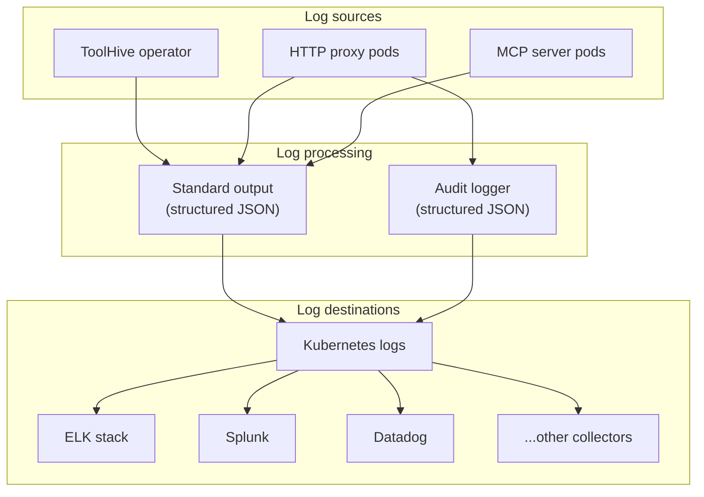

ToolHive provides structured JSON logging for MCP servers in Kubernetes, giving
you detailed operational insights and compliance audit trails. You can configure
log levels, enable audit logging for tracking MCP operations, and integrate with
common log collection systems like Fluentd, Filebeat, and Splunk.

## Overview

The ToolHive operator provides two types of logs:

1. **Standard application logs** - Structured operational logs from the ToolHive
   operator and proxy components
2. **Audit logs** - Security and compliance logs tracking all MCP operations



## Structured application logs

ToolHive automatically outputs structured JSON logs to the standard output
(stdout) of the operator and HTTP proxy (`proxyrunner`) pods.

All logs use a consistent format for easy parsing by log collectors:

```json
{
  "level": "info",
  "ts": 1761934317.963125,
  "caller": "logger/logger.go:39",
  "msg": "MCP server github started successfully"
}
```

### Key fields in application logs

| Field    | Type   | Description                                      |
| -------- | ------ | ------------------------------------------------ |
| `level`  | string | Log level: `debug`, `info`, `warn`, `error`      |
| `ts`     | float  | Unix timestamp with microseconds                 |
| `caller` | string | Source file and line number of the log statement |
| `msg`    | string | Log message (exact content varies by event)      |

## Enable audit logging

Audit logs provide detailed records of all MCP operations for security and
compliance. To enable audit logging, set the `audit.enabled` field to `true` in
your MCP server manifest:

<Tabs group="server-type">
<TabItem value="mcpserver" label="MCPServer" default>

```yaml {11-12}
apiVersion: toolhive.stacklok.dev/v1alpha1
kind: MCPServer
metadata:
  name: <SERVER_NAME>
  namespace: toolhive-system
spec:
  image: <SERVER_IMAGE>
  # ... other spec fields ...

  # Enable audit logging
  audit:
    enabled: true
```

</TabItem>
<TabItem value="mcpremoteproxy" label="MCPRemoteProxy">

```yaml {11-12}
apiVersion: toolhive.stacklok.dev/v1alpha1
kind: MCPRemoteProxy
metadata:
  name: <SERVER_NAME>
  namespace: toolhive-system
spec:
  remoteUrl: <SERVER_URL>
  # ... other spec fields ...

  # Enable audit logging
  audit:
    enabled: true
```

</TabItem>
<TabItem value="virtualmcpserver" label="VirtualMCPServer">

```yaml {11-14}
apiVersion: toolhive.stacklok.dev/v1alpha1
kind: VirtualMCPServer
metadata:
  name: <SERVER_NAME>
  namespace: toolhive-system
spec:
  config:
    groupRef: <GROUP_NAME>

    # Enable audit logging
    audit:
      enabled: true
      includeRequestData: true
      includeResponseData: true

  # ... other configs ...
```

</TabItem>
</Tabs>

ToolHive writes audit logs to stdout alongside standard application logs. Your
log collector can differentiate them using the `audit_id` field or by filtering
for `"msg": "audit_event"`.

### Audit log format

When audit logging is enabled, each MCP operation generates a structured audit
event. For example, here is a sample audit log entry for a tool execution
request from an MCPServer resource:

```json
{
  "time": "2024-01-01T12:00:00.123456789Z",
  "level": "INFO+2",
  "msg": "audit_event",
  "audit_id": "550e8400-e29b-41d4-a716-446655440000",
  "type": "mcp_tool_call",
  "logged_at": "2024-01-01T12:00:00.123456Z",
  "outcome": "success",
  "component": "github-server",
  "source": {
    "type": "network",
    "value": "10.0.1.5",
    "extra": {
      "user_agent": "node"
    }
  },
  "subjects": {
    "user": "john.doe@example.com",
    "user_id": "user-123"
  },
  "target": {
    "endpoint": "/messages",
    "method": "tools/call",
    "name": "search_issues",
    "type": "tool"
  },
  "metadata": {
    "extra": {
      "duration_ms": 245,
      "transport": "http"
    }
  }
}
```

:::info[User information in audit logs]

User information in the `subjects` field comes from JWT claims when OIDC
authentication is configured. The system uses the `name`, `preferred_username`,
or `email` claim (in that order) for the display name. If authentication is not
configured, the `user_id` field is set to `local`.

:::

#### Key fields in audit logs

| Field           | Description                                   |
| --------------- | --------------------------------------------- |
| `audit_id`      | Unique identifier for the audit event         |
| `type`          | Type of MCP operation (see event types below) |
| `outcome`       | Result: `success` or `failure`                |
| `component`     | Name of the MCP server                        |
| `subjects.user` | User display name (from JWT claims)           |
| `target.method` | MCP method called                             |
| `target.name`   | Tool/resource name                            |

#### Common audit event types

| Event Type           | Description               |
| -------------------- | ------------------------- |
| `mcp_initialize`     | MCP server initialization |
| `mcp_tool_call`      | Tool execution request    |
| `mcp_tools_list`     | List available tools      |
| `mcp_resource_read`  | Resource access           |
| `mcp_resources_list` | List available resources  |

<details>
<summary>Complete audit field reference</summary>

#### Audit log fields

| Field                        | Type   | Description                                                             |
| ---------------------------- | ------ | ----------------------------------------------------------------------- |
| `time`                       | string | Timestamp when the log was generated                                    |
| `level`                      | string | Log level (INFO+2 for audit events)                                     |
| `msg`                        | string | Always "audit_event" for audit logs                                     |
| `audit_id`                   | string | Unique identifier for the audit event                                   |
| `type`                       | string | Type of MCP operation (see event types below)                           |
| `logged_at`                  | string | UTC timestamp of the event                                              |
| `outcome`                    | string | Result of the operation: `success` or `failure`                         |
| `component`                  | string | Name of the MCP server                                                  |
| `source`                     | object | Request source information                                              |
| `source.type`                | string | Source type (e.g., "network")                                           |
| `source.value`               | string | Source identifier (e.g., IP address)                                    |
| `source.extra`               | object | Additional source metadata                                              |
| `subjects`                   | object | User and identity information                                           |
| `subjects.user`              | string | User display name (from JWT claims: name, preferred_username, or email) |
| `subjects.user_id`           | string | User identifier (from JWT sub claim)                                    |
| `subjects.client_name`       | string | Client application name (optional, from JWT claims)                     |
| `subjects.client_version`    | string | Client version (optional, from JWT claims)                              |
| `target`                     | object | Target resource information                                             |
| `target.endpoint`            | string | API endpoint path                                                       |
| `target.method`              | string | MCP method called                                                       |
| `target.name`                | string | Tool or resource name                                                   |
| `target.type`                | string | Target type (e.g., "tool")                                              |
| `metadata`                   | object | Additional metadata                                                     |
| `metadata.extra.duration_ms` | number | Operation duration in milliseconds                                      |
| `metadata.extra.transport`   | string | Transport protocol used                                                 |

#### Audit event types

| Event Type           | Description               |
| -------------------- | ------------------------- |
| `mcp_initialize`     | MCP server initialization |
| `mcp_tool_call`      | Tool execution request    |
| `mcp_tools_list`     | List available tools      |
| `mcp_resource_read`  | Resource access           |
| `mcp_resources_list` | List available resources  |
| `mcp_prompt_get`     | Prompt retrieval          |
| `mcp_prompts_list`   | List available prompts    |
| `mcp_notification`   | MCP notifications         |
| `mcp_ping`           | Health check pings        |
| `mcp_completion`     | Request completion        |

</details>

## Set up log collection

ToolHive outputs structured JSON logs that work with your existing log
collection infrastructure. The examples below show basic host-based
configurations for common log collectors. Adapt these patterns to match your
organization's logging setup.

:::note[Prerequisites]

These examples assume:

- Container logs are available at `/var/log/pods/`
- You have a standard Kubernetes logging setup
- Deployment manifests are handled separately
- You're using host-based log collection

:::

:::tip[Use your existing collection methods]

If your organization uses sidecar-based or operator-based log collection (such
as Fluent Bit sidecars or the Fluentd Operator), adapt these configuration
patterns to work with your existing infrastructure.

:::

### Configure Fluentd

```text
# fluentd.conf
<source>
  @type tail
  path /var/log/pods/*toolhive*.log
  tag toolhive
  read_from_head true
  <parse>
    @type json
    time_key time
    time_format %Y-%m-%dT%H:%M:%S.%NZ
  </parse>
</source>

# Route standard logs
<match toolhive>
  @type elasticsearch
  host elasticsearch.logging.svc.cluster.local
  port 9200
  index_name toolhive
</match>

# Route audit logs (entries that contain audit_id) to a separate index
<filter toolhive>
  @type grep
  <regexp>
    key audit_id
    pattern .+
  </regexp>
  @label @AUDIT
</filter>

<label @AUDIT>
  <match **>
    @type elasticsearch
    host elasticsearch.logging.svc.cluster.local
    port 9200
    index_name toolhive-audit
  </match>
</label>
```

### Configure Filebeat

```yaml
filebeat.inputs:
  - type: container
    paths:
      - /var/log/pods/*toolhive*.log
    json.keys_under_root: true
    json.add_error_key: true

output.elasticsearch:
  hosts: ['${ELASTICSEARCH_HOST:elasticsearch}:${ELASTICSEARCH_PORT:9200}']
  indices:
    - index: 'toolhive-audit-%{+yyyy.MM.dd}'
      when.has_fields: ['audit_id']
    - index: 'toolhive-%{+yyyy.MM.dd}'
```

### Configure Splunk

```ini
# inputs.conf
[monitor:///var/log/pods/*toolhive*]
sourcetype = _json
index = toolhive

# props.conf
[_json]
KV_MODE = json
SHOULD_LINEMERGE = false
TRANSFORMS-route_audit = route_audit

# transforms.conf
[route_audit]
REGEX = "audit_id":\s*".+"
DEST_KEY = _MetaData:Index
FORMAT = toolhive_audit
```

## Security considerations

Protect your log data by implementing appropriate access controls and
encryption:

### Encrypt logs

- Encrypt audit logs at rest and in transit
- Use TLS for log shipping to external systems

### Restrict log access

Implement RBAC to control who can access pod logs:

```yaml
apiVersion: rbac.authorization.k8s.io/v1
kind: Role
metadata:
  name: log-reader
  namespace: toolhive-system
rules:
  - apiGroups: ['']
    resources: ['pods/log']
    verbs: ['get', 'list']
```

## Next steps

- Learn about [telemetry and metrics](./telemetry-and-metrics.mdx) to complement
  your logging setup
- See the [observability overview](../concepts/observability.mdx) for the
  complete monitoring picture
- Check the [Kubernetes CRD reference](../reference/crd-spec.mdx) for complete
  configuration options
