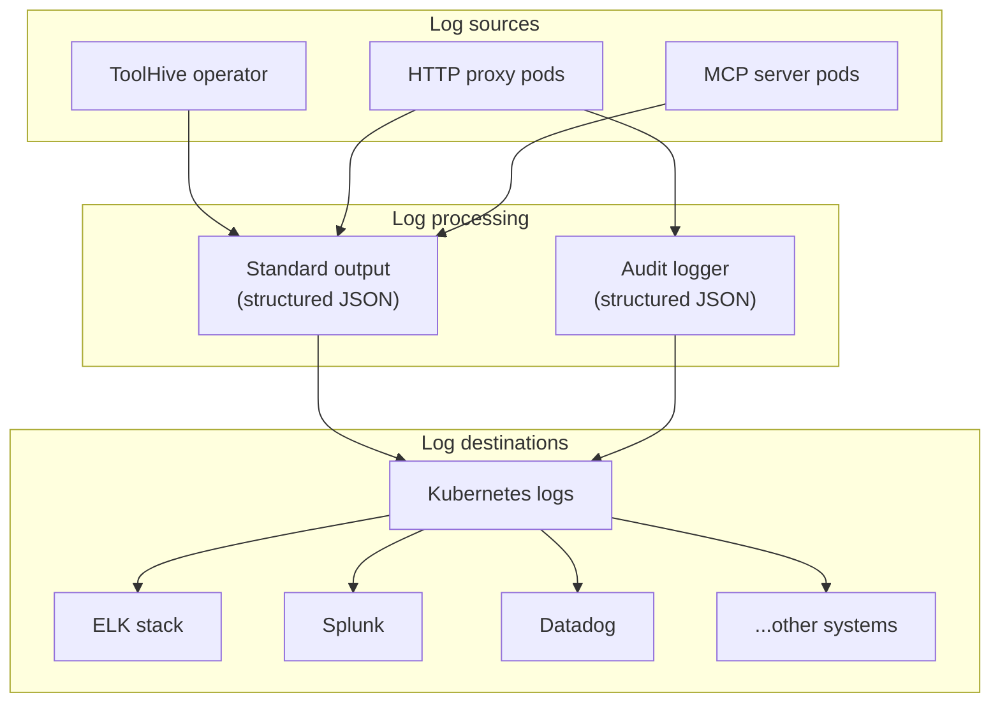

ToolHive provides structured JSON logging for MCP servers in Kubernetes, giving
you detailed operational insights and compliance audit trails. You can configure
log levels, enable audit logging for tracking MCP operations, and ship the logs
with collectors like Fluent Bit, Grafana Alloy, or the OpenTelemetry Collector
to the analysis system you already use, such as the Elastic Stack (ELK), Splunk,
or Datadog.

## Overview

The ToolHive operator provides two types of logs:

1. **Standard application logs** - Structured operational logs from the ToolHive
   operator and proxy components
2. **Audit logs** - Security and compliance logs tracking all MCP operations


```mermaid
flowchart TB
  subgraph Sources["Log sources"]
    Op["ToolHive operator"]
    Proxy["HTTP proxy pods"]
    MCP["MCP server pods"]
  end

  subgraph Processing["Log processing"]
    Stdout["Standard output<br>(structured JSON)"]
    Audit["Audit logger<br>(structured JSON)"]
  end

  subgraph Destinations["Log destinations"]
    K8s["Kubernetes logs"]
    ELK["ELK stack"]
    Splunk["Splunk"]
    Datadog["Datadog"]
    Etc["...other systems"]
  end

  Op --> Stdout
  Proxy --> Stdout & Audit
  MCP --> Stdout

  Stdout --> K8s
  Audit --> K8s

  K8s --> ELK & Splunk & Datadog & Etc
```

## Structured application logs

ToolHive automatically outputs structured JSON logs to the standard output
(stdout) of the operator and HTTP proxy (`proxyrunner`) pods.

All logs use a consistent format for easy parsing by log collectors:

```json
{
  "level": "info",
  "ts": 1761934317.963125,
  "caller": "logger/logger.go:39",
  "msg": "MCP server github started successfully"
}
```

### Key fields in application logs

| Field    | Type   | Description                                      |
| -------- | ------ | ------------------------------------------------ |
| `level`  | string | Log level: `debug`, `info`, `warn`, `error`      |
| `ts`     | float  | Unix timestamp with microseconds                 |
| `caller` | string | Source file and line number of the log statement |
| `msg`    | string | Log message (exact content varies by event)      |

## Enable audit logging

Audit logs provide detailed records of all MCP operations for security and
compliance. To enable audit logging, set the `audit.enabled` field to `true` in
your MCP server manifest:

<Tabs groupId="server-type">
<TabItem value="mcpserver" label="MCPServer" default>

```yaml {11-12}
apiVersion: toolhive.stacklok.dev/v1beta1
kind: MCPServer
metadata:
  name: <SERVER_NAME>
  namespace: toolhive-system
spec:
  image: <SERVER_IMAGE>
  # ... other spec fields ...

  # Enable audit logging
  audit:
    enabled: true
```

</TabItem>
<TabItem value="mcpremoteproxy" label="MCPRemoteProxy">

```yaml {11-12}
apiVersion: toolhive.stacklok.dev/v1beta1
kind: MCPRemoteProxy
metadata:
  name: <SERVER_NAME>
  namespace: toolhive-system
spec:
  remoteUrl: <SERVER_URL>
  # ... other spec fields ...

  # Enable audit logging
  audit:
    enabled: true
```

</TabItem>
<TabItem value="virtualmcpserver" label="VirtualMCPServer">

```yaml {11-14}
apiVersion: toolhive.stacklok.dev/v1beta1
kind: VirtualMCPServer
metadata:
  name: <SERVER_NAME>
  namespace: toolhive-system
spec:
  groupRef:
    name: <GROUP_NAME>
  config:
    # Enable audit logging
    audit:
      enabled: true
      includeRequestData: true
      includeResponseData: true

  # ... other configs ...
```

</TabItem>
</Tabs>

ToolHive writes audit logs to stdout alongside standard application logs. Your
log collector can differentiate them using the `audit_id` field or by filtering
for `"msg": "audit_event"`.

### Audit log format

When audit logging is enabled, each MCP operation generates a structured audit
event. For example, here is a sample audit log entry for a tool execution
request from an MCPServer resource:

```json
{
  "time": "2024-01-01T12:00:00.123456789Z",
  "level": "AUDIT",
  "msg": "audit_event",
  "audit_id": "550e8400-e29b-41d4-a716-446655440000",
  "type": "mcp_tool_call",
  "logged_at": "2024-01-01T12:00:00.123456Z",
  "outcome": "success",
  "component": "github-server",
  "source": {
    "type": "network",
    "value": "10.0.1.5",
    "extra": {
      "user_agent": "node"
    }
  },
  "subjects": {
    "user": "john.doe@example.com",
    "user_id": "user-123"
  },
  "target": {
    "endpoint": "/messages",
    "method": "tools/call",
    "name": "search_issues",
    "type": "tool"
  },
  "metadata": {
    "extra": {
      "duration_ms": 245,
      "transport": "http"
    }
  }
}
```

:::info[User information in audit logs]

User information in the `subjects` field comes from JWT claims when OIDC
authentication is configured. The system uses the `name`, `preferred_username`,
or `email` claim (in that order) for the display name. If authentication is not
configured, the `user_id` field is set to `local`.

:::

#### Key fields in audit logs

| Field           | Description                                                          |
| --------------- | -------------------------------------------------------------------- |
| `audit_id`      | Unique identifier for the audit event                                |
| `type`          | Type of MCP operation (see event types below)                        |
| `outcome`       | Result: `success`, `failure`, `error`, `denied`, `application_error` |
| `component`     | Name of the MCP server                                               |
| `subjects.user` | User display name (from JWT claims)                                  |
| `target.method` | MCP method called                                                    |
| `target.name`   | Tool/resource name                                                   |

#### Common audit event types

| Event Type           | Description               |
| -------------------- | ------------------------- |
| `mcp_initialize`     | MCP server initialization |
| `mcp_tool_call`      | Tool execution request    |
| `mcp_tools_list`     | List available tools      |
| `mcp_resource_read`  | Resource access           |
| `mcp_resources_list` | List available resources  |

<details>
<summary>Complete audit field reference</summary>

#### Audit log fields

| Field                        | Type   | Description                                                                                                                                                                       |
| ---------------------------- | ------ | --------------------------------------------------------------------------------------------------------------------------------------------------------------------------------- |
| `time`                       | string | Timestamp when the log was generated                                                                                                                                              |
| `level`                      | string | Log level (`AUDIT` for audit events)                                                                                                                                              |
| `msg`                        | string | Always "audit_event" for audit logs                                                                                                                                               |
| `audit_id`                   | string | Unique identifier for the audit event                                                                                                                                             |
| `type`                       | string | Type of MCP operation (see event types below)                                                                                                                                     |
| `logged_at`                  | string | UTC timestamp of the event                                                                                                                                                        |
| `outcome`                    | string | Result of the operation: `success`, `failure`, `error`, `denied` (authorization denial), or `application_error` (transport succeeded but the JSON-RPC response reported an error) |
| `component`                  | string | Name of the MCP server                                                                                                                                                            |
| `source`                     | object | Request source information                                                                                                                                                        |
| `source.type`                | string | Source type (e.g., "network")                                                                                                                                                     |
| `source.value`               | string | Source identifier (e.g., IP address)                                                                                                                                              |
| `source.extra`               | object | Additional source metadata                                                                                                                                                        |
| `subjects`                   | object | User and identity information                                                                                                                                                     |
| `subjects.user`              | string | User display name (from JWT claims: name, preferred_username, or email)                                                                                                           |
| `subjects.user_id`           | string | User identifier (from JWT sub claim)                                                                                                                                              |
| `subjects.client_name`       | string | Client application name (optional, from JWT claims)                                                                                                                               |
| `subjects.client_version`    | string | Client version (optional, from JWT claims)                                                                                                                                        |
| `target`                     | object | Target resource information                                                                                                                                                       |
| `target.endpoint`            | string | API endpoint path                                                                                                                                                                 |
| `target.method`              | string | MCP method called                                                                                                                                                                 |
| `target.name`                | string | Tool or resource name                                                                                                                                                             |
| `target.type`                | string | Target type (e.g., "tool")                                                                                                                                                        |
| `metadata`                   | object | Additional metadata                                                                                                                                                               |
| `metadata.extra.duration_ms` | number | Operation duration in milliseconds                                                                                                                                                |
| `metadata.extra.transport`   | string | Transport protocol used                                                                                                                                                           |

#### Audit event types

| Event Type           | Description               |
| -------------------- | ------------------------- |
| `mcp_initialize`     | MCP server initialization |
| `mcp_tool_call`      | Tool execution request    |
| `mcp_tools_list`     | List available tools      |
| `mcp_resource_read`  | Resource access           |
| `mcp_resources_list` | List available resources  |
| `mcp_prompt_get`     | Prompt retrieval          |
| `mcp_prompts_list`   | List available prompts    |
| `mcp_notification`   | MCP notifications         |
| `mcp_ping`           | Health check pings        |
| `mcp_completion`     | Request completion        |

</details>

## Set up log collection

ToolHive outputs structured JSON logs that work with your existing log
collection infrastructure. Before configuring a collector, identify which pods
and containers to target, then route their logs to your observability backend.

### Identify the namespace and containers

By default, the operator and its workloads run in the `toolhive-system`
namespace, but this varies by installation. Confirm the namespace and list the
pods running in it:

```bash
kubectl get pods -n toolhive-system
```

ToolHive pods use different container names depending on the component, and not
every container emits JSON:

| Component                                        | Container  | Output                                   |
| ------------------------------------------------ | ---------- | ---------------------------------------- |
| MCP server proxy (`MCPServer`, `MCPRemoteProxy`) | `toolhive` | Structured JSON, including audit events  |
| Virtual MCP server (`VirtualMCPServer`)          | `vmcp`     | Structured JSON, including audit events  |
| MCP server process                               | `mcp`      | Raw MCP server stdout (often plain text) |

Target the `toolhive` and `vmcp` containers for JSON log collection. The `mcp`
container passes through whatever the MCP server writes to stdout, so pointing a
JSON parser at it produces parse failures whenever that output is plain text.

On a standard Kubernetes node, container logs are symlinked under
`/var/log/containers/` using the pattern
`<POD>_<NAMESPACE>_<CONTAINER>-<ID>.log`. To match only the JSON-emitting
containers in the `toolhive-system` namespace, target:

```text
/var/log/containers/*_toolhive-system_toolhive-*.log
/var/log/containers/*_toolhive-system_vmcp-*.log
```

:::note[Audit events use a custom log level]

Audit events are logged at a custom `AUDIT` level (`"level": "AUDIT"` in the
JSON output), which sits between `INFO` and `WARN` so audit events stay distinct
from regular application logs.

Because `AUDIT` is not one of the standard level names that log aggregators
detect automatically (`debug`, `info`, `warn`, `error`, and so on), audit events
appear with an undetected or `unknown` level in views like Grafana's Explore
Logs. To filter for them, match the `level` field value `AUDIT` or the `msg`
value `audit_event` directly. Matching `level` as a label or indexed field works
only if your collector promotes that field from the JSON log line first.

:::

:::tip[Use your existing collection methods]

The examples below run each collector as a `DaemonSet` that tails container logs
from each node. If your organization uses sidecar-based or operator-based log
collection, adapt these patterns to match your existing infrastructure.

:::

### Fluent Bit

[Fluent Bit](https://fluentbit.io/) is a lightweight, widely deployed log
processor with first-class support for the container (CRI) log format and JSON
parsing. The following [Helm chart](https://github.com/fluent/helm-charts)
values define a complete pipeline that tails the ToolHive containers, enriches
records with Kubernetes metadata, promotes the JSON log fields to the top level,
and ships everything to Grafana Loki:

```yaml title="fluent-bit-values.yaml"
luaScripts:
  add_service.lua: |
    function add_service(tag, timestamp, record)
      if record["kubernetes"] ~= nil then
        record["service"] = record["kubernetes"]["container_name"]
      end
      return 1, timestamp, record
    end

config:
  inputs: |
    [INPUT]
        Name              tail
        Tag               kube.*
        # Target the toolhive (MCP proxy) and vmcp (Virtual MCP) containers.
        # Both emit structured JSON covering audit and application logs.
        Path              /var/log/containers/*_toolhive-system_toolhive-*.log,/var/log/containers/*_toolhive-system_vmcp-*.log
        Parser            cri
        DB                /var/log/flb-toolhive.db
        Mem_Buf_Limit     5MB
        Skip_Long_Lines   On

  filters: |
    [FILTER]
        Name              kubernetes
        Match             kube.*
        Kube_Tag_Prefix   kube.var.log.containers.
        Labels            Off
        Annotations       Off

    [FILTER]
        # Add a `service` label (= container name) for Grafana drilldown grouping
        Name    lua
        Match   kube.*
        script  /fluent-bit/scripts/add_service.lua
        call    add_service

    [FILTER]
        # Parse the JSON content from the `message` field set by the CRI parser
        # and promote its fields (level, msg, audit_id, ...) to the top level.
        # Reserve_Data keeps non-JSON lines (such as plain-text output) intact.
        Name              parser
        Match             kube.*
        Key_Name          message
        Parser            toolhive_json
        Reserve_Data      True
        Preserve_Key      False

  customParsers: |
    [PARSER]
        # No Time_Key: the CRI parser already set the timestamp from the log prefix.
        Name        toolhive_json
        Format      json

  outputs: |
    [OUTPUT]
        Name              loki
        Match             kube.*
        Host              loki.observability.svc
        Port              3100
        Labels            job=toolhive
        Label_Keys        $kubernetes['namespace_name'],$kubernetes['pod_name'],$kubernetes['container_name'],$service
        Auto_Kubernetes_Labels Off
        # Drop internal CRI and Fluent Bit fields that add noise to the log body
        Remove_Keys       logtag,stream,kubernetes
```

The second JSON `parser` filter is the critical stage. Without it, the
structured fields (including `level`) stay nested inside the raw log string and
aren't available as top-level fields for filtering in Loki.

### Grafana Alloy

[Grafana Alloy](https://grafana.com/docs/alloy/latest/) is Grafana's current
recommended collector (it supersedes Promtail) and a natural companion to Loki.
This configuration discovers the ToolHive containers, parses their JSON, and
promotes `level` to a label:

```alloy title="config.alloy"
discovery.kubernetes "pods" {
  role = "pod"
}

// Keep only the JSON-emitting toolhive and vmcp containers
discovery.relabel "toolhive" {
  targets = discovery.kubernetes.pods.targets

  rule {
    source_labels = ["__meta_kubernetes_namespace"]
    regex         = "toolhive-system"
    action        = "keep"
  }
  rule {
    source_labels = ["__meta_kubernetes_pod_container_name"]
    regex         = "toolhive|vmcp"
    action        = "keep"
  }
  rule {
    source_labels = ["__meta_kubernetes_namespace"]
    target_label  = "namespace"
  }
  rule {
    source_labels = ["__meta_kubernetes_pod_name"]
    target_label  = "pod"
  }
  rule {
    source_labels = ["__meta_kubernetes_pod_container_name"]
    target_label  = "service"
  }
}

loki.source.kubernetes "toolhive" {
  targets    = discovery.relabel.toolhive.output
  forward_to = [loki.process.toolhive.receiver]
}

loki.process "toolhive" {
  forward_to = [loki.write.default.receiver]

  // Promote the JSON `level` field to a label
  stage.json {
    expressions = { level = "level" }
  }
  stage.labels {
    values = { level = "" }
  }
}

loki.write "default" {
  endpoint {
    url = "http://loki.observability.svc:3100/loki/api/v1/push"
  }
}
```

### OpenTelemetry Collector

If you already run the
[OpenTelemetry Collector](https://opentelemetry.io/docs/collector/) as an
observability hub, its `filelog` receiver can scrape the ToolHive container
logs. This receiver is also the basis for the
[Splunk Distribution of the OpenTelemetry Collector](https://help.splunk.com/en/splunk-observability-cloud/manage-data/splunk-distribution-of-the-opentelemetry-collector/get-started-with-the-splunk-distribution-of-the-opentelemetry-collector),
Splunk's current recommended approach for Kubernetes log collection:

```yaml title="otel-collector-config.yaml"
receivers:
  filelog:
    include:
      - /var/log/pods/toolhive-system_toolhive-*/toolhive/*.log
      - /var/log/pods/toolhive-system_vmcp-*/vmcp/*.log
    include_file_path: true
    operators:
      # Parse the container (CRI/containerd) log envelope
      - type: container
      # Promote the structured JSON fields (level, msg, audit_id, ...) to attributes
      - type: json_parser
        if: 'body matches "^{"'

processors:
  batch: {}

exporters:
  # Replace with the exporter for your backend (otlphttp, loki, splunk_hec, datadog, ...)
  otlp:
    endpoint: otel-backend.observability.svc:4317

service:
  pipelines:
    logs:
      receivers: [filelog]
      processors: [batch]
      exporters: [otlp]
```

Unlike the `/var/log/containers/` symlinks used in the examples above, the
`filelog` receiver reads the `/var/log/pods/` directory layout directly. The
receiver fits best when the Collector is already part of your stack; teams that
need a dedicated, high-throughput log scraper often pair it with Fluent Bit or
Grafana Alloy.

## Security considerations

Protect your log data by implementing appropriate access controls and
encryption:

### Encrypt logs

- Encrypt audit logs at rest and in transit
- Use TLS for log shipping to external systems

### Restrict log access

Implement RBAC to control who can access pod logs:

```yaml
apiVersion: rbac.authorization.k8s.io/v1
kind: Role
metadata:
  name: log-reader
  namespace: toolhive-system
rules:
  - apiGroups: ['']
    resources: ['pods/log']
    verbs: ['get', 'list']
```

## Next steps

- Learn about [telemetry and metrics](./telemetry-and-metrics.mdx) to complement
  your logging setup
- See the [observability overview](../concepts/observability.mdx) for the
  complete monitoring picture
- Check the [Kubernetes CRD reference](../reference/crds/index.mdx) for complete
  configuration options
