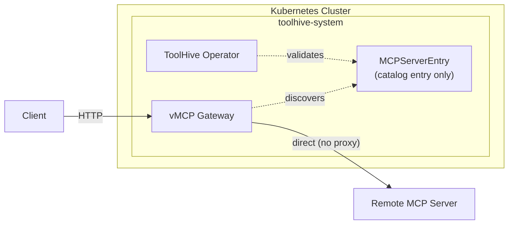

## Overview

MCPServerEntry is a zero-infrastructure catalog entry that declares a remote MCP
server endpoint for [Virtual MCP Server (vMCP)](../guides-vmcp/index.mdx)
discovery and routing. Unlike [MCPRemoteProxy](./remote-mcp-proxy.mdx), it
creates no pods, services, or deployments. Use MCPServerEntry when you want to
include a remote server in vMCP routing without the overhead of running a proxy.



MCPServerEntry is part of an
[MCPGroup](../reference/crd-spec.md#apiv1alpha1mcpgroup), which groups related
backend MCP servers together for vMCP discovery. When vMCP starts in
[discovered mode](../guides-vmcp/backend-discovery.mdx), it queries all
MCPServer, MCPRemoteProxy, and MCPServerEntry resources in the referenced group
and connects to them directly.

## Prerequisites

- A Kubernetes cluster (current and two previous minor versions are supported)
- Permissions to create resources in the cluster
- [`kubectl`](https://kubernetes.io/docs/tasks/tools/) configured to communicate
  with your cluster
- The ToolHive operator installed in your cluster (see
  [Deploy the operator](./deploy-operator.mdx))
- A remote MCP server that supports HTTP transport (SSE or Streamable HTTP)

## When to use MCPServerEntry vs. MCPRemoteProxy

|                     | MCPServerEntry                                                 | MCPRemoteProxy                                                                              |
| ------------------- | -------------------------------------------------------------- | ------------------------------------------------------------------------------------------- |
| **Infrastructure**  | No pods, services, or deployments                              | Creates a proxy pod and service                                                             |
| **Use case**        | Lightweight catalog entries for well-known remote servers      | Proxied connections requiring request transformation, caching, or the full middleware chain |
| **Discovery**       | Discovered by VirtualMCPServer through MCPGroup membership     | Discovered by VirtualMCPServer through MCPGroup membership                                  |
| **Authentication**  | Token exchange via `externalAuthConfigRef`                     | Full OIDC validation of incoming client requests                                            |
| **Authorization**   | Not applicable (no proxy layer)                                | Cedar policy enforcement on every request                                                   |
| **Audit logging**   | Not applicable (no proxy layer)                                | Structured audit logs with user identity                                                    |
| **Telemetry**       | Not applicable (no proxy layer)                                | OpenTelemetry tracing and Prometheus metrics                                                |
| **SSRF protection** | Built-in URL validation blocks internal and metadata endpoints | N/A (proxy runs inside the cluster)                                                         |

Choose MCPServerEntry when:

- You trust the remote server and don't need per-request policy enforcement
- You want the simplest possible configuration with no workload resources (pods,
  services, deployments)
- The remote server handles its own authentication

Choose MCPRemoteProxy when:

- You need to validate incoming client tokens with OIDC
- You need Cedar authorization policies on tool calls
- You need audit logging with user identity
- You need tool filtering or renaming at the proxy layer

## Create an MCPServerEntry

MCPServerEntry resources must be part of an MCPGroup. Create the group first if
it doesn't exist:

```yaml title="my-group.yaml"
apiVersion: toolhive.stacklok.dev/v1alpha1
kind: MCPGroup
metadata:
  name: my-group
  namespace: toolhive-system
spec:
  description: Group of backend MCP servers for vMCP aggregation
```

Then create a basic MCPServerEntry:

```yaml title="my-entry.yaml"
apiVersion: toolhive.stacklok.dev/v1alpha1
kind: MCPServerEntry
metadata:
  name: my-remote-tool
  namespace: toolhive-system
spec:
  groupRef:
    name: my-group
  remoteURL: https://mcp.example.com/mcp
  transport: streamable-http
```

Apply both resources:

```bash
kubectl apply -f my-group.yaml -f my-entry.yaml
```

:::info[What's happening?]

When you apply an MCPServerEntry resource:

1. The ToolHive operator detects the new resource
2. The operator validates the spec: checks that the referenced MCPGroup exists,
   validates the remote URL against SSRF patterns, and verifies any referenced
   auth or TLS resources
3. The operator sets the entry's phase to `Valid` if all checks pass, or
   `Failed` with a descriptive condition if something is wrong
4. When a VirtualMCPServer in
   [discovered mode](../guides-vmcp/backend-discovery.mdx) starts, it discovers
   the entry through its MCPGroup membership and connects directly to the remote
   URL

:::

### Required fields

| Field       | Description                                | Validation                 |
| ----------- | ------------------------------------------ | -------------------------- |
| `remoteURL` | URL of the remote MCP server               | Must match `^https?://`    |
| `transport` | Transport protocol for the remote server   | `sse` or `streamable-http` |
| `groupRef`  | Name of the MCPGroup this entry belongs to | Required, minimum length 1 |

## Configure authentication

When the remote MCP server requires authentication, reference an
[MCPExternalAuthConfig](./token-exchange-k8s.mdx) resource to configure token
exchange. The MCPExternalAuthConfig must exist in the same namespace as the
MCPServerEntry.

```yaml title="auth-entry.yaml"
apiVersion: toolhive.stacklok.dev/v1alpha1
kind: MCPExternalAuthConfig
metadata:
  name: my-auth-config
  namespace: toolhive-system
spec:
  type: tokenExchange
  tokenExchange:
    tokenUrl: https://auth.company.com/protocol/openid-connect/token
    clientId: remote-mcp-client
    clientSecretRef:
      name: remote-mcp-secret
      key: client-secret
    audience: https://mcp.example.com
---
apiVersion: toolhive.stacklok.dev/v1alpha1
kind: MCPServerEntry
metadata:
  name: internal-tool
  namespace: toolhive-system
spec:
  groupRef:
    name: my-group
  remoteURL: https://internal-mcp.corp.example.com/mcp
  transport: streamable-http
  # highlight-next-line
  externalAuthConfigRef:
    name: my-auth-config
```

When vMCP discovers this entry, it uses the referenced MCPExternalAuthConfig to
perform token exchange before forwarding requests to the remote server.

## Configure custom TLS certificates

If the remote server uses a certificate signed by an internal CA, provide a
custom CA bundle so that vMCP can verify the TLS connection.

First, create a ConfigMap containing the CA certificate:

```bash
kubectl create configmap internal-ca-bundle \
  --from-file=ca.crt=/path/to/ca-certificate.pem \
  -n toolhive-system
```

Then reference it in the MCPServerEntry:

```yaml title="tls-entry.yaml"
apiVersion: toolhive.stacklok.dev/v1alpha1
kind: MCPServerEntry
metadata:
  name: internal-tool
  namespace: toolhive-system
spec:
  groupRef:
    name: my-group
  remoteURL: https://internal-mcp.corp.example.com/mcp
  transport: streamable-http
  # highlight-start
  caBundleRef:
    configMapRef:
      name: internal-ca-bundle
      key: ca.crt
  # highlight-end
```

## Inject custom headers

Some remote MCP servers require custom headers for tenant identification, API
keys, or other purposes. Use the `headerForward` field to inject headers into
requests forwarded to the remote server.

```yaml title="header-entry.yaml"
apiVersion: toolhive.stacklok.dev/v1alpha1
kind: MCPServerEntry
metadata:
  name: my-remote-tool
  namespace: toolhive-system
spec:
  groupRef:
    name: my-group
  remoteURL: https://mcp.example.com/mcp
  transport: streamable-http
  # highlight-start
  headerForward:
    addPlaintextHeaders:
      X-Custom-Header: my-value
  # highlight-end
```

For sensitive values like API keys, use `addHeadersFromSecret` instead. See the
[Inject custom headers](./remote-mcp-proxy.mdx#inject-custom-headers) section of
the MCPRemoteProxy guide for the full syntax, which MCPServerEntry shares.

## Complete example

This example creates the MCPServerEntry-related resources for authentication and
custom TLS. If you reference a CA bundle ConfigMap such as `partner-ca-bundle`,
it must already exist or be created separately:

```yaml title="complete-entry.yaml"
---
# 1. Create the MCPGroup
apiVersion: toolhive.stacklok.dev/v1alpha1
kind: MCPGroup
metadata:
  name: engineering-tools
  namespace: toolhive-system
spec:
  description: Engineering team MCP servers

---
# 2. Create authentication config for token exchange
apiVersion: toolhive.stacklok.dev/v1alpha1
kind: MCPExternalAuthConfig
metadata:
  name: remote-auth
  namespace: toolhive-system
spec:
  type: tokenExchange
  tokenExchange:
    tokenUrl: https://auth.company.com/protocol/openid-connect/token
    clientId: remote-mcp-client
    clientSecretRef:
      name: remote-mcp-secret
      key: client-secret
    audience: https://mcp.partner.example.com

---
# 3. Create the MCPServerEntry
apiVersion: toolhive.stacklok.dev/v1alpha1
kind: MCPServerEntry
metadata:
  name: partner-tools
  namespace: toolhive-system
spec:
  groupRef:
    name: engineering-tools
  remoteURL: https://mcp.partner.example.com/mcp
  transport: streamable-http
  externalAuthConfigRef:
    name: remote-auth
  caBundleRef:
    configMapRef:
      name: partner-ca-bundle
      key: ca.crt
  headerForward:
    addPlaintextHeaders:
      X-Tenant-ID: engineering
```

Apply all resources:

```bash
kubectl apply -f complete-entry.yaml
```

## Check MCPServerEntry status

To check the status of your entries:

```bash
kubectl get mcpserverentries -n toolhive-system
```

The status shows the current phase of each entry:

| Phase     | Description                                                        |
| --------- | ------------------------------------------------------------------ |
| `Valid`   | All validations passed and the entry is usable                     |
| `Pending` | Initial state before the first reconciliation                      |
| `Failed`  | One or more referenced resources are missing or the URL is invalid |

For more details about a specific entry:

```bash
kubectl describe mcpserverentry partner-tools -n toolhive-system
```

Check the `Conditions` section for specific validation results:

```bash
kubectl get mcpserverentry partner-tools -n toolhive-system -o yaml
```

## SSRF protection

MCPServerEntry URLs are validated against Server-Side Request Forgery (SSRF)
patterns. The operator rejects URLs that target:

- **Loopback addresses**: `127.0.0.0/8`, `::1`
- **Link-local addresses**: `169.254.0.0/16`, `fe80::/10`
- **Cloud metadata endpoints**: `169.254.169.254` (AWS, GCP, Azure)
- **Private network ranges**: `10.0.0.0/8`, `172.16.0.0/12`, `192.168.0.0/16`

If a URL fails SSRF validation, the entry's phase is set to `Failed` with a
condition describing the rejection reason.

## Next steps

- [Configure a VirtualMCPServer](../guides-vmcp/configuration.mdx) to aggregate
  MCPServerEntry backends with other MCP servers
- [Set up backend discovery](../guides-vmcp/backend-discovery.mdx) to control
  how vMCP finds and connects to backends
- [Configure authentication](../guides-vmcp/authentication.mdx) for
  client-to-vMCP and vMCP-to-backend security

## Related information

- [MCPServerEntry CRD specification](../reference/crd-spec.md#apiv1alpha1mcpserverentry) -
  Full MCPServerEntry field reference
- [Introduction to the Kubernetes Operator](./intro.mdx) - Overview of all
  operator resource types
- [Proxy remote MCP servers](./remote-mcp-proxy.mdx) - Full-featured proxy for
  remote MCP servers
- [Run MCP servers in Kubernetes](./run-mcp-k8s.mdx) - Deploy container-based
  MCP servers

## Troubleshooting

<details>
<summary>MCPServerEntry stuck in Pending phase</summary>

If an MCPServerEntry remains in `Pending` phase after creation:

```bash
# Check the entry status
kubectl describe mcpserverentry <NAME> -n toolhive-system

# Check operator logs
kubectl logs -n toolhive-system -l app.kubernetes.io/name=toolhive-operator
```

Common causes:

- **Operator not running**: Verify the ToolHive operator pod is healthy
- **RBAC issues**: The operator may not have permission to reconcile
  MCPServerEntry resources

</details>

<details>
<summary>MCPServerEntry in Failed phase</summary>

If the entry's phase is `Failed`, check the conditions for the specific reason:

```bash
kubectl get mcpserverentry <NAME> -n toolhive-system \
  -o jsonpath='{.status.conditions}' | jq
```

Common causes:

- **SSRF validation failure**: The `remoteURL` targets a blocked address range
  (loopback, link-local, private network, or cloud metadata). Use an externally
  routable URL
- **Missing MCPGroup**: The group referenced in `groupRef` doesn't exist. Create
  the MCPGroup first
- **Missing MCPExternalAuthConfig**: The auth config referenced in
  `externalAuthConfigRef` doesn't exist in the same namespace
- **Missing CA ConfigMap**: The ConfigMap referenced in `caBundleRef` doesn't
  exist or the specified key is missing

</details>

<details>
<summary>MCPServerEntry not appearing in vMCP backends</summary>

If a `Valid` MCPServerEntry doesn't appear in the VirtualMCPServer's discovered
backends:

```bash
# Verify the entry is Valid
kubectl get mcpserverentry -n toolhive-system

# Check the VirtualMCPServer status
kubectl get virtualmcpserver <NAME> -n toolhive-system \
  -o jsonpath='{.status.discoveredBackends}' | jq

# Check vMCP pod logs
kubectl logs -n toolhive-system deployment/vmcp-<NAME>
```

Common causes:

- **Group mismatch**: The entry's `groupRef` doesn't match the
  VirtualMCPServer's `config.groupRef`
- **vMCP not restarted**: Backend changes require a pod restart to be
  discovered. Restart the vMCP deployment:
  ```bash
  kubectl rollout restart deployment vmcp-<NAME> -n toolhive-system
  ```
- **Inline mode**: The VirtualMCPServer uses `outgoingAuth.source: inline`,
  which doesn't discover backends at runtime. Switch to `discovered` mode or add
  the backend explicitly to `config.backends`

</details>

<details>
<summary>Remote server connection failures</summary>

If vMCP discovers the entry but can't connect to the remote server:

```bash
# Check vMCP logs for connection errors
kubectl logs -n toolhive-system deployment/vmcp-<NAME> | grep -i error
```

Common causes:

- **TLS certificate errors**: If the remote server uses an internal CA, add a
  `caBundleRef` pointing to the CA certificate
- **Authentication failures**: Verify the MCPExternalAuthConfig references valid
  credentials and the token exchange endpoint is reachable
- **Network policies**: Ensure egress from the vMCP pod to the remote server is
  allowed
- **Transport mismatch**: Verify the `transport` field matches the remote
  server's actual transport protocol

</details>
