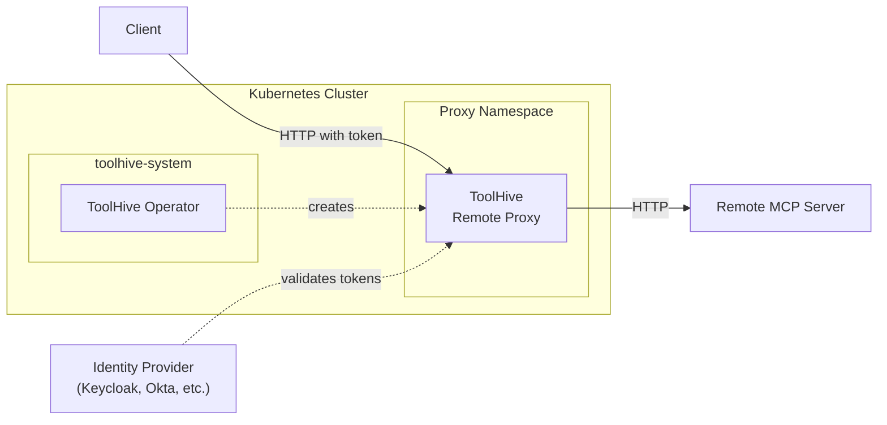

import Tabs from '@theme/Tabs';
import TabItem from '@theme/TabItem';

## Overview

The ToolHive operator can deploy proxies for remote MCP servers that are hosted
externally. This enables you to gain centralized observability, policy
enforcement, and audit logging for external MCP services without requiring
changes to the remote servers themselves.

Remote MCP proxies sit between your users and external MCP servers, providing:

- **Authentication**: Validate user tokens using OIDC
- **Authorization**: Apply Cedar policies based on user identity
- **Audit logging**: Track all requests with user identity and tool information
- **Tool filtering**: Control which tools are exposed to users
- **Telemetry**: Collect metrics and traces for monitoring



:::info[Experimental]

The MCPRemoteProxy CRD is still in an alpha state so breaking changes to the
spec and its capabilities are possible.

:::

## Prerequisites

- A Kubernetes cluster (current and two previous minor versions are supported)
- Permissions to create resources in the cluster
- [`kubectl`](https://kubernetes.io/docs/tasks/tools/) configured to communicate
  with your cluster
- The ToolHive operator installed in your cluster (see
  [Deploy the operator using Helm](./deploy-operator-helm.mdx))
- An OIDC identity provider (Keycloak, Okta, Azure AD, etc.)
- Access to a remote MCP server that supports HTTP transport (SSE or Streamable
  HTTP)

## Use cases

### Enterprise SaaS MCP servers

Organizations using external MCP services need centralized visibility and
control over how employees interact with these services. For example, a company
using a SaaS analytics platform with an MCP interface wants to:

- Monitor which tools employees are calling
- Apply authorization policies based on user roles
- Maintain audit logs for compliance
- Filter or restrict access to sensitive operations
- Collect centralized telemetry

By deploying a remote MCP proxy in Kubernetes, the company gains all these
capabilities without modifying the external service.

### Multi-tenant access control

Different teams within an organization may need different levels of access to
the same remote MCP server. Remote proxies enable you to:

- Deploy separate proxies with different authorization policies
- Apply team-specific tool filters
- Maintain separate audit trails per team
- Scale proxy instances independently based on team usage

## Create a remote MCP proxy

You can create `MCPRemoteProxy` resources in namespaces based on how the
operator was deployed.

- **Cluster mode (default)**: Create MCPRemoteProxy resources in any namespace
- **Namespace mode**: Create MCPRemoteProxy resources only in allowed namespaces

See [Deploy the operator](./deploy-operator-helm.mdx#operator-deployment-modes)
to learn about the different deployment modes.

### Basic configuration

This example creates a remote proxy for a fictional enterprise analytics MCP
server with OIDC authentication:

```yaml title="analytics-proxy.yaml"
apiVersion: toolhive.stacklok.dev/v1alpha1
kind: MCPRemoteProxy
metadata:
  name: analytics-proxy
  namespace: toolhive-system
spec:
  # Remote MCP server URL
  remoteURL: https://mcp.analytics.example.com

  # Port to expose the proxy on
  port: 8080

  # Transport method (sse or streamable-http)
  transport: streamable-http

  # OIDC authentication configuration
  oidcConfig:
    type: inline
    inline:
      # Your identity provider's issuer URL
      issuer: https://auth.company.com/realms/production
      # Expected audience claim in tokens
      audience: analytics-mcp-proxy
      # Optional: Client ID if using introspection
      clientId: analytics-proxy

  # Authorization policies
  authzConfig:
    type: inline
    inline:
      policies:
        # Allow all authenticated users to list tools
        - |
          permit(
            principal,
            action == Action::"list_tools",
            resource
          );
        # Allow users with 'analyst' role to call read-only tools
        - |
          permit(
            principal,
            action == Action::"call_tool",
            resource
          )
          when {
            principal has groups &&
            principal.groups.contains("analyst")
          };

  # Audit logging
  audit:
    enabled: true

  # Resource limits
  resources:
    limits:
      cpu: '500m'
      memory: 512Mi
    requests:
      cpu: 100m
      memory: 128Mi
```

Apply the resource:

```bash
kubectl apply -f analytics-proxy.yaml
```

:::info[What's happening?]

When you apply an `MCPRemoteProxy` resource, here's what happens:

1. The ToolHive operator detects the new resource (if it's in an allowed
   namespace)
2. The operator creates a Deployment running the ToolHive proxy
3. The operator creates a Service to expose the proxy
4. The proxy connects to your OIDC provider to fetch JWKS keys for token
   validation
5. Clients can now connect through the proxy, which validates tokens, applies
   policies, and forwards requests to the remote MCP server

:::

### Authentication configuration

The `oidcConfig` field validates incoming tokens from users. The proxy supports
multiple authentication methods:

<Tabs groupId='auth-method' queryString='auth-method'>
<TabItem value='inline' label='Inline OIDC' default>

Inline OIDC configuration is the simplest approach and works with most identity
providers:

```yaml {4-6}
spec:
  remoteURL: https://mcp.example.com

  oidcConfig:
    type: inline
    inline:
      issuer: https://auth.company.com/realms/production
      audience: mcp-proxy
      # Optional: For token introspection
      clientId: mcp-proxy-client
      clientSecretRef:
        name: mcp-proxy-secret
        key: client-secret
```

The proxy automatically discovers the JWKS URL from the issuer's OIDC discovery
endpoint (`/.well-known/openid-configuration`).

</TabItem>
<TabItem value='configmap' label='ConfigMap'>

For more complex configurations or when you need to share OIDC settings across
multiple proxies, use a ConfigMap:

```yaml {21-25} title="oidc-config.yaml"
apiVersion: v1
kind: ConfigMap
metadata:
  name: company-oidc-config
  namespace: toolhive-system
data:
  oidc.json: |
    {
      "issuer": "https://auth.company.com/realms/production",
      "audience": "mcp-proxy",
      "clientId": "mcp-proxy-client"
    }
---
apiVersion: toolhive.stacklok.dev/v1alpha1
kind: MCPRemoteProxy
metadata:
  name: analytics-proxy
  namespace: toolhive-system
spec:
  remoteURL: https://mcp.analytics.example.com
  oidcConfig:
    type: configMap
    configMap:
      name: company-oidc-config
      key: oidc.json
```

</TabItem>
</Tabs>

:::warning[Production security]

For production deployments:

- Always use HTTPS for the issuer URL
- Store client secrets in Kubernetes Secrets, not inline
- Use certificate validation (set `thvCABundlePath` if using custom CAs)
- Never set `insecureAllowHTTP: true` in production

:::

### Authorization policies

Authorization policies are written in
[Cedar policy language](https://www.cedarpolicy.com/) and evaluated for each
request. Policies can reference claims from the validated JWT token.

This example shows different policy patterns:

```yaml {6-9}
spec:
  remoteURL: https://mcp.example.com
  oidcConfig:
    # ... OIDC config ...

  authzConfig:
    type: inline
    inline:
      policies:
        # Allow all authenticated users to list tools
        - |
          permit(
            principal,
            action == Action::"list_tools",
            resource
          );

        # Allow users from specific email domain
        - |
          permit(
            principal,
            action == Action::"call_tool",
            resource
          )
          when {
            principal has email &&
            principal.email like "*@company.com"
          };

        # Role-based access control
        - |
          permit(
            principal,
            action == Action::"call_tool",
            resource
          )
          when {
            principal has groups &&
            principal.groups.contains("admin")
          };

        # Deny destructive operations
        - |
          forbid(
            principal,
            action == Action::"call_tool",
            resource
          )
          when {
            resource.tool in ["delete_data", "drop_table"]
          };
```

Available principal attributes depend on the claims in your JWT tokens. These
are examples of common JWT claims that can be referenced in policies; actual
available attributes depend on your identity provider's token configuration:

- `sub` - Subject (User ID)
- `email` - Email address
- `name` - Display name
- `groups` - Group memberships (array)
- Custom claims from your identity provider

### Tool filtering

Use `MCPToolConfig` to filter or rename tools from the remote server:

```yaml {2,31-32} title="analytics-tools.yaml"
apiVersion: toolhive.stacklok.dev/v1alpha1
kind: MCPToolConfig
metadata:
  name: analytics-tools-filter
  namespace: toolhive-system
spec:
  # Only expose read-only tools
  toolsFilter:
    - query_data
    - get_report
    - list_dashboards
    - export_chart

  # Rename tools for clarity
  toolsOverride:
    query_data:
      name: analytics_query_data
      description: Query analytics data with custom filters
    get_report:
      name: analytics_get_report
      description: Retrieve a generated analytics report
---
apiVersion: toolhive.stacklok.dev/v1alpha1
kind: MCPRemoteProxy
metadata:
  name: analytics-proxy
  namespace: toolhive-system
spec:
  remoteURL: https://mcp.analytics.example.com
  # ... other config ...
  toolConfigRef:
    name: analytics-tools-filter
```

See [Customize tools](./customize-tools.mdx) for more information about tool
filtering and renaming.

### Token exchange

When your organization has federation with the remote service provider, you can
configure token exchange to convert company tokens into service-specific tokens:

First, create an `MCPExternalAuthConfig`:

```yaml title="external-auth-config.yaml"
apiVersion: toolhive.stacklok.dev/v1alpha1
kind: MCPExternalAuthConfig
metadata:
  name: analytics-token-exchange
  namespace: toolhive-system
spec:
  type: tokenExchange
  tokenExchange:
    tokenURL: https://auth.company.com/protocol/openid-connect/token
    clientID: token-exchange-client
    clientSecretRef:
      name: token-exchange-creds
      key: client-secret
    audience: https://mcp.analytics.example.com
    scopes:
      - 'analytics:read'
      - 'analytics:write'
```

Then reference it in your proxy:

```yaml {11-12}
apiVersion: toolhive.stacklok.dev/v1alpha1
kind: MCPRemoteProxy
metadata:
  name: analytics-proxy
  namespace: toolhive-system
spec:
  remoteURL: https://mcp.analytics.example.com
  oidcConfig:
    # ... Company IDP config ...

  externalAuthConfigRef:
    name: analytics-token-exchange

  # ... other config ...
```

Now the proxy exchanges validated company tokens for remote service tokens
before forwarding requests.

## Quick start example

For testing and development, you can use the public MCP specification server:

```yaml title="mcp-spec-proxy.yaml"
apiVersion: toolhive.stacklok.dev/v1alpha1
kind: MCPRemoteProxy
metadata:
  name: mcp-spec-proxy
  namespace: toolhive-system
spec:
  remoteURL: https://modelcontextprotocol.io/mcp
  port: 8080
  transport: streamable-http

  # For testing - use your IDP's configuration
  oidcConfig:
    type: inline
    inline:
      issuer: https://auth.company.com/realms/test
      audience: mcp-test

  # Simple allow-all policy for testing
  authzConfig:
    type: inline
    inline:
      policies:
        - |
          permit(
            principal,
            action,
            resource
          );

  audit:
    enabled: true

  resources:
    limits:
      cpu: '100m'
      memory: 128Mi
    requests:
      cpu: '50m'
      memory: 64Mi
```

Apply it and test:

```bash
kubectl apply -f mcp-spec-proxy.yaml

# Check status
kubectl get mcpremoteproxy -n toolhive-system

# Port-forward to test locally
kubectl port-forward -n toolhive-system svc/mcp-mcp-spec-proxy-remote-proxy 8080:8080

# Get a token from your IDP and test
curl -X POST http://localhost:8080/mcp \
  -H "Authorization: Bearer <YOUR_TOKEN>" \
  -H "Content-Type: application/json" \
  -d '{"jsonrpc":"2.0","method":"tools/list","id":1}'
```

## Expose the proxy externally

To make the proxy accessible from outside the cluster, create an Ingress
resource:

```yaml title="proxy-ingress.yaml"
apiVersion: networking.k8s.io/v1
kind: Ingress
metadata:
  name: analytics-proxy-ingress
  namespace: toolhive-system
  annotations:
    # Preserve the path when forwarding
    nginx.ingress.kubernetes.io/rewrite-target: /
spec:
  ingressClassName: nginx
  rules:
    - host: analytics-mcp.company.com
      http:
        paths:
          - path: /
            pathType: Prefix
            backend:
              service:
                name: mcp-analytics-proxy-remote-proxy
                port:
                  number: 8080
  # Optional: TLS configuration
  tls:
    - hosts:
        - analytics-mcp.company.com
      secretName: analytics-proxy-tls
```

Apply the Ingress:

```bash
kubectl apply -f proxy-ingress.yaml
```

Users can now access the proxy at `https://analytics-mcp.company.com`.

## Check remote proxy status

To check the status of your remote proxies:

```bash
# List all proxies
kubectl get mcpremoteproxy -n toolhive-system

# Get detailed information
kubectl describe mcpremoteproxy analytics-proxy -n toolhive-system

# Check proxy logs
kubectl logs -n toolhive-system -l app.kubernetes.io/instance=analytics-proxy
```

The status shows:

- **Phase**: Current state (Pending, Ready, Failed, Terminating)
- **URL**: Internal cluster URL
- **External URL**: External URL if exposed via Ingress
- **Conditions**: Detailed status conditions

## Telemetry and observability

### Audit logging

When `audit.enabled: true`, the proxy logs all requests with:

- User identity (from token claims)
- Request method and parameters
- Response status and duration
- Timestamp

Audit logs are structured JSON written to stdout:

```json
{
  "loggedAt": "2025-10-29T10:15:30.123Z",
  "type": "mcp_tools_call",
  "outcome": "success",
  "source": "remote-proxy",
  "component": "analytics-proxy",
  "subjects": {
    "user": "jane.doe@company.com",
    "user_id": "user-123"
  },
  "target": {
    "method": "tools/call",
    "name": "query_data"
  },
  "metadata": {
    "auditId": "550e8400-e29b-41d4-a716-446655440000",
    "extra": {
      "duration_ms": 234,
      "transport": "http"
    }
  }
}
```

### Prometheus metrics

Enable Prometheus metrics to monitor proxy health and usage:

```yaml {6-8}
spec:
  remoteURL: https://mcp.example.com
  # ... other config ...

  telemetry:
    prometheus:
      enabled: true
```

Metrics are exposed at `/metrics` and include:

- `toolhive_mcp_requests_total` - Total MCP requests
- `toolhive_mcp_request_duration_seconds` - Request duration
- `toolhive_mcp_tool_calls_total` - Tool call operations
- `toolhive_mcp_active_connections` - Number of active connections

### OpenTelemetry

For distributed tracing and metrics export:

```yaml {6-15}
spec:
  remoteURL: https://mcp.example.com
  # ... other config ...

  telemetry:
    openTelemetry:
      enabled: true
      endpoint: https://otel-collector.company.com:4317
      serviceName: analytics-mcp-proxy
      tracing:
        enabled: true
        samplingRate: '0.1'
      metrics:
        enabled: true
```

See [Telemetry and metrics](./telemetry-and-metrics.mdx) for more information.

## Use with Virtual MCP Server

MCPRemoteProxy resources can be added to an MCPGroup and aggregated by a
VirtualMCPServer, enabling you to combine remote MCP servers with local
container-based MCPServer resources into a single unified endpoint.

### Add remote proxy to a group

To include a remote proxy in vMCP aggregation, add the `groupRef` field to your
MCPRemoteProxy spec:

```yaml
apiVersion: toolhive.stacklok.dev/v1alpha1
kind: MCPRemoteProxy
metadata:
  name: analytics-proxy
  namespace: toolhive-system
spec:
  groupRef: my-group # Reference to an MCPGroup
  remoteURL: https://mcp.analytics.example.com
  transport: streamable-http
  port: 8080
  oidcConfig:
    type: inline
    inline:
      issuer: https://auth.company.com/realms/production
      audience: analytics-proxy
```

### Benefits of vMCP aggregation

When remote proxies are part of a vMCP group:

- **Unified endpoint**: Clients connect to one vMCP URL instead of multiple
  proxy endpoints
- **Centralized authentication**: vMCP handles client authentication; remote
  proxies validate the forwarded tokens
- **Tool namespacing**: Tools from remote proxies are automatically prefixed to
  avoid conflicts with local MCP servers
- **Unified toolset**: Combine tools from container-based servers and external
  SaaS MCP services

### Complete example

This example creates a vMCP that aggregates a local Fetch server with a remote
analytics proxy:

```yaml
# 1. Create the group
apiVersion: toolhive.stacklok.dev/v1alpha1
kind: MCPGroup
metadata:
  name: dev-tools
  namespace: toolhive-system
spec:
  description: Development tools group
---
# 2. Local MCP Server
apiVersion: toolhive.stacklok.dev/v1alpha1
kind: MCPServer
metadata:
  name: fetch
  namespace: toolhive-system
spec:
  groupRef: dev-tools
  image: ghcr.io/stackloklabs/gofetch/server
  transport: streamable-http
---
# 3. Remote MCP Proxy
apiVersion: toolhive.stacklok.dev/v1alpha1
kind: MCPRemoteProxy
metadata:
  name: analytics-proxy
  namespace: toolhive-system
spec:
  groupRef: dev-tools
  remoteURL: https://mcp.analytics.example.com
  transport: streamable-http
  port: 8080
  oidcConfig:
    type: inline
    inline:
      issuer: https://auth.company.com
      audience: analytics-proxy
---
# 4. Virtual MCP Server
apiVersion: toolhive.stacklok.dev/v1alpha1
kind: VirtualMCPServer
metadata:
  name: dev-vmcp
  namespace: toolhive-system
spec:
  groupRef:
    name: dev-tools
  incomingAuth:
    type: oidc
    oidcConfig:
      type: inline
      inline:
        issuer: https://auth.company.com
        audience: dev-vmcp
```

Clients connect to the VirtualMCPServer endpoint and see tools from both the
local Fetch server and the remote analytics proxy.

See [Configure vMCP servers](../guides-vmcp/configuration.mdx) for more vMCP
configuration options.

## Next steps

See the [Client compatibility](../reference/client-compatibility.mdx) reference
to learn how to connect to remote MCP proxies using different clients.

Learn how to customize MCP tools using
[filters and overrides](./customize-tools.mdx).

Discover your deployed MCP servers automatically using the
[Kubernetes registry](../guides-registry/configuration.mdx#kubernetes-registry)
feature in the ToolHive Registry Server.

## Related information

- [Kubernetes CRD reference](../reference/crd-spec.mdx) - Full MCPRemoteProxy
  specification
- [Deploy the operator using Helm](./deploy-operator-helm.mdx) - Install the
  ToolHive operator
- [Run MCP servers in Kubernetes](./run-mcp-k8s.mdx) - Deploy local MCP servers

## Troubleshooting

<details>
<summary>Proxy pod in CrashLoopBackOff</summary>

If the proxy pod is restarting continuously:

```bash
# Check pod status
kubectl get pods -n toolhive-system -l app.kubernetes.io/instance=analytics-proxy

# Check pod logs
kubectl logs -n toolhive-system -l app.kubernetes.io/instance=analytics-proxy
```

Common causes:

- **Invalid OIDC configuration**: Verify the issuer URL is accessible and
  returns valid OIDC discovery metadata
- **Certificate validation issues**: If using a custom CA, ensure
  `thvCABundlePath` is set correctly
- **Resource limits**: Check if the pod has sufficient CPU and memory

</details>

<details>
<summary>401 Unauthorized errors</summary>

If clients receive 401 errors when calling the proxy:

```bash
# Check proxy logs for authentication errors
kubectl logs -n toolhive-system -l app.kubernetes.io/instance=analytics-proxy | grep -i "auth"
```

Common causes:

- **Missing audience claim**: Ensure tokens include the expected `aud` claim
- **Token expired**: Check token expiration time
- **Issuer mismatch**: Verify token `iss` claim matches `oidcConfig.issuer`
- **JWKS fetch failure**: Check proxy can reach the OIDC provider's JWKS
  endpoint

Verify your token claims:

```bash
# Decode JWT payload (requires jq)
# This handles base64url and missing padding
echo "<TOKEN>" | cut -d. -f2 | tr '_-' '/+' | awk '{l=length($0)%4; if(l>0) printf "%s", substr("====",1,4-l); print $0}' | base64 -d 2>/dev/null | jq
```

:::note

JWTs use base64url encoding and may omit padding characters (`=`). The command
above converts base64url to standard base64 and adds padding if needed. If you
get an "invalid input" error, check your shell and base64 version, or manually
add padding to the payload.

:::

</details>

<details>
<summary>Remote server unreachable</summary>

If the proxy cannot connect to the remote MCP server:

```bash
# Check proxy logs
kubectl logs -n toolhive-system -l app.kubernetes.io/instance=analytics-proxy

# Test connectivity from the pod
kubectl exec -n toolhive-system <POD_NAME> -- \
  curl -v https://mcp.analytics.example.com
```

Common causes:

- **Network policies**: Check if network policies allow egress to the remote
  server
- **DNS resolution**: Verify the remote URL resolves correctly
- **Firewall rules**: Ensure the cluster can reach the remote server
- **Certificate issues**: If using HTTPS, verify certificates are valid

</details>

<details>
<summary>Tool filtering not working</summary>

If tool filtering isn't being applied:

```bash
# Check if MCPToolConfig exists
kubectl get mcptoolconfig -n toolhive-system

# Verify the reference in MCPRemoteProxy
kubectl get mcpremoteproxy analytics-proxy -n toolhive-system -o yaml | \
  grep -A2 toolConfigRef
```

Ensure:

- The MCPToolConfig exists in the same namespace as the MCPRemoteProxy
- The `toolConfigRef.name` matches the MCPToolConfig name
- The MCPRemoteProxy status shows the config is applied

</details>

<details>
<summary>Token exchange failing</summary>

If token exchange is configured but not working:

```bash
# Check for token exchange errors in logs
kubectl logs -n toolhive-system -l app.kubernetes.io/instance=analytics-proxy | \
  grep -i "token.*exchange"
```

Verify:

- The MCPExternalAuthConfig exists and is correctly configured
- The client secret is valid and stored in a Kubernetes Secret
- The token exchange endpoint is reachable from the proxy
- The company IDP is configured for token exchange (RFC 8693)

</details>

<details>
<summary>Getting more debug information</summary>

For additional debugging:

```bash
# Get all resources related to your proxy
kubectl get all -n toolhive-system -l app.kubernetes.io/instance=analytics-proxy

# Export MCPRemoteProxy for inspection
kubectl get mcpremoteproxy analytics-proxy -n toolhive-system -o yaml

# Check operator logs
kubectl logs -n toolhive-system -l app.kubernetes.io/name=toolhive-operator

# Check events
kubectl get events -n toolhive-system --sort-by='.lastTimestamp' | \
  grep analytics-proxy
```

</details>
