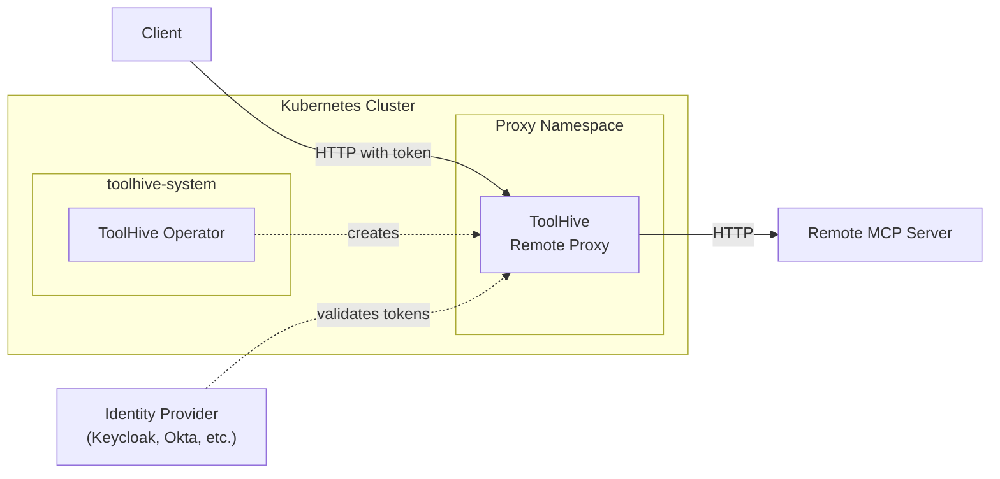

import Tabs from '@theme/Tabs';
import TabItem from '@theme/TabItem';

## Overview

The ToolHive operator can deploy proxies for remote MCP servers that are hosted
externally. This enables you to gain centralized observability, policy
enforcement, and audit logging for external MCP services without requiring
changes to the remote servers themselves.

Remote MCP proxies sit between your users and external MCP servers, providing:

- **Authentication**: Validate user tokens using OIDC
- **Authorization**: Apply Cedar policies based on user identity
- **Audit logging**: Track all requests with user identity and tool information
- **Tool filtering**: Control which tools are exposed to users
- **Telemetry**: Collect metrics and traces for monitoring


```mermaid
flowchart LR
  Client["Client"] -->|HTTP with token| Proxy["ToolHive<br>Remote Proxy"]
  Proxy -->|HTTP| RemoteMCP["Remote MCP Server"]

  subgraph K8s["Kubernetes Cluster"]
    subgraph NS["toolhive-system"]
      Operator["ToolHive Operator"]
    end
    subgraph NS2["Proxy Namespace"]
      Proxy
    end
  end

  Operator -.->|creates| Proxy

  IDP["Identity Provider<br>(Keycloak, Okta, etc.)"] -.->|validates tokens| Proxy
```

## Prerequisites

- An OIDC identity provider (Keycloak, Okta, Microsoft Entra ID, etc.)
- Access to a remote MCP server that supports HTTP transport (SSE or Streamable
  HTTP)

## Use cases

### Enterprise SaaS MCP servers

Organizations using external MCP services need centralized visibility and
control over how employees interact with these services. For example, a company
using a SaaS analytics platform with an MCP interface wants to:

- Monitor which tools employees are calling
- Apply authorization policies based on user roles
- Maintain audit logs for compliance
- Filter or restrict access to sensitive operations
- Collect centralized telemetry

By deploying a remote MCP proxy in Kubernetes, the company gains all these
capabilities without modifying the external service.

### Multi-tenant access control

Different teams within an organization may need different levels of access to
the same remote MCP server. Remote proxies enable you to:

- Deploy separate proxies with different authorization policies
- Apply team-specific tool filters
- Maintain separate audit trails per team
- Scale proxy instances independently based on team usage

## Create a remote MCP proxy

You can create `MCPRemoteProxy` resources in namespaces based on how the
operator was deployed.

- **Cluster mode (default)**: Create MCPRemoteProxy resources in any namespace
- **Namespace mode**: Create MCPRemoteProxy resources only in allowed namespaces

See [Deploy the operator](./deploy-operator.mdx#operator-deployment-modes) to
learn about the different deployment modes.

### Basic configuration

This example creates a remote proxy for a fictional enterprise analytics MCP
server with OIDC authentication:

```yaml title="analytics-proxy.yaml"
apiVersion: toolhive.stacklok.dev/v1beta1
kind: MCPOIDCConfig
metadata:
  name: analytics-oidc
  namespace: toolhive-system
spec:
  type: inline
  inline:
    # Your identity provider's issuer URL
    issuer: https://auth.company.com/realms/production
    # Optional: Client ID if using introspection
    clientId: analytics-proxy
---
apiVersion: toolhive.stacklok.dev/v1beta1
kind: MCPRemoteProxy
metadata:
  name: analytics-proxy
  namespace: toolhive-system
spec:
  # Remote MCP server URL
  remoteUrl: https://mcp.analytics.example.com

  # Port to expose the proxy on
  proxyPort: 8080

  # Transport method (sse or streamable-http)
  transport: streamable-http

  # OIDC authentication configuration
  oidcConfigRef:
    name: analytics-oidc
    # Expected audience claim in tokens
    audience: analytics-mcp-proxy

  # Authorization policies
  authzConfig:
    type: inline
    inline:
      policies:
        # Allow all authenticated users to list tools
        - |
          permit(
            principal,
            action == Action::"list_tools",
            resource
          );
        # Allow users with 'analyst' role to call read-only tools
        - |
          permit(
            principal,
            action == Action::"call_tool",
            resource
          )
          when {
            principal has groups &&
            principal.groups.contains("analyst")
          };

  # Audit logging
  audit:
    enabled: true

  # Resource limits
  resources:
    limits:
      cpu: '500m'
      memory: 512Mi
    requests:
      cpu: 100m
      memory: 128Mi
```

Apply the resource:

```bash
kubectl apply -f analytics-proxy.yaml
```

:::info[What's happening?]

When you apply an `MCPRemoteProxy` resource, here's what happens:

1. The ToolHive operator detects the new resource (if it's in an allowed
   namespace)
2. The operator creates a Deployment running the ToolHive proxy
3. The operator creates a Service to expose the proxy
4. The proxy connects to your OIDC provider to fetch JWKS keys for token
   validation
5. Clients can now connect through the proxy, which validates tokens, applies
   policies, and forwards requests to the remote MCP server

:::

### Authentication configuration

The `oidcConfigRef` field references an MCPOIDCConfig resource that validates
incoming tokens from users. The proxy supports multiple authentication methods:

:::warning[Authentication is not enabled by default]

If you omit `oidcConfigRef` (and configure no other authentication source), the
proxy accepts every request that can reach it and forwards it to the remote MCP
server under a synthetic local-user identity, with no token or credential check.
This is intended for local development or deployments already isolated behind a
trusted network boundary (such as a NetworkPolicy or service mesh). To enforce
client authentication, configure an authentication source: set `oidcConfigRef`
to reference an `MCPOIDCConfig`, or configure an embedded authorization server
with `authServerRef`.

:::

<Tabs groupId='auth-method' queryString='auth-method'>
<TabItem value='inline' label='OIDC provider' default>

Create an MCPOIDCConfig resource with inline OIDC settings and reference it from
the MCPRemoteProxy. This works with most identity providers:

```yaml {1-12,21-25}
apiVersion: toolhive.stacklok.dev/v1beta1
kind: MCPOIDCConfig
metadata:
  name: company-oidc
  namespace: toolhive-system
spec:
  type: inline
  inline:
    issuer: https://auth.company.com/realms/production
    clientId: mcp-proxy-client
    clientSecretRef:
      name: mcp-proxy-secret
      key: client-secret
---
apiVersion: toolhive.stacklok.dev/v1beta1
kind: MCPRemoteProxy
metadata:
  name: my-proxy
  namespace: toolhive-system
spec:
  remoteUrl: https://mcp.example.com
  oidcConfigRef:
    name: company-oidc
    audience: mcp-proxy
```

The proxy automatically discovers the JWKS URL from the issuer's OIDC discovery
endpoint (`/.well-known/openid-configuration`).

</TabItem>
<TabItem value='k8s-sa' label='Kubernetes service account'>

For in-cluster clients, create an MCPOIDCConfig that validates Kubernetes
service account tokens:

```yaml title="k8s-sa-oidc.yaml"
apiVersion: toolhive.stacklok.dev/v1beta1
kind: MCPOIDCConfig
metadata:
  name: k8s-sa-oidc
  namespace: toolhive-system
spec:
  type: kubernetesServiceAccount
  kubernetesServiceAccount:
    serviceAccount: mcp-client
    namespace: client-apps
---
apiVersion: toolhive.stacklok.dev/v1beta1
kind: MCPRemoteProxy
metadata:
  name: analytics-proxy
  namespace: toolhive-system
spec:
  remoteUrl: https://mcp.analytics.example.com
  oidcConfigRef:
    name: k8s-sa-oidc
    audience: mcp-proxy
```

</TabItem>
</Tabs>

:::warning[Production security]

For production deployments:

- Always use HTTPS for the issuer URL
- Store client secrets in Kubernetes Secrets, not inline
- Use certificate validation (set `caBundleRef` if using custom CAs)
- Never set `insecureAllowHTTP: true` in production

:::

### Authorization policies

Authorization policies are written in
[Cedar policy language](https://www.cedarpolicy.com/) and evaluated for each
request. Policies can reference claims from the validated JWT token.

This example shows different policy patterns:

```yaml {6-9}
spec:
  remoteUrl: https://mcp.example.com
  oidcConfigRef:
    # ... OIDC config ref ...

  authzConfig:
    type: inline
    inline:
      policies:
        # Allow all authenticated users to list tools
        - |
          permit(
            principal,
            action == Action::"list_tools",
            resource
          );

        # Allow users from specific email domain
        - |
          permit(
            principal,
            action == Action::"call_tool",
            resource
          )
          when {
            principal has email &&
            principal.email like "*@company.com"
          };

        # Role-based access control
        - |
          permit(
            principal,
            action == Action::"call_tool",
            resource
          )
          when {
            principal has groups &&
            principal.groups.contains("admin")
          };

        # Deny destructive operations
        - |
          forbid(
            principal,
            action == Action::"call_tool",
            resource
          )
          when {
            resource.tool in ["delete_data", "drop_table"]
          };
```

Available principal attributes depend on the claims in your JWT tokens. These
are examples of common JWT claims that can be referenced in policies; actual
available attributes depend on your identity provider's token configuration:

- `sub` - Subject (User ID)
- `email` - Email address
- `name` - Display name
- `groups` - Group memberships (array)
- Custom claims from your identity provider

### Tool filtering

Use `MCPToolConfig` to filter or rename tools from the remote server:

```yaml {2,31-32} title="analytics-tools.yaml"
apiVersion: toolhive.stacklok.dev/v1beta1
kind: MCPToolConfig
metadata:
  name: analytics-tools-filter
  namespace: toolhive-system
spec:
  # Only expose read-only tools
  toolsFilter:
    - query_data
    - get_report
    - list_dashboards
    - export_chart

  # Rename tools for clarity
  toolsOverride:
    query_data:
      name: analytics_query_data
      description: Query analytics data with custom filters
    get_report:
      name: analytics_get_report
      description: Retrieve a generated analytics report
---
apiVersion: toolhive.stacklok.dev/v1beta1
kind: MCPRemoteProxy
metadata:
  name: analytics-proxy
  namespace: toolhive-system
spec:
  remoteUrl: https://mcp.analytics.example.com
  # ... other config ...
  toolConfigRef:
    name: analytics-tools-filter
```

See [Customize tools](./customize-tools.mdx) for more information about tool
filtering and renaming.

### Token exchange

When your organization has federation with the remote service provider, you can
configure token exchange to convert company tokens into service-specific tokens:

First, create an `MCPExternalAuthConfig`:

```yaml title="external-auth-config.yaml"
apiVersion: toolhive.stacklok.dev/v1beta1
kind: MCPExternalAuthConfig
metadata:
  name: analytics-token-exchange
  namespace: toolhive-system
spec:
  type: tokenExchange
  tokenExchange:
    tokenUrl: https://auth.company.com/protocol/openid-connect/token
    clientId: token-exchange-client
    clientSecretRef:
      name: token-exchange-creds
      key: client-secret
    audience: https://mcp.analytics.example.com
    scopes:
      - 'analytics:read'
      - 'analytics:write'
```

Then reference it in your proxy:

```yaml {11-12}
apiVersion: toolhive.stacklok.dev/v1beta1
kind: MCPRemoteProxy
metadata:
  name: analytics-proxy
  namespace: toolhive-system
spec:
  remoteUrl: https://mcp.analytics.example.com
  oidcConfigRef:
    # ... Company IDP config ref ...

  externalAuthConfigRef:
    name: analytics-token-exchange

  # ... other config ...
```

Now the proxy exchanges validated company tokens for remote service tokens
before forwarding requests.

:::tip[AWS services]

For AWS services like the AWS MCP Server, use `type: awsSts` instead of
`type: tokenExchange`. This exchanges OIDC tokens for temporary AWS credentials
via `AssumeRoleWithWebIdentity` and signs requests with SigV4. See the
[AWS STS integration tutorial](../integrations/aws-sts.mdx) for details.

:::

### Customize the remote proxy pod

Use `podTemplateSpec` to set pod-level options that aren't exposed as
first-class fields on `MCPRemoteProxy`, such as security contexts, node
selectors, tolerations, and affinity rules. The field follows the standard
Kubernetes
[`PodTemplateSpec`](https://kubernetes.io/docs/reference/kubernetes-api/workload-resources/pod-template-v1/#PodTemplateSpec)
format, and you only need to specify the fields you want to add or override.

This example sets resource limits on the proxy container and adds a node
selector:

```yaml {15-27} title="analytics-proxy-custom-pod.yaml"
apiVersion: toolhive.stacklok.dev/v1beta1
kind: MCPRemoteProxy
metadata:
  name: analytics-proxy
  namespace: toolhive-system
spec:
  remoteUrl: https://mcp.analytics.example.com
  proxyPort: 8080
  transport: streamable-http

  oidcConfigRef:
    name: analytics-oidc
    audience: analytics-mcp-proxy

  podTemplateSpec:
    spec:
      nodeSelector:
        workload-tier: platform
      containers:
        - name: toolhive # This name must be "toolhive"
          resources:
            limits:
              cpu: '500m'
              memory: '512Mi'
            requests:
              cpu: '100m'
              memory: '128Mi'
```

:::info[Container name requirement]

To override the proxy container, use `name: toolhive`. The operator applies
overrides by matching the container name; any other name adds a sidecar instead.
This differs from [`MCPServer`](./run-mcp-k8s.mdx#customize-the-mcp-server-pod),
where the main container is `mcp`.

:::

If the pod template fails validation, the operator sets the `PodTemplateValid`
condition to `False`, moves the resource to phase `Failed`, and stops updating
the Deployment. See [Check remote proxy status](#check-remote-proxy-status) to
inspect the failure message.

### Inject custom headers

Some remote MCP servers require custom headers for tenant identification, API
keys, or other purposes. Use the `headerForward` field to inject headers into
every request forwarded to the remote server.

For non-sensitive values like tenant IDs or correlation headers, use
`addPlaintextHeaders`:

```yaml {6-9}
spec:
  remoteUrl: https://mcp.analytics.example.com
  # ... other config ...

  headerForward:
    addPlaintextHeaders:
      X-Tenant-ID: 'tenant-123'
      X-Correlation-ID: 'corr-abc-def-456'
```

For sensitive values like API keys, reference Kubernetes Secrets using
`addHeadersFromSecret`. First, create a Secret containing the header value:

```yaml title="api-key-secret.yaml"
apiVersion: v1
kind: Secret
metadata:
  name: api-key-secret
  namespace: toolhive-system
type: Opaque
stringData:
  api-key: 'your-api-key-value'
```

Then reference the Secret in your MCPRemoteProxy:

```yaml title="analytics-proxy.yaml" {12-17}
apiVersion: toolhive.stacklok.dev/v1beta1
kind: MCPRemoteProxy
metadata:
  name: analytics-proxy
  namespace: toolhive-system
spec:
  remoteUrl: https://mcp.analytics.example.com
  # ... other config ...

  headerForward:
    addHeadersFromSecret:
      - headerName: 'X-API-Key'
        valueSecretRef:
          name: api-key-secret
          key: api-key
```

You can combine plaintext and secret-backed headers:

```yaml {6-14}
spec:
  remoteUrl: https://mcp.analytics.example.com
  # ... other config ...

  headerForward:
    addPlaintextHeaders:
      X-Tenant-ID: 'tenant-123'
      X-Request-Source: 'toolhive-proxy'
    addHeadersFromSecret:
      - headerName: 'X-API-Key'
        valueSecretRef:
          name: api-key-secret
          key: api-key
```

:::warning[Security considerations]

- Plaintext header values are visible when you inspect the full resource (e.g.,
  `kubectl get ... -o yaml` or `kubectl describe`). For sensitive values (API
  keys, tokens), always use `addHeadersFromSecret`.
- Secret-backed header values are stored in Kubernetes Secrets and resolved at
  runtime. Only secret references (not actual values) appear in ConfigMaps used
  internally by ToolHive.
- ToolHive blocks headers that could enable request smuggling, identity
  spoofing, or routing manipulation: `Host`, `Connection`, `Keep-Alive`, `TE`,
  `Trailer`, `Upgrade`, `HTTP2-Settings`, `Proxy-Authorization`,
  `Proxy-Authenticate`, `Proxy-Connection`, `Transfer-Encoding`,
  `Content-Length`, `Forwarded`, `X-Forwarded-For`, `X-Forwarded-Host`,
  `X-Forwarded-Proto`, and `X-Real-IP`. Other headers, including `User-Agent`,
  are not restricted. HTTP header names are case-insensitive, so this list
  applies regardless of casing.

:::

## Quick start example

For testing and development, you can use the public MCP specification server:

```yaml title="mcp-spec-proxy.yaml"
apiVersion: toolhive.stacklok.dev/v1beta1
kind: MCPOIDCConfig
metadata:
  name: test-oidc
  namespace: toolhive-system
spec:
  type: inline
  inline:
    issuer: https://auth.company.com/realms/test
---
apiVersion: toolhive.stacklok.dev/v1beta1
kind: MCPRemoteProxy
metadata:
  name: mcp-spec-proxy
  namespace: toolhive-system
spec:
  remoteUrl: https://modelcontextprotocol.io/mcp
  proxyPort: 8080
  transport: streamable-http

  # For testing - use your IDP's configuration
  oidcConfigRef:
    name: test-oidc
    audience: mcp-test

  # Simple allow-all policy for testing
  authzConfig:
    type: inline
    inline:
      policies:
        - |
          permit(
            principal,
            action,
            resource
          );

  audit:
    enabled: true

  resources:
    limits:
      cpu: '100m'
      memory: 128Mi
    requests:
      cpu: '50m'
      memory: 64Mi
```

Apply it and test:

```bash
kubectl apply -f mcp-spec-proxy.yaml

# Check status
kubectl get mcpremoteproxy -n toolhive-system

# Port-forward to test locally
kubectl port-forward -n toolhive-system svc/mcp-mcp-spec-proxy-remote-proxy 8080:8080

# Get a token from your IDP and test
curl -X POST http://localhost:8080/mcp \
  -H "Authorization: Bearer <YOUR_TOKEN>" \
  -H "Content-Type: application/json" \
  -d '{"jsonrpc":"2.0","method":"tools/list","id":1}'
```

## Run multiple replicas for high availability

By default, an `MCPRemoteProxy` runs as a single proxy pod. To survive pod
restarts and absorb higher request volumes, set `spec.replicas` and configure
shared session storage so MCP sessions resolve across replicas.

```yaml title="analytics-proxy-ha.yaml"
apiVersion: toolhive.stacklok.dev/v1beta1
kind: MCPRemoteProxy
metadata:
  name: analytics-proxy
  namespace: toolhive-system
spec:
  remoteUrl: https://mcp.analytics.example.com
  transport: streamable-http
  # ... other config ...

  # highlight-start
  replicas: 3
  sessionStorage:
    provider: redis
    address: redis.toolhive-system.svc.cluster.local:6379
    db: 0
    keyPrefix: analytics-proxy-sessions
    passwordRef:
      name: redis-password
      key: password
  sessionAffinity: None
  # highlight-end
```

When `spec.replicas` is omitted, the operator does not write `replicas` on the
Deployment, so an HPA or other external controller can own scaling without the
operator overwriting the live count. Set `spec.replicas` to make the operator
authoritative.

`sessionStorage` configures a shared store for the proxy's session state.
Without it, each pod keeps sessions in memory only, so a request routed to a
different replica than the one that established the session fails with
`Session not found`. The store must be `redis` for multi-replica deployments;
the `memory` provider stays pod-local.

`sessionAffinity` controls how the Service routes connections. The default
`ClientIP` value pins each client to a single pod, which is correct when you
have no Redis-backed session storage but defeats the load-balancing benefit of
multiple replicas. With Redis-backed `sessionStorage`, set
`sessionAffinity: None` so requests distribute across pods and sessions resolve
through the shared store.

For end-to-end Redis deployment steps and Sentinel configuration, see
[Redis Sentinel session storage](./redis-session-storage.mdx).

:::warning

If `spec.replicas` is greater than 1 without Redis-backed `sessionStorage`, the
operator sets a `SessionStorageWarning` condition on the resource but still
applies the replica count. Pods start, but any request routed to a replica that
did not establish the session fails. Configure Redis before scaling past a
single replica.

:::

## Expose the proxy externally

To make the proxy accessible from outside the cluster, create an Ingress
resource:

```yaml title="proxy-ingress.yaml"
apiVersion: networking.k8s.io/v1
kind: Ingress
metadata:
  name: analytics-proxy-ingress
  namespace: toolhive-system
  annotations:
    # Preserve the path when forwarding
    nginx.ingress.kubernetes.io/rewrite-target: /
spec:
  ingressClassName: nginx
  rules:
    - host: analytics-mcp.company.com
      http:
        paths:
          - path: /
            pathType: Prefix
            backend:
              service:
                name: mcp-analytics-proxy-remote-proxy
                port:
                  number: 8080
  # Optional: TLS configuration
  tls:
    - hosts:
        - analytics-mcp.company.com
      secretName: analytics-proxy-tls
```

Apply the Ingress:

```bash
kubectl apply -f proxy-ingress.yaml
```

Users can now access the proxy at `https://analytics-mcp.company.com`.

## Check remote proxy status

To check the status of your remote proxies:

```bash
# List all proxies
kubectl get mcpremoteproxy -n toolhive-system

# Get detailed information
kubectl describe mcpremoteproxy analytics-proxy -n toolhive-system

# Check proxy logs
kubectl logs -n toolhive-system -l app.kubernetes.io/instance=analytics-proxy
```

The status shows:

- **Phase**: Current state (Pending, Ready, Failed, Terminating)
- **URL**: Internal cluster URL
- **External URL**: External URL if exposed via Ingress
- **Conditions**: Detailed status conditions, including `PodTemplateValid` when
  you use [`podTemplateSpec`](#customize-the-remote-proxy-pod). Check the
  `message` field of any condition reporting `status: "False"` to see why.

## Telemetry and observability

### Audit logging

When `audit.enabled: true`, the proxy logs all requests with:

- User identity (from token claims)
- Request method and parameters
- Response status and duration
- Timestamp

Audit logs are structured JSON written to stdout:

```json
{
  "loggedAt": "2025-10-29T10:15:30.123Z",
  "type": "mcp_tools_call",
  "outcome": "success",
  "source": "remote-proxy",
  "component": "analytics-proxy",
  "subjects": {
    "user": "jane.doe@company.com",
    "user_id": "user-123"
  },
  "target": {
    "method": "tools/call",
    "name": "query_data"
  },
  "metadata": {
    "auditId": "550e8400-e29b-41d4-a716-446655440000",
    "extra": {
      "duration_ms": 234,
      "transport": "http"
    }
  }
}
```

### Shared telemetry configuration

The preferred way to enable telemetry is to reference a shared
`MCPTelemetryConfig` resource using `telemetryConfigRef`. This lets you define
telemetry settings once and reuse them across multiple proxies and MCP servers:

```yaml {6-8} title="analytics-proxy.yaml"
spec:
  remoteUrl: https://mcp.example.com
  # ... other config ...

  telemetryConfigRef:
    name: shared-otel
    serviceName: analytics-mcp-proxy
```

The `MCPTelemetryConfig` resource is created separately. See
[Telemetry and metrics](./telemetry-and-metrics.mdx) for the full configuration
reference and examples.

### Available Prometheus metrics

When Prometheus is enabled, metrics are exposed at `/metrics` and include:

- `toolhive_mcp_requests_total` - Total MCP requests
- `toolhive_mcp_request_duration_seconds` - Request duration
- `toolhive_mcp_tool_calls_total` - Tool call operations
- `toolhive_mcp_active_connections` - Number of active connections

See [Telemetry and metrics](./telemetry-and-metrics.mdx) for more information.

## Use with Virtual MCP Server

MCPRemoteProxy resources can be added to an MCPGroup and aggregated by a
VirtualMCPServer, letting you combine remote MCP servers with local
container-based MCPServer resources into a single unified endpoint.

In [discovered mode](../guides-vmcp/backend-discovery.mdx), the vMCP finds
MCPRemoteProxy backends through their shared MCPGroup and connects to them like
any other backend. (In inline mode, you list the backends in the
VirtualMCPServer spec instead.) If the proxy is configured to validate incoming
requests, whether through `oidcConfigRef` or an embedded authorization server,
configure an
[backend authentication strategy](../guides-vmcp/authentication.mdx#backend-authentication)
on the vMCP so it presents a token the proxy accepts, such as `upstreamInject`
to forward a user's upstream token or `tokenExchange` to obtain a token with the
proxy's expected audience. A proxy left without an authentication source accepts
the vMCP's requests without extra configuration.

:::tip[Lighter-weight alternative]

If you only need to route a remote MCP server through vMCP and don't need the
proxy's per-request authorization, audit logging, or tool filtering, use an
[MCPServerEntry](./mcp-server-entry.mdx) instead. It registers the remote
endpoint as a catalog entry with no proxy pod, and vMCP handles outgoing
authentication to the remote server directly.

:::

### Add a remote proxy to a group

To include a remote proxy in an MCPGroup for vMCP aggregation, add the
`groupRef` field to your MCPRemoteProxy spec:

```yaml
apiVersion: toolhive.stacklok.dev/v1beta1
kind: MCPOIDCConfig
metadata:
  name: company-oidc
  namespace: toolhive-system
spec:
  type: inline
  inline:
    issuer: https://auth.company.com
---
apiVersion: toolhive.stacklok.dev/v1beta1
kind: MCPRemoteProxy
metadata:
  name: context7-proxy
  namespace: toolhive-system
spec:
  groupRef:
    name: my-group # Reference to an MCPGroup
  remoteUrl: https://mcp.context7.com/mcp
  transport: streamable-http
  proxyPort: 8080
  oidcConfigRef:
    name: company-oidc
    audience: context7-proxy
```

### Benefits of vMCP aggregation

Aggregating MCPRemoteProxy backends behind a vMCP provides:

- **Unified endpoint**: Clients connect to one vMCP URL instead of multiple
  proxy endpoints
- **Centralized authentication**: vMCP handles client authentication at the
  entry point
- **Tool namespacing**: Tools from remote proxies are automatically prefixed to
  avoid conflicts with local MCP servers
- **Unified toolset**: Combine tools from container-based servers and external
  SaaS MCP services

See [Configure vMCP servers](../guides-vmcp/configuration.mdx) for more vMCP
configuration options.

## Next steps

See the [Client compatibility](../reference/client-compatibility.mdx) reference
to learn how to connect to remote MCP proxies using different clients.

Learn how to customize MCP tools using
[filters and overrides](./customize-tools.mdx).

Discover your deployed MCP servers automatically using the
[Kubernetes source](../guides-registry/configuration.mdx#kubernetes-source)
feature in the ToolHive Registry Server.

## Related information

- [Kubernetes CRD reference](../reference/crds/mcpremoteproxy.mdx) - Full
  MCPRemoteProxy specification
- [Deploy the operator](./deploy-operator.mdx) - Install the ToolHive operator
- [Run MCP servers in Kubernetes](./run-mcp-k8s.mdx) - Deploy local MCP servers

## Troubleshooting

<details>
<summary>Proxy pod in CrashLoopBackOff</summary>

Check the logs of both the current and previous container instance:

```bash
kubectl logs -n toolhive-system -l app.kubernetes.io/instance=analytics-proxy
kubectl logs -n toolhive-system -l app.kubernetes.io/instance=analytics-proxy --previous
```

Typical causes:

- The MCPOIDCConfig issuer URL isn't reachable from inside the cluster, so JWKS
  discovery fails on startup. Confirm cluster egress and DNS for the issuer.
- The remote server uses a private CA but `caBundleRef` is missing or points to
  a Secret/ConfigMap that doesn't exist.
- The pod was OOMKilled. `kubectl describe pod` shows `Reason: OOMKilled` in the
  last terminated state - raise `resources.limits`.

</details>

<details>
<summary>401 Unauthorized errors</summary>

If clients receive 401 errors when calling the proxy:

```bash
# Check proxy logs for authentication errors
kubectl logs -n toolhive-system -l app.kubernetes.io/instance=analytics-proxy | grep -i "auth"
```

Common causes:

- **Missing audience claim**: Ensure tokens include the expected `aud` claim
- **Token expired**: Check token expiration time
- **Issuer mismatch**: Verify token `iss` claim matches the MCPOIDCConfig issuer
- **JWKS fetch failure**: Check proxy can reach the OIDC provider's JWKS
  endpoint

Verify your token claims:

```bash
# Decode JWT payload (requires jq)
# This handles base64url and missing padding
echo "<TOKEN>" | cut -d. -f2 | tr '_-' '/+' | awk '{l=length($0)%4; if(l>0) printf "%s", substr("====",1,4-l); print $0}' | base64 -d 2>/dev/null | jq
```

:::note

JWTs use base64url encoding and may omit padding characters (`=`). The command
above converts base64url to standard base64 and adds padding if needed. If you
get an "invalid input" error, check your shell and base64 version, or manually
add padding to the payload.

:::

</details>

<details>
<summary>Remote server unreachable</summary>

Test connectivity from inside the proxy pod to isolate cluster egress from proxy
logic:

```bash
kubectl exec -n toolhive-system <POD_NAME> -- \
  curl -v https://mcp.analytics.example.com
```

If `curl` fails, the cluster can't reach the remote server. Check for
NetworkPolicies that block egress from the proxy namespace, and confirm any
upstream firewall or VPC egress rules permit the destination. If `curl` succeeds
but the proxy still reports errors, check the proxy logs for the exact failure
(TLS handshake, HTTP status, transport mismatch).

</details>

<details>
<summary>Tool filtering not working</summary>

If tool filtering isn't being applied:

```bash
# Check if MCPToolConfig exists
kubectl get mcptoolconfig -n toolhive-system

# Verify the reference in MCPRemoteProxy
kubectl get mcpremoteproxy analytics-proxy -n toolhive-system -o yaml | \
  grep -A2 toolConfigRef
```

Ensure:

- The MCPToolConfig exists in the same namespace as the MCPRemoteProxy
- The `toolConfigRef.name` matches the MCPToolConfig name
- The MCPRemoteProxy status shows the config is applied

</details>

<details>
<summary>Token exchange failing</summary>

If token exchange is configured but not working:

```bash
# Check for token exchange errors in logs
kubectl logs -n toolhive-system -l app.kubernetes.io/instance=analytics-proxy | \
  grep -i "token.*exchange"
```

Verify:

- The MCPExternalAuthConfig exists and is correctly configured
- The client secret is valid and stored in a Kubernetes Secret
- The token exchange endpoint is reachable from the proxy
- The company IDP is configured for token exchange (RFC 8693)

</details>

<details>
<summary>Getting more debug information</summary>

For additional debugging:

```bash
# Get all resources related to your proxy
kubectl get all -n toolhive-system -l app.kubernetes.io/instance=analytics-proxy

# Export MCPRemoteProxy for inspection
kubectl get mcpremoteproxy analytics-proxy -n toolhive-system -o yaml

# Check operator logs
kubectl logs -n toolhive-system -l app.kubernetes.io/name=toolhive-operator

# Check events
kubectl get events -n toolhive-system --sort-by='.lastTimestamp' | \
  grep analytics-proxy
```

</details>
