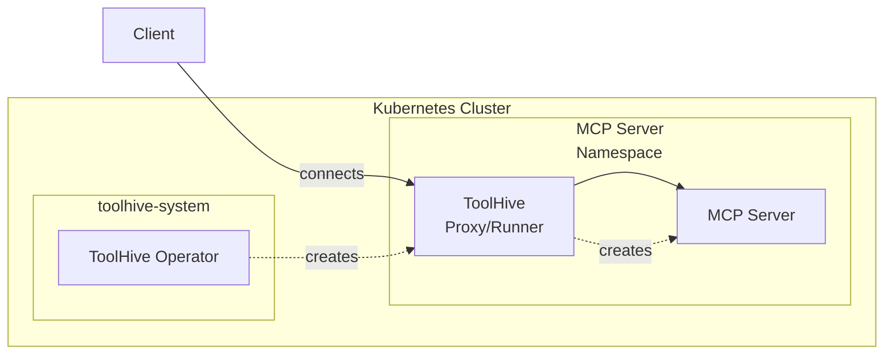
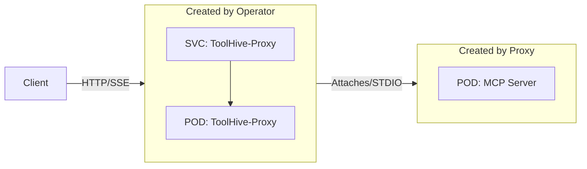
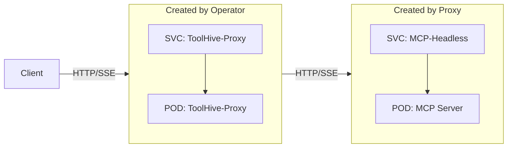

## Prerequisites

- A Kubernetes cluster (current and two previous minor versions are supported)
- Permissions to create resources in the cluster
- [`kubectl`](https://kubernetes.io/docs/tasks/tools/) configured to communicate
  with your cluster
- The ToolHive operator installed in your cluster (see
  [Deploy the operator using Helm](./deploy-operator-helm.md))

## Overview

The ToolHive operator deploys MCP servers in Kubernetes by creating proxy pods
that manage the actual MCP server containers. Here's how the architecture works:

### High-level architecture

This diagram shows the basic relationship between components. The ToolHive
operator watches for `MCPServer` resources and automatically creates the
necessary infrastructure to run your MCP servers securely within the cluster.



### STDIO transport flow

For MCP servers using STDIO transport, the proxy directly attaches to the MCP
server pod's standard input/output streams.



### SSE transport flow

For MCP servers using Server-Sent Events (SSE) transport, the proxy creates both
a pod and a headless service. This allows direct HTTP/SSE communication between
the proxy and MCP server while maintaining network isolation and service
discovery.



## Create an MCP server

You can create `MCPServer` resources in namespaces based on how the operator was
deployed.

- **Cluster mode (default)**: Create MCPServer resources in any namespace
- **Namespace mode**: Create MCPServer resources only in allowed namespaces

See [Deploy the operator](./deploy-operator-helm.md#operator-deployment-modes)
to learn about the different deployment modes.

To create an MCP server, define an `MCPServer` resource and apply it to your
cluster. This minimal example creates the
[`osv` MCP server](https://github.com/StacklokLabs/osv-mcp) which queries the
[Open Source Vulnerability (OSV) database](https://osv.dev/) for vulnerability
information.

```yaml title="my-mcpserver.yaml"
apiVersion: toolhive.stacklok.dev/v1alpha1
kind: MCPServer
metadata:
  name: osv
  namespace: my-namespace # Update with your namespace
spec:
  image: ghcr.io/stackloklabs/osv-mcp/server
  transport: sse
  port: 8080
  permissionProfile:
    type: builtin
    name: network
  resources:
    limits:
      cpu: '100m'
      memory: '128Mi'
    requests:
      cpu: '50m'
      memory: '64Mi'
```

Apply the resource:

```bash
kubectl apply -f my-mcpserver.yaml
```

:::info What's happening?

When you apply an `MCPServer` resource, here's what happens:

1. The ToolHive operator detects the new resource (if it's in an allowed
   namespace)
2. The operator automatically creates the necessary RBAC resources in the target
   namespace:
   - A ServiceAccount with the same name as the MCPServer
   - A Role with minimal permissions for StatefulSets, Services, Pods, and Pod
     logs/attach operations
   - A RoleBinding that connects the ServiceAccount to the Role
3. The operator creates a new Deployment containing a ToolHive proxy pod and
   service to handle client connections
4. The proxy creates the actual `MCPServer` pod containing your specified
   container image
5. For STDIO transport, the proxy attaches directly to the pod; for SSE
   transport, a headless service is created for direct pod communication
6. Clients can now connect through the service → proxy → MCP server chain to use
   the tools and resources (note: external clients will need an ingress
   controller or similar mechanism to access the service from outside the
   cluster)

:::

For more examples of `MCPServer` resources, see the
[example MCP server manifests](https://github.com/stacklok/toolhive/tree/main/examples/operator/mcp-servers)
in the ToolHive repo.

## Automatic RBAC management

The ToolHive operator automatically handles RBAC (Role-Based Access Control) for
each MCPServer instance, providing better security isolation and multi-tenant
support. Here's what the operator creates automatically:

- **ServiceAccount**: A dedicated ServiceAccount with the same name as your
  MCPServer
- **Role**: A namespace-scoped Role with minimal permissions for:
  - StatefulSets (create, get, list, watch, update, patch, delete)
  - Services (create, get, list, watch, update, patch, delete)
  - Pods (get, list, watch)
  - Pod logs and attach operations (get, list)
- **RoleBinding**: Connects the ServiceAccount to the Role

This approach provides:

- Each MCPServer operates with its own minimal set of permissions
- No manual RBAC setup required
- Better security isolation between different MCPServer instances
- Support for multi-tenant deployments across different namespaces

## Customize server settings

You can customize the MCP server by adding additional fields to the `MCPServer`
resource. The full specification is available in the
[Kubernetes CRD reference](../reference/crd-spec.mdx).

Below are some common configurations.

### Customize the MCP server pod

You can customize the MCP server pod that gets created by the proxy using the
`podTemplateSpec` field. This gives you full control over the pod specification,
letting you set security contexts, resource limits, node selectors, and other
pod-level configurations.

The `podTemplateSpec` field follows the standard Kubernetes
[`PodTemplateSpec`](https://kubernetes.io/docs/reference/kubernetes-api/workload-resources/pod-template-v1/#PodTemplateSpec)
format, so you can use any valid pod specification options.

This example sets resource limits.

```yaml {14-15} title="my-mcpserver-custom-pod.yaml"
apiVersion: toolhive.stacklok.dev/v1alpha1
kind: MCPServer
metadata:
  name: fetch
  namespace: development # Can be any namespace
spec:
  image: ghcr.io/stackloklabs/gofetch/server
  transport: sse
  port: 8080
  targetPort: 8080
  permissionProfile:
    type: builtin
    name: network
  podTemplateSpec:
    spec:
      containers:
        - name: mcp # This name must be "mcp"
          resources: # These resources apply to the MCP container
            limits:
              cpu: '500m'
              memory: '512Mi'
            requests:
              cpu: '100m'
              memory: '128Mi'
  resources: # These resources apply to the proxy container
    limits:
      cpu: '100m'
      memory: '128Mi'
    requests:
      cpu: '50m'
      memory: '64Mi'
```

:::info Container name requirement

When customizing containers in `podTemplateSpec`, you must use `name: mcp` for
the main container. This ensures the proxy can properly manage the MCP server
process.

:::

### Run a server with secrets

For MCP servers that require authentication tokens or other secrets, add the
`secrets` field to the `MCPServer` resource. This example shows how to use a
Kubernetes secret to pass a GitHub personal access token to the `github` MCP
server.

```yaml {13-16} title="my-mcpserver-with-secrets.yaml"
apiVersion: toolhive.stacklok.dev/v1alpha1
kind: MCPServer
metadata:
  name: github
  namespace: production # Can be any namespace
spec:
  image: ghcr.io/github/github-mcp-server
  transport: stdio
  port: 8080
  permissionProfile:
    type: builtin
    name: network
  secrets:
    - name: github-token
      key: token
      targetEnvName: GITHUB_PERSONAL_ACCESS_TOKEN
```

First, create the secret. Note that the secret must be created in the same
namespace as the MCP server and the key must match the one specified in the
`MCPServer` resource.

```bash
kubectl -n production create secret generic github-token --from-literal=token=<YOUR_TOKEN>
```

Apply the MCPServer resource:

```bash
kubectl apply -f my-mcpserver-with-secrets.yaml
```

### Mount a volume

You can mount volumes into the MCP server pod to provide persistent storage or
access to data. This is useful for MCP servers that need to read/write files or
access large datasets.

To do this, add a standard `volumes` field to the `podTemplateSpec` in the
`MCPServer` resource and a `volumeMounts` section in the container
specification. Here's an example that mounts a persistent volume claim (PVC) to
the `/projects` path in the Filesystem MCP server. The PVC must already exist in
the same namespace as the MCPServer.

```yaml {15-18,22-25} title="my-mcpserver-with-volume.yaml"
apiVersion: toolhive.stacklok.dev/v1alpha1
kind: MCPServer
metadata:
  name: filesystem
  namespace: data-processing # Can be any namespace
spec:
  image: docker.io/mcp/filesystem
  transport: stdio
  port: 8080
  permissionProfile:
    type: builtin
    name: none
  podTemplateSpec:
    spec:
      volumes:
        - name: my-mcp-data
          persistentVolumeClaim:
            claimName: my-mcp-data-claim
      containers:
        - name: mcp
          # ... other container settings ...
          volumeMounts:
            - mountPath: /projects/my-mcp-data
              name: my-mcp-data
              readOnly: true
```

## Check MCP server status

To check the status of your MCP servers in a specific namespace:

```bash
kubectl -n <NAMESPACE> get mcpservers
```

To check MCP servers across all namespaces:

```bash
kubectl get mcpservers --all-namespaces
```

The status, URL, and age of each MCP server is displayed.

For more details about a specific MCP server:

```bash
kubectl -n <NAMESPACE> describe mcpserver <NAME>
```

## Next steps

See the [Client compatibility](../reference/client-compatibility.mdx) reference
to learn how to connect to MCP servers using different clients.

## Related information

- [Kubernetes CRD reference](../reference/crd-spec.mdx) - Reference for the
  `MCPServer` Custom Resource Definition (CRD)
- [Deploy the operator using Helm](./deploy-operator-helm.md) - Install the
  ToolHive operator
- [Custom permissions](../guides-cli/custom-permissions.mdx) - Configure
  permission profiles

:::important

Outbound network filtering using permission profiles isn't currently implemented
in the ToolHive Operator. This is a roadmap feature planned for future releases.
For now, only file system permissions are enforced.

Contributions to help implement this feature are welcome! You can contribute by
visiting our [GitHub repository](https://github.com/stacklok/toolhive).

:::

## Troubleshooting

<details>
<summary>MCPServer resource not creating pods</summary>

If your `MCPServer` resource is created but no pods appear, first ensure you
created the `MCPServer` resource in an allowed namespace. If the operator runs
in namespace mode and you didn't include the namespace in the
`allowedNamespaces` list, the operator ignores the resource. Check the
operator's configuration:

```bash
helm get values toolhive-operator -n toolhive-system
```

Check the `operator.rbac.scope` and `operator.rbac.allowedNamespaces`
properties. If the operator runs in `namespace` mode, add the namespace where
you created the `MCPServer` to the `allowedNamespaces` list. See
[Operator deployment modes](./deploy-operator-helm.md#operator-deployment-modes).

If the operator runs in `cluster` mode (default) or the `MCPServer` is in an
allowed namespace, check the operator logs and resource status:

```bash
# Check MCPServer status
kubectl -n <NAMESPACE> describe mcpserver <NAME>

# Check operator logs
kubectl -n toolhive-system logs -l app.kubernetes.io/name=toolhive-operator

# Verify the operator is running
kubectl -n toolhive-system get pods -l app.kubernetes.io/name=toolhive-operator
```

Other common causes include:

- **Operator not running**: Ensure the ToolHive operator is deployed and running
- **Invalid image reference**: Verify the container image exists and is
  accessible
- **RBAC issues**: The operator automatically creates RBAC resources, but check
  for cluster-level permission issues
- **Resource quotas**: Check if namespace resource quotas prevent pod creation

</details>

<details>
<summary>MCP server pod fails to start</summary>

If the MCP server pod is created but fails to start or is in `CrashLoopBackOff`:

```bash
# Check pod status
kubectl -n <NAMESPACE> get pods

# Describe the failing pod
kubectl -n <NAMESPACE> describe pod <POD_NAME>

# Check pod logs
kubectl -n <NAMESPACE> logs <POD_NAME> -c mcp
```

Common causes include:

- **Image pull errors**: Verify the container image is accessible and the image
  name is correct
- **Missing secrets**: Ensure required secrets exist and are properly referenced
- **Resource constraints**: Check if the pod has sufficient CPU and memory
  resources
- **Permission issues**: Verify the security context and permission profile are
  correctly configured
- **Invalid arguments**: Check if the `args` field contains valid arguments for
  the MCP server

</details>

<details>
<summary>Proxy pod connection issues</summary>

If the proxy pod is running but clients cannot connect:

```bash
# Check proxy pod status
kubectl -n <NAMESPACE> get pods -l app.kubernetes.io/instance=<MCPSERVER_NAME>

# Check proxy logs
kubectl -n <NAMESPACE> logs -l app.kubernetes.io/instance=<MCPSERVER_NAME>

# Verify service is created
kubectl -n <NAMESPACE> get services
```

Common causes include:

- **Service not created**: Ensure the proxy service exists and has the correct
  selectors
- **Port configuration**: Verify the `port` field matches the MCP server's
  listening port
- **Transport mismatch**: Ensure the `transport` field (stdio/sse) matches the
  MCP server's capabilities
- **Network policies**: Check if network policies are blocking communication

</details>

<details>
<summary>Secret mounting issues</summary>

If secrets are not being properly mounted or environment variables are missing:

```bash
# Check if secret exists
kubectl -n <NAMESPACE> get secret <SECRET_NAME>

# Verify secret content
kubectl -n <NAMESPACE> describe secret <SECRET_NAME>

# Check environment variables in the pod
kubectl -n <NAMESPACE> exec <POD_NAME> -c mcp -- env | grep <ENV_VAR_NAME>
```

Common causes include:

- **Secret doesn't exist**: Create the secret in the correct namespace
- **Wrong key name**: Ensure the `key` field matches the actual key in the
  secret
- **Namespace mismatch**: Secrets must be in the same namespace as the
  `MCPServer`
- **Permission issues**: The operator automatically creates the necessary RBAC
  resources, but verify the ServiceAccount has access to read secrets

</details>

<details>
<summary>Volume mounting problems</summary>

If persistent volumes or other volumes are not mounting correctly:

```bash
# Check PVC status
kubectl -n <NAMESPACE> get pvc

# Describe the PVC
kubectl -n <NAMESPACE> describe pvc <PVC_NAME>

# Check volume mounts in the pod
kubectl -n <NAMESPACE> describe pod <POD_NAME>
```

Common causes include:

- **PVC not bound**: Ensure the PersistentVolumeClaim is bound to a
  PersistentVolume
- **Namespace mismatch**: The PVC must be in the same namespace as the MCPServer
- **Storage class issues**: Verify the storage class exists and is available
- **Access mode conflicts**: Check that the access mode is compatible with your
  setup
- **Mount path conflicts**: Ensure mount paths don't conflict with existing
  directories

</details>

<details>
<summary>Permission profile errors</summary>

If the MCP server fails due to permission profile issues:

```bash
# Check if ConfigMap exists (for custom profiles)
kubectl -n <NAMESPACE> get configmap <CONFIGMAP_NAME>

# Verify ConfigMap content
kubectl -n <NAMESPACE> describe configmap <CONFIGMAP_NAME>

# Check operator logs for permission errors
kubectl -n toolhive-system logs -l app.kubernetes.io/name=toolhive-operator | grep -i permission
```

Common causes include:

- **Invalid profile name**: Ensure built-in profile names are correct (`none`,
  `network`)
- **ConfigMap not found**: Create the ConfigMap with the custom permission
  profile
- **Invalid JSON**: Verify the permission profile JSON is valid
- **Missing key**: Ensure the specified key exists in the ConfigMap

</details>

<details>
<summary>Resource limit issues</summary>

If pods are being killed due to resource constraints:

```bash
# Check resource usage
kubectl -n <NAMESPACE> top pods

# Check for resource limit events
kubectl -n <NAMESPACE> get events --sort-by='.lastTimestamp'

# Describe the pod for resource information
kubectl -n <NAMESPACE> describe pod <POD_NAME>
```

Solutions:

- **Increase resource limits**: Adjust `resources.limits` in the `MCPServer`
  spec
- **Optimize resource requests**: Set appropriate `resources.requests` values
- **Check node capacity**: Ensure cluster nodes have sufficient resources
- **Review resource quotas**: Check namespace resource quotas and limits

</details>

<details>
<summary>Debugging connectivity</summary>

To test connectivity between components:

```bash
# Port-forward to test direct access to the proxy
kubectl -n <NAMESPACE> port-forward service/<MCPSERVER_NAME> 8080:8080

# Test the connection locally
curl http://localhost:8080/health

# Check service endpoints
kubectl -n <NAMESPACE> get endpoints
```

</details>

<details>
<summary>Getting more debug information</summary>

For additional debugging information:

```bash
# Get all resources related to your MCP server
kubectl -n <NAMESPACE> get all -l app.kubernetes.io/instance=<MCPSERVER_NAME>

# Check operator events
kubectl -n <NAMESPACE> get events --field-selector involvedObject.kind=MCPServer

# Export MCPServer resource for inspection
kubectl -n <NAMESPACE> get mcpserver <NAME> -o yaml
```

</details>
