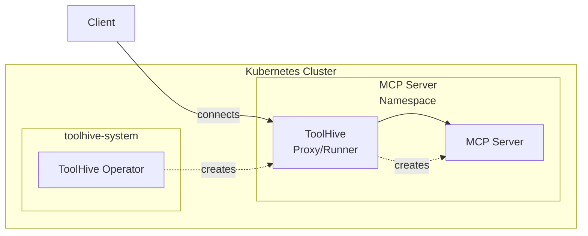
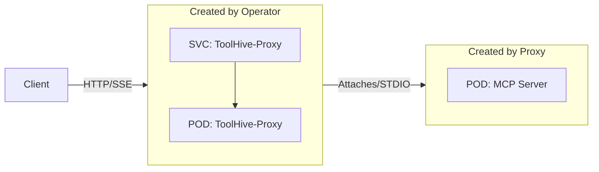
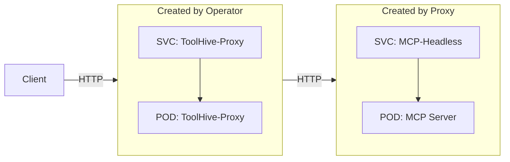

## Prerequisites

- A Kubernetes cluster (current and two previous minor versions are supported)
- Permissions to create resources in the cluster
- [`kubectl`](https://kubernetes.io/docs/tasks/tools/) configured to communicate
  with your cluster
- The ToolHive operator installed in your cluster (see
  [Deploy the operator](./deploy-operator.mdx))

## Overview

The ToolHive operator deploys MCP servers in Kubernetes by creating proxy pods
that manage the actual MCP server containers.

:::tip

If you need to build a container image for an MCP server that doesn't already
have one available, see the
[Build MCP containers](../guides-cli/build-containers.mdx) guide to learn how to
quickly create container images using the ToolHive CLI.

:::

### High-level architecture

This diagram shows the basic relationship between components. The ToolHive
operator watches for `MCPServer` resources and automatically creates the
necessary infrastructure to run your MCP servers securely within the cluster.



### STDIO transport flow

For MCP servers using STDIO transport, the proxy directly attaches to the MCP
server pod's standard input/output streams.



:::info[STDIO Transport Limitation]

MCP servers using STDIO transport support only a single client connection at a
time. If you need to support multiple users or concurrent client connections,
use SSE (Server-Sent Events) or Streamable HTTP transport instead.

:::

### Streamable HTTP and SSE transport flow

For MCP servers using Server-Sent Events (SSE) or Streamable HTTP transport, the
proxy creates both a pod and a headless service. This allows direct HTTP/SSE or
HTTP/Streamable HTTP communication between the proxy and MCP server while
maintaining network isolation and service discovery.



## Create an MCP server

You can create `MCPServer` resources in namespaces based on how the operator was
deployed.

- **Cluster mode (default)**: Create MCPServer resources in any namespace
- **Namespace mode**: Create MCPServer resources only in allowed namespaces

See [Deploy the operator](./deploy-operator.mdx#operator-deployment-modes) to
learn about the different deployment modes.

To create an MCP server, define an `MCPServer` resource and apply it to your
cluster. This minimal example creates the
[`osv` MCP server](https://github.com/StacklokLabs/osv-mcp) which queries the
[Open Source Vulnerability (OSV) database](https://osv.dev/) for vulnerability
information.

```yaml title="my-mcpserver.yaml"
apiVersion: toolhive.stacklok.dev/v1beta1
kind: MCPServer
metadata:
  name: osv
  namespace: my-namespace # Update with your namespace
spec:
  image: ghcr.io/stackloklabs/osv-mcp/server
  transport: streamable-http
  mcpPort: 8080
  proxyPort: 8080
  resources:
    limits:
      cpu: '100m'
      memory: '128Mi'
    requests:
      cpu: '50m'
      memory: '64Mi'
```

Apply the resource:

```bash
kubectl apply -f my-mcpserver.yaml
```

:::info[What's happening?]

When you apply an `MCPServer` resource, here's what happens:

1. The ToolHive operator detects the new resource (if it's in an allowed
   namespace)
2. The operator automatically creates the necessary RBAC resources in the target
   namespace:
   - A ServiceAccount with the same name as the MCPServer
   - A Role with minimal permissions for StatefulSets, Services, Pods, and Pod
     logs/attach operations
   - A RoleBinding that connects the ServiceAccount to the Role
3. The operator creates a new Deployment containing a ToolHive proxy pod and
   service to handle client connections
4. The proxy creates the actual `MCPServer` pod containing your specified
   container image
5. For STDIO transport, the proxy attaches directly to the pod; for SSE and
   Streamable HTTP transport, a headless service is created for direct pod
   communication
6. Clients can now connect through the service → proxy → MCP server chain to use
   the tools and resources (note: external clients will need an ingress
   controller or similar mechanism to access the service from outside the
   cluster)

:::

For more examples of `MCPServer` resources, see the
[example MCP server manifests](https://github.com/stacklok/toolhive/tree/main/examples/operator/mcp-servers)
in the ToolHive repo.

## Automatic RBAC management

The ToolHive operator automatically handles RBAC (Role-Based Access Control) for
each MCPServer instance, providing better security isolation and multi-tenant
support. Here's what the operator creates automatically:

- **ServiceAccount**: A dedicated ServiceAccount with the same name as your
  MCPServer
- **Role**: A namespace-scoped Role with minimal permissions for:
  - StatefulSets (create, get, list, watch, update, patch, delete)
  - Services (create, get, list, watch, update, patch, delete)
  - Pods (get, list, watch)
  - Pod logs and attach operations (get, list)
- **RoleBinding**: Connects the ServiceAccount to the Role

This approach provides:

- Each MCPServer operates with its own minimal set of permissions
- No manual RBAC setup required
- Better security isolation between different MCPServer instances
- Support for multi-tenant deployments across different namespaces

## Customize server settings

You can customize the MCP server by adding additional fields to the `MCPServer`
resource. The full specification is available in the
[Kubernetes CRD reference](../reference/crds/mcpserver.mdx).

Below are some common configurations.

### Customize the MCP server pod

You can customize the MCP server pod that gets created by the proxy using the
`podTemplateSpec` field. This gives you full control over the pod specification,
letting you set security contexts, resource limits, node selectors, and other
pod-level configurations.

The `podTemplateSpec` field follows the standard Kubernetes
[`PodTemplateSpec`](https://kubernetes.io/docs/reference/kubernetes-api/workload-resources/pod-template-v1/#PodTemplateSpec)
format, so you can use any valid pod specification options.

This example sets resource limits.

```yaml {14-15} title="my-mcpserver-custom-pod.yaml"
apiVersion: toolhive.stacklok.dev/v1beta1
kind: MCPServer
metadata:
  name: fetch
  namespace: development # Can be any namespace
spec:
  image: ghcr.io/stackloklabs/gofetch/server
  transport: streamable-http
  mcpPort: 8080
  proxyPort: 8080
  podTemplateSpec:
    spec:
      containers:
        - name: mcp # This name must be "mcp"
          resources: # These resources apply to the MCP container
            limits:
              cpu: '500m'
              memory: '512Mi'
            requests:
              cpu: '100m'
              memory: '128Mi'
  resources: # These resources apply to the proxy container
    limits:
      cpu: '100m'
      memory: '128Mi'
    requests:
      cpu: '50m'
      memory: '64Mi'
```

:::info[Container name requirement]

When customizing containers in `podTemplateSpec`, you must use `name: mcp` for
the main container. This ensures the proxy can properly manage the MCP server
process.

:::

### Run a server with secrets

When your MCP servers require authentication tokens or other secrets, ToolHive
supports multiple secrets management methods to fit your existing
infrastructure. Choose the method that best suits your needs:

<Tabs groupId='secret-manager' queryString='secret-manager'>
<TabItem value='kubernetes-native' label='Kubernetes secrets' default>

ToolHive can reference existing Kubernetes secrets to inject sensitive data into
your MCP server pods as environment variables. This example demonstrates how to
pass a GitHub personal access token to the `github` MCP server.

First, create the secret. The secret must exist in the same namespace as your
MCP server and the key must match what you specify in the `MCPServer` resource.

```bash
kubectl -n production create secret generic github-token --from-literal=token=<YOUR_TOKEN>
```

Next, define the `MCPServer` resource to reference the secret:

```yaml {10-13} title="my-mcpserver-with-secrets.yaml"
apiVersion: toolhive.stacklok.dev/v1beta1
kind: MCPServer
metadata:
  name: github
  namespace: production # Can be any namespace
spec:
  image: ghcr.io/github/github-mcp-server
  transport: stdio
  proxyPort: 8080
  secrets:
    - name: github-token
      key: token
      targetEnvName: GITHUB_PERSONAL_ACCESS_TOKEN
```

Finally, apply the MCPServer resource:

```bash
kubectl apply -f my-mcpserver-with-secrets.yaml
```

</TabItem>
<TabItem value='eso' label='External Secrets Operator'>

[External Secrets Operator](https://external-secrets.io/) is a Kubernetes
operator that integrates external secret management systems and syncs secrets
into Kubernetes as native resources. This example demonstrates how to use
ESO-managed secrets with your MCP server.

:::note

When you use the External Secrets Operator, your MCP server definition will look
the same as the Kubernetes-native example. This is because the External Secrets
Operator creates standard Kubernetes secrets from external sources.

:::

First, create a secret using the
[ExternalSecret resource](https://external-secrets.io/latest/api/externalsecret/).
The exact configuration depends on your external secret management system. The
secret must exist in the same namespace as your MCP server and the key must
match what you specify in the `MCPServer` resource.

Next, define the `MCPServer` resource to reference the secret:

```yaml {10-13} title="my-mcpserver-with-secrets-eso.yaml"
apiVersion: toolhive.stacklok.dev/v1beta1
kind: MCPServer
metadata:
  name: github
  namespace: production # Can be any namespace
spec:
  image: ghcr.io/github/github-mcp-server
  transport: stdio
  proxyPort: 8080
  secrets:
    - name: github-token
      key: token
      targetEnvName: GITHUB_PERSONAL_ACCESS_TOKEN
```

Finally, apply the MCPServer resource:

```bash
kubectl apply -f my-mcpserver-with-secrets-eso.yaml
```

</TabItem>
<TabItem value='vault' label='HashiCorp Vault'>

HashiCorp Vault provides multiple integration methods for Kubernetes
environments:

1. [Vault Sidecar Agent Injector](https://developer.hashicorp.com/vault/docs/deploy/kubernetes/injector),
   which injects a sidecar container into your pod to fetch and renew secrets
2. [Vault Secrets Operator](https://developer.hashicorp.com/vault/docs/deploy/kubernetes/vso),
   which creates Kubernetes secrets from Vault secrets (similar to the External
   Secrets Operator)
3. [Vault CSI Provider](https://developer.hashicorp.com/vault/docs/deploy/kubernetes/csi),
   which mounts secrets directly into your pod as files

ToolHive supports the first two methods. When you use the Vault Secrets
Operator, your MCP server definition will look the same as the Kubernetes-native
example because the Vault Secrets Operator creates standard Kubernetes secrets
from Vault.

The Vault Sidecar Agent Injector requires additional configuration in your
`MCPServer` resource to add the required annotations. For a complete example,
see the [HashiCorp Vault integration tutorial](../integrations/vault.mdx).

</TabItem>
</Tabs>

### Mount a volume

You can mount volumes into the MCP server pod to provide persistent storage or
access to data. This is useful for MCP servers that need to read/write files or
access large datasets.

To do this, add a standard `volumes` field to the `podTemplateSpec` in the
`MCPServer` resource and a `volumeMounts` section in the container
specification. Here's an example that mounts a persistent volume claim (PVC) to
the `/projects` path in the Filesystem MCP server. The PVC must already exist in
the same namespace as the MCPServer.

```yaml {12-15,19-22} title="my-mcpserver-with-volume.yaml"
apiVersion: toolhive.stacklok.dev/v1beta1
kind: MCPServer
metadata:
  name: filesystem
  namespace: data-processing # Can be any namespace
spec:
  image: docker.io/mcp/filesystem
  transport: stdio
  proxyPort: 8080
  podTemplateSpec:
    spec:
      volumes:
        - name: my-mcp-data
          persistentVolumeClaim:
            claimName: my-mcp-data-claim
      containers:
        - name: mcp
          # ... other container settings ...
          volumeMounts:
            - mountPath: /projects/my-mcp-data
              name: my-mcp-data
              readOnly: true
```

## Check MCP server status

To check the status of your MCP servers in a specific namespace:

```bash
kubectl -n <NAMESPACE> get mcpservers
```

To check MCP servers across all namespaces:

```bash
kubectl get mcpservers --all-namespaces
```

The status, URL, and age of each MCP server is displayed.

For more details about a specific MCP server:

```bash
kubectl -n <NAMESPACE> describe mcpserver <NAME>
```

## Horizontal scaling

MCPServer creates two separate Deployments: a proxy runner and a backend MCP
server. You can scale each independently:

- `spec.replicas` controls the proxy runner pod count
- `spec.backendReplicas` controls the backend MCP server pod count

The proxy runner handles authentication, MCP protocol framing, and session
management; it is stateless with respect to tool execution. The backend runs the
actual MCP server and executes tools.

:::warning[Stdio transport limitation]

Backends using the `stdio` transport are limited to a single replica. The
operator rejects configurations with `backendReplicas` greater than 1 for stdio
backends.

:::

### Session routing for backend replicas

MCP connections are stateful: once a client establishes a session with a
specific backend pod, all subsequent requests in that session must reach the
same pod. When `backendReplicas > 1` and Redis session storage is configured,
the proxy runner uses Redis to store a session-to-pod mapping so every proxy
runner replica knows which backend pod owns each session.

When Redis session storage is configured and a backend pod is restarted or
replaced, its entry in the Redis routing table is invalidated and the next
request reconnects to an available pod. Sessions are not automatically migrated
between pods.

Without Redis session storage, the proxy runner relies on Kubernetes `ClientIP`
session affinity on the backend Service. `ClientIP` affinity is unreliable
behind NAT or shared egress IPs, and there is no shared session-to-pod mapping,
so a pod restart or replacement can cause subsequent requests to be routed to a
different pod, which will fail for stateful sessions.

Common configurations:

- **Scale only the proxy** (`replicas: N`, omit `backendReplicas`): useful when
  auth and connection overhead is the bottleneck with a single backend.
- **Scale only the backend** (omit `replicas`, `backendReplicas: M`): useful
  when tool execution is CPU/memory-bound and the proxy is not a bottleneck.
  Configure Redis session storage so the proxy runner can route requests to the
  correct backend pod.
- **Scale both** (`replicas: N`, `backendReplicas: M`): full horizontal scale.
  Redis session storage is required for reliable operation when `replicas > 1`,
  and strongly recommended when `backendReplicas > 1`.

```yaml title="MCPServer resource"
spec:
  replicas: 2
  backendReplicas: 3
  sessionStorage:
    provider: redis
    address: redis.toolhive-system.svc.cluster.local:6379
    db: 0
    keyPrefix: mcp-sessions
    passwordRef:
      name: redis-password
      key: password
```

When running multiple replicas, configure
[Redis session storage](./redis-session-storage.mdx#horizontal-scaling-session-storage)
so that sessions are shared across pods. If you omit `replicas` or
`backendReplicas`, the operator defers replica management to an HPA or other
external controller.

:::note

The `SessionStorageWarning` condition fires only when `spec.replicas > 1`
(multiple proxy runner pods). It does not fire when only
`spec.backendReplicas > 1`, but `ClientIP` affinity is unreliable behind NAT or
shared egress IPs. Redis session storage is strongly recommended whenever
`spec.backendReplicas > 1`.

:::

### Connection draining on scale-down

When a proxy runner pod is terminated (scale-in, rolling update, or node
eviction), Kubernetes sends SIGTERM and the proxy drains in-flight requests for
up to 30 seconds before force-closing connections. The grace period and drain
timeout are both 30 seconds with no headroom, so long-lived SSE or streaming
connections may be dropped if they exceed the drain window.

No preStop hook is injected by the operator. If your workload requires
additional time - for example, to let kube-proxy propagate endpoint removal
before the pod stops accepting traffic - override
`terminationGracePeriodSeconds` via `podTemplateSpec`:

```yaml
spec:
  podTemplateSpec:
    spec:
      terminationGracePeriodSeconds: 60
```

The same 30-second default applies to the backend Deployment.

## Next steps

- [Connect clients to your MCP servers](./connect-clients.mdx) from outside the
  cluster using Ingress or Gateway API, or from within the cluster
- [Secure your servers](./auth-k8s.mdx) with OIDC authentication and Cedar
  policies
- [Customize MCP tools](./customize-tools.mdx) with filters and overrides
- [Aggregate multiple servers](../guides-vmcp/index.mdx) into a single endpoint
  with Virtual MCP Server
- [Curate a server catalog](../guides-registry/index.mdx) for your team with the
  Registry Server

## Related information

- [Kubernetes CRD reference](../reference/crds/mcpserver.mdx) - Reference for
  the `MCPServer` Custom Resource Definition (CRD)
- [vMCP scaling and performance](../guides-vmcp/scaling-and-performance.mdx) -
  Scale Virtual MCP Server deployments
- [Deploy the operator](./deploy-operator.mdx) - Install the ToolHive operator
- [Build MCP containers](../guides-cli/build-containers.mdx) - Create custom MCP
  server container images

## Troubleshooting

Troubleshooting an MCPServer typically falls into one of three failure modes,
depending on how far the resource has progressed: the operator never picks it
up, the operator accepts it but pods fail, or pods run but clients can't reach
the server. Start with `kubectl describe mcpserver <NAME>` to see which stage
your server is stuck at, then jump to the matching section below.

### MCPServer not picked up by the operator

The resource exists in the cluster but no proxy pod or backend pod is created,
and `kubectl describe mcpserver` shows no events from the operator.

<details>
<summary>MCPServer resource is ignored by the operator</summary>

The most common cause is that the operator runs in namespace mode and the
MCPServer is in a namespace that isn't in `allowedNamespaces`. Check the
operator configuration:

```bash
helm get values toolhive-operator -n toolhive-system
```

Look at `operator.rbac.scope` and `operator.rbac.allowedNamespaces`. If the
scope is `namespace`, add the MCPServer's namespace to `allowedNamespaces` and
upgrade the chart. See
[Operator deployment modes](./deploy-operator.mdx#operator-deployment-modes).

If the scope is `cluster` (the default) or the namespace is already allowed,
verify the operator is actually running and isn't crash-looping:

```bash
kubectl -n toolhive-system get pods -l app.kubernetes.io/name=toolhive-operator
kubectl -n toolhive-system logs -l app.kubernetes.io/name=toolhive-operator --tail=100
```

Also confirm the CRDs are installed and match the API version your manifest
uses:

```bash
kubectl api-resources --api-group=toolhive.stacklok.dev
```

If `mcpservers` doesn't appear, the CRDs aren't installed. See
[Install the CRDs](./deploy-operator.mdx#install-the-crds).

</details>

<details>
<summary>MCPServer status shows a validation error</summary>

If the operator did reconcile but rejected the resource, `kubectl describe`
shows the reason in events or status conditions:

```bash
kubectl -n <NAMESPACE> describe mcpserver <NAME>
```

Common validation failures:

- A referenced ConfigMap or Secret (for example, `oidcConfigRef`,
  `toolConfigRef`, `secrets[*].name`) doesn't exist in the same namespace
- `transport: stdio` is set with `backendReplicas > 1`, which the operator
  rejects
- The container name in `podTemplateSpec.containers` is not `mcp`

Fix the referenced field, then reapply the resource.

</details>

### Resource accepted but pods are failing

The operator created the proxy and backend Deployments, but one or both pods are
not Running. Check pod status first:

```bash
kubectl -n <NAMESPACE> get pods -l app.kubernetes.io/instance=<MCPSERVER_NAME>
kubectl -n <NAMESPACE> describe pod <POD_NAME>
```

`kubectl describe pod` surfaces image pull errors, scheduling problems,
out-of-memory kills, and missing Secret/ConfigMap mounts directly in the events
section, so check there before drilling deeper.

<details>
<summary>Pod stuck in ImagePullBackOff or ErrImagePull</summary>

The cluster can't pull the container image. Verify the image reference and
authentication:

```bash
kubectl -n <NAMESPACE> describe pod <POD_NAME> | grep -A3 -i "failed to pull"
```

Check that:

- The `spec.image` value is correct, including the registry, repository, and tag
- The image exists and is publicly accessible, or the cluster has an
  `imagePullSecrets` reference for a private registry
- Cluster nodes have network egress to the registry

</details>

<details>
<summary>Pod in CrashLoopBackOff</summary>

The container starts but exits repeatedly. Check the logs from the failing
container, including the previous instance:

```bash
kubectl -n <NAMESPACE> logs <POD_NAME> -c mcp
kubectl -n <NAMESPACE> logs <POD_NAME> -c mcp --previous
```

Typical causes:

- Missing or wrong environment variables. If you reference a Secret in
  `spec.secrets`, confirm the Secret exists in the same namespace and the `key`
  matches:

  ```bash
  kubectl -n <NAMESPACE> get secret <SECRET_NAME> -o yaml
  ```

- Invalid `args` for the MCP server. Many servers fail fast on bad CLI
  arguments. Compare your `args` to the upstream image documentation.
- The MCP server expects a writable filesystem or specific volume mounts that
  aren't provided.

</details>

<details>
<summary>Pod stuck in Pending</summary>

The pod was created but never scheduled. `kubectl describe pod` shows the
reason. Common cases:

- A namespace ResourceQuota or LimitRange is blocking pod creation. The events
  section names the limit that was exceeded.
- The pod requests more CPU or memory than any node can satisfy. Lower
  `resources.requests` or add nodes.
- A `nodeSelector`, `affinity`, or `tolerations` rule in your `podTemplateSpec`
  doesn't match any node.
- A PersistentVolumeClaim is unbound. Check PVC status:

  ```bash
  kubectl -n <NAMESPACE> get pvc
  ```

</details>

<details>
<summary>Pod is OOMKilled or terminated by the kubelet</summary>

If `kubectl describe pod` shows `Last State: Terminated, Reason: OOMKilled`, the
container exceeded its memory limit. Either raise `resources.limits.memory` on
the MCPServer (or on the `mcp` container in `podTemplateSpec` for the backend),
or reduce the workload's memory use. Check recent events for context:

```bash
kubectl -n <NAMESPACE> get events --sort-by='.lastTimestamp'
```

</details>

### Pods running but the server is unreachable

Both the proxy and backend pods are Ready, but clients see connection failures
or empty tool lists. Verify the path from client to proxy to backend.

<details>
<summary>Client gets connection refused or no response from the Service</summary>

Check the Service exists and has endpoints:

```bash
kubectl -n <NAMESPACE> get svc -l app.kubernetes.io/instance=<MCPSERVER_NAME>
kubectl -n <NAMESPACE> get endpoints -l app.kubernetes.io/instance=<MCPSERVER_NAME>
```

If endpoints are empty, the Service selector doesn't match any Ready pod.
Confirm the proxy pod is Ready and not failing readiness probes.

Port-forward and test the proxy locally to isolate cluster networking from the
proxy itself:

```bash
kubectl -n <NAMESPACE> port-forward service/mcp-<MCPSERVER_NAME>-proxy 8080:8080
curl -s http://localhost:8080/health | jq .status
```

A `"healthy"` response confirms the proxy is up. If port-forward works but
external clients can't reach the Service, see
[Connect clients to MCP servers](./connect-clients.mdx) for Ingress and Gateway
API configuration.

</details>

<details>
<summary>Client connects but sees no tools</summary>

The proxy is reachable but `tools/list` returns nothing, or your MCP client
shows zero tools. Use the ToolHive CLI's debug subcommand against the
port-forwarded URL to confirm the server side:

```bash
kubectl -n <NAMESPACE> port-forward service/mcp-<MCPSERVER_NAME>-proxy 8080:8080
thv mcp list tools --server http://localhost:8080/mcp
```

If `thv mcp list tools` returns the expected tools, the issue is on the client
or in the path between the client and the cluster (Ingress, network policy,
auth). If it also returns nothing, check:

- The proxy logs for backend connection errors:

  ```bash
  kubectl -n <NAMESPACE> logs -l app.kubernetes.io/instance=<MCPSERVER_NAME> -c toolhive
  ```

- That `transport` matches what the upstream MCP server actually speaks
  (`stdio`, `sse`, or `streamable-http`)
- Whether a `toolConfigRef` is filtering tools more aggressively than expected

</details>

<details>
<summary>NetworkPolicy is blocking traffic</summary>

If the cluster uses NetworkPolicies, a policy may block ingress to the proxy or
egress from the proxy to the backend. List policies in both namespaces:

```bash
kubectl -n <NAMESPACE> get networkpolicy
kubectl -n <CLIENT_NAMESPACE> get networkpolicy
```

Allow traffic from the client namespace to the proxy Service on `proxyPort`, and
from the proxy pod to the backend pod on `mcpPort`. See
[Connect clients to MCP servers](./connect-clients.mdx#network-policies-for-cross-namespace-access)
for example rules.

</details>

<details>
<summary>Gather more debug information</summary>

To collect everything related to a single MCPServer for a bug report or deeper
investigation:

```bash
kubectl -n <NAMESPACE> get all -l app.kubernetes.io/instance=<MCPSERVER_NAME>
kubectl -n <NAMESPACE> get events --field-selector involvedObject.kind=MCPServer
kubectl -n <NAMESPACE> get mcpserver <NAME> -o yaml
kubectl -n toolhive-system logs -l app.kubernetes.io/name=toolhive-operator --tail=200
```

</details>
