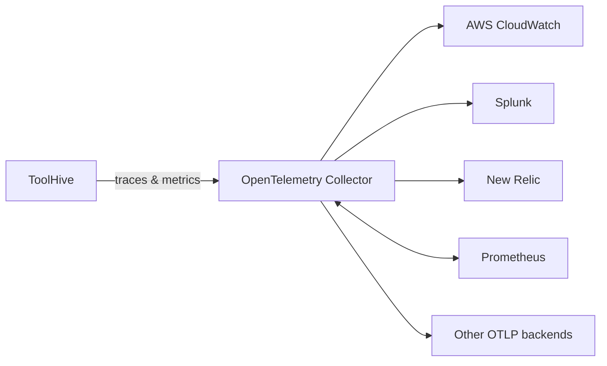

ToolHive includes built-in instrumentation using OpenTelemetry, which gives you
comprehensive observability for your MCP server interactions. You can export
traces and metrics to popular observability backends like Jaeger, Honeycomb,
Datadog, and Grafana Cloud, or expose Prometheus metrics directly.

## What you can monitor

ToolHive's telemetry captures detailed information about MCP interactions
including traces, metrics, and performance data. For a comprehensive overview of
the telemetry architecture, metrics collection, and monitoring capabilities, see
the [observability overview](../concepts/observability.mdx).

## Enable telemetry

You can enable telemetry when deploying an MCP server by specifying Telemetry
configuration in the MCPServer or MCPRemoteProxy custom resource.

This example runs the Fetch MCP server and exports traces to a deployed instance
of the [OpenTelemetry Collector](https://opentelemetry.io/docs/collector/):

```yaml {12}
apiVersion: toolhive.stacklok.dev/v1alpha1
kind: MCPServer # or MCPRemoteProxy
metadata:
  name: gofetch
  namespace: toolhive-system
spec:
  image: ghcr.io/stackloklabs/gofetch/server
  transport: streamable-http
  proxyPort: 8080
  mcpPort: 8080
  # ... other spec fields ...
  telemetry:
    openTelemetry:
      enabled: true
      endpoint: otel-collector-opentelemetry-collector.monitoring.svc.cluster.local:4318
      serviceName: mcp-fetch-server
      insecure: true
      metrics:
        enabled: true
      tracing:
        enabled: true
        samplingRate: '0.05'
    prometheus:
      enabled: true
```

The `spec.telemetry.openTelemetry.endpoint` will be the OpenTelemetry collector
that is deployed inside of your infrastructure, the
`spec.telemetry.openTelemetry.serviceName` will be what you can use to identify
your MCP server in your observability stack.

### Export metrics to an OTLP endpoint

If you want to enable ToolHive to export metrics to your OTel collector, you can
enable the `spec.telemetry.openTelemetry.metrics.enabled` flag.

### Export traces to an OTLP endpoint

If you want to enable ToolHive to export tracing information, you can enable the
`spec.telemetry.openTelemetry.tracing.enabled` flag.

You can also set the sampling rate of your traces by setting the
`spec.telemetry.openTelemetry.tracing.sampleRate` option to a number between 0
and 1.0. By default this will be `0.05` which equates to 5% of all requests.

:::note

The `spec.telemetry.openTelemetry.endpoint` is provided as a hostname and
optional port, without a scheme or path (e.g., use `api.honeycomb.io` or
`api.honeycomb.io:443`, not `https://api.honeycomb.io`). ToolHive automatically
uses HTTPS unless `--otel-insecure` is specified.

:::

By default, the service name is set to `toolhive-mcp-proxy`, and the sampling
rate is `0.05` (5%).

:::tip[Recommendation]

Set the `spec.telemetry.openTelemetry.serviceName` flag to a meaningful name for
each MCP server. This helps you identify the server in your observability
backend.

:::

### Enable Prometheus metrics

You can expose Prometheus-style metrics at `/metrics` on the main transport port
for local scraping by enabling the `spec.telemetry.prometheus.enabled` flag.

To access the metrics, you can use `curl` or any Prometheus-compatible scraper.
The metrics are available at `http://<HOST>:<PORT>/metrics`, where `<HOST>` is
resolvable address of the ToolHive ProxyRunner fronting your MCP server pod and
`<PORT>` is the port of which the ProxyRunner service is configured to expose
for traffic.

### Dual export

You can export to both an OTLP endpoint and expose Prometheus metrics
simultaneously.

The `MCPServer` example at the top of this page has dual export enabled.

## Observability backends

ToolHive can export telemetry data to many different observability backends. It
supports exporting traces and metrics to any backend that implements the OTLP
protocol. Some common examples are listed below, but specific configurations
will vary based on your environment and requirements.

### OpenTelemetry Collector (recommended)

The OpenTelemetry Collector is a vendor-agnostic way to receive, process and
export telemetry data. It supports many backend services, scalable deployment
options, and advanced processing capabilities.



You can run the OpenTelemetry Collector inside of a Kubernetes cluster, follow
the
[OpenTelemetry Collector documentation](https://opentelemetry.io/docs/collector/)
for more information.

To export data to a local OpenTelemetry Collector, set your OTLP endpoint to the
OTLP http receiver port (default is `4318`):

```yaml
apiVersion: toolhive.stacklok.dev/v1alpha1
kind: MCPServer
metadata:
  name: gofetch
  namespace: toolhive-system
spec:
  ...
  ...
  telemetry:
    openTelemetry:
      enabled: true
      endpoint: otel-collector-opentelemetry-collector.monitoring.svc.cluster.local:4318
      serviceName: mcp-fetch-server
      insecure: true
      metrics:
        enabled: true
```

### Prometheus

To collect metrics using Prometheus, run your MCP server with the
`spec.telemetry.prometheus.enabled` flag enabled and add the following to your
Prometheus configuration:

```yaml title="prometheus.yml"
scrape_configs:
  - job_name: 'toolhive-mcp-proxy'
    static_configs:
      - targets: ['<MCP_SERVER_PROXY_SVC_URL>:<MCP_SERVER_PORT>']
    scrape_interval: 15s
    metrics_path: /metrics
```

You can add multiple MCP servers to the `targets` list. Replace
`<MCP_SERVER_PROXY_SVC_URL>` with the ProxyRunner SVC name and
`<MCP_SERVER_PORT>` with the port number exposed by the SVC.

### Jaeger

[Jaeger](https://www.jaegertracing.io) is a popular open-source distributed
tracing system. You can run it inside of a Kubernetes cluster in order to store
tracing telemetry data exported by the ToolHive proxy.

You can export traces to Jaeger by setting the OTLP endpoint to an OpenTelemetry
collector, and then configuring the collector to export tracing data to Jaeger.

```yaml
apiVersion: toolhive.stacklok.dev/v1alpha1
kind: MCPServer
metadata:
  name: gofetch
  namespace: toolhive-system
spec:
  ...
  ...
  telemetry:
    openTelemetry:
      enabled: true
      endpoint: otel-collector-opentelemetry-collector.monitoring.svc.cluster.local:4318
      serviceName: mcp-fetch-server
      insecure: true
      tracing:
        enabled: true
```

Inside of your OpenTelemetry collector configuration.

```yaml
config:
  receivers:
    otlp:
      protocols:
        grpc:
          endpoint: 0.0.0.0:4317
        http:
          endpoint: 0.0.0.0:4318

  exporters:
    otlp/jaeger:
      endpoint: http://jaeger-all-in-one-collector.monitoring:4317

  service:
    pipelines:
      traces:
        receivers: [otlp]
        processors: [batch]
        exporters: [otlp/jaeger]
```

### Honeycomb

Coming soon.

You'll need your Honeycomb API key, which you can find in your
[Honeycomb account settings](https://ui.honeycomb.io/account).

### Datadog

Datadog has [multiple options](https://docs.datadoghq.com/opentelemetry/) for
collecting OpenTelemetry data:

- The
  [**OpenTelemetry Collector**](https://docs.datadoghq.com/opentelemetry/setup/collector_exporter/)
  is recommended for existing OpenTelemetry users or users wanting a
  vendor-neutral solution.

- The [**Datadog Agent**](https://docs.datadoghq.com/opentelemetry/setup/agent)
  is recommended for existing Datadog users.

### Grafana Cloud

Coming soon.

## Performance considerations

### Sampling rates

Adjust sampling rates based on your environment:

- **Development**: `spec.telemetry.openTelemetry.tracing.samplingRate: 1.0`
  (100% sampling)
- **Production**: `spec.telemetry.openTelemetry.tracing.samplingRate 0.01` (1%
  sampling for high-traffic systems)
- **Default**: `spec.telemetry.openTelemetry.tracing.samplingRate 0.05` (5%
  sampling)

### Network overhead

Telemetry adds minimal overhead when properly configured:

- Use appropriate sampling rates for your traffic volume
- Monitor your observability backend costs and adjust sampling accordingly

## Related information

- Tutorial:
  [Collect telemetry for MCP workloads](../tutorials/opentelemetry.mdx) -
  Step-by-step guide to set up a local observability stack
- [Telemetry and monitoring concepts](../concepts/observability.mdx) - Overview
  of ToolHive's observability architecture
- [Kubernetes CRD reference](../reference/crd-spec.md#apiv1alpha1mcpserver) -
  Reference for the `MCPServer` Custom Resource Definition (CRD)
- [Deploy the operator](./deploy-operator.mdx) - Install the ToolHive operator
