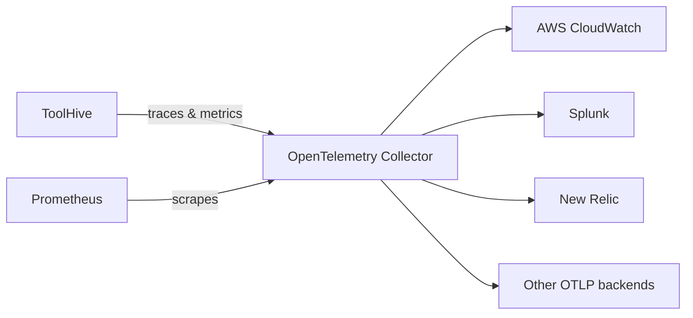

ToolHive includes built-in instrumentation using OpenTelemetry, providing
comprehensive observability for your MCP server interactions. Export traces and
metrics to popular observability backends like Jaeger, Honeycomb, Datadog, and
Grafana Cloud, or expose Prometheus metrics directly.

## What you can monitor

ToolHive's telemetry captures detailed information about MCP interactions
including traces, metrics, and performance data. For a comprehensive overview of
the telemetry architecture, metrics collection, and monitoring capabilities, see
the [observability overview](../concepts/observability.mdx).

## Enable telemetry

The recommended way to configure telemetry is with a shared `MCPTelemetryConfig`
resource referenced by `telemetryConfigRef` on each MCPServer or MCPRemoteProxy.

### Shared telemetry configuration

The `MCPTelemetryConfig` CRD lets you define telemetry settings once and
reference them from multiple MCPServer resources. Each server can override its
`serviceName` for a distinct identity in your observability backend.

**Step 1: Create an MCPTelemetryConfig resource**

```yaml title="shared-otel-config.yaml"
apiVersion: toolhive.stacklok.dev/v1alpha1
kind: MCPTelemetryConfig
metadata:
  name: shared-otel
  namespace: toolhive-system
spec:
  openTelemetry:
    enabled: true
    endpoint: otel-collector-opentelemetry-collector.monitoring.svc.cluster.local:4318
    insecure: true
    metrics:
      enabled: true
    tracing:
      enabled: true
      samplingRate: '0.05'
  prometheus:
    enabled: true
```

```bash
kubectl apply -f shared-otel-config.yaml
```

**Step 2: Reference from an MCPServer or MCPRemoteProxy**

Reference the config by name in `telemetryConfigRef`. Both `MCPServer` and
`MCPRemoteProxy` support this field:

```yaml {10-12} title="mcpserver-with-shared-otel.yaml"
apiVersion: toolhive.stacklok.dev/v1alpha1
kind: MCPServer
metadata:
  name: gofetch
  namespace: toolhive-system
spec:
  image: ghcr.io/stackloklabs/gofetch/server
  transport: streamable-http
  proxyPort: 8080
  telemetryConfigRef:
    name: shared-otel
    serviceName: mcp-fetch-server
```

For an `MCPRemoteProxy`, the reference works the same way:

```yaml {8-10} title="remote-proxy-with-shared-otel.yaml"
apiVersion: toolhive.stacklok.dev/v1alpha1
kind: MCPRemoteProxy
metadata:
  name: analytics-proxy
  namespace: toolhive-system
spec:
  remoteUrl: https://mcp.analytics.example.com
  telemetryConfigRef:
    name: shared-otel
    serviceName: analytics-mcp-proxy
```

:::tip[Service name]

Set `serviceName` to a meaningful name for each MCP server. This helps identify
the server in your observability backend. The default is `toolhive-mcp-proxy`.

:::

```bash
kubectl apply -f mcpserver-with-shared-otel.yaml
```

**Step 3: Verify**

```bash
kubectl get mcpotel -n toolhive-system
```

The `REFERENCES` column shows which workloads use this config. The `READY`
column confirms validation passed.

#### Configuration details

Set `spec.openTelemetry.endpoint` to the address of your OTLP-compatible
collector or backend. ToolHive supports exporting traces, metrics, or both
simultaneously, as shown in the example above.

:::note

Specify the endpoint as a hostname and optional port, without a scheme or path
(for example, `api.honeycomb.io` or `api.honeycomb.io:443`, not
`https://api.honeycomb.io`). ToolHive uses HTTPS by default; set
`insecure: true` to disable TLS.

:::

Set `spec.openTelemetry.tracing.samplingRate` to control the percentage of
requests traced, as a quoted string between `'0'` and `'1.0'`. The default is
`'0.05'` (5%).

To expose a Prometheus-compatible `/metrics` endpoint for pull-based scraping,
enable `spec.prometheus.enabled`. Access the metrics at
`http://<HOST>:<PORT>/metrics`, where `<HOST>` is the resolvable address of the
ToolHive ProxyRunner fronting your MCP server pod and `<PORT>` is the port the
ProxyRunner service exposes for traffic.

#### Authentication headers

If your OTLP endpoint requires authentication, add headers to the
`MCPTelemetryConfig` resource. Use `headers` for non-secret values or
`sensitiveHeaders` to reference credentials stored in Kubernetes Secrets. A
header name cannot appear in both fields.

```yaml title="otel-config-with-auth.yaml"
apiVersion: toolhive.stacklok.dev/v1alpha1
kind: MCPTelemetryConfig
metadata:
  name: otel-with-auth
  namespace: toolhive-system
spec:
  openTelemetry:
    enabled: true
    endpoint: <OTLP_ENDPOINT>
    sensitiveHeaders:
      - name: Authorization
        secretKeyRef:
          name: otel-credentials
          key: api-key
    tracing:
      enabled: true
    metrics:
      enabled: true
```

#### Custom CA certificates for OTLP endpoints

If your OTLP collector uses TLS with certificates signed by an internal or
private CA, add a `caBundleRef` to your MCPTelemetryConfig. The operator mounts
the referenced ConfigMap into the pod and configures the OTLP exporters to trust
the custom CA alongside the system CA pool.

```yaml title="telemetry-with-ca-bundle.yaml"
apiVersion: toolhive.stacklok.dev/v1alpha1
kind: MCPTelemetryConfig
metadata:
  name: shared-otel
  namespace: toolhive-system
spec:
  openTelemetry:
    enabled: true
    endpoint: otel-collector.internal:4318
    caBundleRef:
      configMapRef:
        name: otel-ca-bundle
        key: ca.crt
    tracing:
      enabled: true
    metrics:
      enabled: true
```

:::note

`caBundleRef` cannot be used when `insecure` is set to `true`.

:::

## Observability backends

ToolHive can export telemetry data to many different observability backends. It
supports exporting traces and metrics to any backend that implements the OTLP
protocol. Some common examples are listed below, but specific configurations
will vary based on your environment and requirements.

:::note

The backend examples below use `MCPTelemetryConfig` resources. Reference them
from your MCPServer resources using `telemetryConfigRef` as shown in the
[shared telemetry configuration](#shared-telemetry-configuration) section above.

:::

### OpenTelemetry Collector (recommended)

The OpenTelemetry Collector is a vendor-agnostic way to receive, process and
export telemetry data. It supports many backend services, scalable deployment
options, and advanced processing capabilities.


```mermaid
graph LR
    A[ToolHive] -->|traces & metrics| B[OpenTelemetry Collector]
    B --> C[AWS CloudWatch]
    B --> D[Splunk]
    B --> E[New Relic]
    F[Prometheus] -->|scrapes| B
    B --> G[Other OTLP backends]
```

To deploy the OpenTelemetry Collector in a Kubernetes cluster, see the
[OpenTelemetry Collector documentation](https://opentelemetry.io/docs/collector/).
The following minimal configuration receives OTLP data and exports traces and
metrics:

```yaml title="otel-collector.yaml"
apiVersion: opentelemetry.io/v1beta1
kind: OpenTelemetryCollector
metadata:
  name: otel-collector
  namespace: monitoring
spec:
  config:
    receivers:
      otlp:
        protocols:
          http:
            endpoint: 0.0.0.0:4318
    processors:
      batch:
        send_batch_size: 1024
        timeout: 5s
    exporters:
      otlp/traces:
        endpoint: <TRACE_BACKEND>:4317
        tls:
          insecure: true
      prometheus:
        endpoint: 0.0.0.0:8889
    service:
      pipelines:
        traces:
          receivers: [otlp]
          processors: [batch]
          exporters: [otlp/traces]
        metrics:
          receivers: [otlp]
          processors: [batch]
          exporters: [prometheus]
```

Then point your `MCPTelemetryConfig` at the collector's OTLP HTTP receiver port
(default `4318`):

```yaml
apiVersion: toolhive.stacklok.dev/v1alpha1
kind: MCPTelemetryConfig
metadata:
  name: otel-collector
  namespace: toolhive-system
spec:
  openTelemetry:
    enabled: true
    endpoint: otel-collector-opentelemetry-collector.monitoring.svc.cluster.local:4318
    insecure: true
    metrics:
      enabled: true
    tracing:
      enabled: true
```

### Prometheus

This example scrapes the `/metrics` endpoint exposed by each MCP server
directly. To aggregate metrics through an OpenTelemetry Collector instead
(ToolHive pushes to the collector, Prometheus scrapes the collector), see the
[OpenTelemetry Collector](#opentelemetry-collector-recommended) section.

To enable scraping, [enable Prometheus](#configuration-details) in your
telemetry configuration and add the following to your Prometheus configuration:

```yaml title="prometheus.yml"
scrape_configs:
  - job_name: 'toolhive-mcp-proxy'
    static_configs:
      - targets: ['<MCP_SERVER_PROXY_SVC_URL>:<MCP_SERVER_PORT>']
    scrape_interval: 15s
    metrics_path: /metrics
```

Add multiple MCP servers to the `targets` list. Replace
`<MCP_SERVER_PROXY_SVC_URL>` with the ProxyRunner SVC name and
`<MCP_SERVER_PORT>` with the port number exposed by the SVC.

### Jaeger

[Jaeger](https://www.jaegertracing.io) is a popular open source distributed
tracing system that natively supports OTLP. Point your telemetry configuration
directly at Jaeger's OTLP HTTP port (default `4318`):

```yaml
apiVersion: toolhive.stacklok.dev/v1alpha1
kind: MCPTelemetryConfig
metadata:
  name: jaeger-tracing
  namespace: toolhive-system
spec:
  openTelemetry:
    enabled: true
    endpoint: jaeger-collector.monitoring.svc.cluster.local:4318
    insecure: true
    tracing:
      enabled: true
```

### Honeycomb

Send OpenTelemetry data directly to
[Honeycomb's OTLP endpoint](https://docs.honeycomb.io/send-data/opentelemetry/#using-the-honeycomb-opentelemetry-endpoint),
or use the [OpenTelemetry Collector](#opentelemetry-collector-recommended) to
forward data to Honeycomb. This example sends data directly:

```yaml
apiVersion: toolhive.stacklok.dev/v1alpha1
kind: MCPTelemetryConfig
metadata:
  name: honeycomb
  namespace: toolhive-system
spec:
  openTelemetry:
    enabled: true
    endpoint: api.honeycomb.io:443
    sensitiveHeaders:
      - name: x-honeycomb-team
        secretKeyRef:
          name: honeycomb-credentials
          key: api-key
    tracing:
      enabled: true
    metrics:
      enabled: true
```

Find your Honeycomb API key in your
[Honeycomb account settings](https://ui.honeycomb.io/account). Store it in a
Kubernetes Secret referenced by `sensitiveHeaders`.

### Datadog

Datadog has [multiple options](https://docs.datadoghq.com/opentelemetry/) for
collecting OpenTelemetry data:

- The
  [**OpenTelemetry Collector**](https://docs.datadoghq.com/opentelemetry/setup/collector_exporter/)
  is recommended for existing OpenTelemetry users or users wanting a
  vendor-neutral solution.

- The [**Datadog Agent**](https://docs.datadoghq.com/opentelemetry/setup/agent)
  is recommended for existing Datadog users.

### Grafana Cloud

Send OpenTelemetry data to Grafana Cloud using
[Grafana Alloy](https://grafana.com/docs/opentelemetry/collector/grafana-alloy/),
Grafana Labs' supported distribution of the OpenTelemetry Collector. This is the
recommended method for production deployments.

To send data directly to
[Grafana Cloud's OTLP endpoint](https://grafana.com/docs/grafana-cloud/send-data/otlp/send-data-otlp/#manual-opentelemetry-setup-for-advanced-users):

```yaml
apiVersion: toolhive.stacklok.dev/v1alpha1
kind: MCPTelemetryConfig
metadata:
  name: grafana-cloud
  namespace: toolhive-system
spec:
  openTelemetry:
    enabled: true
    endpoint: <GRAFANA_OTLP_ENDPOINT>
    sensitiveHeaders:
      - name: Authorization
        secretKeyRef:
          name: grafana-cloud-credentials
          key: auth-header
    tracing:
      enabled: true
    metrics:
      enabled: true
```

Replace `<GRAFANA_OTLP_ENDPOINT>` with the OTLP endpoint from your Grafana Cloud
portal (for example, `otlp-gateway-prod-us-central-0.grafana.net:443`). Store
the full `Authorization` header value in the referenced Kubernetes Secret:
`Basic <base64(instanceID:apiToken)>`.

## Performance considerations

### Sampling rates

Adjust sampling rates based on your environment:

- **Development**: `samplingRate: '1.0'` (100% sampling)
- **Production**: `samplingRate: '0.01'` (1% sampling for high-traffic systems)
- **Default**: `samplingRate: '0.05'` (5% sampling)

### Network overhead

Telemetry adds minimal overhead when properly configured:

- Use appropriate sampling rates for your traffic volume
- Monitor your observability backend costs and adjust sampling accordingly

## Next steps

- [Set up audit logging](./logging.mdx) for structured request and authorization
  event tracking
- [Secure your servers](./auth-k8s.mdx) with authentication and authorization

## Related information

- Tutorial:
  [Collect telemetry for MCP workloads](../integrations/opentelemetry.mdx) -
  step-by-step guide to set up a local observability stack
- [Telemetry and monitoring concepts](../concepts/observability.mdx) - overview
  of ToolHive's observability architecture
- [Kubernetes CRD reference](../reference/crds/mcpserver.mdx) - reference for
  the `MCPServer` Custom Resource Definition (CRD)
- [Deploy the operator](./deploy-operator.mdx) - install the ToolHive operator
